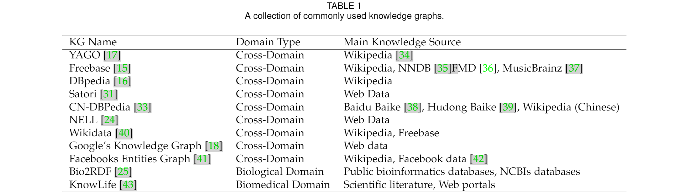
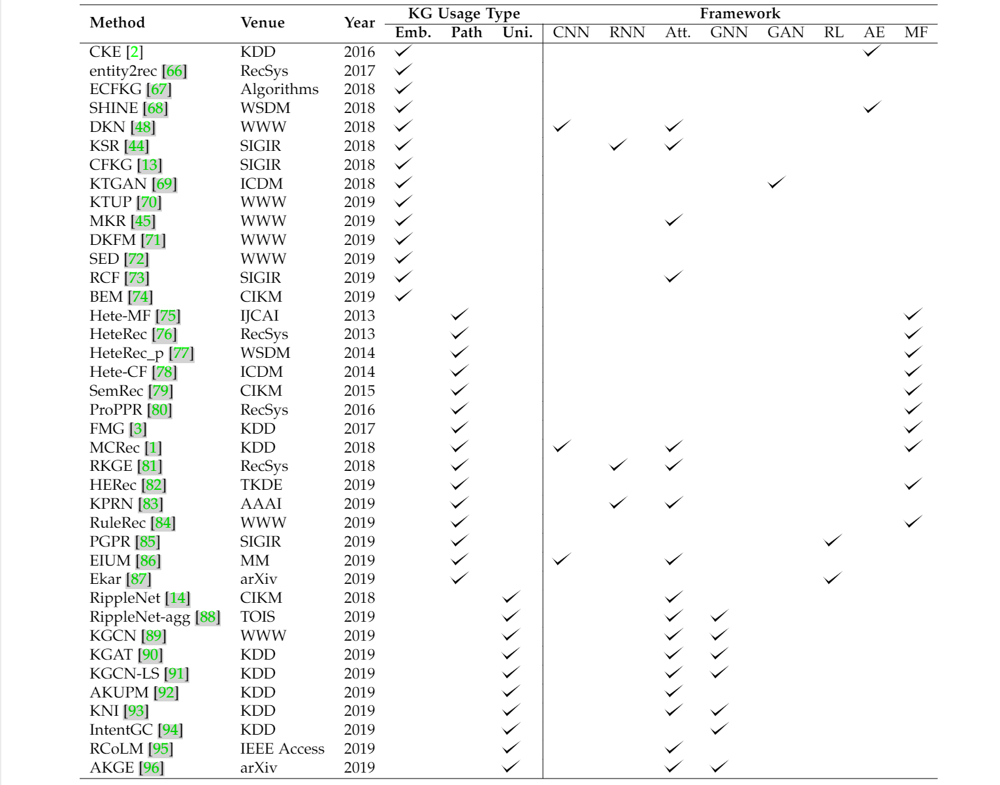
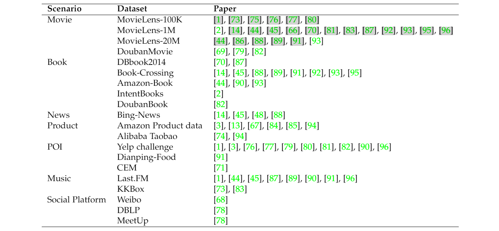

# A Survey on Knowledge Graph-Based Recommender Systems

> SCIENTIA SINICA Informationis (2020)|Qi ZHANGLe ZHANG...

## Abstract

为了解决各种在线应用程序中的信息爆炸问题并增强用户体验，已经开发了推荐系统来对用户偏好进行建模。 尽管已经为更加个性化的推荐做出了许多努力，但推荐系统仍然面临着一些挑战，例如数据稀疏性和冷启动。 近年来，将知识图谱作为辅助信息生成推荐引起了相当大的兴趣。 这种方法不仅可以缓解上述问题以获得更准确的推荐，还可以为推荐项目提供解释。 在本文中，我们对基于知识图谱的推荐系统进行了系统的调查。 我们收集了该领域最近发表的论文，并从两个角度对其进行了总结。 一方面，我们通过关注论文如何利用知识图谱进行准确和可解释的推荐来研究提出的算法。 另一方面，我们介绍了这些作品中使用的数据集。 最后，我们提出了该领域的几个潜在研究方向。

## 1 INTRODUCTION

本调查旨在全面回顾利用知识图谱作为推荐系统中的辅助信息的文献。 在我们的调查中，我们发现现有的基于 KG 的推荐系统以三种方式应用 KG：基于嵌入的方法、基于路径的方法和统一的方法。 我们详细说明了这些方法之间的异同。 除了更准确的推荐之外，基于 KG 的推荐的另一个好处是可解释性。 

我们讨论了不同的作品如何利用 KG 进行可解释的推荐。 此外，根据我们的调查，我们发现 KG 在多个场景中充当辅助信息，包括电影、书籍、新闻、产品、兴趣点 (POI)、音乐和社交平台的推荐。 我们收集最近的作品，按应用对其进行分类，并收集在这些作品中评估的数据集。 本次调查的组织如下：在第 2 节中，我们介绍了 KG 和推荐系统的基础； 在第 3 节中，我们介绍了本文中使用的符号和概念； 在第 4 节和第 5 节中，我们分别从方法和评估数据集方面回顾了基于 KG 的推荐系统； 在第 6 节中，我们提供了一些潜在的研究方向。

## 2 RELATED WORK

### 2.1 Knowledge Graphs

KG 是一种表示来自多个域的大规模信息的实用方法。 描述 KG 的常用方法是遵循资源描述框架 (RDF) 标准，其中节点表示实体，而图中的边表示实体之间的关系。 每条边都以三元组（头实体、关系、尾实体）的形式表示，在图中也称为事实，暗示头实体和尾实体之间的特定关系。

### 2.2 Recommender Systems

- 基于协同过滤的推荐算法

  利用用户和物品历史的反馈数据, 挖掘用户和物品本身的相关联性, 并基于此进行推荐。

  - 方法1：基于用户的推荐。假设 “用户可能喜欢与他相似用户喜欢的物品”。
  - 方法2：基于物品的推荐。与内容推荐的区别：这里是使用物品历史被反馈的数据来判断物品之间相似性；
  - 方法3：基于模型的推荐。解决用户与item之间的稀疏问题。

- 基于内容的推荐算法

  基于内容的推荐算法源于一个基本假设: “用户可能会喜欢与他曾经喜欢过的物品相似的物品”, 其通过建模计算用户曾经有过的显示反馈 (打分、点赞等) 和隐式反馈 (搜索、点击、购买等) 的物品集合与所有物品的相似度, 按照相似度的大小排序到推荐的列表.

  优点：解决新物品冷启动; 不受交互矩阵的稀疏性所影响;有解释性；

  缺点：复杂的特征工程；缺乏多样性；

- 混合推荐算法

  混合方法是利用多种推荐技术来克服仅使用一种方法的限制。 基于CF的推荐的一个主要问题是用户-项目交互数据的稀疏性，这使得从交互的角度很难找到相似的项目或用户。混合推荐通过将用户和项目的内容信息（也称为用户侧信息和项目侧信息）纳入基于 CF 的框架中，可以获得更好的推荐性能。

## 3 OVERVIEW

在深入研究利用知识图谱作为推荐辅助信息的最新方法之前，我们首先介绍论文中使用的符号和概念以消除误解。Heterogeneous Information Network (HIN)、Knowledge Graph (KG)、Meta-path、Meta-graph、Knowledge Graph Embedding (KGE)、User Feedback、H-hop Neighbor、Relevant Entity、User Ripple Set、Entity Ripple Set...

## 4 METHODS OF RECOMMENDER SYSTEMS WITH KNOWLEDGE GRAPHS

在本节中，我们收集与基于 KG 的推荐系统相关的论文。 根据这些工作如何利用 KG 信息，我们将它们分为三类：基于嵌入的方法、基于路径的方法和统一的方法。 我们将介绍不同的方法如何利用 KG 来改进推荐结果。

### 4.1 Embedding-based Methods

知识图谱的学习表示学习，直接把KG编码成低秩嵌入，即是用向量来表知识图谱中的节点也关系，这里分为两类：

- translation distance models：TransE, TransH,TransR, TransD；

- semantic matching models：DistMult

另外，根据KG是否包含users来分类,可以分为两类:

第一类（item graph），KGs只使用items数据与它相关属性来构建，这个目的用item graph来进行学习，输出item的向量表示。

| 名称 | 论文                                                         | 描述                                                         |
| ---- | ------------------------------------------------------------ | ------------------------------------------------------------ |
| CKE  | Collaborative Knowledge Base Embedding for Recommender Systems | 提出基于知识图谱的embedding来刻画物品的显式信息，这种是从图结构中学到的关联，能够比较充分地学习到物品的表达，把结构化的物品信息给加进去了。 |
| DKN  | DKN: Deep knowledgeaware network for news recommendation     | 它在建模型新闻信息表示时，把通过KimCNN模型学习的句子文本嵌入与通过TranD模型对KG的实体学习的嵌入想结合起来。 |
| KSR  | Improving sequential recommendation with knowledge-enhanced memory networks | 作者提出一个带有KEY-VALUE记忆网络的RNN模型架构。其中RNN模型用于捕捉序列化的用户偏好，而键值对记忆网络用于捕捉商品属性级的用户偏好，这两个vector组合在一起作为最终的用户偏好表示。 |

第二类（ user-item graph），users,items，这些相关属性构成graph的节点。属性层关系与用户关系看成是图的边。

| 名称  |                             论文                             |                             描述                             |
| :---: | :----------------------------------------------------------: | :----------------------------------------------------------: |
| CFKG  | 2018-Learning over knowledge-base embeddings for recommendation | 构造了一个 user-item KG。 在这个用户-商品图中，用户行为（购买、提及）被视为实体之间的一种关系类型，包括多种类型的商品侧信息（评论、品牌、类别、一起购买等）。 为了学习实体和关系在图中的嵌入，模型定义了一个度量函数 d(·) 来根据给定的关系测量两个实体之间的距离。 |
| SHINE | 2018-Shine: Signed heterogeneous information network embedding for sentiment link prediction | 把名人推荐系统看成是图中实体之间的情感连接预测任务。对于用户与目标，建立情感网络Gs（微博文本中对情感抽取出来的网络），使用它们的社交网络Gr（微博用户的关注关系网络）与简介网络Gp作为辅助信息。利用这三个网络进行嵌入，组合成用户与目标的表达。最后的推荐分数是一个深度网络去实现的。 |
| DKFM  |    2019-Location embeddings for next trip recommendation     | 针对POI推荐而提出来的。使用TransE训练城市数据去丰富目的地表达，提升了相关性能。 |

上面都是直接使用已学习结构知识原始的隐向量，最近提出了提练实体、关系表达的推荐。

| 名称  |                             论文                             |                             描述                             |
| :---: | :----------------------------------------------------------: | :----------------------------------------------------------: |
| KTGAN | 2018-A knowledge-enhanced deep recommendation framework incorporating gan-based models | 引入基于GAN的模型。模型分两个阶段。首先，结合Metapath2Vec进行学习KG嵌入与结合Word2Vec学习标注嵌入；然后，生成器G与判别器D用来提炼最初的用户与items的表达。 |
|  BEM  | 2019 Bayes embedding (bem): Refining representation by integrating knowledge graphs and behavior-specific networks | 对用户使用两种图：知识相关图与行为图。首先采用TransE与GCC模型来对两种进行学习表达，然后采用Byes框架去refine最初的表达。 |

另一个趋势是采用多任务学习的策略，在 KG 相关任务的指导下共同学习推荐任务。

| 名称 | 论文                                                         | 描述                                                         |
| ---- | ------------------------------------------------------------ | ------------------------------------------------------------ |
| KTUP | 2019-Unifying knowledge graph learning and recommendation: Towards a better understanding of user preferences | 是利用联合嵌入的方法，利用kg中的facts作为辅助信息；基于user-item的模拟，填补kg中facts的缺失。 |
| MKR  | 2019-Multitask feature learning for knowledge graph enhanced recommendation | 推荐模型与KGE模型所组成。 前者学习users与Items的隐表达；后者使用情感网络去学习item相关的实体。 |
| RCF  | 2019-Relational collaborative fifiltering: Modeling multiple item relations for recommendation | items分层描述，包括关系类型及关系值的嵌入。使用DistMult模型去对items之间关系进行表达，然后使用关注力模型分别对user的类型级与user值级进行建模。最后，联合训练推荐模块与KG关系模块。 |

总结：对于嵌入表达中，大部分都会加入一些用户辅助信息进来，有些嵌入表达直接在原图谱表达，有些还要经过第二步的提炼；有些联合多任务来训练。

### 4.2 Path-based Methods

基于路径的方法构建用户项图，并利用图中实体的连接模式进行推荐。从2013年开始就开始使用了，传统papers称这种方法是HIN图中的推荐 。核心思想：利用users或items连接的相似性去提升推荐。

一种基于路径的方法利用不同元路径中实体的语义相似性作为图正则化来细化 HIN 中用户和项目的表示。通常使用三种类型的实体相似性：User-User Similarity、Item-Item Similarity、User-Item Similarity。

|   名称    |                             论文                             |                             描述                             |
| :-------: | :----------------------------------------------------------: | :----------------------------------------------------------: |
|  Hete-MF  | 2013-Collaborative filtering with entity similarity regularization in heterogeneous information networks | 抽取L条不同元路径并对每种路径计算item-item相似度。将item-item正则化与加权非负矩阵因式分解方法相结合，从而细化用户和项目的低秩表示，以便更好地推荐。 |
|  Hete-CF  | 2014-Hete-cf: Social-based collaborative fifiltering recommendation using heterogeneous relations | Hete-CF扩展了Hete-MF,加入user-user，item-item，user-item相似，最后比Hete-MF有更好的效果。 |
|  HeteRec  | 2013-Recommendation in heterogeneous information networks with implicit user feedback | 利用元路径相似性来丰富用户-项目交互矩阵R，从而可以提取更全面的用户和项目表示。 |
| HeteRec-p | 2014-Personalized entity recommendation: A heterogeneous information network approach | 进一步考虑了不同元路径的重要性，对于不同的用户来说应该是不同的。Hete Rec-p首先将用户根据过去的行为分为c个类，并利用聚类信息生成个性化推荐，而不是应用全局偏好模型。 |
|    FMG    | 2017-Meta-graph based recommendation fusion over heterogeneous information networks |                    使用元图来代替元路径。                    |
|  SemRec   | 2015-Semantic path based personalized recommendation on weighted heterogeneous information networks |            考虑用户喜欢和讨厌的过去items的交互。             |
|  RuleRec  | 2019-Jointly learning explainable rules for recommendation with knowledge graph | 通过应用外部KG的相关性去学学习item之间的关系。通过两个模块：规则学习模块与item推荐模块。 |
|   MCRec   | 2018-Leveraging meta-path based context for top-n recommendation with a neural co-attention model |     学习meta-paths显式表达去描述user-item对的互动上下文      |
|   RKGE    | 2018-Recurrent knowledge graph embedding for effective recommendation |  在没有手工定义元路径的情况下自动挖掘u_i与v_j之间的路径关系  |
|   KPRN    | 2019-Explainable reasoning over knowledge graphs for recommendation |           使用实体与关系嵌入来构建抽象的路径时序。           |
|   EIUM    | 2019-Explainable interaction-driven user modeling over knowledge graph for sequential recommendation |          对于时序推荐，它EIUM捕捉用户的动态的关注点          |
|   PGPR    | 2019-Reinforcement knowledge graph reasoning for explainable recommendation |         使用强化学习去搜索合理的user-item对的路径。          |
|   EKar    | 2019-Explainable knowledge graph-based recommendation via deep reinforcement learning |                  使用强化学习去生成推荐序列                  |

### 4.3 Unified Methods

|   名称    |                             论文                             |                             描述                             |
| :-------: | :----------------------------------------------------------: | :----------------------------------------------------------: |
| RippleNet | 2018-Ripplenet: Propagating user preferences on the knowledge graph for recommender systems | 为了解决基于embedding和基于路径的方法的限制，第一个引入偏好传播概念的相关工作。利用用户的点击记录，不断外扩发现用户的可能兴趣点。 |
|   AKUPM   | 2019-Akupm: Attention enhanced knowledge-aware user preference model for recommendation | 使用用户的点击历史来进行建模。AKUPM应用TransR对实体进行学习表示。在每个传播过程中，AKUPM使用自关注层来学习实体之间的关系，并传播用户对具有偏见的不同实体的偏好；最后，用自注意机制对交互项的不同阶邻居的嵌入进行聚合，得到最终的用户表示。 |
|   RCoLM   | 2019-Unifying taskoriented knowledge graph learning and recommendation | RCoLM 联合训练 KG 完成模块和推荐模块，其中 AKUPM 作为主干。  |
|   KGCN    | 2019-Knowledge graph convolutional networks for recommender systems | 通过将 KG 中从 vj 的远邻到 vj 本身的实体嵌入来对候选项目 vj 的最终表示进行建模。 |
|   KGAT    | 2019-Kgat: Knowledge graph attention network for recommendation | 提出了一种基于知识图谱和注意力机制的新方法-**KGAT**。**通过user和item之间的属性将user-item实例链接在一起，摒弃user-item之间相互独立的假设**。将user-item和知识图谱融合在一起形成一种新的网络结构，并从该网络结构中**抽取高阶链接路径**用来表达网络中的节点。 |
|  KGCN-LS  | 2019-Knowledge-aware graph neural networks with label smoothness regularization for recommender systems | 在 KGCN 模型上进一步增加了标签平滑度 (LS) 机制。 LS机制获取用户交互信息并在KG上传播用户交互标签，能够指导学习过程并获得候选项目vj的全面表示。 |
|    KNI    | 2019-An end-to-end neighborhood-based interaction model forknowledge-enhanced recommendation | 进一步考虑了项目侧邻居和用户侧邻居之间的交互，使得用户嵌入和项目嵌入的细化过程不分离。 |
| IntentGC  | 2019-Intentgc: a scalable graph convolution framework fusing heterogeneous information for recommendation | 利用图中丰富的用户相关行为来获得更好的推荐。 他们还设计了更快的图卷积网络来保证 IntentGC 的可扩展性。 |
|   AKGE    | 2019-Attentive knowledge graph embedding for personalized recommendation | 通过在该用户-项目对的子图中传播信息来学习用户 ui 和候选项目 vj 的表示。 |

总结：统一方法受益于 KG 的语义嵌入和语义路径模式。 这些方法利用嵌入传播的思想来改进 KG 中具有多跳邻居的项目或用户的表示。 统一方法继承了基于路径的方法的可解释性。 传播过程可以被视为在 KG 中发现用户的偏好模式，这类似于在基于路径的方法中发现连接模式。

### 4.4 Summary

基于嵌入的方法使用 KGE 方法对 KG（项目图或用户项目图）进行预处理，以获得实体和关系的嵌入，并将其进一步集成到推荐框架中。 然而，在这种方法中，图中的信息连接模式被忽略了，很少有作品可以为推荐结果提供理由。 基于路径的方法利用用户-项目图通过预定义元路径或自动挖掘连接模式来发现项目的路径级相似性。 基于路径的方法还可以为用户提供对结果的解释。 最近的一个研究趋势是统一基于嵌入的方法和基于路径的方法，以充分利用双方的信息。 此外，统一的方法还具有解释推荐过程的能力。

## 5 DATASETS OF RECOMMENDER SYSTEMS WITH KNOWLEDGE GRAPH

## 6 FUTURE DIRECTIONS

- Dynamic Recommendation–动态推荐
- Multi-task Learning–多任务学习
- Cross-Domain Recommendation–跨领域推荐
- Knowledge Enhanced Language Representation–知识提升语言表达
- Knowledge Graph Embedding Method–知识图谱嵌入方法
- User Side Information–用户辅助信息