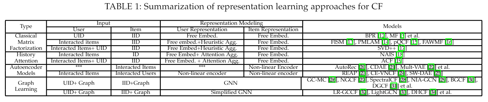
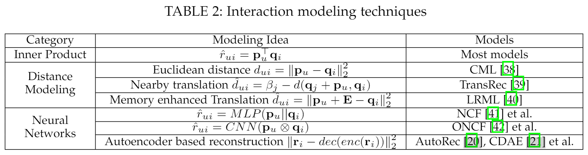
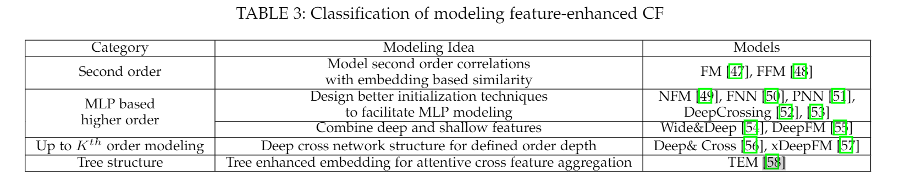
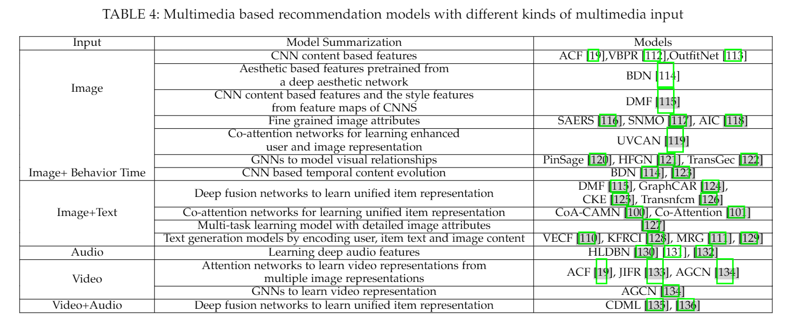
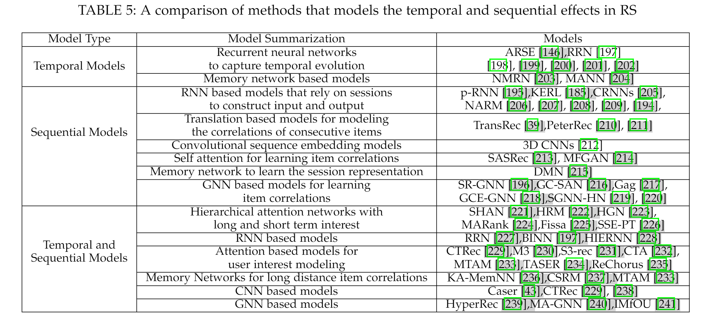

# A Survey on Neural Recommendation: From Collaborative Filtering to Content and Context Enriched Recommendation

> 2021|IEEE TRANSACTIONS ON KNOWLEDGE AND DATA ENGINEERING|Le Wu Member, IEEE, Xiangnan He Member, IEEE...

## Abstract

摘要：受深度学习在计算机视觉和语言理解方面取得惊人成功的影响，推荐研究已转向发明基于神经网络的新推荐模型。 近年来，我们见证了神经推荐模型的开发取得了重大进展，由于神经网络强大的表示能力，该模型泛化并超越了传统的推荐模型。 在这篇调查论文中，我们对神经推荐模型进行了系统回顾，旨在总结该领域以促进未来的发展。 与基于深度学习技术分类法对现有方法进行分类的现有调查不同，我们从推荐建模的角度对该领域进行了总结，这可能对研究推荐系统的研究人员和从业者更具指导意义。 具体来说，我们根据他们用于推荐建模的数据将工作分为三种类型：1）协同过滤模型，它利用用户-项目交互数据的关键来源；  2）内容丰富的模型，它额外利用与用户和项目相关的辅助信息，如用户资料和项目知识图谱；  3) 上下文丰富的模型，它解释了与交互相关的上下文信息，例如时间、位置和过去的交互。 在回顾了每种类型的代表作品之后，我们最后讨论了该领域的一些有前途的方向，包括基准推荐系统、基于图推理的推荐模型以及可解释和公平的社会公益推荐。

## 2 COLLABORATIVE FILTERING MODELS

### 2.1 Representation Learning

令 U 和 V 表示 CF 中的用户和项目，其中 R ∈ RM×N 是用户-项目交互行为矩阵。  CF 中表示学习的一般目标是学习用户嵌入矩阵 P 和项目嵌入 Q，其中 pu 和 qi 分别表示用户 u 和项目 i 的表示参数。 事实上，与大型项目集相比，每个用户执行有限的行为，CF 中的一个关键挑战是用户-项目交互行为的稀疏性，以实现准确的用户和项目嵌入学习。 不同类型的表示学习模型在表示学习的输入数据以及给定输入数据的表示建模技术方面有所不同。 我们将此部分分为三类：历史行为聚合增强模型、基于自动编码器的模型和图学习方法。 为了便于解释，我们在表 1 中列出了典型的表示学习模型。

### 2.2 Interaction Modeling

大多数以前的推荐模型依赖于用户嵌入和项目嵌入之间的内积来估计用户-项目对分数：$\hat{r}_{u i}=\mathbf{p}_{u}^{\top} \mathbf{q}_{i}=\sum_{f=1}^{d} p_{u f} q_{i f}$ 。 尽管它取得了巨大的成功和简单性，但先前的努力表明，简单地进行内积将有两个主要限制。 首先，违反了三角不等式。 也就是说，内积仅鼓励用户和历史项目的表示相似，但缺乏对用户-用户和项目-项目关系之间的相似性传播的保证。 其次，它对线性交互进行建模，可能无法捕捉到用户和物品之间的复杂关系。我们总结了交互建模的三个主要类别：基于经典内积的方法、基于距离的建模和基于神经网络的方法:

## 3 CONTENT-ENRICHED RECOMMENDATION

除了一般的用户-项目交互信息外，推荐问题通常伴随着辅助数据。 辅助数据可以分为两类：基于内容的信息和上下文感知数据。由于页面限制，我们讨论最典型的上下文数据：时间数据。 在接下来的两节中，我们将详细总结内容丰富的推荐和上下文感知推荐。 对于内容丰富的推荐，我们根据可用的内容信息将相关作品分为五类：用户和项目的一般特征、文本内容信息、多媒体信息、社交网络和知识图谱。

### 3.1 Modeling General Feature Interactions

目前该主题的相关工作可分为三类：隐式 MLP 结构和显式 K 阶建模，以及树增强模型。

### 3.2 Modeling Textual Content

在下文中，我们不区分输入内容数据类型，将上下文内容建模的相关工作总结为以下几类：基于自动编码器的模型、词嵌入、注意力模型和用于推荐的文本解释。

### 3.3 Modeling Multimedia Content

随着基于多媒体平台的普及，基于视觉内容的多媒体内容，例如图像、视频和音乐，是最吸引用户眼球的。 下面，我们介绍在推荐系统中对多媒体内容进行建模的相关工作。 为了便于解释，我们在表 4 中总结了不同类型输入数据的基于多媒体推荐的相关工作。

### 3.4 Modeling Social Network

我们将社交推荐模型总结为以下两类：社交相关性增强和正则化模型，以及基于 GNN 的模型。

- 社会相关性增强和正则化。 通过将用户的社交行为作为社交域，将项目偏好行为作为项目域，社会相关性增强和正则化模型试图将来自两个域的用户的两种行为融合在一个统一的表示中。
- 基于 GNN 的方法。 上述大多数社交推荐模型都利用本地一阶社交邻居进行社交推荐。 在现实世界中，每个用户都受到全球社交网络图结构的递归影响。 为此，研究人员认为，最好利用基于 GNN 的模型来更好地为推荐的全球社会扩散过程建模。

### 3.5 Modeling Knowledge Graph

最近对 KG 增强推荐的努力可以大致分为三类：基于路径的模型、基于正则化的模型和基于 GNN 的方法。

- 基于路径的方法。 许多努力引入了元路径和路径提出了用户和项目之间的高阶连接，然后将它们输入预测模型以直接推断用户偏好。
- 基于正则化的方法。 该研究路线设计了一个联合学习框架，其中使用直接的用户-项目交互来优化推荐器损失，并且使用 KG 三元组作为附加损失项来规范推荐器模型学习。
- 基于 GNN 的方法。 基于正则化的方法只考虑实体之间的直接连通性，而以相当隐含的方式编码高阶连通性。 由于缺乏显式建模，既不能保证捕获远程连接，也不能保证捕获高阶的结果建模是可解释的。受到 GNN 进步的启发，探索图上的消息传递机制以利用高阶以端到端的方式连接。

## 4 TEMPORAL/SEQUENTIAL MODELS

用户的偏好不是静态的，而是随着时间的推移而演变的。 与使用上述模型对用户的静态偏好进行建模不同，基于时间/顺序的推荐侧重于对用户的动态偏好或随时间的顺序模式进行建模。当前的时间/顺序推荐通常可以分为三类：

## 5 CONCLUSION AND FUTURE DIRECTIONS

我们希望这项调查能让研究人员全面了解基于神经网络的推荐的最新模型。 上述各种基于神经网络的推荐模型已经证明了优越的推荐质量。 同时，我们意识到目前的推荐解决方案还远远不能令人满意，并且在这方面仍有很多机会。 我们从基础、建模和应用的角度讨论了一些值得更多研究的可能方向。

- 基础知识：推荐基准测试。尽管近年来神经推荐系统领域引起了极大的兴趣，但研究人员也很难跟踪代表最先进模型的内容。 迫切需要确定推广到大多数推荐模型的架构和关键机制。
- 模型：基于图推理的推荐。 图是表示各种推荐场景的普遍结构。随着图深度学习的巨大成功，设计基于图的推荐模型很有前途。 最近的一些工作已经通过经验证明了基于图嵌入的推荐模型的优越性，如何探索自然图推理技术以获得更好的推荐是一个很有前途的方向。
- HCI：会话推荐。 当前的大多数推荐系统都以单轮人机交互 (HCI) 形式存在。 随着人类和 AI 代理（也称为聊天机器人）之间自然语言对话的最新进展，为推荐系统构建会话 AI 代理以呈现用户和 AI 系统之间的多轮交互是一个有前途的方向。
- 评估：社会公益推荐的多目标目标。  如何为社会公益推荐提供多目标，如可解释性、多方利益相关者平衡、社会公平等，是需要关注的重要研究课题。