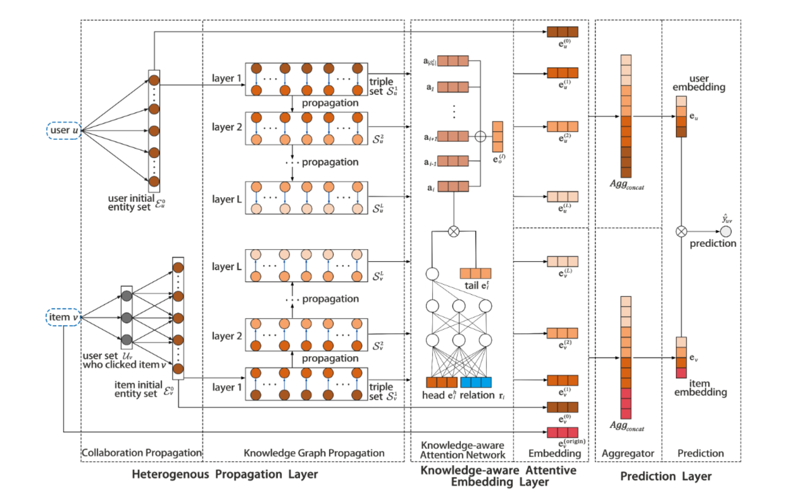
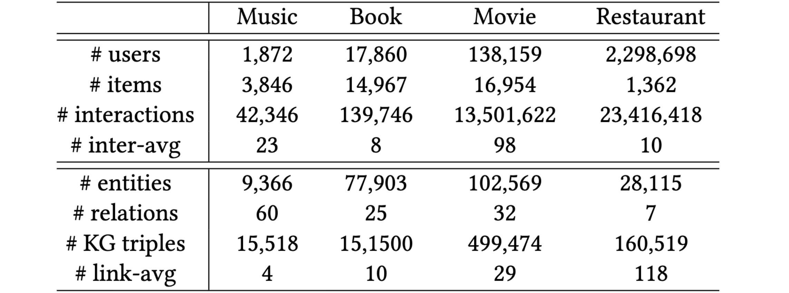
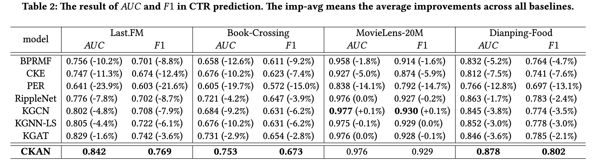
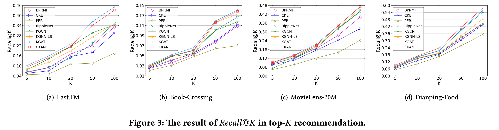
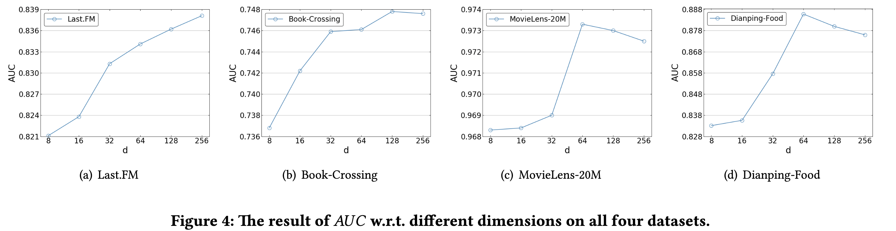

# CKAN: Collaborative Knowledge-aware Attentive Network for Recommender Systems

> SIGIR ’20, July 25|Ze Wang、Guangyan Lin...|[源码链接](https://github.com/weberrr/CKAN)

## ABSTRACT

知识图谱作为辅助信息在推荐系统中得到了广泛的研究和应用。然而，现有的基于知识属性的推荐方法大多关注于如何有效地对知识属性关联进行编码，而没有突出隐藏在用户-物品交互中的关键协同信号。因此，学习到的嵌入信息没有充分利用这两种关键信息，不能有效地表示用户和项目在向量空间中的潜在语义。本文提出了一种新的协作知识感知注意网络方法(Collaborative Knowledge-aware Attentive Network，CKAN)，用异质传播策略显式编码这两种信息，并使用知识感知的关注机制来区分不同知识邻居的贡献。

## 1 INTRODUCTION

CKAN的设计有两种:

- 异构传播(Heterogeneous propagation)，它由协作过程和知识图传播(knowledge graph propagation)组成，将交互和知识视为两个不同空间中的信息，以自然的方式进行组合，使它们共享不同的权重，从而形成嵌入。
- 知识感知注意嵌入(Knowledge-aware attention embedding)是一种全新的知识感知神经注意机制，用于学习不同条件下相邻节点在KG中的不同权重。

## 2 PROBLEM FORMULATION

用户集合 $\mathcal{U}=\left\{u_{1}, u_{2}, \ldots, u_{M}\right\}$ ，物品集合$\mathcal{V}=\left\{v_{1}, v_{2}, \ldots, v_{N}\right\}$，用户-物品交互矩阵$\mathbf{Y} \in \mathbb{R}^{M \times N}$，知识图谱为$\mathcal{G}=\{(h, r, t) \mid h, t \in \mathcal{E}, r \in \mathcal{R}\}$，$\mathcal{A}=\{(v, \mathrm{e}) \mid v \in \mathcal{V}, \mathrm{e} \in \mathcal{E}\}$ 表示项目 v 和知识图中的实体 e 对齐。

## 3 METHODOLOGY

### 3.1 Heterogeneous Propagation

#### 3.1.1 Collaboration Propagation

用户在历史上与之交互过的物品在一定程度上能够表示用户的偏好，通过用户 $u$ 的历史查询得到用户 $u$ 的相关项集，通过项与实体的比对，将其转换为在KG中传播的初始实体集。用户 $u$ 的初始实体集定义如下:

类似的，与同一产品进行过交互的用户也会因为他们相似的行为偏好而对该产品的特征表示做出贡献。我们将已被同一用户交互的项目定义为协作邻居，并将项目 $v$ 的协作项目集定义如下：

则项目 v 的初始化实体集为：

#### 3.1.2 Knowledge Graph Propagation

对于上一阶段得到的用户和项目的实体集，在知识图谱中逐层传播，每一层得到的实体集合定义如下：

每一层传播所得到的三元组集合定义如下：

### 3.2 Knowledge-aware Attentive Embedding

我们提出了一种知识感知注意力嵌入方法来生成尾部实体的不同注意力权重，以揭示它在获得不同头部实体和关系时具有的不同含义。 考虑 $(h, r, t) $是第 $ l $ 层三元组中的第 $i$ 个三元组，我们构建一个尾部实体的注意力嵌入 $\mathrm{a}_{i}$，如下所示：

其中 $\mathrm{e}_{i}^{h}$ 是头实体的嵌入，$\mathrm{r}_{i}$ 是关系的嵌入，$\mathrm{e}_{i}^{t}$ 是尾实体对第 $i$ 个三元组的嵌入。 $\pi\left(\mathrm{e}_{i}^{h}, \mathrm{r}_{i}\right)$ 控制头部实体产生的注意力权重以及头部和尾部之间的关系，具体实现如下：

最后，我们获得了用户 $u$ 或项目 $v$ 的第 $l$ 层三元组的表示：

请注意，由于初始实体集中的实体最接近原始表示。 因此，我们为用户和项目添加了初始实体集的表示：

作者认为最中心处与item直接相关的那些实体，与item在潜层最相近，因此把它们也与相加，来表示物品的origin：

因此得到用户和项目的表示集：

### 3.3 Model Prediction

将多个表示聚合为用户和项目的单个向量。

- Sum aggregator：将上一个模块的每一层向量直接相加

  

- Pooling aggregator：去上一模块中所有层的向量中每一维度选取最大的

  

- Concat aggregator：将每一层向量进行拼接

  

我们使用 $e_{u}$ 和 $e_{v}$ 来表示用户的聚合向量。 最后，我们进行表示的内积来预测用户对项目的偏好分数：

为了平衡正负样本的数量并保证模型训练的效果，我们为每个用户提取了与正样本相同数量的负样本。 损失函数如下：

## 4 EXPERIMENTS

### Dataset Description

