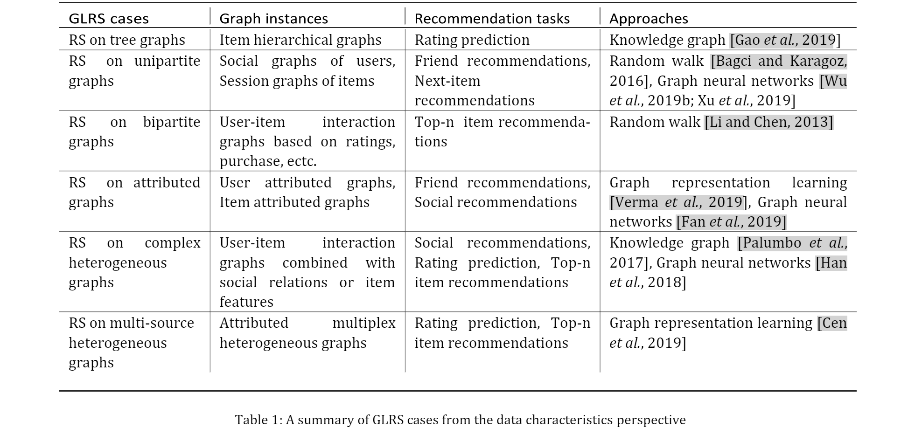
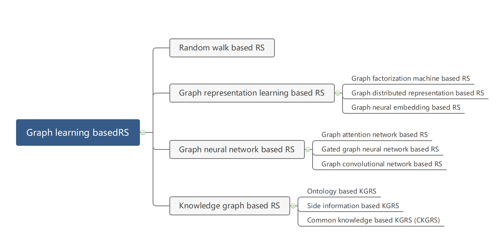

# Graph Learning Approaches to Recommender Systems: A Review

## Abstract

GLRS主要采用先进的图学习方法来模拟用户的偏好和意图以及推荐系统（RS）的项目特征和流行度。 与传统的 RS 不同，包括基于内容的过滤和协同过滤，GLRS 建立在简单或复杂的图上，其中各种对象，例如用户、项目和属性，是显式或隐式连接的。在本文中，我们对 GLRS 进行了系统回顾，介绍了他们如何从图表中获取知识以提高推荐的准确性、可靠性和可解释性。 首先，我们对 GLRS 进行表征和形式化，然后对这一新研究领域的关键挑战进行总结和分类。 然后，我们调查了该地区最新和最重要的发展。 最后，我们分享了这个充满活力的领域的一些新研究方向。

## 1 Introduction

这项工作的主要贡献总结如下：

- 我们系统地分析了 GLRS 中各种图上普遍存在的关键挑战，并从数据驱动的角度对其进行了分类，为深入理解 GLRS 的特性提供了新的视角。
- 我们通过从技术角度系统地对最先进的作品进行分类，总结了GLRS 目前的研究进展。
- 我们分享和讨论一些开放的研究。

## 2 Data Characteristics and Challenges

 在本节中，我们将从数据驱动的角度出发，系统地分析 RS 中的数据复杂性和特征，并据此展示在具有不同特定特征的不同图上构建 RS 时所面临的挑战。 表 1 中提供了简要总结。

### 2.1 RS on Tree Graphs

- 用于推荐的交易数据集中的所有项目都根据项目的特定属性例如类别按照也称为树形图的层次结构进行组织。
- 这种层次图本质上揭示了物品背后的丰富关系，这种层次关系可以极大地提高推荐的性能。
- 因此，如何有效地学习项目之间的这种层次关系并将其纳入后续的推荐任务是一个重要的挑战。

### 2.2 RS on Unipartite Graphs

- 在 RS 中，可以定义至少两个同质单部图，一个用于用户，另一个用于项目。一方面，用户之间的线上或线下社交关系构成了用户的同质社交图谱； 另一方面，同一购物篮或会话中物品的共现将交易数据中的所有物品连接在一起，从而导致物品的同质会话图。 
- 挑战：如何学习用户间的社交影响及其在用户图上的传播以进行推荐。如何充分捕捉项目图上的项目间关系并适当地利用它们来提高推荐的准确性。

### 2.3 RS on Bipartite Graphs

- 连接用户和项目的交互（例如，点击、购买）是 RS 的核心信息，所有这些信息一起自然形成用户-项目二分图。
- 向某个用户推荐项目的任务可以看作是用户-项目二分图上的链接预测，即给定图中的已知边来预测可能的未知边。 在这种情况下，一个典型的挑战是如何在具有同质交互的图上学习复杂的用户-项目交互以及这些交互之间的综合关系以进行推荐。 
- 此外，如何在具有异构交互的图上捕获不同类型交互之间的影响，例如点击对购买的影响，以提供更丰富的信息以生成更准确的推荐是另一个更大的挑战。

### 2.4 RS on Attributed Graphs

- 除了前面提到的同构用户/项目图，异构用户图、项目图或用户项目交互图在RS中也很常见。
- 如何在异构用户图上建模不同类型的关系以及它们之间的相互影响，然后如何将它们适当地集成到推荐任务中是一个挑战。
- 如何在异构项目图上有效地建模这种异构关系以提高推荐性能成为该分支的另一个挑战。

### 2.5 RS on Complex Heterogeneous Graphs

- 为了解决用户-项目交互数据中的稀疏性问题，以便更好地理解用户偏好和项目特征，社会关系或项目特征等辅助信息通常与用户-项目交互信息相结合以获得更好的推荐。
- 将两种类型的异构信息用于推荐的这种组合导致了两种异构图：一种是基于用户-项目交互的二分图，另一种是用户之间的社交图或项目-特征图。 两个图中的共享用户或项目充当连接它们的桥梁。 
- 使来自两个图的异构信息能够适当地相互通信并固有地组合以使推荐任务受益是相当具有挑战性的。

### 2.6 RS on Multi-source Heterogeneous Graphs

- 为了有效解决普遍存在的数据稀疏和冷启动问题，以构建更健壮和可靠的 RS，除了用户-项目交互之外，可以有效利用和整合大量对多源推荐具有显着或隐含影响的相关信息进入RS。
- 多个异构图被联合构建用于推荐：基于用户-项目交互的二部图为建模用户选择提供关键信息，用户属性图和社交图提供用户的辅助信息，而项目属性图和基于项目共现的图 提供物品的辅助信息。
- 如何将不同的图一起利用以相互补充并有益于推荐是第一个挑战。如何从多源异构图中提取连贯信息并减少噪声和不连贯信息以改进下游推荐是另一大挑战。

## 3 Graph Learning Approaches to RS

在本节中，我们将首先从技术角度对构建 GLRS 的这些挑战的解决方案进行分类，然后讨论在每个类别中取得的进展。  GLRS 方法的分类如图 2 所示。

### 3.1 Random Walk Approach

基于随机游走的 RS 擅长捕捉图上各种节点（例如，用户和物品）之间的复杂、高阶和间接关系，因此可以解决同构或异构图中的重要挑战生成推荐。但基于随机游走的 RS 的缺点也很明显：

- 它们需要为每个用户在每一步生成所有候选项目的排名分数，因此难以在大规模图上应用效率低，
- 与大多数基于学习的范式不同，基于随机游走的RS是启发式的，缺乏模型参数来优化推荐目标，大大降低了推荐性能。

### 3.2 Graph Representation Learning Approach

图表示学习是分析嵌入在图上的复杂关系的另一种有效技术，它将每个节点映射为潜在的低维表示，以便将图结构信息编码到其中。 根据用于表示学习的具体方法，GRRLS 通常可以分为三类：

|                       名称                        |                             论文                             |                             描述                             |
| :-----------------------------------------------: | :----------------------------------------------------------: | :----------------------------------------------------------: |
|   Graph Factorization Machine based RS (GFMRS)    | Unified Embedding Model over Heterogeneous Information Network for Personalized Recommendation | 使用因子分解机（例如，矩阵因子分解）基于图上的元路径对节点间交换矩阵进行因子分解，以获得每个节点（例如，用户或项目）的潜在表示，这些表示将用作后续推荐任务的输入。 |
| Graph Distributed Representation based RS (GDRRS) | Representation Learning for Attributed Multiplex Heterogeneous Network | 与GFMRS不同，GDRRS通常遵循Skip-gram模型，学习图形中每个用户或项目的分布式表示，将用户或项目的自我信息及其相邻关系编码为低维向量，为后续建议做准备。 |
|      Graph Neural Embedding based RS (GNERS)      | Aspect-Level Deep Collaborative Filtering via Heterogeneous Information Networks | GNER通常利用神经网络，如多层感知器（MLP），来学习用户或项目在图形中的嵌入，然后使用所学的嵌入进行推荐。 |

### 3.3 Graph Neural Network Approach

受益于 GNN 的优势，许多基于 GNN 的 RS 通过引入 GNN 来解决 GLRS 中的不同挑战。 具体而言，基于 GNN 的 RS 根据所使用的特定 GNN 模型主要可分为三类：

|                     名称                     |                             论文                             |                             描述                             |
| :------------------------------------------: | :----------------------------------------------------------: | :----------------------------------------------------------: |
|   Graph Attention network based RS (GATRS)   |       Graph Neural Networks for Social Recommendation        | 将注意机制引入GNN，以区别性地学习其他用户或项目与目标用户或项目在用户或项目图上的不同相关性和影响程度。 |
| Gated Graph Neural Network based RS (GGNNRS) |   Session-Based Recommendation with Graph Neural Networks    | 将门控递归单元（GRU）引入GNN，通过迭代吸收图中其他节点的影响来学习优化的节点表示，从而全面捕捉节点间关系。 |
| Graph Convolutional Network based RS (GCNRS) | Graph Convolutional Neural Networks for Web-Scale Recommender Systems | 图卷积网络（GCN）通常学习如何利用图结构和节点特征信息，使用神经网络从局部图邻域迭代聚合特征信息。一般来说，通过利用卷积和池运算，GCN能够通过有效地将用户和项目的邻域信息聚合到图中，从而学习用户和项目的信息嵌入。 |

### 3.4 Knowledge-Graph Approach

基于知识图谱的RS（KGRS）通常基于外部知识（例如辅助信息）构建知识图谱（KG），以探索用户或物品之间的隐式或高阶连接关系，以丰富其表示，从而提高推荐性能。根据构建KG所使用的知识，KGRS一般可以分为三类：

|                名称                 |                             论文                             |                             描述                             |
| :---------------------------------: | :----------------------------------------------------------: | :----------------------------------------------------------: |
|     Ontology based KGRS (OKGRS)     | Perceiving the Next Choice with Comprehensive Transaction Embeddings for Online Recommendation | 建立了一个基于用户或项目本体的层次KG，以表示树状图中的层次归属关系。 |
| Side information based KGRS (SKGRS) |                              —                               | 基于用户或项目的侧面信息（例如，项目属性）构建KG，以发现它们之间的隐含联系，从而提高推荐性能。 |
| Common knowledge based KGRS (CKGRS) |  DKN: Deep Knowledge-Aware Network for News Recommendation   | 主要基于公共知识构建KG，例如，从在线文本中提取的一般语义、领域知识等。CKGRS整合了从公共知识中提取的推荐产品或服务之间的外部隐式关系，以改进推荐。 |

## 4 Open Research Directions

通过将已经取得的研究进展与该领域已证明的挑战联系起来，我们确定了下面将讨论的进一步开放的研究方向：

- RS 的动态图学习
- RS 的基于随机推理的图学习
- RS 的大规模实时图学习

## 5 Conclusions

图学习（GL）作为最有前途的人工智能技术之一，在学习 RS 中涉及的各种对象之间的复杂关系方面显示出强大的实力。 这催生了一个全新的 RS 范式：基于图学习的推荐系统 (GLRS)，它具有成为下一代 RS 的巨大潜力。 我们希望这篇评论能够概述 GLRS 面临的挑战和最近的进展，以及 GLRS 对学术界和工业界的一些未来方向。

