# Graph Neural Networks for Recommender Systems: Challenges, Methods, and Directions

> September 2021|ACM Transactions on Information Systems|Yang Liu、Goran Radanovic...|[论文仓库](https://github.com/tsinghua-fib-lab/GNN-Recommender-Systems)

## 1 INTRODUCTION

本次调查的结构安排如下。在第二节中，我们首先从四种角度（阶段、场景、目标、应用）介绍了推荐系统的背景，以及图形神经网络的背景。第三节从四个方面讨论了将图神经网络应用于推荐系统所面临的挑战。然后，我们在第四节中通过遵循上一节中的分类法详细阐述了基于图神经网络的推荐的代表性方法。我们将在第5节讨论这一领域最关键的开放性问题，并提供未来方向的想法，并在第6节总结本次调查。

## 2 BACKGROUND

### 2.1 Recommender Systems

#### 2.1.1 Overview

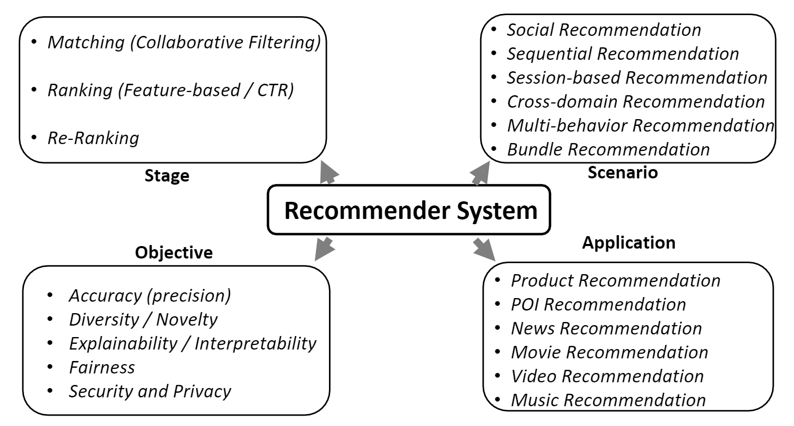

#### 2.1.2 Stages

项目池，即推荐系统可用的所有项目，通常很大，可以包含数百万个项目。因此，常见的推荐系统遵循一种多阶段的体系结构，从大规模的项目池中一步一步地过滤项目，直到向用户公开的最终推荐，几十个项目。现代推荐系统一般由以下三个阶段组成。

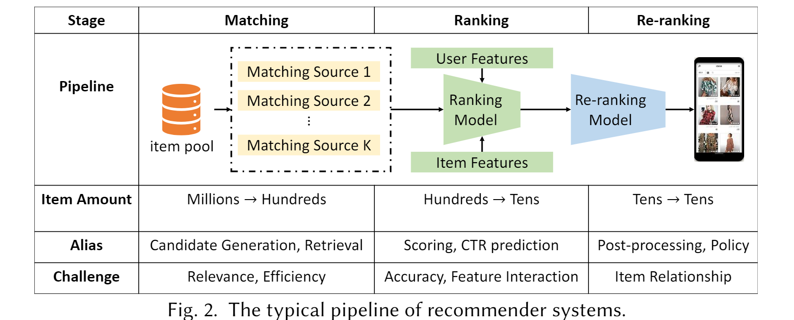

- **Matching**.第一阶段从巨大的项目库（百万级甚至十亿级）中生成数百个候选项目，这大大降低了规模。这一阶段的核心任务是高效地检索潜在的相关项，并实现用户兴趣的粗粒度建模。
- **Ranking**.在匹配阶段之后，来自不同渠道的多个候选项源被合并到一个列表中，然后通过单个排名模型进行评分。由于这一阶段的输入项相对较少，系统可以提供更复杂的算法，以实现更高的推荐精度。由于涉及到很多功能，因此这一阶段的关键挑战是设计合适的模型来捕获复杂的功能交互。
- **Re-ranking**.尽管排名阶段后获得的项目列表在相关性方面进行了优化，但它可能不满足其他重要要求，如新鲜度、多样性、公平性等，因此，需要重新排名阶段，通常删除某些项目或更改列表顺序，以满足其他标准，并满足业务需求。这一阶段的主要关注点是考虑得分最高的项目之间的多重关系。

#### 2.1.3 Scenarios

**Social Recommendation**.由于能够与其他用户交互，个人行为受到个人和社会因素的驱动。图3示出了社会推荐的数据输入，其中用户交互由他/她自己的偏好和社会因素（社会影响和社会同质性）决定。

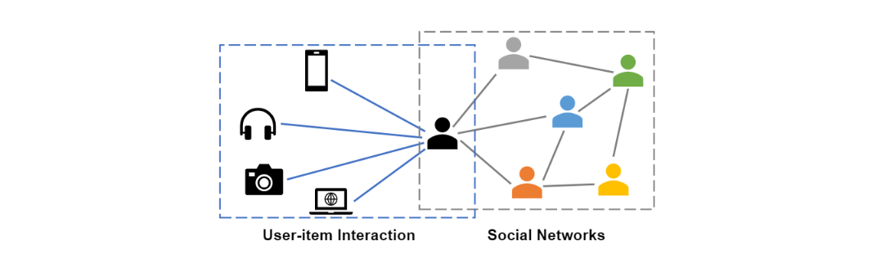

**Sequential Recommendation**.在推荐系统中，用户会随着时间的推移产生大量的交互行为。顺序推荐方法从这些行为序列中提取信息，并预测用户的下一个交互项目，如图4所示。在顺序推荐中，有两个主要挑战。首先，对于每个样本，即每个序列，需要从序列中提取用户的兴趣，以预测下一个项目。特别是当序列长度增加时，同时对用户的短期、长期和动态兴趣进行建模是非常具有挑战性的。其次，除了在一个序列中建模外，由于项目可能出现在多个序列中，或者用户有多个序列，因此需要捕获不同序列之间的协作信号，以便更好地表示学习。

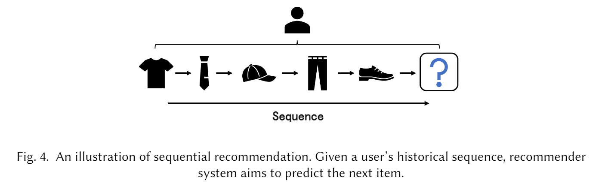

**Session-based Recommendation**.用户配置文件和长期历史交互不可用，只提供来自匿名用户的短期会话数据。因此，传统的推荐方法（如协同过滤）在这种情况下可能表现不佳。这就引发了基于会话的推荐（SBR）问题，其目的是用给定的匿名行为会话数据预测下一个项目，如图5所示。

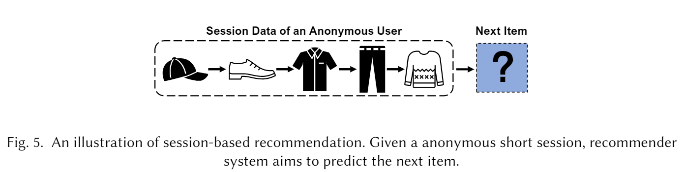

**Bundle Recommendation**.现有的推荐系统主要侧重于向用户推荐独立的项目。捆绑是一系列物品的集合，这是产品促销的重要营销策略，Bundle Recommension旨在为用户推荐一组商品供其消费。

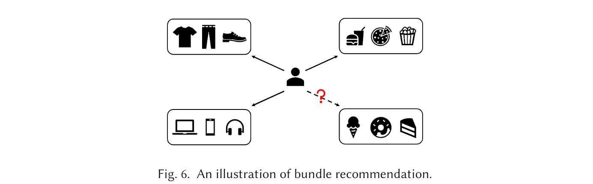

**Cross-Domain Recommendation**.随着越来越多的用户跨多个域与多模式信息交互，跨域推荐（CDR）已被证明是一种有希望缓解冷启动和数据稀疏问题的方法]。CDR方法大致可分为两类，单目标CDR（STCDR）和双目标CDR（DTCDR）。CDR方法将信息从源域向目标域单向传输；DTCDR强调源域和目标域信息的相互利用，可以扩展到多目标CDR（MTCDR）。由于利用来自多个域的信息可以提高性能，跨域推荐已经成为推荐系统中的一个重要场景。

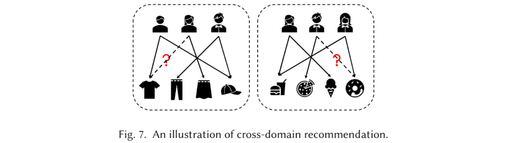

**Multi-behavior Recommendation**.用户与推荐系统在多种类型的行为下进行交互，而不是仅在一种类型的行为下进行交互。对于多行为推荐，一般来说，有两个主要挑战。首先，不同的行为对目标行为有不同的影响。有些行为可能是强信号，有些可能是弱信号。同时，这种影响对每个用户都是不同的。准确地模拟这些不同行为对目标行为的影响是一个挑战。其次，从不同类型的行为中学习项目的综合表征是一个挑战。不同的行为反映了用户对物品的不同偏好；换句话说，不同的行为有不同的含义。为了获得更好的表征，需要将不同行为的意义整合到表征学习中。

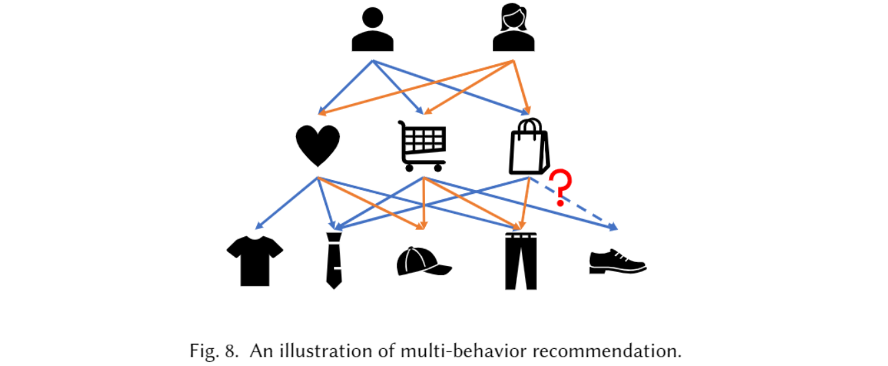

#### 2.1.4 Objectives

当然，推荐系统最重要的目标是准确性。在下文中，我们将详细阐述其他三个重要目标，包括多样性、可解释性和公平性。

**Diversity**.推荐系统通常考虑两种多样性，即个体层次的多样性和系统层次的多样性。个体水平的多样性是向用户推荐不同的项目，系统级多样性方面期望推给不同用户的项目彼此不同。

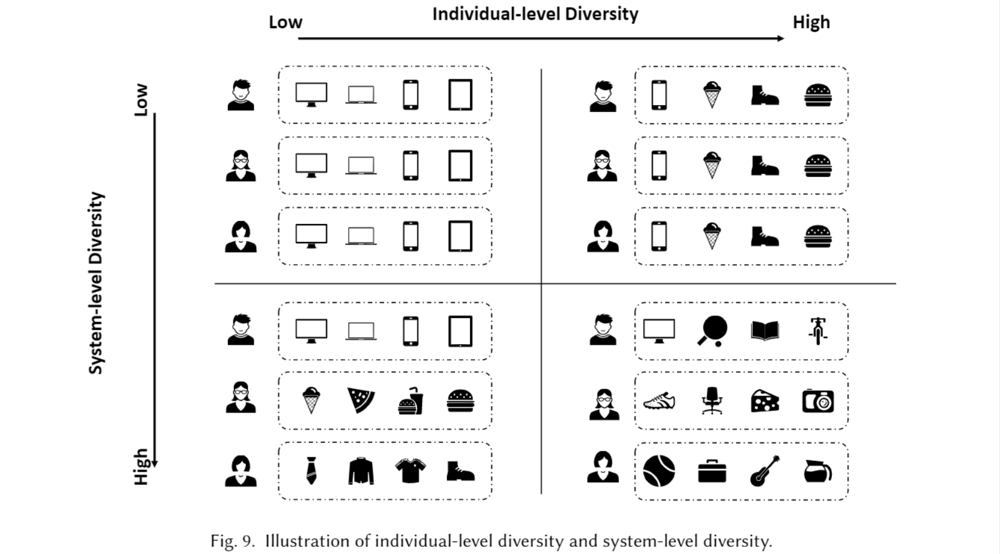

**Explainability**.由于当前的推荐系统大多采用深度学习范式，它们会引起对推荐可解释性的迫切需求。

**Fairness**.推荐系统中的公平性可以分为两类： 用户公平性，它试图确保特定用户或人口统计群体之间没有算法偏差， 和项目公平性，表示不同项目的公平曝光，或不同项目之间没有流行度偏差。 

#### 2.1.5 Applications

推荐系统广泛存在于当今的信息服务中，应用种类繁多，其中具有代表性的有产品推荐、兴趣点推荐、新闻推荐、电影推荐，还有其他类型的推荐应用，例如视频推荐，音乐推荐，工作推荐，食物推荐等。

### 2.2 Graph Neural Networks

实现 GNN 模型的总体过程：从数据（例如表格或文本）构建图形，设计定制的 GNN 以生成表示，将表示映射到预测结果，并进一步定义带有标签的损失函数以进行优化。

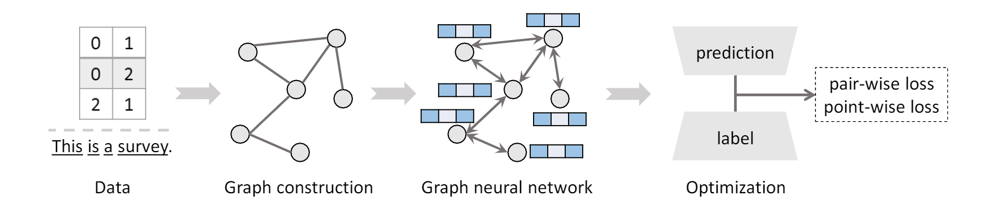

几种典型 GNN 模型的比较如下：

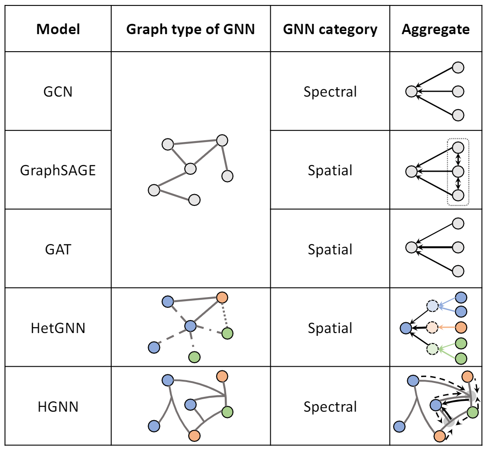

### 2.3 Why are GNNs required for recommender systems

 基于 GNN 的推荐器的成功可以从以下三个角度来解释：（1）结构数据；  (2) 高阶连通性；  (3)监督信号。

- 数据结构：GNN 提供了一种统一的方式来利用可用数据。 同时，GNN 在学习表示方面表现出强大的能力，因此可以获得用户、项目和其他特征的高质量嵌入，这对推荐性能至关重要。
- 高阶连通性：基于 GNN 的模型可以有效地捕获高阶连接。 具体来说，协同过滤效果可以自然地表示为图上的多跳邻居，并通过嵌入传播和聚合将其合并到学习的表示中。
- 监督信号： 监督信号在收集的数据中通常是稀疏的，而基于 GNN 的模型可以在表示学习过程中利用半监督信号来缓解这个问题。

## 3 CHALLENGES OF APPLYING GNNS TO RECOMMENDER SYSTEMS

尽管在推荐系统中应用图神经网络很有动力，但存在四个关键挑战。

- 如何为特定任务构建适当的图表？
- 如何设计信息传播和聚合的机制？
- 如何优化模型？
- 如何保证模型训练和推理的效率？ 

## 4 EXISTING METHODS

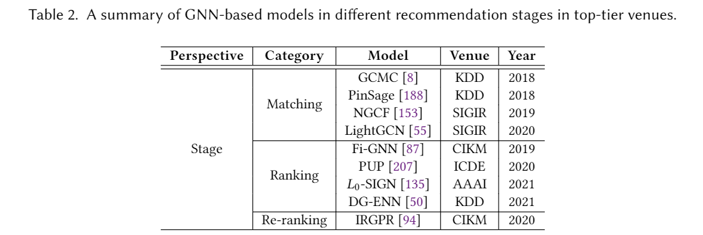

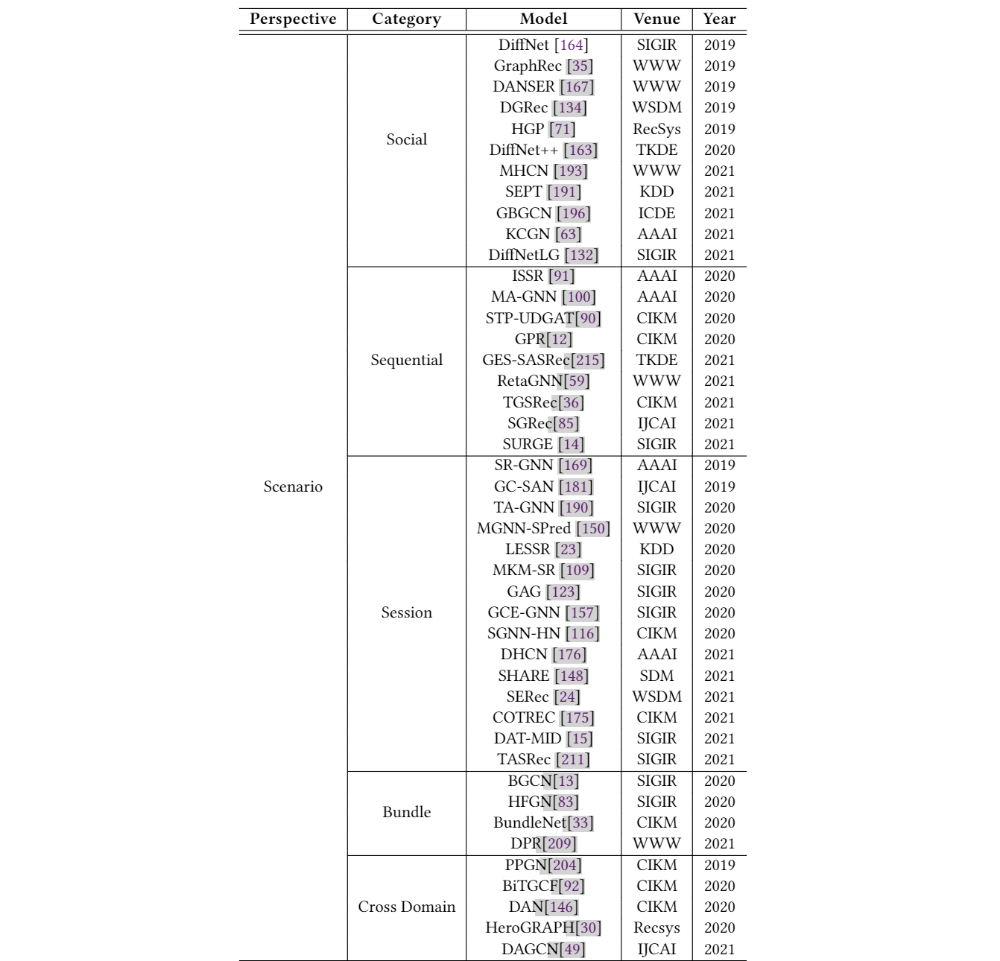

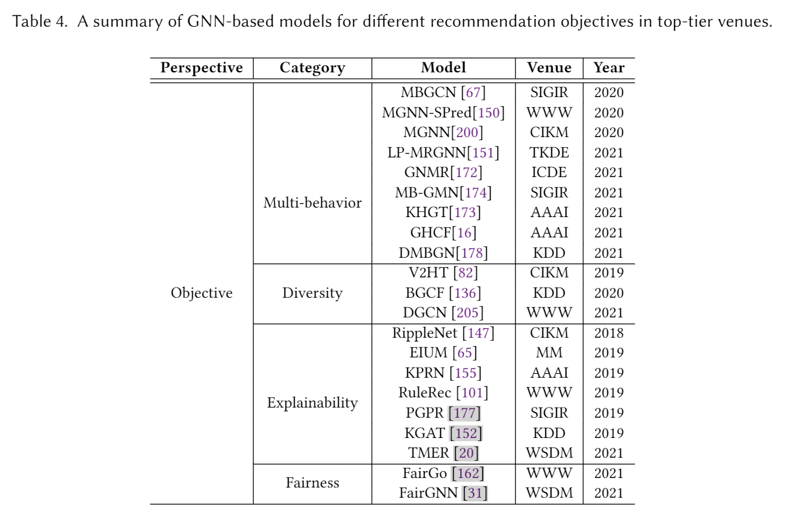

## 5 OPEN PROBLEMS AND FUTURE DIRECTIONS

- Go Deeper：更深层的GNN，GNN加深可以捕获更高阶的关联，但是存在过平滑等问题，同时在GNN加深的过程中，需要保证计算量是可以接受的。最近也看到一篇DeepGCNs论文，在对应官网上有对应代码和ppt展示。
- Dynamic GNN：动态的GNN推荐，应用场景中很多图是一直在动态变化的，例如在序列推荐或者会话推荐中，用户的数据就是以动态方式收集。
- KG-enhanced Recommendation：知识图谱增强的GNN推荐，利用知识图谱引入更多外部知识，提高推荐质量的同时也能考虑多样性，公平性更多指标。
- Efficiency and Scalability：效率和可扩展性，早期的GNN模型是使用full-batch梯度下降来更新权重，但是大规模工业系统中的边数和节点数是灰常巨大的，所以要考虑效率和大数据量。
- Self-supervised GNN：自监督GNN，利用自监督缓解数据稀疏问题。
- Conversational Recommendation：会话推荐，用户可以与系统进行聊天，明确传达自己的消费需求，或者对推荐的商品给出正面或负面的反馈。
- AutoML-enhanced GNN：自适应GNN推荐，推荐目前有很多场景，如何结合Auto ML等技术，创建通用的GNN推荐系统。