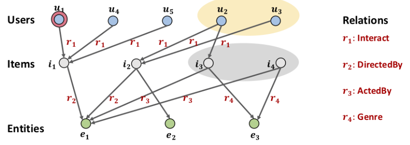
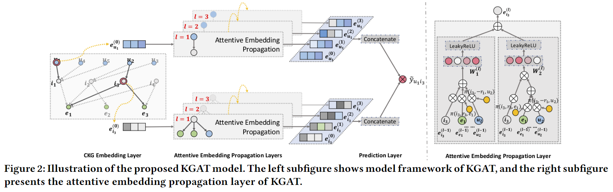
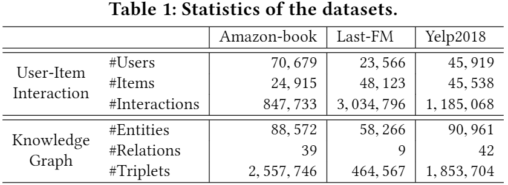
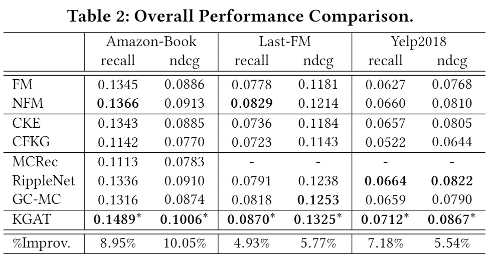
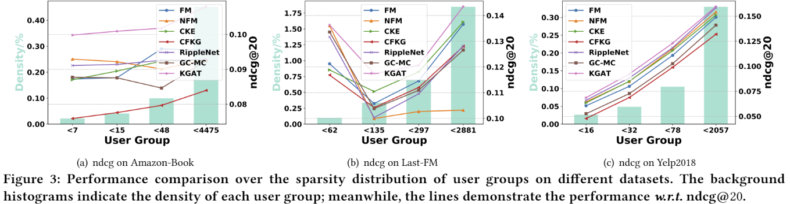
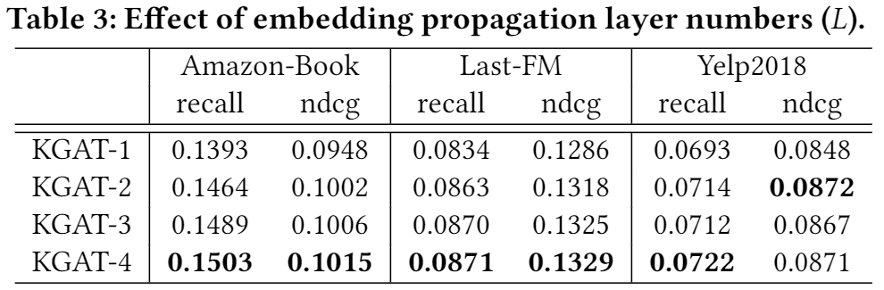
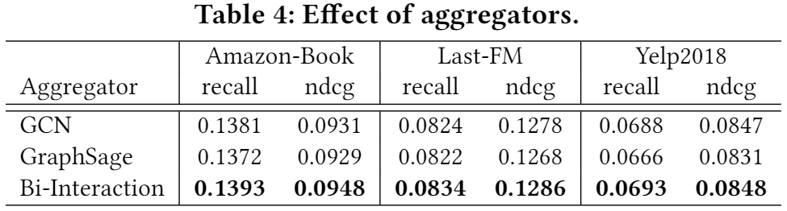
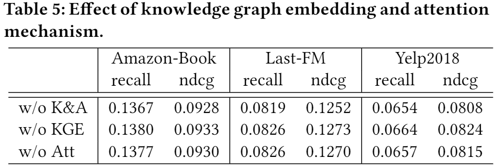
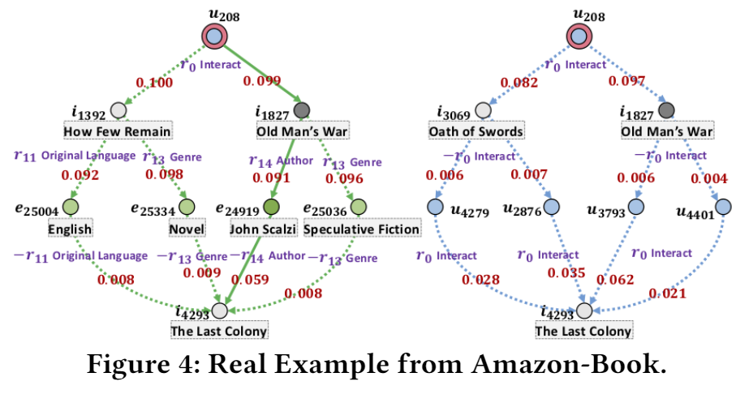

# KGAT:Knowledge Graph Attention Network for Recommendation

> KDD ’19, August 4–8, 2019,Xiang Wang,Xiangnan He|[源码](https://github.com/xiangwang1223/knowledge_graph_attention_network)

## ABSTRACT

传统的FM方法忽略了实例或项目之间的关系（例如，一部电影的导演也是另一部电影的演员），这些方法不足以从用户的集体行为中提取协作信号。我们提出了一种名为知识图注意网络（KGAT）的新方法，它以端到端的方式显式地对 KG 中的高阶连接进行建模。 它递归地从节点的邻居（可以是用户、项目或属性）传播嵌入以改进节点的嵌入，并采用注意力机制来区分邻居的重要性。 

## 1 INTRODUCTION

图1：协作知识图的玩具示例。u1是要为其提供推荐的目标用户。黄圈和灰圈表示高阶关系发现的重要用户和项目，但传统方法忽略了这一点。

为了解决基于特征的SL模型的局限性，一个解决方案是获取项目边信息的图表，也就是。知识图1，构建预测模型。我们把知识图和用户-项目图的混合结构称为协同知识图（CKG）。如图1所示，成功推荐的关键是充分利用CKG中的高阶关系，例如远程连通性：

本文的工作总结如下：

- 我们强调了显式建模协作知识图中的高阶关系以提供更好的项目边信息推荐的重要性。
- 我们提出了一种新的方法KGAT，该方法在图神经网络框架下以显式和端到端的方式实现了高阶关系的建模。
- 我们在三个公共基准上进行了广泛的实验，证明了KGAT及其可解释性在理解高阶关系重要性方面的有效性。

## 2 TASK FORMULATION

**User-Item Bipartite Graph**(用户-项目二部图)：G1定义为$\left.\left\{\left(u, y_{u i}, i\right) \mid u \in \mathcal{U}, i \in \mathcal{I}\right)\right\}$，其中**U**和**I**分别表示用户和项目集，并且链接$y_{u i}$=1表示在用户u和项目i之间存在观察到的交互；否则$y_{u i}$=0。

**Knowledge Graph**(知识图谱)：G2定义为$\{(h, r, t) \mid h, t \in \mathcal{E}, r \in \mathcal{R}\}$,其中$\mathcal{E}$表示实体集，$\mathcal{R}$表示关系集。

**Collaborative Knowledge Graph**(协同知识图谱)：将用户行为和项目知识编码为一个统一的关系图。我们首先将每个用户行为表示为三元组(u，InterAct，i)，其中$y_{u i}$=1看作为用户u和项i之间交互的一个附加关系。然后将两个图进行对齐融合成一个统一图：

其中$\mathcal{E}^{\prime}=\mathcal{E} \cup \mathcal{U},\mathcal{R}^{\prime}=\mathcal{R} \cup\{\text { Interact }\}$.

## 3 METHODOLOGY

图 2 显示了模型框架，它由三个主要组件组成： 1）嵌入层，通过保留 CKG 的结构将每个节点参数化为向量； 2）注意力嵌入传播层，递归地从节点的邻居传播嵌入以更新其表示，并采用知识感知注意力机制来学习传播过程中每个邻居的权重； 3）预测层，聚合来自所有传播层的用户和项目的表示，并输出预测的匹配分数。

### 3.1 Embedding Layer

我们在 CKG 上采用了一种广泛使用的方法 TransR,打分函数如下：

其中$\mathbf{W}_{r} \in \mathbb{R}^{k \times d}$是关系r的变换矩阵，它将实体从d维实体空间投影到k维关系空间。得分越低，表明三元组更有可能是真的，反之则不然。KGLoss函数如下：

其中$\mathcal{T}=\left\{\left(h, r, t, t^{\prime}\right) \mid(h, r, t) \in \mathcal{G},\left(h, r, t^{\prime}\right) \notin \mathcal{G}\right\}$,(h, r , t ′) 是通过随机替换有效三元组中的一个实体而构造的负样本， σ (·) 是 sigmoid 函数。

### 3.2 Attentive Embedding Propagation Layers

**Information Propagation**：为了刻画实体h的一阶连通结构，我们计算h的一阶邻居的线性组合：

其中$\pi(h, r, t)$控制边$(h, r, t)$上每次传播的衰减因子，表示从 t 传播到 h 的信息量取决于关系 r。

**Knowledge-aware Attention**：通过关系注意机制实现$\pi(h, r, t)$，我们选择 tanh 作为非线性激活函数：

此后，我们通过采用 softmax 函数对与 h 连接的所有三元组的系数进行归一化：

**Information Aggregation**：最后是将实体表示$\mathbf{e}_{\mathcal{h}}$及其一阶邻居表示$\mathbf{e}_{\mathcal{N}_{h}}$聚合为实体 h 的新表示。聚合方式有以下三种：

**High-order Propagation**：堆叠更多的传播层来探索高阶连接信息，收集从更高跳邻居传播的信息。

### 3.3 Model Prediction

采用层聚合机制将每个步骤的表示连接成单个向量。最后，我们对用户和项目表示进行内积，从而预测他们的匹配分数：

其中$\|$表示串联操作。

### 3.4 Optimization

选择BPRLoss来作为CF的损失函数：

其中$\boldsymbol{O}=\left\{(u, i, j) \mid(u, i) \in \mathcal{R}^{+},(u, j) \in \mathcal{R}^{-}\right\}$表示训练集，R+ 表示用户 u 和项目 j 之间观察到的（正）交互，而 R- 是采样的未观察（负）交互集；  σ (·) 是 sigmoid 函数。

最后，我们有目标函数来联合学习$\mathcal{L}_{\mathrm{KG}}$和$\mathcal{L}_{\mathrm{CF}}$，如下:

## 4 EXPERIMENTS

### 4.1 Dataset Description

### 4.2 Experimental Settings

### 4.3 Performance Comparison (RQ1)

### 4.4 Study of KGAT (RQ2)

### 4.5 Case Study (RQ3)

- KGAT 捕获了基于行为和基于属性的高阶连通性，它们在推断用户偏好方面起着关键作用。 检索到的路径可以被视为该项目满足用户偏好的证据。 如我们所见，连接性$u_{208} \stackrel{r_{0}}{\longrightarrow} \text { Old Man's War } \stackrel{r_{14}}{\longrightarrow} \text { John Scalzi } \stackrel{-r_{14}}{\longrightarrow} i_{4293}$具有最高的注意力得分，在左子图中用实线标记。 因此，我们可以生成解释，因为您看过同一作者约翰·斯卡尔齐（John Scalzi）撰写的《老人之战》，因此推荐《最后的殖民地》。
- 项目知识的质量至关重要。 正如我们所看到的，实体英语与原始语言的关系涉及一个路径，这太笼统而无法提供高质量的解释。 这激励我们在未来的工作中进行严格的关注，以过滤掉信息量较少的实体。

## 5 CONCLUSION AND FUTURE WORK

在这项工作中，我们探索了CKG中具有语义关系的高阶连通性，以实现知识感知的推荐。我们设计了一个新的框架KGAT，它以端到端的方式显式地模拟了CKG中的高阶连通性。

该工作探索了图神经网络在推荐中的潜力，代表了利用信息传播机制开发结构化知识的初步尝试。除了知识图之外，现实世界中确实存在许多其他结构化信息，如社会网络和项目上下文。另一个令人兴奋的方向是信息传播和决策过程的集成，这开启了对可解释推荐的深入研究。

