# Knowledge Graph Convolutional Networks for Recommender Systems

> WWW ’19, May 13–17, 2019,Hongwei Wang，Miao Zhao...|[源码](https://github.com/hwwang55/KGCN)

## ABSTRACT

在本文中，我们提出了知识图卷积网络（KGCN），这是一种端到端的框架，通过在 KG 上挖掘相关属性来有效地捕获项目间的相关性。 为了自动发现 KG 的高阶结构信息和语义信息，我们从 KG 中每个实体的邻居中采样作为它们的感受野，然后在计算给定实体的表示时将邻居信息与偏差结合起来。 感受野可以扩展到多跳，以模拟高阶邻近信息并捕获用户潜在的远距离兴趣。 

## 1 INTRODUCTION

在本文中，我们研究了KG感知的推荐问题。我们的设计目标是自动捕获KG中的高阶结构和语义信息。受图卷积网络(GCN)1试图将卷积推广到图域的启发，我们提出了用于推荐系统的知识图卷积网络(KGCN)。KGCN的核心思想是在计算给定实体在KG中的表示时，聚合并结合带有偏差的邻域信息。这样的设计有两个优点：(1)通过邻域聚合操作，成功地捕获并存储在每个实体中的局部邻接结构。(2)邻域根据连接关系和特定用户的得分进行加权，它既表征了KG的语义信息，也表征了用户对关系的个性化兴趣。

## 2 KNOWLEDGE GRAPH CONVOLUTIONAL NETWORKS

### 2.1 Problem Formulation

据用户的隐式反馈定义用户-物品交互矩阵Y和知识图G，我们的目标是学习预测函数$\hat{y}_{u v}=\mathcal{F}(u, v \mid \Theta, \mathrm{Y}, \mathcal{G})$，其中$\hat{y}_{u v}$表示用户u参与项目v的概率，Θ表示函数F的模型参数。

### 2.2 KGCN Layer

为了刻画项目v的拓扑邻近结构，我们计算v的邻域的线性组合：

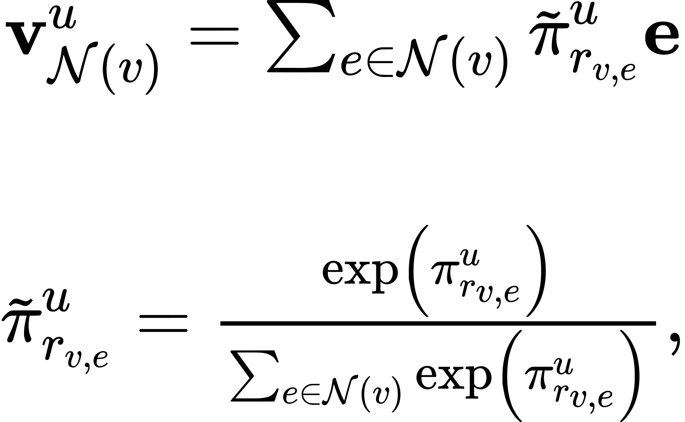

这里的$\pi_{r}^{u}=g(r, u)$,函数g(·)用来计算用户 u 和某个关系 r 之间的分数。为了防止节点邻居过多带来的计算压力，这里设置了阈值超参数K。也就是说，对于每一个结点 v，只是选取 K 个邻居进行计算。接下来就是聚合自身和邻域特征，以下提供了三种可用的聚合方式：

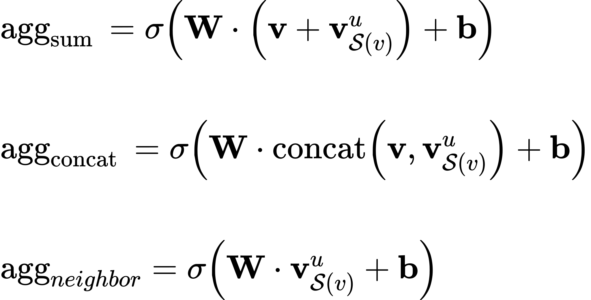

以下是一次迭代过程演示：

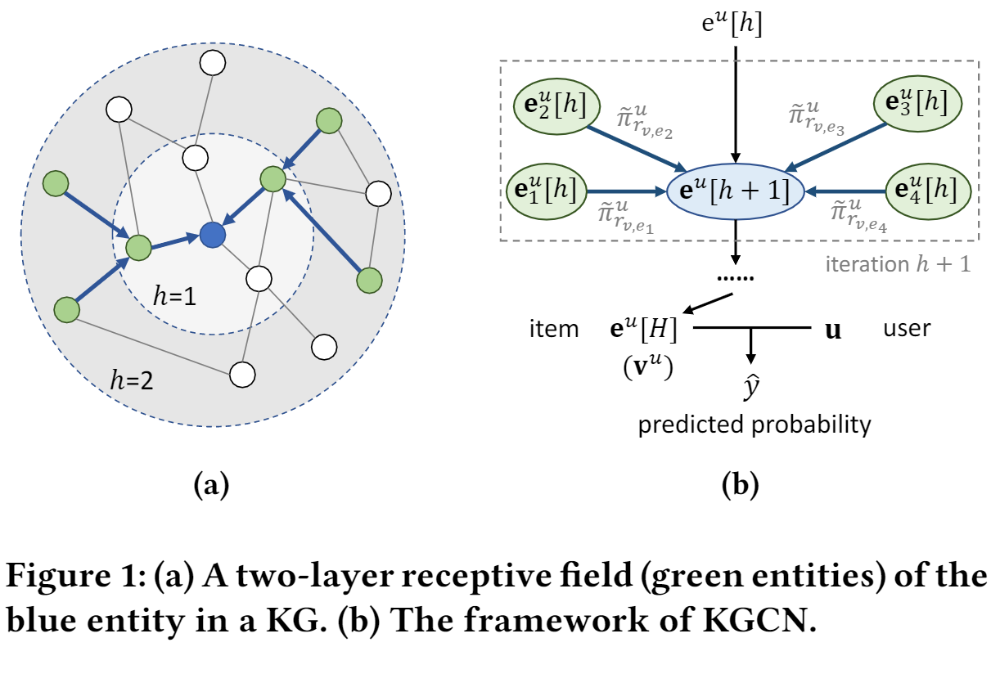

### 2.3 Learning Algorithm

将KGCN Layer层迭代多次可获得更深的感受野，算法如下：

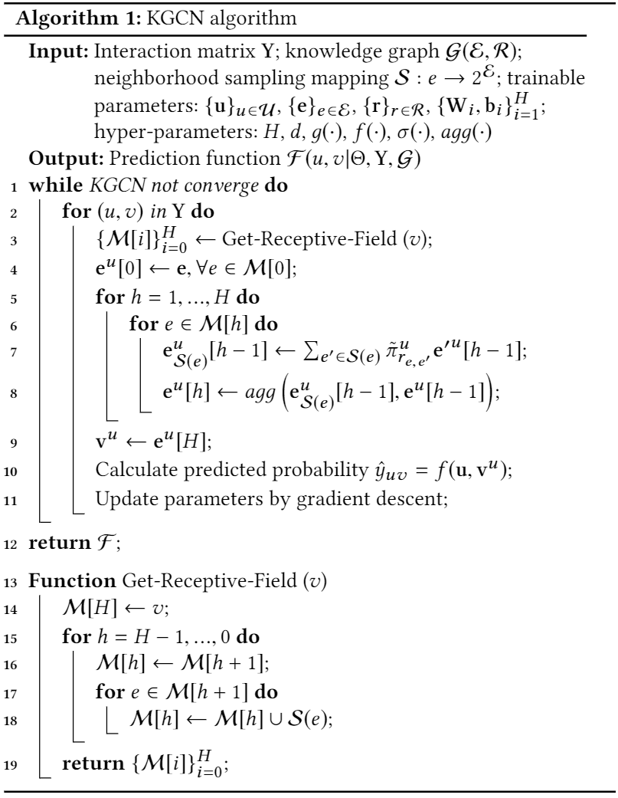

得到各个结点的表示后，同理使用 u v 的内积搭配 sigmoid 函数作点击概率预测：

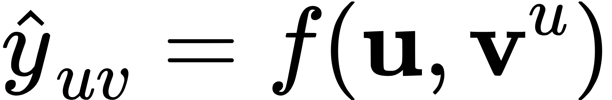

整体的损失函数如下：

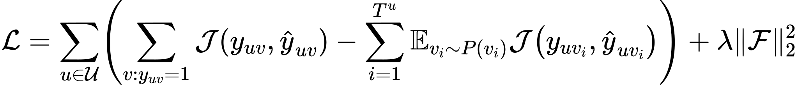

其中J为交叉熵损失，P为负抽样分布，Tu为用户u的负样本个数。本文中$T^{u}=\left|\left\{v: y_{u v}=1\right\}\right|$，P服从均匀分布。最后一项是L2正则化子。

## 4 EXPERIMENTS

### 4.1 Datasets

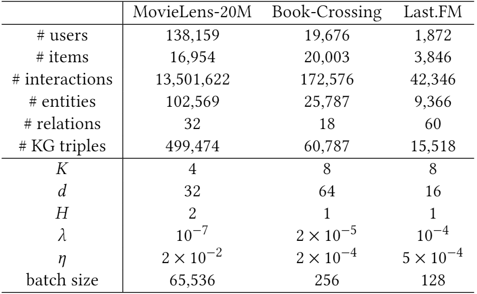

表1：三个数据集的基本统计数据和超参数设置（K：相邻采样大小，d：嵌入维度，H：感受野深度，λ：L2正则化器权重，η：学习率）。

### 4.2 Results

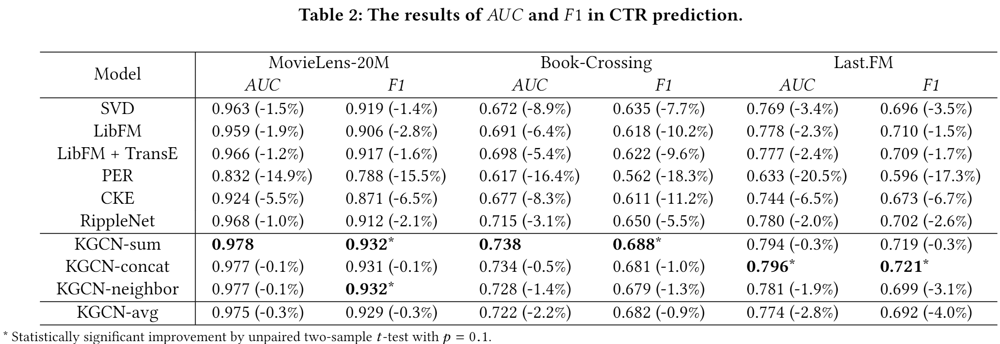

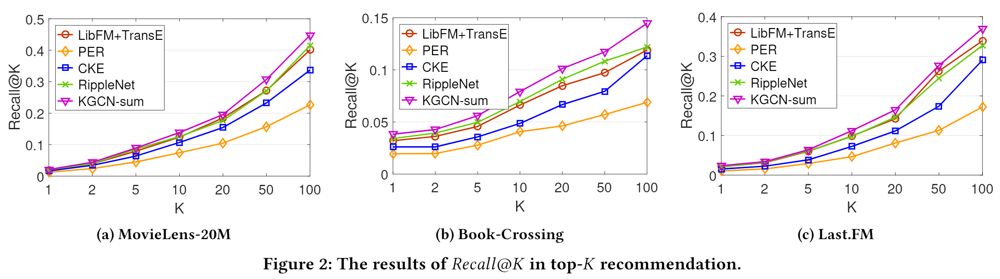

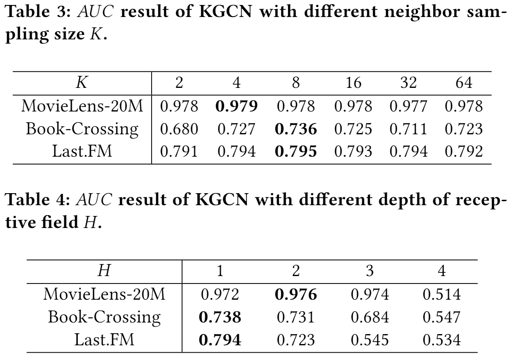

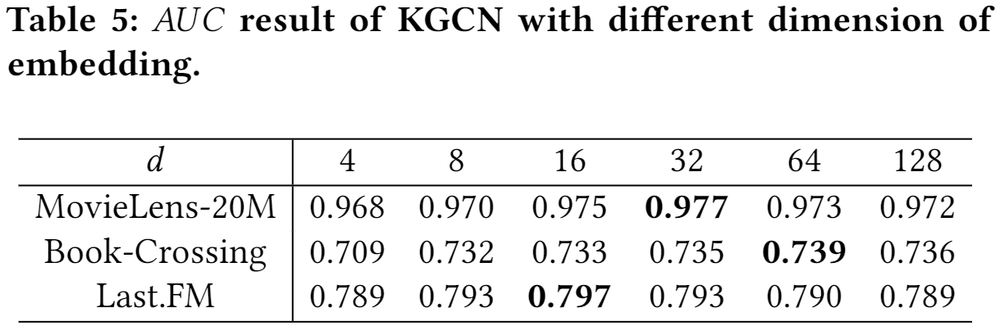

## 5 CONCLUSIONS AND FUTURE WORK

KGCN通过选择性和有偏地聚合邻域信息，将非谱GCN方法扩展到知识图，既能学习KG的结构信息和语义信息，又能学习用户的个性化兴趣和潜在兴趣。我们为未来的工作指出了三个途径。

- 在这项工作中，我们从一个实体的邻域中均匀地抽样来构造它的接受场。探索非均匀采样器(例如，重要的采样)是未来工作的重要方向。

- 本文(以及所有文献)的重点是建立项目端知识获取系统的模型。未来工作的一个有趣的方向是研究利用用户端KGS是否有助于提高推荐性能。

- 设计一种在两端很好地结合KG的算法也是一个很有前途的方向。

