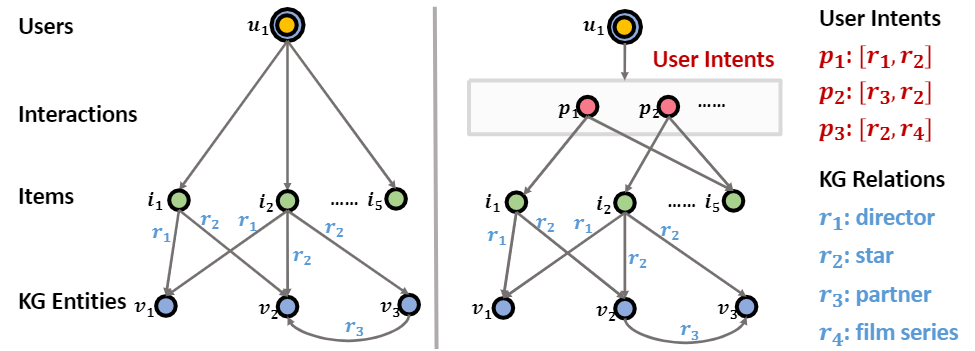
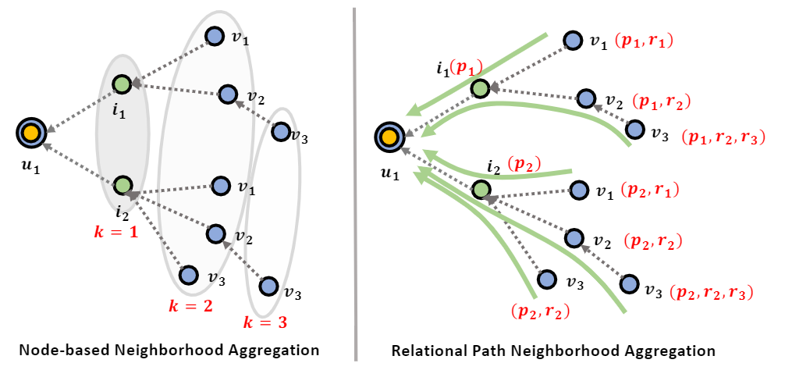
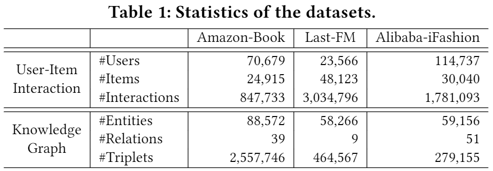
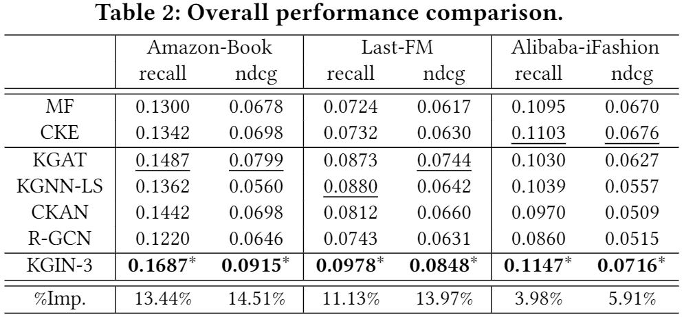
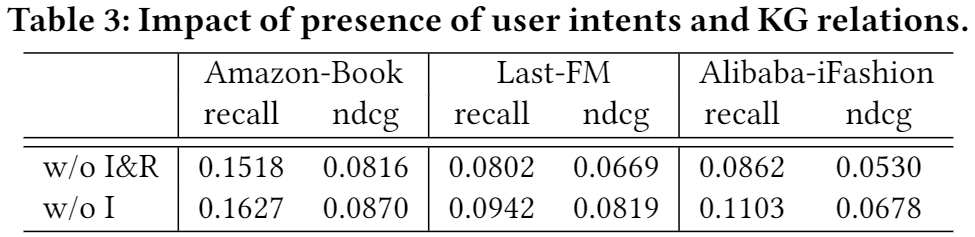
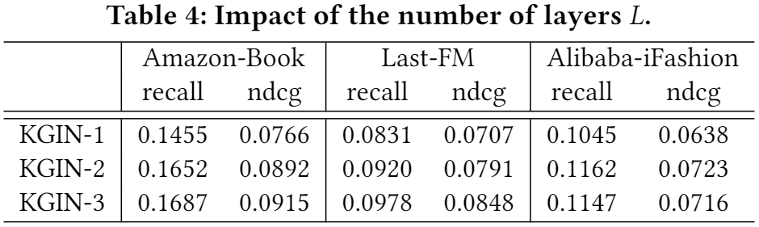
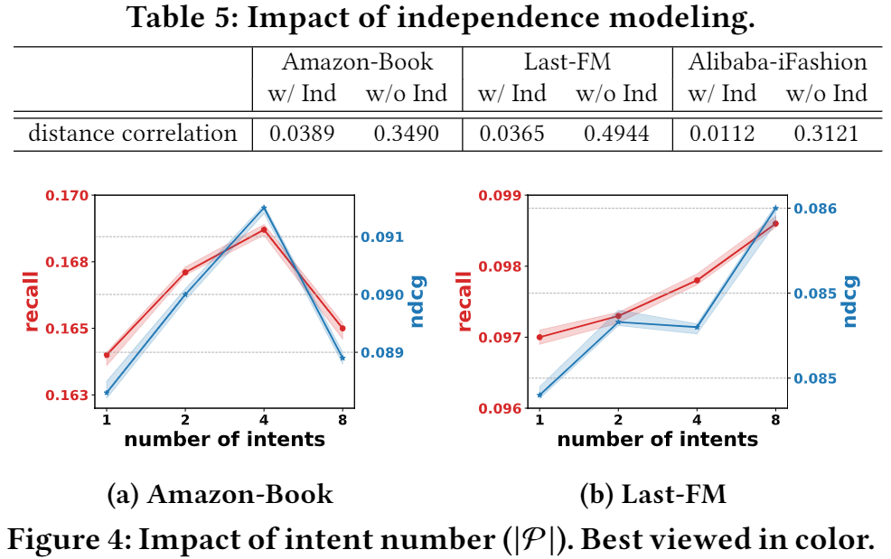
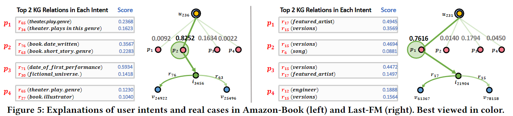

# Learning Intents behind Interactions with Knowledge Graph for Recommendation

> WWW ’21, April 19–23, 2021,Xiang Wang,Xiangnan He|[源码](https://github.com/huangtinglin/Knowledge_Graph_based_Intent_Network)

## ABSTRACT

现有的GNN模型在关系建模上是粗粒度的，不能(1)在细粒度的意图层次上识别用户-项目关系，(2)利用关系依赖关系来保持远距离连接的语义。从技术上讲，我们将每个意图建模为KG关系的精心组合，鼓励不同意图的独立性，以获得更好的模型能力和可解释性。此外，我们还为GNN设计了一种新的信息聚合方案，它递归地集成了长距离连通性(即关系路径)的关系序列。该方案允许我们提取关于用户意图的有用信息，并将其编码为用户和项的表示。

## 1 INTRODUCTION

用户意图。当前基于 GNN 的方法都没有在更细粒度的意图水平上考虑用户项关系。 一个重要的事实被忽略了：一个用户通常有多个意图，驱使用户消费不同的项目。以图1的右侧为例，Intent p1强调导演(𝑟1)和明星(𝑟2)方面的组合，从而驱动用户𝑢1观看电影𝑖1和𝑖5；而另一个意图 p2 突出显示用户选择电影 i2 的明星 (r2) 和合作伙伴 (r3) 方面的原因。 忽略用户意图的存在会限制用户-项目交互的建模。

关系路径。当前基于 GNN 的方法信息聚合方案大多是基于节点的——即从相邻节点收集信息，而不区分它来自哪些路径。 如图2左侧所示，u1的表示混合了来自一跳、二跳和三跳邻居的信号（即{i1, i2}, {v1, v2, v3}, {v3})。 它无法保留路径（例如，从 v3 到 u1 的三跳路径中的 (p1, r2, r3) ）携带的关系依赖关系和顺序。 因此，这种基于节点的方案不足以捕捉关系之间的交互。

本文工作总结为：

- 揭示基于KG的推荐中交互背后的用户意图，以获得更好的模型容量和可解释性；
- 提出一个新的模型KGIN，该模型在GNN范式下的意图和关系路径的长期管理的细粒度上考虑用户-项目关系；
- 在三个基准数据集上进行实证研究，以证明KGIN的优越性。

## 2 PROBLEM FORMULATION

**Interaction Data**：定义为$\mathcal{O}^{+}=\{(u, i) \mid u \in \mathcal{U}, i \in \mathcal{I}\}$，如KGAT一样，引入了一个额外的关系InterAct-With来显式表示用户-项目关系，并将(𝑢，𝑖)对转换为(𝑢，InterAct-With，𝑖)三元组。因此，用户与项目的交互可以与KG无缝结合。

**Knowledge Graph**：定义为$\mathcal{G}=\{(h, r, t) \mid h, t \in \mathcal{V}, r \in \mathcal{R}\}$,其中$\mathcal{V}$是实体集，$\mathcal{R}$是关系集，$(h, r, t)$表示从头实体 h 到尾实体 t 存在关系 r。

**Task Description**：给定交互数据$\mathcal{O}^{+}$和$\mathcal{G}$，我们的知识感知推荐的任务是学习一个函数，该函数可以预测用户采用某一项的可能性有多大。

## 3 METHODOLOGY

### 3.1 User Intent Modeling

假设 P 是所有用户共享的意图集，我们可以将统一的用户-项目关系分割成 |P|个意图，并将每个 (u, i) 对分解为 {(u, p, i)|p ∈ P}。 因此，我们将用户-项目交互数据重组为异构图，称为意图图 (IG)。

#### 3.1.1 Representation Learning of Intents

其中e𝑟是关系𝑟的ID嵌入，其被赋予注意力分数𝛼(𝑟，𝑝)以量化其重要性,𝑤𝑟𝑝是特定于特定关系𝑟和特定意图𝑝的可训练重量。

#### 3.1.2 Independence Modeling of Intents

为了更好的建模能力和可解释性，我们鼓励意图的表示彼此不同。在这里，我们提供两个实现。

**Mutual information**：我们最小化任意两个不同意图的表示之间的互信息，以量化它们的独立性：

其中𝑠(·)是度量任意两个意图表示之间的关联性的函数，这里设置为余弦相似函数；𝜏是温度的超参数，以Softmax函数表示。

**Distance correlation**：它测量任意两个变量的线性和非线性相关性，当且仅当这些变量是独立的，其系数为零。最小化用户意图的距离相关性使我们能够减少不同意图的依赖，其表达式如下：

其中𝑑𝐶𝑜𝑟(·)是意图𝑝和𝑝‘之间的距离相关性，𝑑𝐶𝑜𝑣(·)是两个表示的距离协方差，而𝑑𝑉𝑎𝑟(·)是每个意图表示的距离方差。

### 3.2 Relational Path-aware Aggregation

#### 3.2.1 Aggregation Layer over Intent Graph

考虑到IG中的用户𝑢，使用N𝑢={(𝑝，𝑖)|(𝑢，𝑝，𝑖)∈C}来表示𝑢周围的意图感知历史和一阶连通性。在技术上，我们可以整合历史项中的意图感知信息来创建用户𝑢的表示为：

#### 3.2.2 Aggregation Layer over Knowledge Graph

考虑到KG中的物品i，使用N𝑖={(𝑟，𝑣)|(𝑖，𝑟，𝑣)∈G}来表示物品𝑖的属性和一阶连通性，然后集成来自相连实体的关联感知信息来生成物品𝑖的表示：

#### 3.2.3 Capturing Relational Paths

我们进一步堆叠了更多的聚合层来收集来自更高阶邻居的有影响的信号。从技术上讲，我们递归地将用户 u 和项目 i 在 𝑙 层之后的表示表示为：

*设$s=i \stackrel{r_{1}}{\longrightarrow} s_{1} \stackrel{r_{2}}{\longrightarrow} \cdots s_{l-1} \stackrel{r_{l}}{\longrightarrow} s_{l}$是一条以项目 i 为根的 𝑙 -hop 路径，其中包含一系列连接的三元组。 其关系路径仅表示为关系序列，即(r1, r2,····,r𝑙 )。 我们可以重写表示 e i (l)如下：

### 3.3 Model Prediction

### 3.4 Model Optimization

其中O={(𝑢，𝑖，𝑗)|(𝑢，𝑖)∈O+，(𝑢，𝑗)∈O−})，是由正样本O+和负样本O−组成，𝜎(·)是Sigmoid函数。

## 4 EXPERIMENTS

### 4.1 Datasets

### 4.2 Performance Comparison (RQ1)

### 4.3 Relational Modeling of KGIN (RQ2)

#### 4.3.1 Impact of Presence of User Intents & KG Relations

#### 4.3.2 Impact of Model Depth

#### 4.3.3 Impact of Intent Modeling

### 4.4 Explainability of KGIN (RQ3)

## 5 RELATED WORK

与 KG 结合的现有推荐模型大致分为四组。

- 基于嵌入的方法主要关注一阶连通性，但它们忽略了高阶连通性。 这使得它们无法捕获两个节点之间路径的远程语义或顺序依赖关系。

- 基于路径的方法通过提取通过 KG 实体连接目标用户和项目节点的路径来解释远程连接。 然而，两种主流的路径提取方法存在一些固有的局限性：（1）当涉及大规模图时，应用蛮力搜索很容易导致劳动密集型和耗时的特征工程； (2) 在使用元路径模式过滤路径实例时，需要领域专家预先定义特定领域的模式，从而导致对不同领域的可迁移性较差。

- 基于策略的方法从强化学习 (RL) 成功中获得灵感，并设计 RL 代理来学习寻路策略，然而，稀疏的奖励信号、巨大的动作空间和基于策略梯度的优化使得这些网络难以训练和收敛到稳定且令人满意的解决方案。
- 基于 GNN 的方法建立在图神经网络的信息聚合机制之上。然而，据我们所知，当前基于 GNN 的方法假设用户和项目之间仅存在一种关系，但隐藏的意图未被探索。 此外，它们中的大多数都未能保留路径中的关系依赖关系。 

## 6 CONCLUSION AND FUTURE WORK

我们提出了一个新的框架，KGIN，它从两个维度实现了更好的关系建模：（1）在意图的粒度上揭示用户项关系，与 KG 关系相结合以展示可解释的语义；  (2) 关系路径感知聚合，它整合来自多跳路径的关系信息以细化表示。推荐的有效性和可解释性。 当前的工作通常将基于 KG 的推荐构建为监督任务，其中监督信号仅来自历史交互。 这种监督过于稀疏，无法提供高质量的表示。 在未来的工作中，我们将探索推荐中的自监督学习，以通过自监督任务生成辅助监督，并揭示数据实例之间的内部关系。 此外，我们希望将因果概念（例如因果效应推断、反事实推理和去混杂）引入到知识感知推荐中，以发现和放大偏差。
