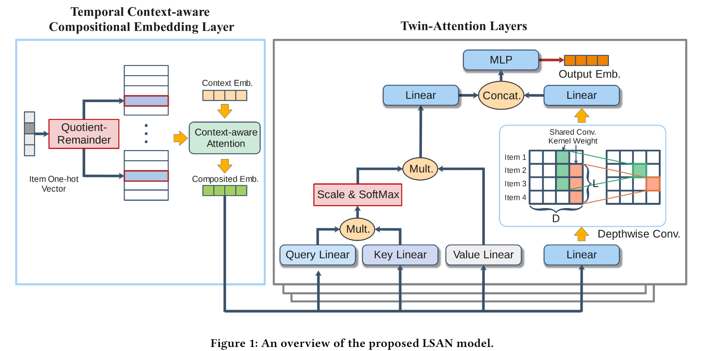
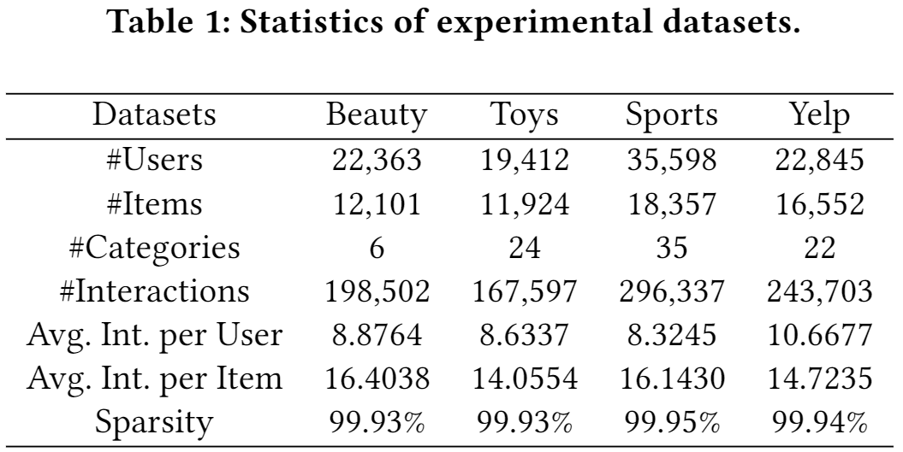
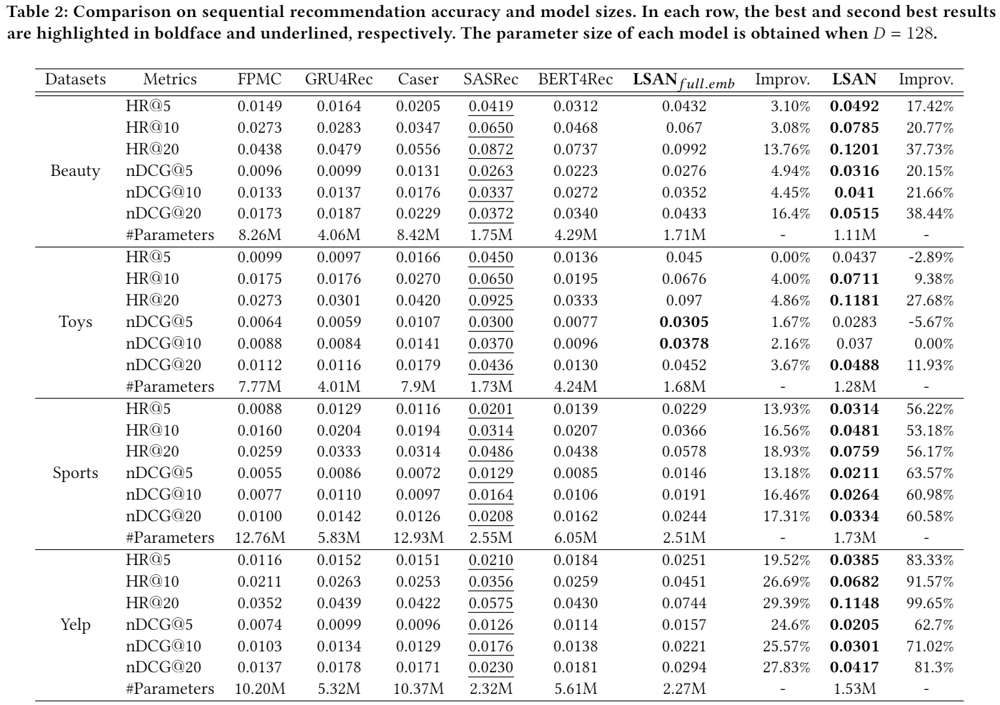
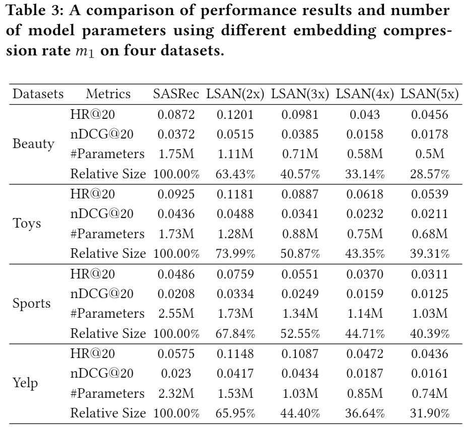
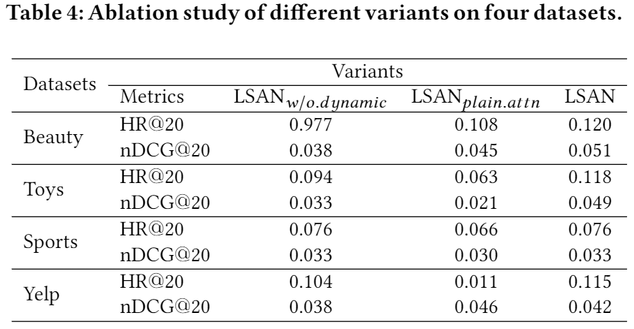
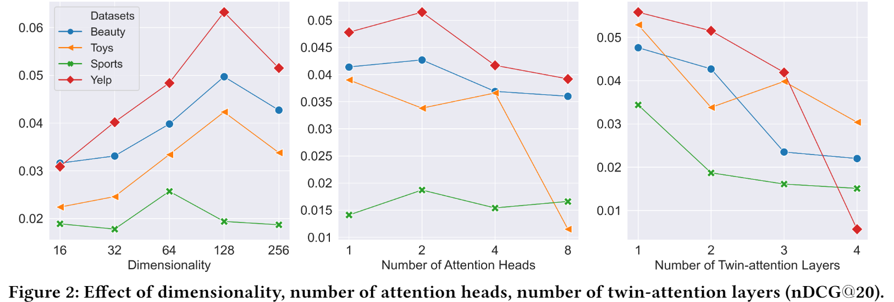
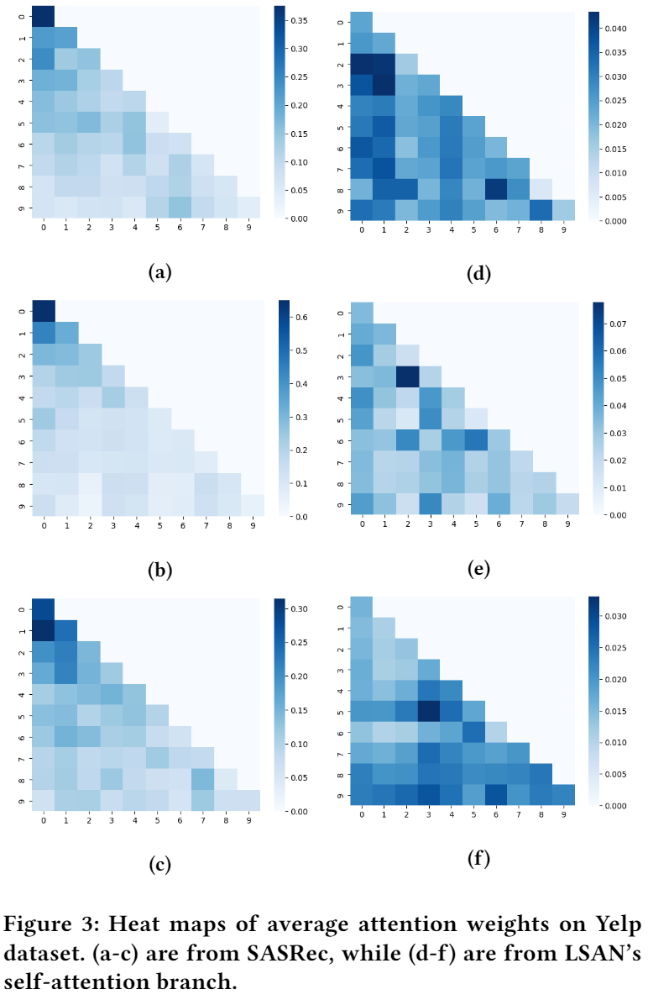

# Lightweight Self-Attentive Sequential Recommendation

> CIKM ’21, November 1–5, 2021,Yang Li,Tong Chen...

## ABSTRACT

现有的基于 DNN 的顺序推荐器通常将每个项目嵌入到唯一的向量中，以支持用户兴趣的后续计算。 然而，由于潜在的大量项目，顺序推荐器的过度参数化项目嵌入矩阵已成为在资源受限环境（例如智能手机和其他边缘设备）中有效部署的内存瓶颈。 此外，我们观察到广泛使用的多头自注意力虽然在建模项目之间的顺序依赖方面很有效，但严重依赖冗余注意力单元来完全捕获序列中的全局和局部项目-项目转换模式。

- 在本文中，我们介绍了一种用于顺序推荐的新型轻量级自注意力网络（LSAN）。 为了积极地压缩原始嵌入矩阵，LSAN 利用了组合嵌入的概念，其中每个项目嵌入是通过合并一组从更小的嵌入矩阵派生的选定基本嵌入向量组成的。 

- 同时，为了考虑每个项目的内在动态，我们进一步提出了一种时间上下文感知嵌入组合方案。

- 此外，我们开发了一种创新的双注意力网络，可以减轻传统多头自注意力的冗余，同时保留捕获长期和短期（即全局和局部）项目依赖关系的全部能力。 

## 1 INTRODUCTION

通过提出的 LSAN，我们对轻量级顺序推荐的主要贡献有三方面：

- 我们设计了一个动态的上下文感知组合嵌入方案，它大大减少了项目嵌入矩阵的内存占用和同时确保生成的项目嵌入的唯一性和动态性。
- 我们提出了一种新颖的双注意力序列框架，该框架分别通过专用的自注意力和卷积操作专门学习长期和短期用户偏好信号。 这有助于对全局和局部模式进行显式建模，同时避免多头自注意力模块的冗余。
- 在三个基准数据集上进行了广泛的实验。 结果证明了 LSAN 与最先进的基线方法相比具有优势的有效性和内存效率。

## 2 PROBLEM FORMULATION

设V、U分别为项目集和用户集。S𝑢={𝑣1，𝑣2，...，𝑣𝑇}表示用户𝑇u的交互序列。给定一系列交互 S𝑢，我们的目标是计算一个排名列表，其中包含 𝑢 在下一个时间步 𝑇 + 1 最有可能访问的前 𝐾 项目。

## 3 METHODOLOGY

### 3.1 Dynamic Context-aware Compositional Embedding

在典型的基于潜在因子的推荐系统中，项目的嵌入矩阵的大小为𝑬 ∈ R|V |×𝐷。为了减小 𝑬 的大小以获得更好的内存效率，我们将 𝑬 替换为一组 𝑁 基嵌入表，表示为$\left\{\widetilde{E}_{1}, \widetilde{E}_{2}, \ldots, \widetilde{E}_{N}\right\}$，其中$\widetilde{\boldsymbol{E}}_{n} \in \mathbb{R}^{m_{n} \times D}$表，𝑛 = 1, 2, ..., 𝑁。 这里，𝑚𝑛 表示第 𝑛 基嵌入表$\widetilde{\boldsymbol{E}}_{n}$中基嵌入的数量且𝑚𝑛 ≪ |V | 。对于每个项目，它的组合嵌入是通过首先从每个$\widetilde{\boldsymbol{E}}_{n}$中选择一个基嵌入向量来产生的，然后将所有选择的基嵌入集中融合到一个嵌入中。以第一个基嵌入表$\widetilde{\boldsymbol{E}}_{1}$为例，项目 𝑣𝑖 ∈ S𝑢 的相应基嵌入索引 𝑞𝑖（即$\widetilde{\boldsymbol{E}}_{1}$中的行索引）可以通过基嵌入表大小 𝑚1 上的余数函数计算：

正式的运算时我们需要先定义一个哈希矩阵$\boldsymbol{R}^{1} \in \mathbb{R}^{m_{1} \times|\mathcal{V}|}$：

再结合项目 𝑣𝑖 的one-hot向量$f_{i} \in \mathbb{R}^{|\mathcal{V}|}$与$\widetilde{\boldsymbol{E}}_{1}$来查找 𝑣𝑖 的第一基嵌入$\widetilde{\boldsymbol{e}}_{i}^{1}$：

类似地，对于 𝑛 = 2, 3, ..., 𝑁 , 𝑣𝑖 的第 𝑛 基嵌入表的哈希矩阵$\boldsymbol{R}^{n}$可以概括为：

其中项目 𝑣𝑖 在第 𝑛 基嵌入表中的索引由先前基嵌入表的结果商确定，然后，我们通过同样的方式获得$\widetilde{\boldsymbol{e}}_{i}^{n}$：

通过商余数技巧，我们现在获得了项目 𝑣𝑖 的一组基本嵌入$\left\{\tilde{\boldsymbol{e}}_{i}^{1}, \widetilde{\boldsymbol{e}}_{i}^{2}, \ldots, \widetilde{\boldsymbol{e}}_{i}^{N}\right\}$，可以通过集成操作将其合成一个统一的项目嵌入，但这不足以捕捉项目属性的内在动态。定义每个 𝑣𝑖 的上下文$r_{i}=\left(c_{i-1}, c_{i}, \operatorname{time}(i)\right)$为先前和当前项目的类别以及离散时间段（即一天中的每个小时）的三元组，再将所有$r_{i}$进行ont-hot编码后映射到密集上下文嵌入$\boldsymbol{r}_{i} \in \mathbb{R}^{D}$。我们通过根据目标周围的上下文给不同的基嵌入分配权重：

其中 SiLU(𝑥) = 𝑥 · sigmoid(𝑥) 是一个激活函数，它是 ReLU 的替代方案。然后使用注意力权重来计算项目 𝑣𝑖 的组合嵌入hi：

最后，为了方便辅助信息建模，我们通过非线性操作将项目𝑖 的上下文嵌入注入到上述计算的组合嵌入ℎ𝑖中：

其中[;]是连接操作，MLP(·)：2D → D表示多层感知机。对于长度为T的交互序列，我们可以通过将所有计算得到的 $\tilde{\boldsymbol{h}}_{i}$ 堆叠起来得到一个嵌入矩阵：$\boldsymbol{H}=\left[\tilde{\boldsymbol{h}}_{1} ; \tilde{\boldsymbol{h}}_{2} ; \ldots ; \tilde{\boldsymbol{h}}_{T}\right]^{\top} \in\mathbb{R}^{T \times D}$.

### 3.2 Modelling Long- and Short-term User Preferences with Twin-Attention

我们提出了一种双注意力神经网络，以更好地捕捉序列信息，同时保持 LSAN 的轻量级特性。 如图 1 所示，它有两个分支：一个自注意力分支和一个分别专门用于全局和局部偏好建模的卷积分支。

#### 3.2.1 Convolution Branch for Local Patterns

我们对嵌入矩阵H执行一维卷积。 假设滑动窗口大小为𝐿，输出大小为𝐷，我们采用了轻量级的卷积并引入了深度卷积操作，它为每个通道（即每个项目嵌入维度）应用大小为 𝐿 的共享内核。卷积输出矩阵 𝑯𝑐𝑜𝑛𝑣 ∈ R𝑇 ×𝐷 中的第 𝑖 个嵌入的第 𝑑 元素 (𝑑 = 1, 2, ..., 𝐷) 可以表示为：

#### 3.2.2 Self-attention Branch for Global Patterns

将自注意与卷积结合的基本原理是，通过有一个专门用于提取局部序列模式的卷积分支，自注意分支现在可以更好地专注于学习全局模式，从而减少使用过多的自注意的需要。和SASRec一样定义一个与项目嵌入矩阵同样大小的可学习的位置嵌入矩阵P∈ R𝑇 ×𝐷 。然后再将其与原始嵌入融合后再通过点击缩放注意力来计算最终的项目表示(其中H为注意头数)：

#### 3.2.3 Enhancing Expressiveness with Parallelism

与纯基于自我注意的方法类似，可以为双注意中的两个分支使用H个注意头。然后，可以通过连接 2𝐻 学习的表示矩阵来获得双注意力的最终输出：

### 3.3 Prediction Layer

#### 3.3.1 Point-wise Feed-forward Network

为了进一步增强 LSAN 的表示能力，我们将非线性加入到双注意力的输出中。具体来说，我们采用如下的逐点前馈网络（FFN）：

GeLU(·) 表示我们用于非线性的高斯误差线性单元。

#### 3.3.2 Generating Rankings

最后的预测函数计算用户u与每个项目交互的概率，取其Topk作为推荐结果：

### 3.4 Learning Objective

使用估计的概率向量，然后我们使用交叉熵损失函数来量化 LSAN 预测下一项的误差：

其中𝑠 ≤ 𝑆 是训练样本的索引，y𝑠 是表示下一项的基本事实的 one-hot 向量，Ψ 是系数为 𝜆 的 𝐿2 正则化项下所有可训练参数的集合。

## 4 EXPERIMENTS

### 4.1 datasets

### 4.2 Overall Performance Comparison

其中LSAN𝑓𝑢𝑙𝑙.𝑒𝑚𝑏 是使用全尺寸嵌入表进行训练的。

### 4.3 Impact of Embedding Compression Rate

在 LSAN 中，改变 𝑁 或 𝑚𝑛 会导致原始嵌入表的压缩率不同。

### 4.4 Ablation Study

与现有的自注意力方法相比，LSAN 主要包含两个新颖的组件：动态上下文感知组合嵌入和双注意力层。 为了验证每个组件的有效性，我们对所有基准数据集进行消融研究。

### 4.5 Hyper-parameter Analysis

### 4.6 Attention Weight Visualisation

## 5 CONCLUSION

在本文中，我们介绍了一种名为 LSAN 的轻量级双注意力顺序推荐器，其中两个并行分支分别专门用于短期和长期用户偏好建模。 为了克服现有基于 DNN 的顺序推荐器中内存成本大的共同瓶颈，我们引入了时间上下文感知组合嵌入方案，该方案在很大程度上降低了内存成本并保留了顺序数据的内在时间动态。
