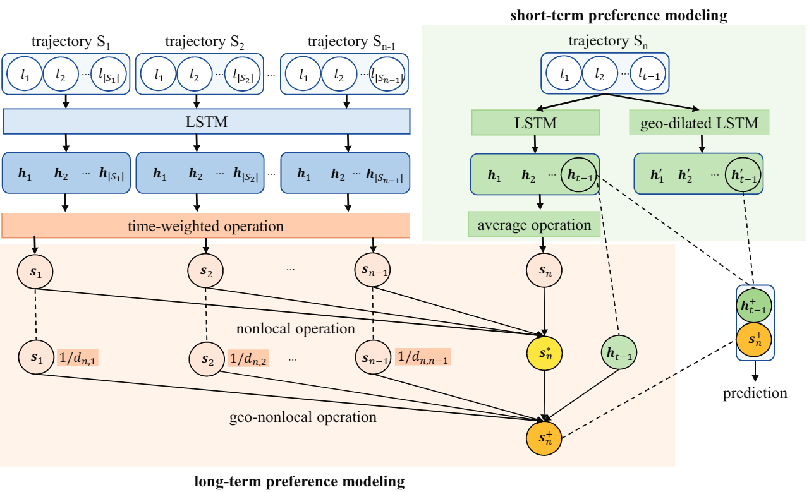
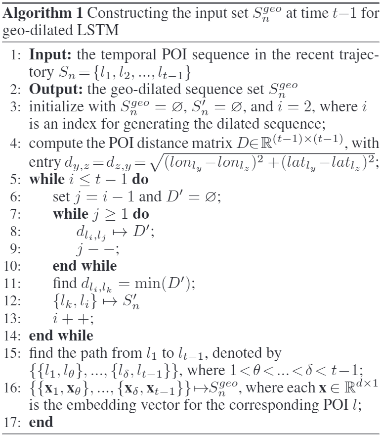
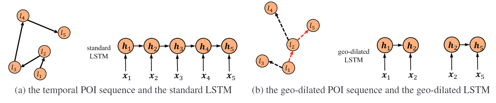
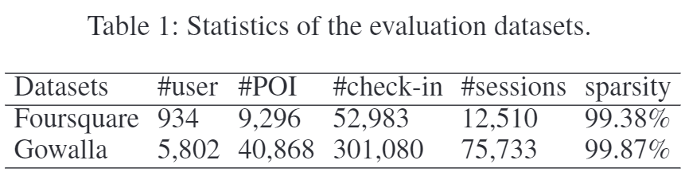
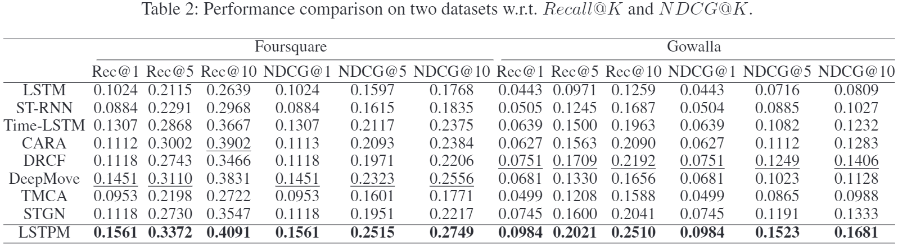
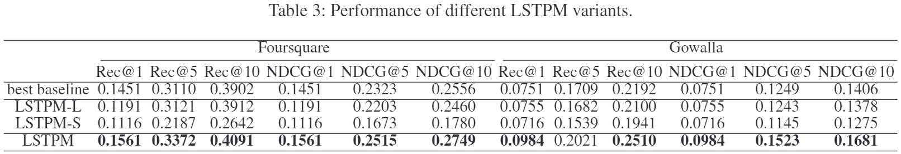
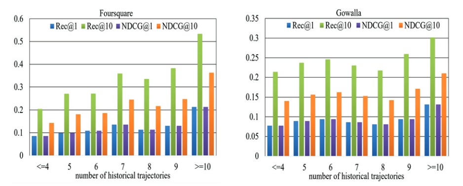
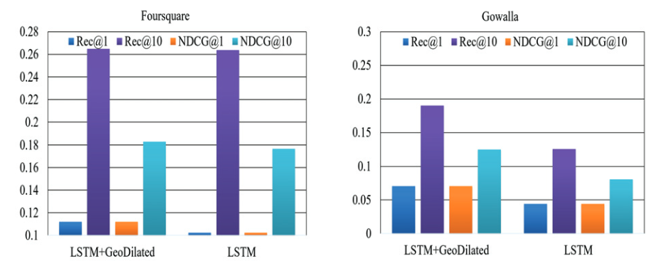

# Where to Go Next: Modeling Long- and Short-Term User Preferences for Point-of-Interest Recommendation

## Abstract

现有的基于RNN的方法在对用户的短期偏好进行建模时，要么忽略了用户的长期偏好，要么忽略了最近访问的POI之间的地理关系，从而导致推荐结果不可靠。我们提出了一种新的方法，称为长期和短期偏好建模（LSTPM），用于下一个 POI 推荐。

## Problem Formulation

对于用户u，给定历史轨迹$\left\{S_{1}, S_{2}, \ldots, S_{n-1}\right\}$（$S_{n}=\left\{l_{1}, l_{2}, \ldots, l_{t-1}\right\}$），求该用户在下一个时间戳t访问的POI。

## The Proposed Model

### Long-Term Preference Modeling

1. 使用一层LSTM将每个历史序列中的每个POI进行编码

2. 划分时间片，具体来说，我们将一周划分为48个时段（工作日24小时，周末24小时)。将每个POI对号入座放到对应的时间片里，这里不区分具体用户，并根据以下公式对不同时间片之间的差异性进行计算。

3. 每一个历史轨迹根据划分得到时间片轨迹，并计算每个时间片与目标时间片之间的差异性并做归一化形成权值，并得到最后的轨迹向量。

4. 对于当前轨迹，使用单独的LSTM进行显式的建模最近访问的POI，Sn的加权操作被平均值取代。

5. 根据每个历史轨迹与当前轨迹的相似性计算权值，并根据权值计算长期偏好的表示。

   其中C(S)是归一化因子，g生成sh的表示，f计算当前轨迹和历史轨迹的亲和度。

6. 得到的偏好向量只考虑了当前轨迹与历史轨迹的时间相似性，没有考虑当前位置与历史轨迹中位置的相似性。计算当前位置与历史轨迹的位置相似性时，每条历史轨迹的位置粗略的定义为各签到位置的中心点。

### Short-Term Preference Modeling

对于一个签到地点，它不仅受到连续签到序列的影响，还会受到非连续签到地点的地理因素影响。举个例子：对于某一签到序列Sn={l1，l2，l3，l4，l5}，虽然签到顺序是l4->l5，但位置上l5更靠近l2，此时，l2对l5的影响可能就要大于l4。扩张 RNN 的 LSTM 形式定义如下：

其中，Δ是跳跃长度。然而，跳跃长度约束的RNN总是预先定义和固定的，这使得它很难推广到POI推荐任务。因此，在下文中，我们提出了地理扩张的LSTM方案，该方案基于地理和时间因素自动确定要使用的相关输入。使用下面算法1生成非连续签到地点序列：

获得生成的非连续签到地点序列后，使用LSTM编码：

短期用户偏好的最终表示是由标准LSTM和地理扩展LSTM学习的两个潜在表示两个向量的平均值：

### Prediction

## Experiments

### Datasets and Settings

 嵌入维度和隐藏状态设置为 500， 我们模型中的所有参数都使用梯度下降优化算法 Adam 进行了优化，批量大小为 32，学习率为 0.0001

### Performance comparison on two datasets

###   Analysis on Key Components in LSTPM

  - LSTPM-L：此版本删除了 LSTPM 的短期组件，仅使用长期组件。 
  
  - LSTPM-S：此版本删除了 LSTPM 的长期组件，仅使用短期组件。

###   Analysis on Impact of History Length

### Analysis on Effectiveness of Geo-Dilated LSTM

## Conclusion

我们开发了一个上下文感知的非本地网络来建模长期偏好，并开发了一个地理扩展的LSTM来建模短期偏好。实验结果表明，与现有的推荐方法相比，本文提出的方法显著提高了推荐准确率。但是，虽然我们提出的方法比所有的基线都要好，但我们意识到POI推荐中普遍存在的问题，即召回率和NDCG得分较低。由于数据的高度稀疏性，这是合理的。未来，我们计划通过引入用户/POI侧信息来解决这一问题。

