# LightGCN: Simplifying and Powering Graph Convolution Network for Recommendation

> SIGIR ’20, July 25–30, 2020,Xiangnan HeKuan Deng|[TF实现](https://github.com/kuandeng/LightGCN)|[PT实现](https://github.com/gusye1234/pytorch-light-gcn)

## ABSTRACT

我们发现 GCN 中最常见的两种设计——特征转换和非线性激活对协同过滤的性能贡献不大。 更糟糕的是，包括它们会增加训练的难度并降低推荐性能。 在这项工作中，我们旨在简化 GCN 的设计，使其更简洁，更适合推荐。 我们提出了一个名为 LightGCN 的新模型，它只包括 GCN 中最重要的组件——邻域聚合，用于协同过滤。 

## 1 INTRODUCTION

我们对 NGCF 进行了广泛的消融研究。 通过严格的对照实验（在相同的数据拆分和评估协议上），我们得出结论，从 GCN 继承的两个操作——特征转换和非线性激活——对 NGCF 的有效性没有任何贡献。 更令人惊讶的是，删除它们会显着提高准确性。 这反映了在图神经网络中添加对目标任务无用的操作的问题，这不仅没有带来任何好处，反而降低了模型的有效性。 受这些实证发现的启发，我们提出了一个名为 LightGCN 的新模型，其中包括 GCN 中最重要的组件——邻域聚合——用于协同过滤。

## 2 PRELIMINARIES

NGCF的详细介绍请移步[NGCF](_posts/NGCF)

我们对 NGCF 进行消融研究，以探索非线性激活和特征转换的影响。我们实现了 NGCF 的三个简化变体：

- NGCF-f，它删除了特征变换矩阵 W1 和 W2。
- NGCF-n，去除非线性激活函数σ。
- NGCF-fn，去除特征变换矩阵和非线性激活函数。

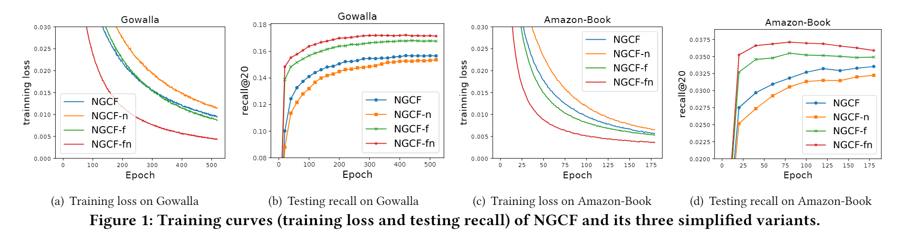

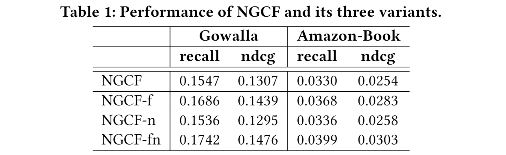

## 3 LightGCN

### 3.1 Light Graph Convolution (LGC)

在 LightGCN 中，我们采用了简单的加权和聚合器，放弃了使用特征变换和非线性激活。  LightGCN 中的图卷积操作定义为：

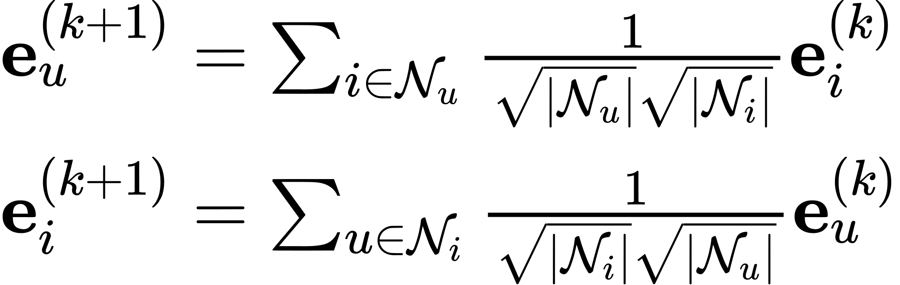

值得注意的是，在 LGC 中，我们只聚合连接的邻居，而不集成目标节点本身（即自连接）。

### 3.2 Layer Combination and Model Prediction

NGCF通过将不同层得到的嵌入表示连接起来得到最终的嵌入，我们这里使用简单的线性组合来取代这一操作（$\alpha_{k}$为超参，统一设置为1/(k+1)）：

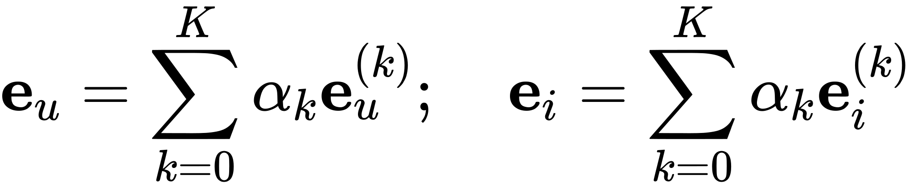

模型预测被定义为用户和项目最终表示的内积：

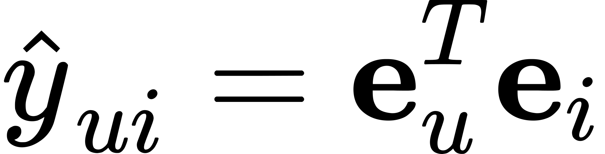

### 3.3 Model Training

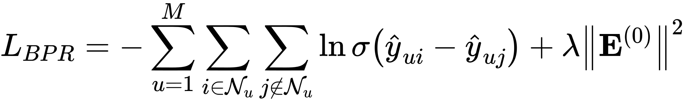

### 3.4 Matrix Form

根据用户项目交互矩阵$\mathbf{R} \in \mathbb{R}^{M \times N}$可得到用户-项目图的邻接矩阵为：

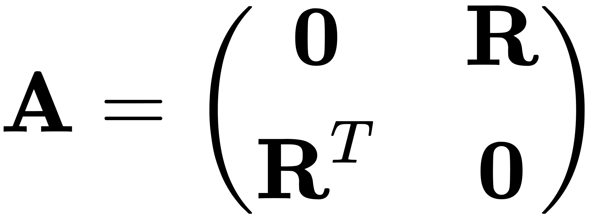

设第零层的项目和用户的嵌入矩阵$\mathbf{E}^{(0)} \in \mathbb{R}^{(M+N) \times T}$，LGC的矩阵等价形式为：

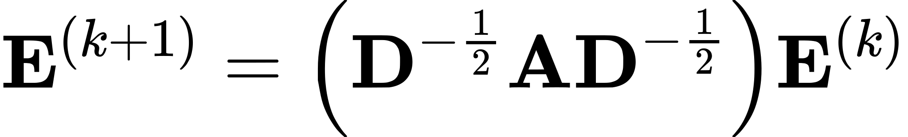

其中 D 是 (M + N ) × (M + N ) 对角矩阵，其中每个条目 Dii 表示邻接矩阵 A（也称为度矩阵）的第 i 行向量中非零条目的数量。则模型预测的最终嵌入矩阵：

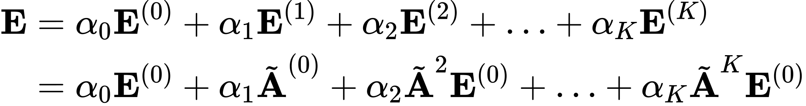

其中$\tilde{\mathbf{A}}=\mathbf{D}^{-\frac{1}{2}} \mathbf{A} \mathbf{D}^{-\frac{1}{2}}$是对称归一化矩阵。

## 4 EXPERIMENTS

### 4.1 Datsets

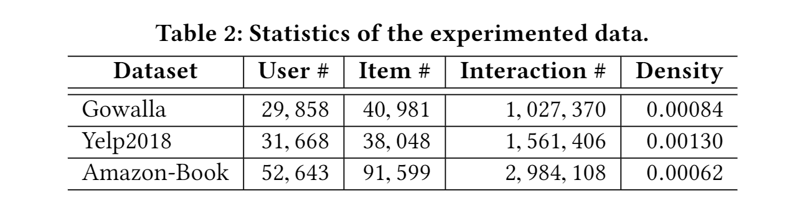

### 4.2 Performance Comparison with NGCF

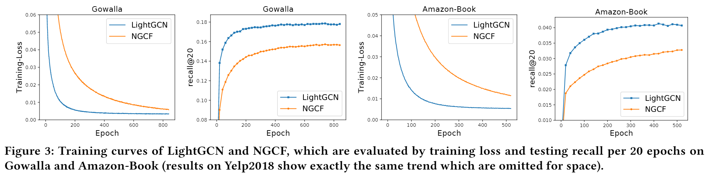

### 4.3 Performance Comparison with State-of-the-Arts

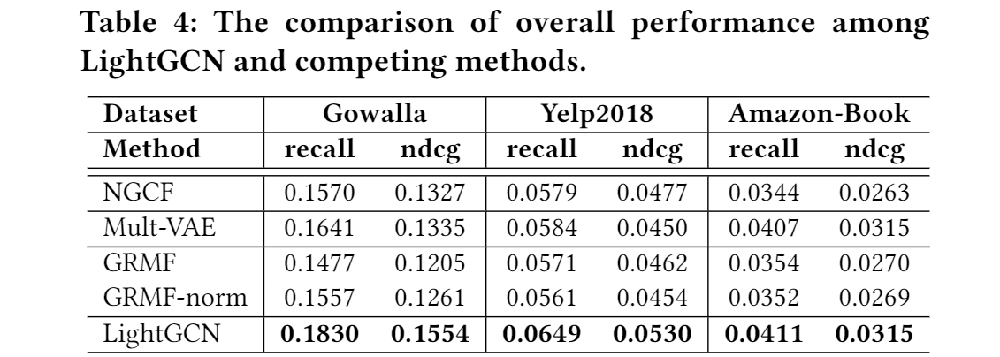

### 4.4 Ablation and Effectiveness Analyses

#### 4.4.1 Impact of Layer Combination

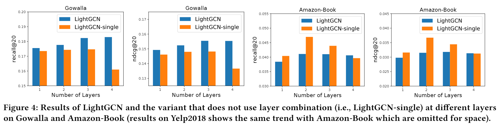

#### 4.4.2 Impact of Symmetric Sqrt Normalization

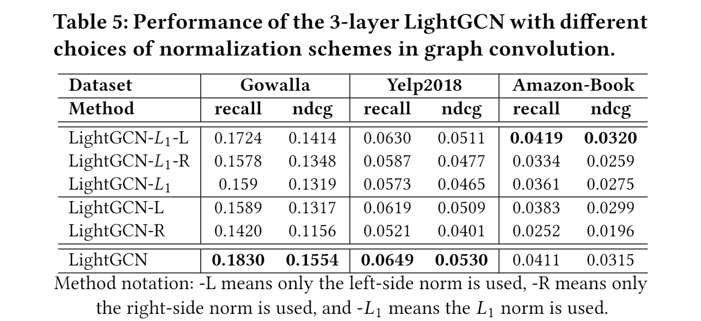

#### 4.4.3 Analysis of Embedding Smoothness

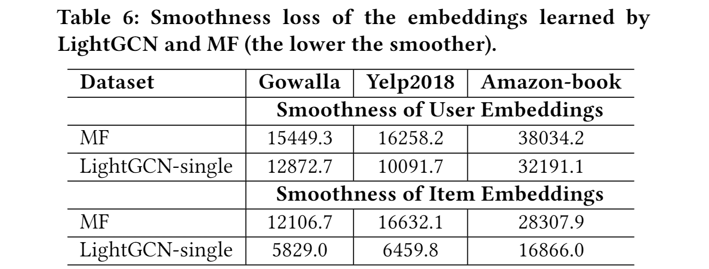

### 4.5 Hyper-parameter Studies

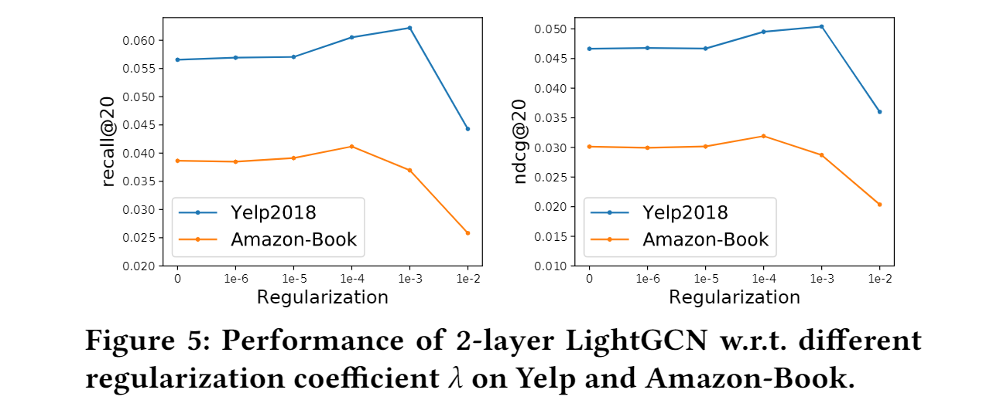

## 5 CONCLUSION AND FUTURE WORK

我们提出了 LightGCN，它由两个基本组件组成——轻量级图卷积和层组合。 在轻量级图卷积中，我们丢弃了特征变换和非线性激活。 在层组合中，我们将一个节点的最终嵌入构造为它在所有层上的嵌入的加权和，这被证明包含自连接的影响，并且有助于控制过度平滑。我们计划在基于GCN的模型中探索 LightGCN，另一个未来方向是个性化层组合权重αk ，以便为不同用户启用自适应阶平滑。最后，我们将进一步探索 LightGCN 简单性的优势，研究是否存在针对非采样回归损失的快速解决方案，并将其流式传输到在线工业场景。
