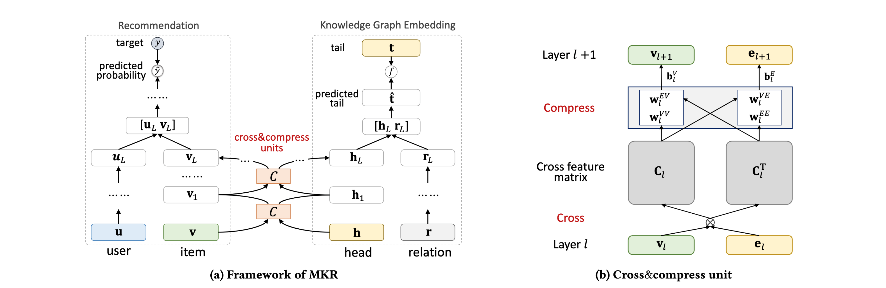
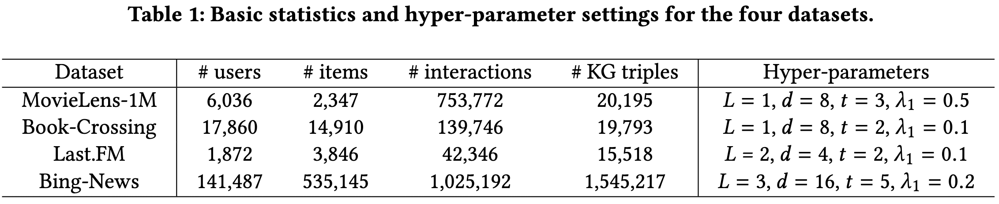
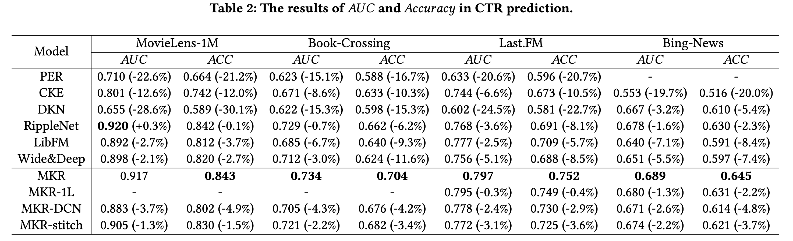
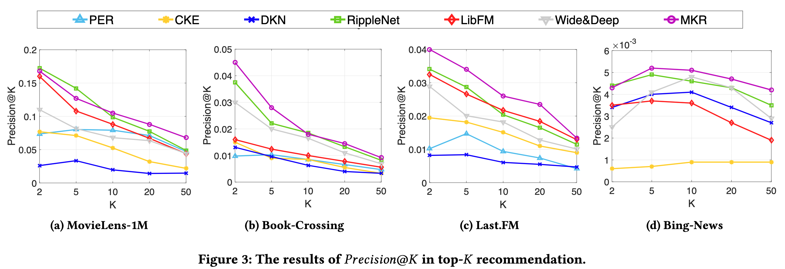
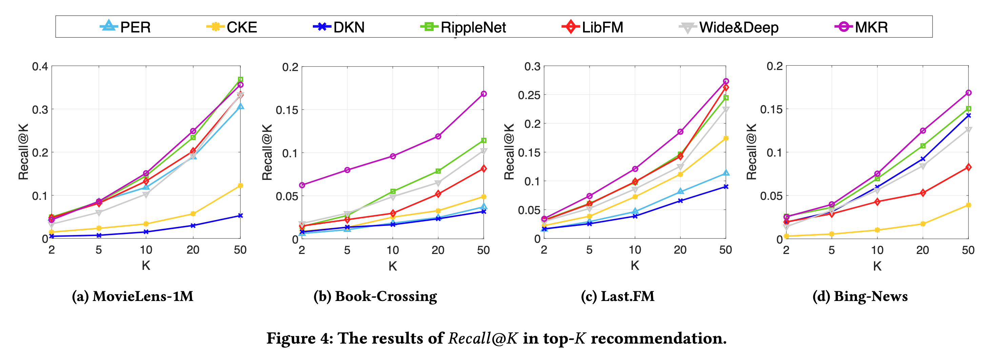
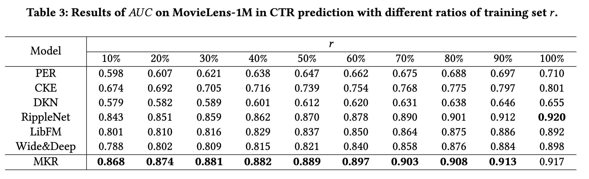
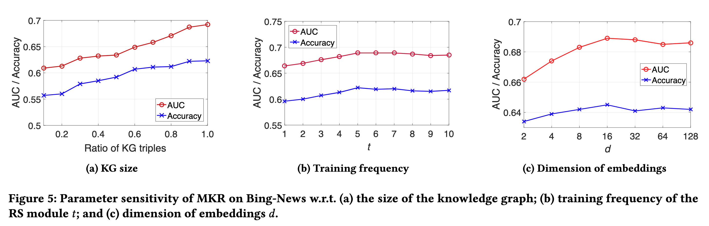

#### Multi-Task Feature Learning for Knowledge Graph Enhanced Recommendation

> Hongwei Wang、Fuzheng Zhang、Miao Zhao...|WWW ’19, May 13–17, 2019|[源码](https://github.com/hwwang55/MKR)

## 1 Abstart

协同过滤在实际推荐场景中经常存在稀疏性和冷启动问题，因此研究人员和工程师通常使用辅助信息来解决这些问题并提高推荐系统的性能。 在本文中，我们将知识图谱视为辅助信息的来源。 我们提出了 MKR，一种用于知识图增强推荐的多任务特征学习方法。  MKR 是一个深度端到端的框架，它利用知识图嵌入任务来辅助推荐任务。 这两个任务由交叉压缩单元关联，它们自动共享潜在特征并学习推荐系统中的项目与知识图谱中的实体之间的高阶交互。 我们证明了交叉压缩单元具有足够的多项式逼近能力，并表明 MKR 是推荐系统和多任务学习的几种代表性方法的通用框架。 

## 2 Our Approach

### 2.1 Problem Formulation

给定用户-项目交互矩阵 Y 以及知识图 G，我们的目标是预测用户 u 是否对他之前没有交互过的项目 v 有潜在兴趣。 我们的目标是学习一个预测函数 $\hat{y}_{u v}=\mathcal{F}(u, v \mid \Theta, \mathbf{Y}, \mathcal{G})$ ，其中 $\hat{y}_{u v}$ 表示用户 u 将与项目 v 互动的概率，Θ 是函数 F 的模型参数。

### 2.2 Framework

图 1：(a) MKR 的框架。 左右部分分别说明了推荐模块和KGE模块，它们由cross&compress单元桥接。  (b) 交叉压缩单元的图示。  cross&compress 单元通过交叉操作从项目和实体向量生成交叉特征矩阵，并通过压缩操作将它们的向量输出到下一层。

### 2.3 Cross&compress Unit

为了对项目和实体之间的特征交互进行建模，我们在 MKR 框架中设计了一个交叉压缩单元。我们首先从第 l 层构造它们的潜在特征 vl ∈ Rd 和 el ∈ Rd 的 d ×d 成对交互：

我们通过将交叉特征矩阵投影到它们的潜在表示空间中，为下一层输出项目和实体的特征向量：

为简单起见，cross&compress 单元表示为：

### 2.4 Recommendation Module

给定用户 u 的原始特征向量 u，我们使用 L 层 MLP 来提取他的潜在浓缩特征：

其中 M(x) = σ (Wx+b) 是一个全连接神经网络。对于项目 v，我们使用 L 个交叉压缩单元来提取其特征：

其中 S(v) 是项目 v 的关联实体集。最后我们通过预测函数 fRS 将这两条路径结合起来(fRS为H层MLP)：

### 2.5 Knowledge Graph Embedding Module

与推荐模块类似，对于给定的知识三元组（h，r，t），我们首先利用多个交叉压缩单元和非线性层来处理头部 h 和关系 r 的原始特征向量，然后将它们的潜在特征连接在一起，然后是 K 层 MLP 用于预测尾 t：

S(h) 是实体 h 的关联项的集合。最后，使用相似度函数 fKG (内积)计算三元组 (h, r, t) 的分数：

## 4 Experiments

### 4.1 Datasets

### 4.2 Results

- MKR-1L是一层cross&compress单元的MKR。
- MKR-DCN 是基于方程式的 MKR 的变体。
- MKR-stitch 是 MKR 的另一种变体，对应于十字绣网络，其中方程中的转移权重被四个可训练的标量代替。

