# Neural Collaborative Filtering

> 2017 International World Wide Web Conference Committee(Xiangnan He,Lizi Liao)
> [源码链接](https://github.com/hexiangnan/neural_collaborative_filtering)

## ABSTRACT

近年来，深度神经网络在语音识别、计算机视觉和自然语言处理方面取得了巨大成功。 然而，在推荐系统上对深度神经网络的探索受到的审查相对较少。 在这项工作中，我们努力开发基于神经网络的技术，以在隐式反馈的基础上解决推荐中的关键问题——协同过滤。

## 1. INTRODUCTION

这项工作的主要贡献如下。 

1. 我们提出了一种神经网络架构来对用户和项目的潜在特征进行建模，并设计了一个基于神经网络的协同过滤通用框架 NCF。 

2. 我们表明，MF 可以解释为 NCF 的一种特殊化，并利用多层感知器赋予 NCF 建模高度非线性。 

3. 我们对两个真实世界的数据集进行了广泛的实验，以证明我们的 NCF 方法的有效性以及深度学习对协同过滤的承诺。

## 2. PRELIMINARIES

Matrix Factorization:

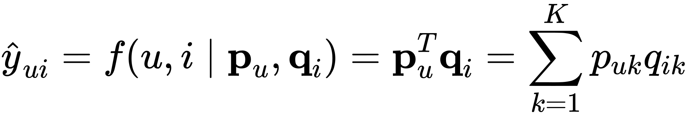

$\mathbf{p}_{u}, \mathbf{q}_{i}$分别表示用户 u 和项目 i 的潜在向量,K表示潜在空间的维度,$\hat{y}_{u i}$表示交互的预测分数。

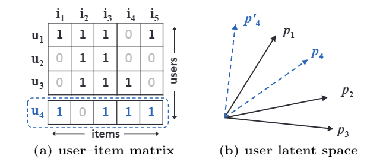

一个例子说明了 MF 的局限性。 从数据矩阵 (a) 来看，u4 与 u1 最相似，其次是 u3，最后是 u2。 然而，在潜在空间 (b) 中，将 p4 放置在最靠近 p1 的位置会使 p4 比 p3 更靠近 p2，从而导致较大的排名损失。

## 3. NEURAL COLLABORATIVE FILTERING

### 3.1 General Framework

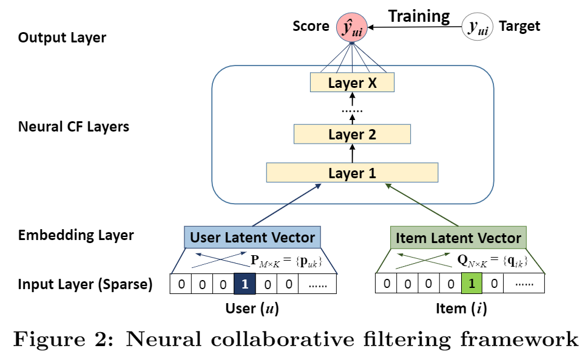

NCF 的预测模型表述为：

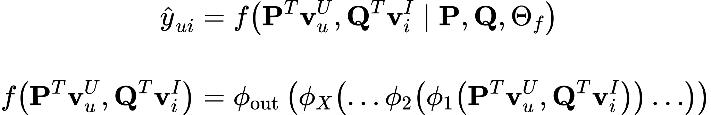

其中 P ∈ $\mathbf{R}^{M×K} $和 Q ∈$\mathbf{R}^{N×K}$,分别表示用户和项目的潜在因子矩阵;$\Theta_{f}$表示交互函数f的模型参数。$\phi_{out}$和$\phi_{X}$分别表示输出层和第x个神经协同过滤（CF）层的映射函数，总共有X个神经CF层.
似然函数定义为:

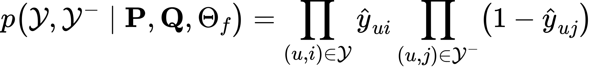

$\mathcal{Y}, \mathcal{Y}^{-}$分别表示正实例和负实例的集合.

取似然函数的负对数:

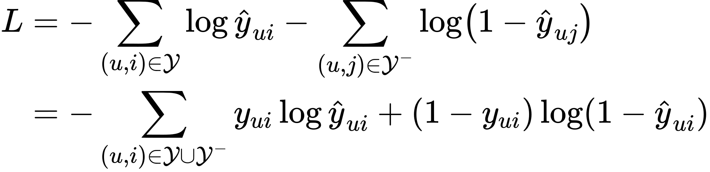

### 3.2 Generalized Matrix Factorization (GMF)

第一个神经 CF 层的映射函数定义为:

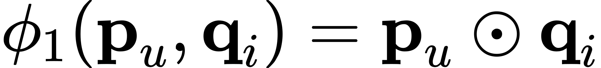

将向量投影到输出层：

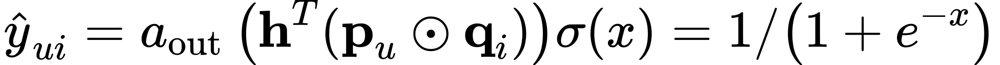

$a_{\text {out }}$和$h$分别表示输出层的激活函数和边缘权重,$\sigma(x)$是sigmoid 函数.

### 3.3 Multi-Layer Perceptron (MLP)

NCF 框架下的 MLP 模型定义为:

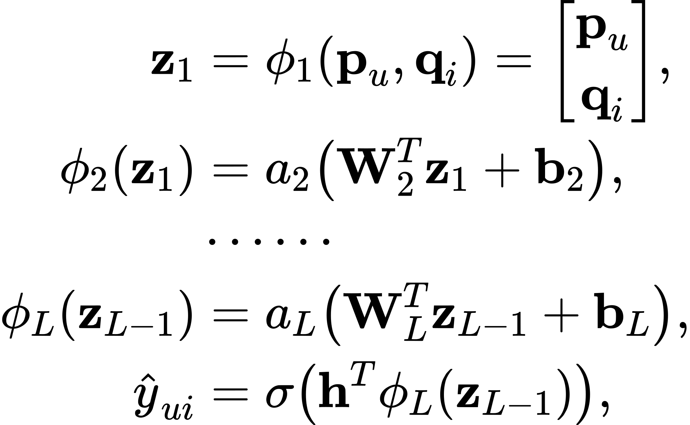

其中 Wx、bx 和 ax分别表示第 x 层感知器的权重矩阵、偏置向量和激活函数。 对于 MLP 层的激活函数，可以自由选择 sigmoid、双曲正切 (tanh) 和 Rectifier (ReLU) 等。

### 3.4 Fusion of GMF and MLP

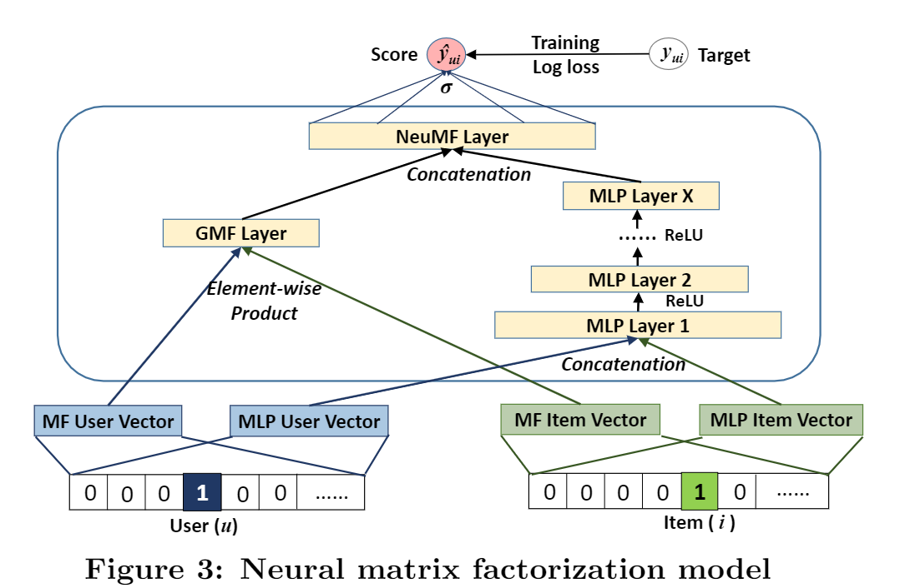

将 GMF 与单层 MLP 相结合的模型可以表示为:

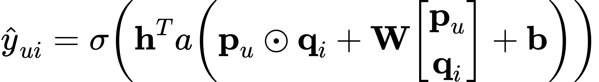

为了给融合模型提供更大的灵活性，我们允许 GMF 和 MLP 学习单独的嵌入，并通过连接它们的最后一个隐藏层来组合这两个模型。 图 3 说明了我们的建议，其公式如下:

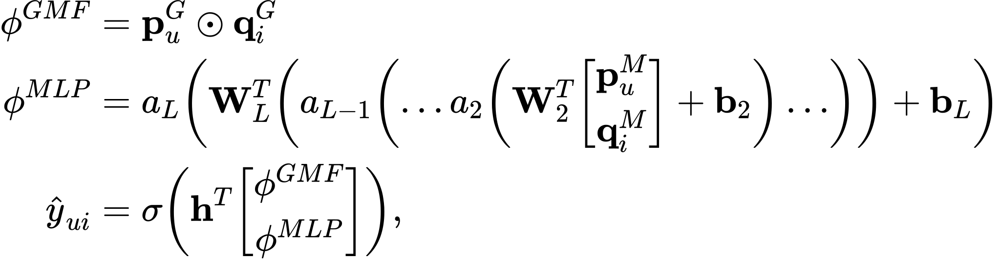

预训练：

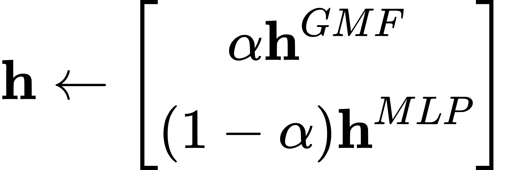

其中 hGMF 和 hMLP 分别表示预训练的 GMF 和 MLP 模型的 h 向量；  α 是一个超参数，决定了两个预训练模型之间的权衡。

## 4. EXPERIMENTS

### 4.1 Datasets

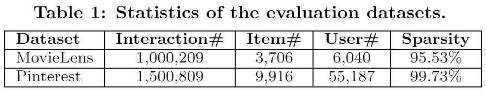

### 4.2 Performance Comparison (RQ1)

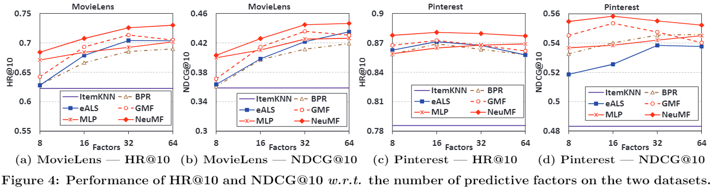

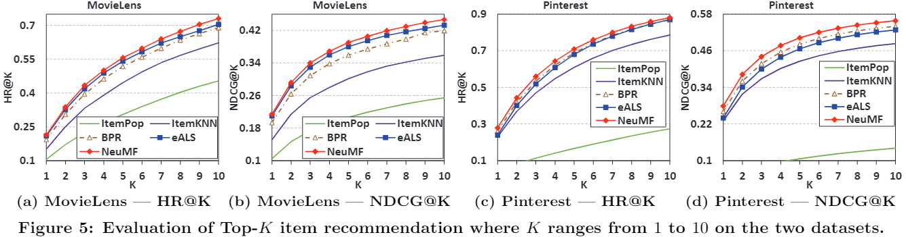

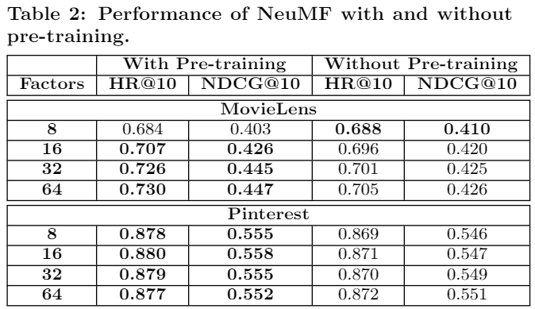

### 4.3 Log Loss with Negative Sampling (RQ2)

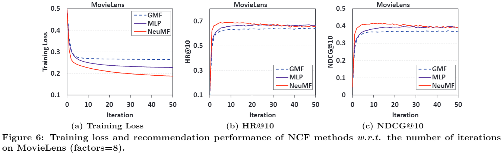

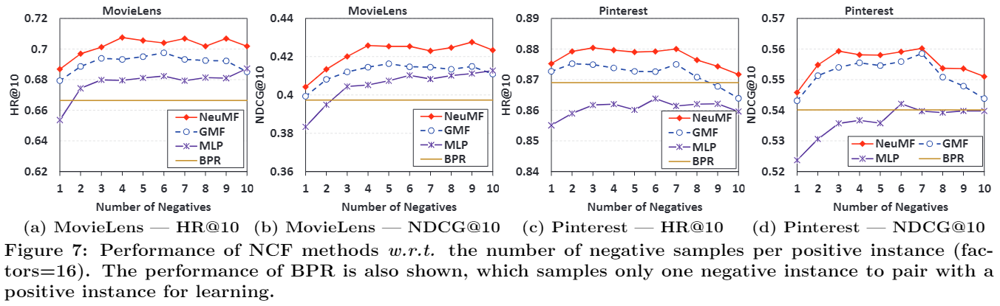

### 4.4 Is Deep Learning Helpful? (RQ3)

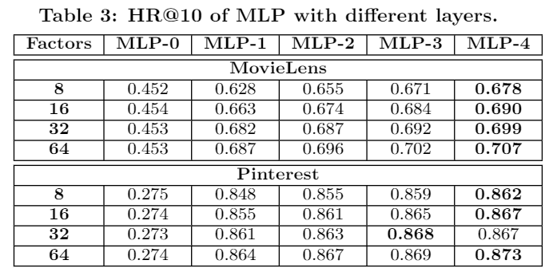

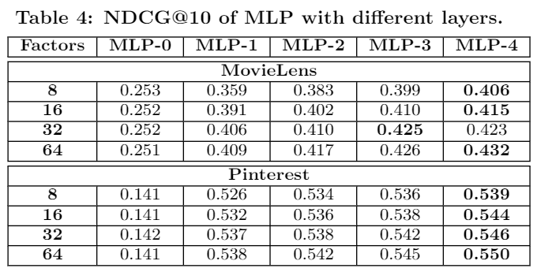

## 6. CONCLUSION AND FUTURE WORK

在这项工作中，我们探索了用于协同过滤的神经网络架构。 我们设计了一个通用框架 NCF 并提出了三个实例化——GMF、MLP 和 NeuMF——以不同的方式对用户-项目交互进行建模。

多媒体项目构建推荐系统是一项有趣的任务，为了构建多媒体推荐系统，我们需要开发有效的方法来从多视图和多模态数据中学习。 另一个新兴方向是探索递归神经网络和散列方法提供有效在线推荐的潜力。
