# Neural Graph Collaborative Filtering

> SIGIR ’19, July 21–25, 2019,Xiang Wang,Xiangnan He...|[源码](https://github.com/xiangwang1223/neural_graph_collaborative_filtering)

## ABSTRACT

从早期的矩阵分解到最近出现的基于深度学习的方法的一个固有缺点是，用户项目交互中潜在的协作信号在嵌入过程中没有编码。因此，生成的嵌入可能不足以捕获协同过滤效果。在这项工作中，我们建议将用户-项目交互更具体地说是将二分图结构集成到嵌入过程中。 我们开发了一个新的推荐框架 Neural Graph Collaborative Filtering (NGCF)，它通过在其上传播嵌入来利用用户项目图结构。 这导致了用户项目图中高阶连通性的表达建模，以显式方式有效地将协作信号注入到嵌入过程中。

## 1 INTRODUCTION

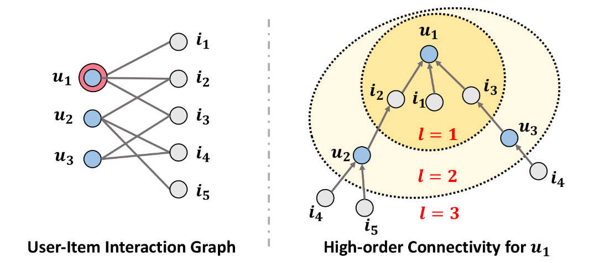

图1说明了高阶连通性的概念。高阶连通性表示从路径长度大于 1 的任意节点到达 u1 的路径。这种高阶连通性包含了承载协作信号的丰富语义。例如，路径 u1 ← i2 ← u2 表示 u1 和 u2 之间的行为相似性，因为两个用户都与 i2 进行了交互； 较长的路径 u1 ← i2 ← u2 ← i4 表明 u1 很可能采用 i4，因为她的相似用户 u2 之前已经消费过 i4。 此外，从 l = 3 的整体来看，项目 i4 比项目 i5 更可能对 u1 感兴趣，因为有两条路径连接 <i4，u1>，而只有一条路径连接 <i5，u1>。

总而言之，这项工作做出了以下主要贡献：

- 我们强调了在基于模型的 CF 方法的嵌入功能中明确利用协作信号的重要性。
- 我们提出了NGCF，一种基于图神经网络的新推荐框架，它通过执行嵌入传播以高阶连接的形式显式编码协作信号。
- 我们对三百万个数据集进行实证研究。 广泛的结果证明了 NGCF 的最新性能及其在通过神经嵌入传播提高嵌入质量方面的有效性。

## 2 METHODOLOGY

我们现在提出提出的 NGCF 模型，其架构如图 2 所示。框架中包含三个组件：（1）提供和初始化用户嵌入和项目嵌入的嵌入层；  (2) 多个嵌入传播层，通过注入高阶连接关系来细化嵌入；  (3) 预测层，聚合来自不同传播层的精细嵌入并输出用户-项目对的亲和度得分。

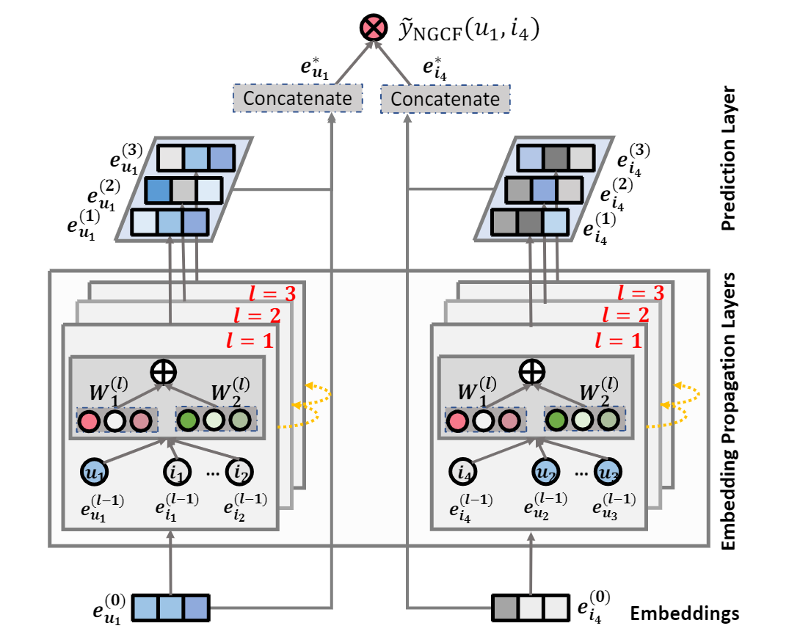

### 2.1 Embedding Layer

首先构建一个参数矩阵作为嵌入查找表，其中eu和ei分别是用户和项目的d维嵌入向量：

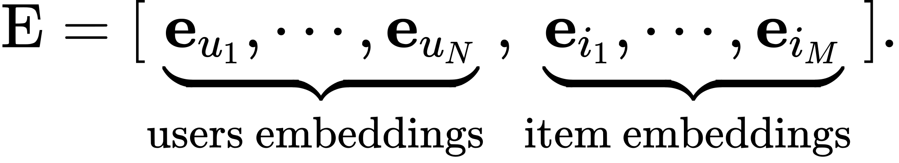

### 2.2 Embedding Propagation Layers

接下来，我们建立在 GNN  的消息传递架构之上，以便沿着图结构捕获 CF 信号并细化用户和项目的嵌入。我们首先说明单层传播的设计，然后将其推广到多个连续层。

#### 2.2.1 First-order Propagation

项目被用户交互可以视为项目的特征，用于衡量两个项目的协作相似度。 我们在此基础上在连接的用户和项目之间执行嵌入传播，制定了具有两个主要操作的过程：消息构造和消息聚合。

**Message Construction**.对于连接的用户-项目对 (u, i)，我们将 i 到 u 的消息定义为：

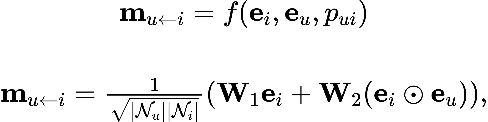

其中 mu←i 是消息嵌入（即要传播的信息），f (·) 是消息编码函数，它以嵌入 ei 和 eu 作为输入，并使用系数 pui 来控制边缘 (u, i) 上每次传播的衰减因子。这里将 pui 设置为图拉普拉斯范数$1 / \sqrt{\left|\mathcal{N}_{u} \| \mathcal{N}_{i}\right|}$，其中Nu和Ni分别表示用户 u 和项目 i 的第一跳邻居。

**Message Aggregation**.在这个阶段，我们聚合从 u 的邻域传播的消息以细化 u 的表示。 具体来说，我们将聚合函数定义为：

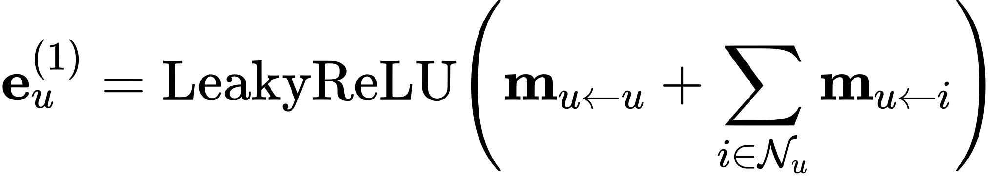

其中 $\mathbf{e}_{u}^{(1)}$ 表示在第一个嵌入传播层之后获得的用户 u 的表示，请注意，除了从邻居 Nu 传播的消息外，我们还考虑了 u 的自连接 $\mathbf{m}_{u \leftarrow u}=\mathbf{W}_{1} \mathbf{e}_{u}$，它保留了原始特征的信息。

#### 2.2.2 High-order Propagation

通过堆叠多个 $l$ 个嵌入传播层，用户（和项目）能够接收从其 $l$ 跳邻居传播的消息。 如图 2 所示，在第 $l$ 步中，用户 u 的表示递归地表示为：

其中正在传播的消息定义如下：

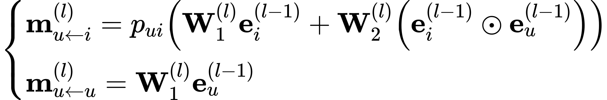

如图 3 所示，在嵌入传播过程中可以捕获像 u1 ← i2 ← u2 ← i4 这样的协作信号。 此外，来自 i4 的消息在 e(3)u1 中显式编码（由红线表示）。 因此，堆叠多个嵌入传播层将协作信号无缝地注入到表示学习过程中。

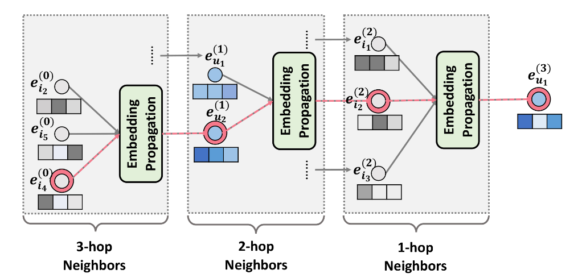

**Propagation Rule in Matrix Form**.嵌入逐层传播规则的矩阵形式如下：

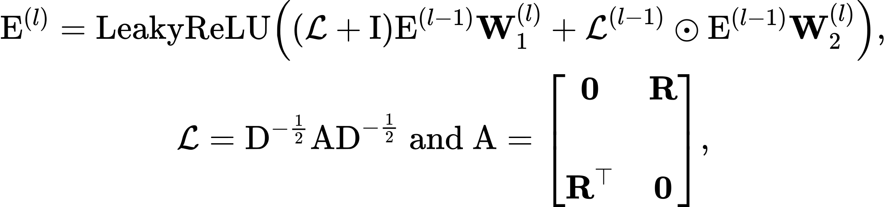

### 2.3 Model Prediction

连接不同层的学习的项目和用户表示得到最终的嵌入表示：

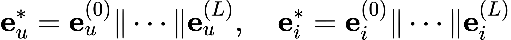

最后，我们进行内积来估计用户对目标项目的偏好：

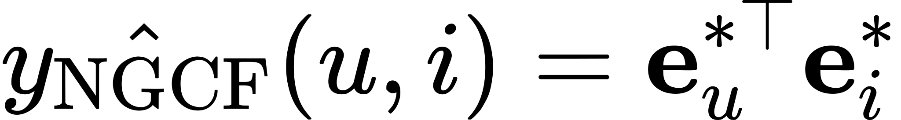

### 2.4 Optimization

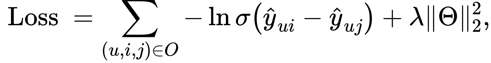

其中$\boldsymbol{O}=\left\{(u, i, j) \mid(u, i) \in \mathcal{R}^{+},(u, j) \in \mathcal{R}^{-}\right\}$，$\mathcal{R}^{+}$为正例，$\mathcal{R}^{-}$为负例。

## 3 EXPERIMENTS

### 3.1 Dataset Description

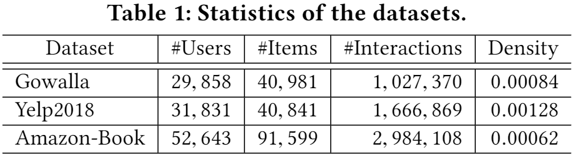

### 3.2 Performance Comparison (RQ1)

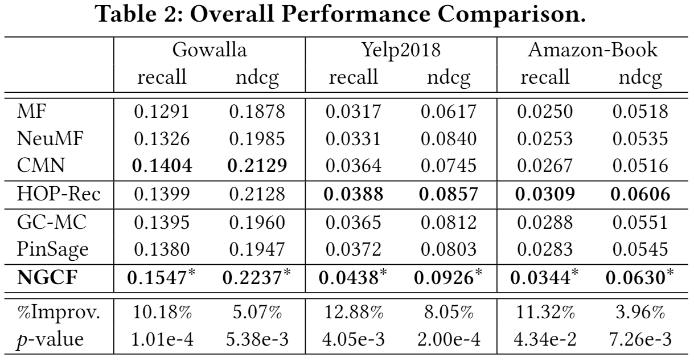

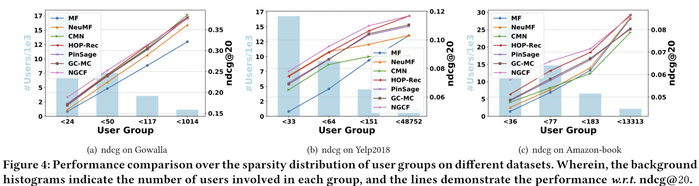

### 3.3 Study of NGCF (RQ2)

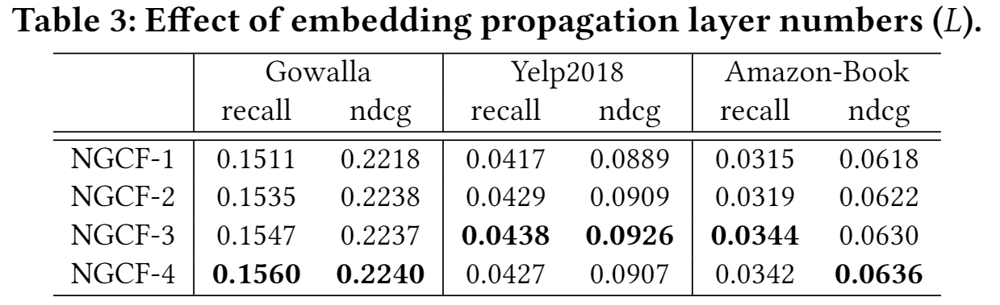

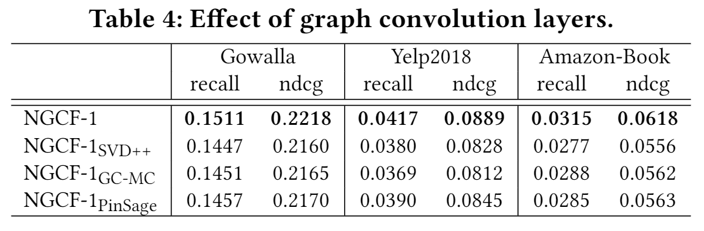

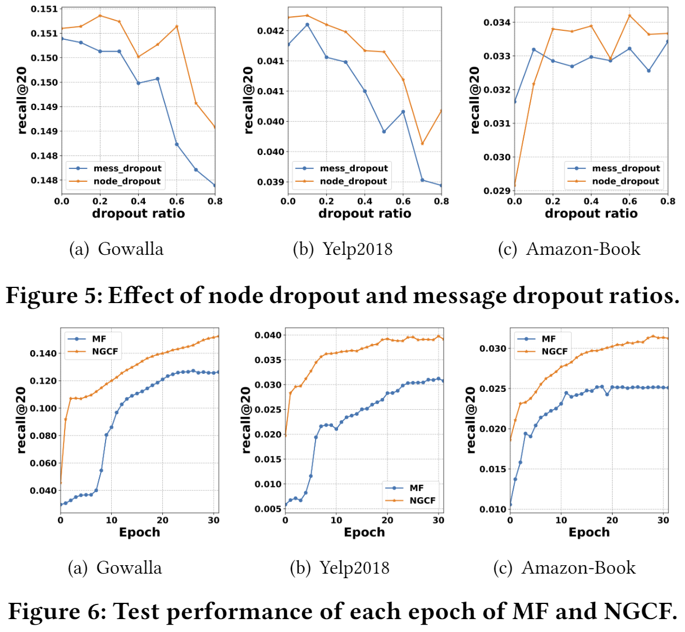

### 3.4 Effect of High-order Connectivity (RQ3)

图 7：从 MF 和 NGCF-3 派生的学习 t-SNE 转换表示的可视化。 每个星代表 Gowalla 数据集中的一个用户，而具有相同颜色的点表示相关项目。 

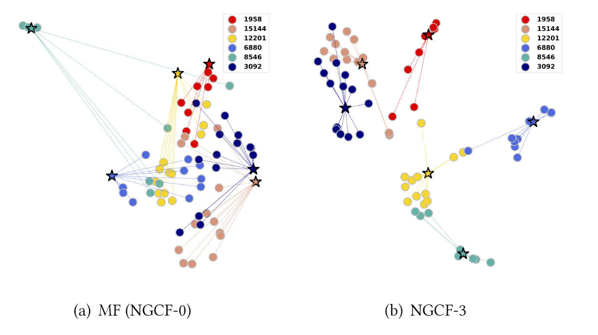

## 4 CONCLUSION AND FUTURE WORK

我们设计了一个新的框架 NGCF，它通过利用用户-项目集成图中的高阶连接性来实现目标。 NGCF 的关键是新提出的嵌入传播层，在此基础上，我们允许用户和项目的嵌入相互交互以获取协作信号。未来，我们将通过结合注意力机制 [2] 来进一步改进 NGCF，以在嵌入传播期间学习邻居的可变权重以及不同阶的连接性。 这将有利于模型的泛化和可解释性。 此外，我们有兴趣探索关于用户/项目嵌入的对抗性学习和图结构以增强 NGCF 的鲁棒性。
