# RippleNet: Propagating User Preferences on the Knowledge Graph for Recommender Systems

> CIKM ’18, October 22–26, 2018,Hongwei WangFuzheng Zhang...|[源码](https://github.com/hwwang55/RippleNet)|[pytorch实现](https://github.com/hwwang55/RippleNet)

## ABSTRACT

为了解决协同过滤的稀疏性和冷启动问题，研究人员通常利用边信息，例如社交网络或物品属性来提高推荐性能。 本文将知识图谱视为边信息的来源。 为了解决现有的基于嵌入和基于路径的知识图感知推荐方法的局限性，我们提出了 RippleNet，这是一个端到端的框架，可以自然地将知识图合并到推荐系统中。

## 1 INTRODUCTION

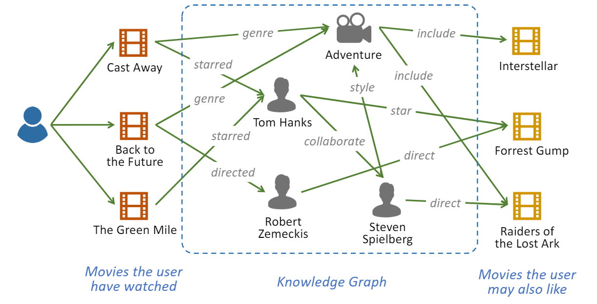

图 1：知识图增强电影推荐系统示意图。 知识图谱提供了丰富的事实和项目之间的联系，有助于提高推荐结果的准确性、多样性和可解释性。

我们在本文中的贡献如下： 

- 据我们所知，这是第一个在 KG 感知推荐中结合基于嵌入和基于路径的方法的工作。 
- 我们提出了RippleNet，一个利用知识图谱辅助推荐系统的端到端框架。 RippleNet 通过在 KG 中迭代传播用户的偏好，自动发现用户的分层潜在兴趣。 
- 我们对三个真实世界的推荐场景进行了实验，结果证明了 RippleNet 在几个最先进的基线上的有效性。

## 2 PROBLEM FORMULATION

给定交互矩阵 Y 以及知识图 G，我们的目标是预测用户 u 是否对他之前没有交互过的项目 v 有潜在兴趣。 我们的目标是学习一个预测函数$\hat{y}_{u v}=\mathcal{F}(u, v ; \Theta)$，其中$\hat{y}_{u v}$表示用户 u 点击项目 v 的概率，Θ 表示函数 F 的模型参数。

## 3 RIPPLENET

### 3.1 Framework

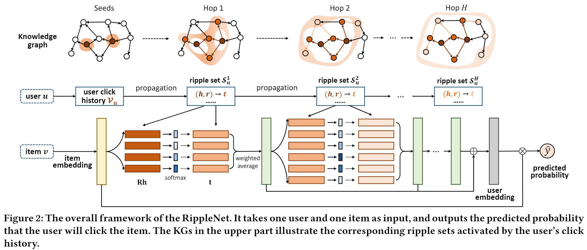

### 3.2 Ripple Set

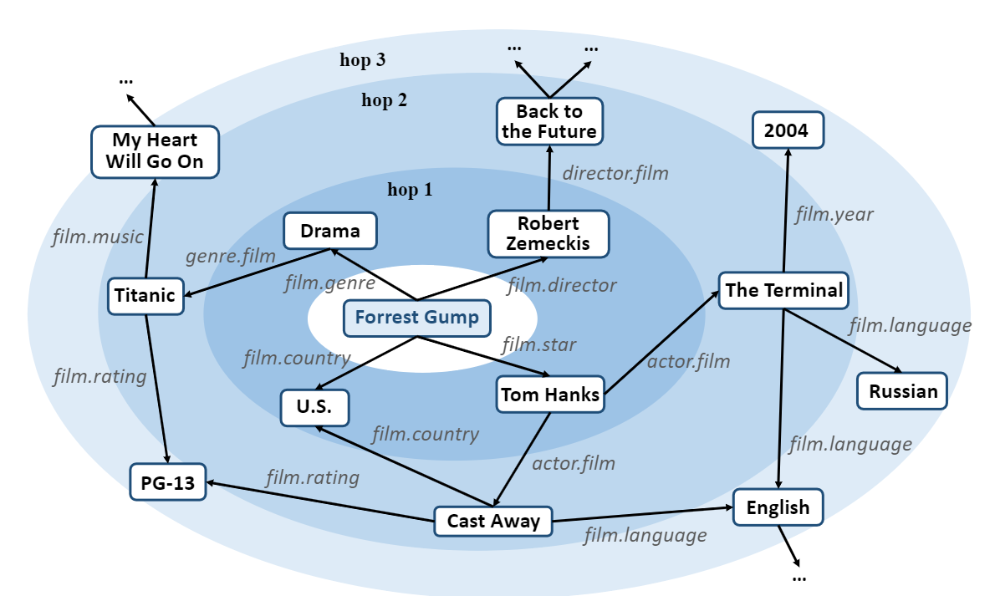

图 3：电影 KG 中“阿甘正传”波纹集的图示。 同心圆表示具有不同跳数的波纹集。 淡蓝色表示中心和周围实体之间的相关性降低。请注意，不同跃点的波纹集在实践中不一定是不相交的。

定义 1 (relevant entity).给定交互矩阵 Y 和知识图 G，用户 u 的 k-hop 相关实体集定义为：

其中$\mathcal{E}_{u}^{0}=V_{u}=\left\{v \mid y_{u v}=1\right\}$是用户过去点击的项目集，可以看作是用户u在KG中的种子集。

定义 2 (ripple set).用户u的k跳波纹集合被定义为从$\mathcal{E}_{u}^{k-1}$开始的知识三元组的集合：

### 3.3 Preference Propagation

给定项目嵌入 v 和用户 u 的 1 跳波纹集 $\mathcal{S}_{u}^{1}$，通过将项目 v 与头部 hi 和该三元组中的关系 ri 进行比较，为 $\mathcal{S}_{u}^{1}$ 中的每个三元组 (hi , ri , ti ) 分配一个相关概率 ：

其中Ri∈Rd×d和hi∈Rd分别是关系ri和Head hi的嵌入。关联概率pi可以被认为是在关系Ri空间中测量的项v和实体hi的相似度。获得相关概率后，将$\mathcal{S}_{u}^{1}$中三元组的尾实体按相应的相关概率加权求和，得到用户兴趣经过第一轮扩散的结果：

之后，将pi公式中的V换成ou1后得到ou2，将上述过程重复H次得到用户u的最终嵌入表示：

最后，结合用户嵌入和项目嵌入，输出的预测点击概率为：

### 3.4 Learning Algorithm

在给定知识图谱G，用户的隐式反馈(即用户的历史记录)Y时，我们希望最大化后验概率：

其中Θ包括所有实体、关系和项目的嵌入。后验概率可以转化为（根据概率的乘法公式）：

我们将 p(Θ) 设置为均值为零和对角协方差矩阵的高斯分布：

在RippleNet中，使用three-way tensor factorization method来定义KGE的似然函数：

p(Y|Θ,G) 表示在给定Θ和KG后，观察到的隐式反馈Y的似然函数。根据前面的推导，可以得到：

最终损失函数为：

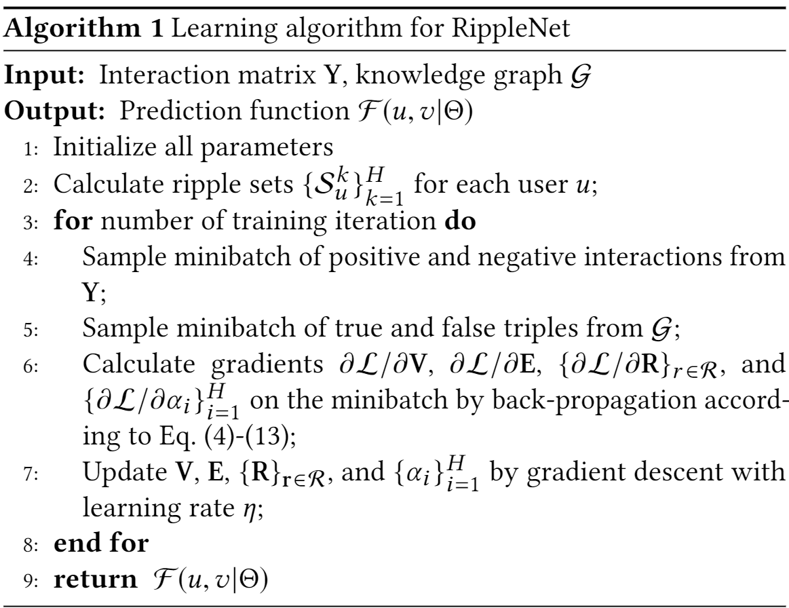

## 4 EXPERIMENTS

### 4.1 Datasets

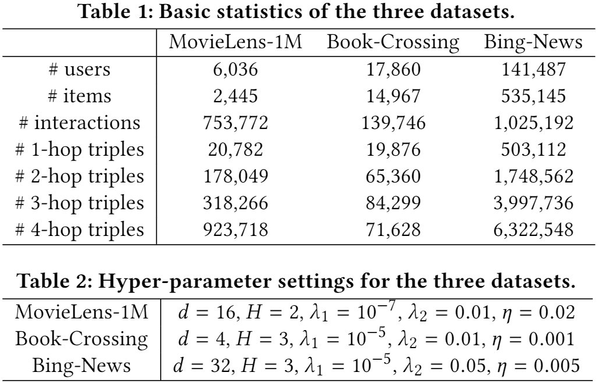

### 4.2 Empirical Study

我们进行了一项实证研究，以考察KG中一个项目的平均共同邻居数与他们在RS中是否有共同的评分者之间的相关性。
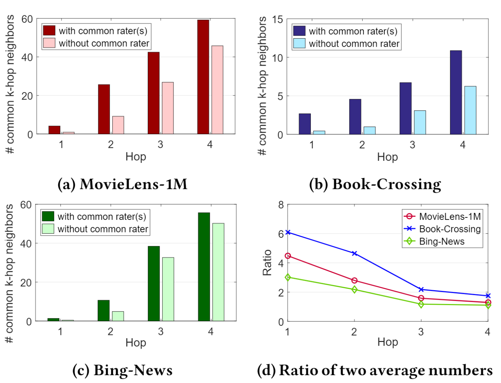

### 4.5 Results

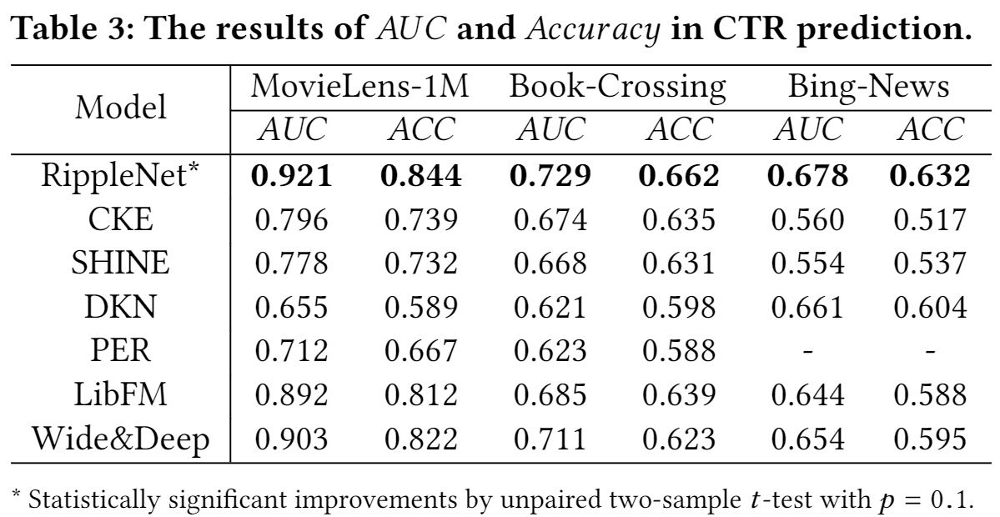

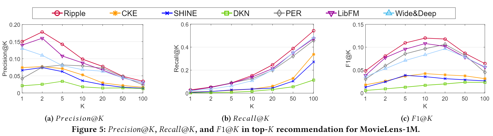

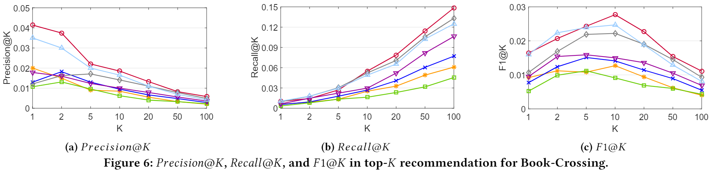

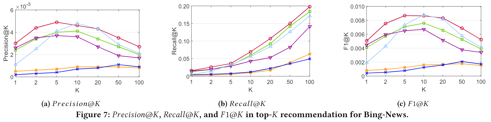

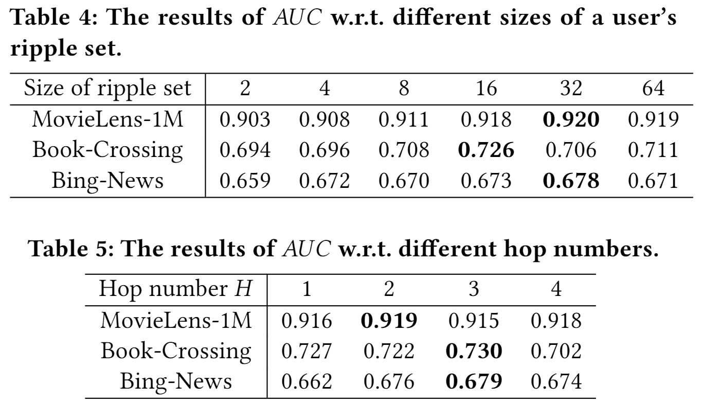

### 4.6 Case Study

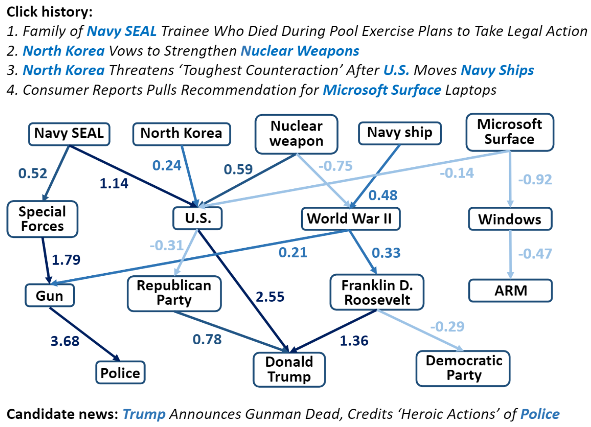

### 4.7 Parameter Sensitivity

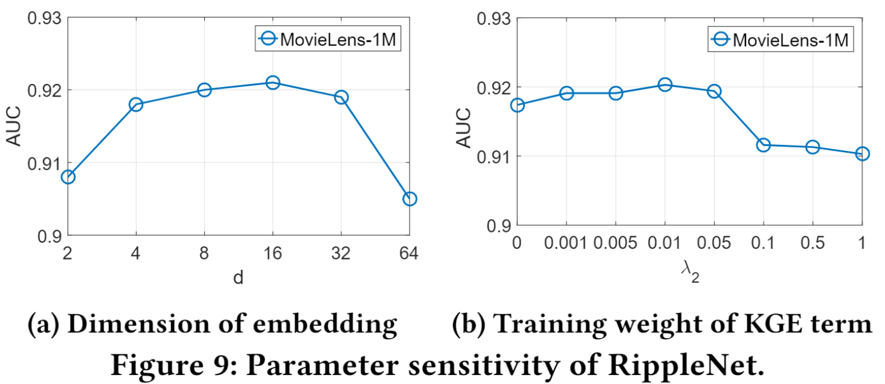

## 5 CONCLUSION AND FUTURE WORK

在本文中，我们提出了 RippleNet，这是一个端到端的框架，可以自然地将知识图谱整合到推荐系统中。 RippleNet 通过引入偏好传播克服了现有基于嵌入和基于路径的 KG 感知推荐方法的局限性，它自动传播用户的潜在偏好并探索他们在 KG 中的层次兴趣。RippleNet 在用于点击率预测的贝叶斯框架中将偏好传播与 KGE 的正则化相结合。对于未来的工作，我们计划（1）进一步研究表征实体-关系交互的方法； (2) 在偏好传播过程中设计非均匀采样器，以更好地挖掘用户的潜在兴趣并提高性能。

