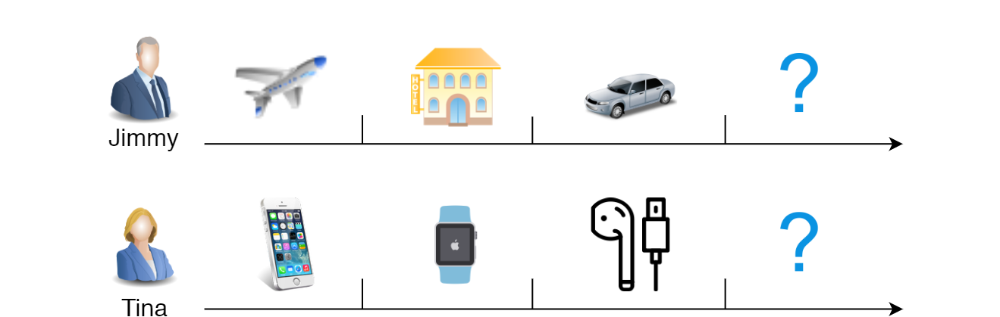
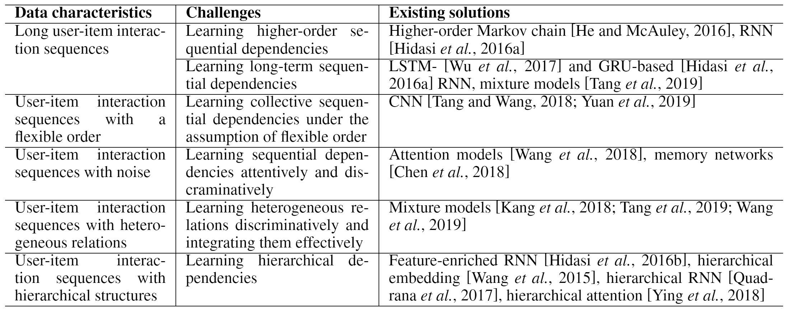
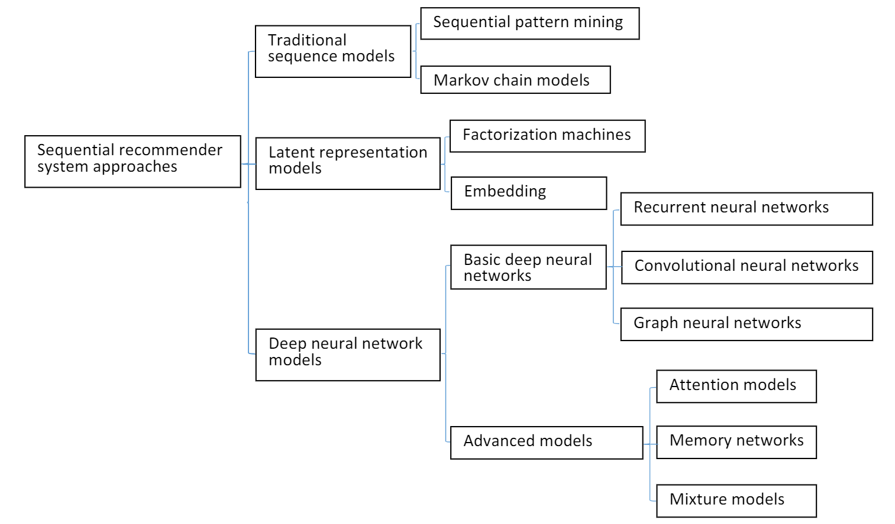

# Sequential Recommender Systems: Challenges, Progress and Prospects

> Conference: IJCAI 2019|Shoujin Wang，Liang Hu...

## Abstract

近年来，顺序推荐系统（SRS）这一新兴话题引起了越来越多的关注。与包括协同过滤和基于内容的过滤在内的传统推荐系统（RSs）不同，SRS试图理解和建模连续的用户行为、用户与项目之间的交互，以及用户偏好和项目受欢迎程度随时间的演变。SRS涉及上述方面，以更精确地描述用户上下文、意图和目标，以及物品消费趋势，从而产生更准确、定制和动态的建议。本文对SRS进行了系统的综述。我们首先介绍了SRS的特点，然后总结和分类了该研究领域的主要挑战，然后介绍了相应的研究进展，包括该主题的最新和代表性发展。最后，我们讨论了这一活跃领域的重要研究方向。

## 1 Introduction

用户-项目交互本质上是顺序相关的。在现实世界中，用户的购物行为通常是按顺序连续发生的，而不是以孤立的方式发生的。

这项工作的主要贡献总结如下： 

- 我们系统地分析了 SRSs 中不同数据特征带来的一些关键挑战，并从数据驱动的角度对其进行了分类，为深入理解 SRSs 的特征提供了新的视角。 
- 我们通过从技术角度系统地对最先进的作品进行分类，总结了当前 SRS 的研究进展。 
- 我们分享和讨论 SRS 的一些前景，以供社区参考。

## 2 Data Characteristics and Challenges

由于客户的购物行为、物品特征和现实世界中特定购物环境的多样性和复杂性，生成的用户-物品交互数据往往具有不同的特征。 不同的数据特征本质上给 SRSs 带来了不同的挑战，需要不同的解决方案，如表 1 所示。

## 3 Research Progress

为了概述 SRSs 的技术进展并提供解决上述挑战的更多技术细节，我们在本节中从技术角度总结并简要讨论 SRSs 的研究进展。 特别是，我们首先从技术角度对 SRS 的所有方法进行了分类，然后简要介绍了每个类别的最新进展。

### 3.1 Traditional Sequence Models for SRSs

- **Sequential pattern mining**.基于序列模式的RSs首先在序列数据上挖掘频繁模式，然后利用挖掘出的模式指导后续的推荐。
- **Markov chain models**.基于马尔可夫链的 RS 采用马尔可夫链模型来建模用户-项目交互序列中的转换，以预测下一次交互。

### 3.2 Latent Representation Models for SRSs

- **Factorization machines**.基于分解机的 SRS 通常利用矩阵分解或张量分解将观察到的用户-项目交互分解为用户的潜在因素和推荐项目。与协同过滤 (CF) 不同，要分解的矩阵或张量是由交互而不是 CF 中的评级组成的。 这样的模型容易受到观测数据稀疏性的影响，因此无法实现理想的推荐。
- **Embedding**.基于嵌入的 SRS 通过将序列中的所有用户-项目交互编码到潜在空间中来学习每个用户和项目的潜在表示以用于后续推荐。由于其简单、高效和有效，该模型近年来显示出巨大的潜力。

### 3.3 Deep Neural Network Models for SRSs

- **Basic Deep Neural Networks**.
  - **RNN-based SRSs**.基于 RNN 的 SRS 试图通过对给定交互的顺序依赖关系建模来预测下一个可能的交互。虽然在SASs中使用较为广泛，然而它有两个方面的缺点：（1）现实世界序列中通常存在不相关或嘈杂的交互会有很大干扰； （2）它可能只捕获逐点依赖，而忽略集体依赖。
  - **CNN-based SRSs**.CNN 首先将用户和项目交互的所有嵌入放入一个矩阵中，然后将这样的矩阵视为时间和潜在空间中的“图像”。 最后，CNN 使用卷积滤波器将顺序模式作为图像的局部特征来学习，以进行后续推荐。由于 CNN 对序列中的交互没有强顺序假设，因此，基于 CNN 的 SRS 可以在一定程度上弥补基于 RNN 的 SRS 的上述缺点。然而，基于 CNN 的 SRS 无法有效地捕获长期依赖关系，因为 CNN 中使用的滤波器尺寸有限，这限制了它们的应用。
  - **GNN-based SRSs**.这种方法充分利用了 GNN 的优势来捕获结构化关系数据集中的复杂关系。 基于 GNN 的 SRS 通过揭示推荐项目与相应序列上下文之间的复杂关系，显示出提供可解释推荐的巨大潜力。 
- **Advanced Models**
  - **Attention models**.通常在 SRS 中使用，以强调序列中那些真正相关且重要的交互，同时淡化那些与下一次交互无关的交互。 它们被广泛纳入浅层网络以处理带有噪声的交互序列。
  - **Memory networks**.内存网络被引入到 SRS 中，以通过合并外部内存矩阵来直接捕获任何历史用户-项目交互与下一次交互之间的依赖关系。这样的矩阵可以更明确和动态地存储和更新序列中的历史交互，以提高模型的表达能力并减少那些不相关交互的干扰。
  - **Mixture models**.基于混合模型的 SRS 结合了擅长捕获不同类型依赖关系的不同模型，以增强整个模型捕获各种依赖关系以获得更好推荐的能力。

## 4 Open Research Directions

- **Context-aware sequential recommender systems.**
- **Social-aware sequential recommender systems.**
- **Interactive sequential recommender systems.**
- **Cross-domain sequential recommender systems.**

