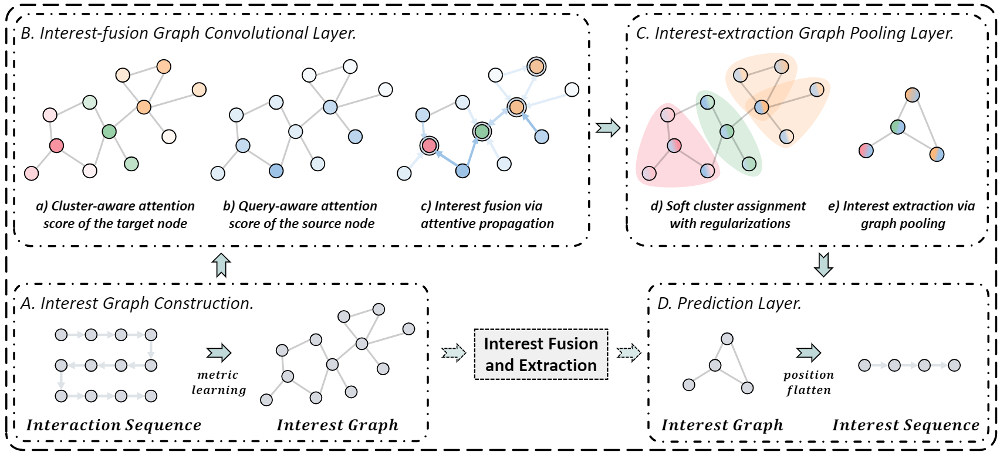
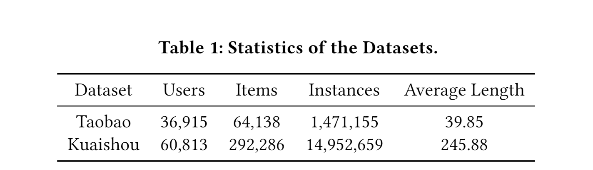
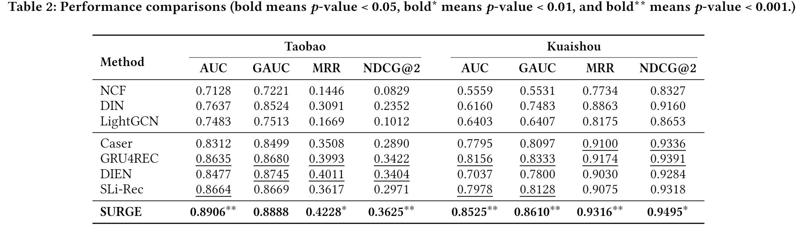
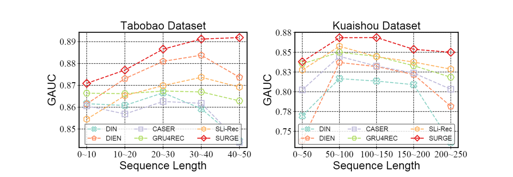
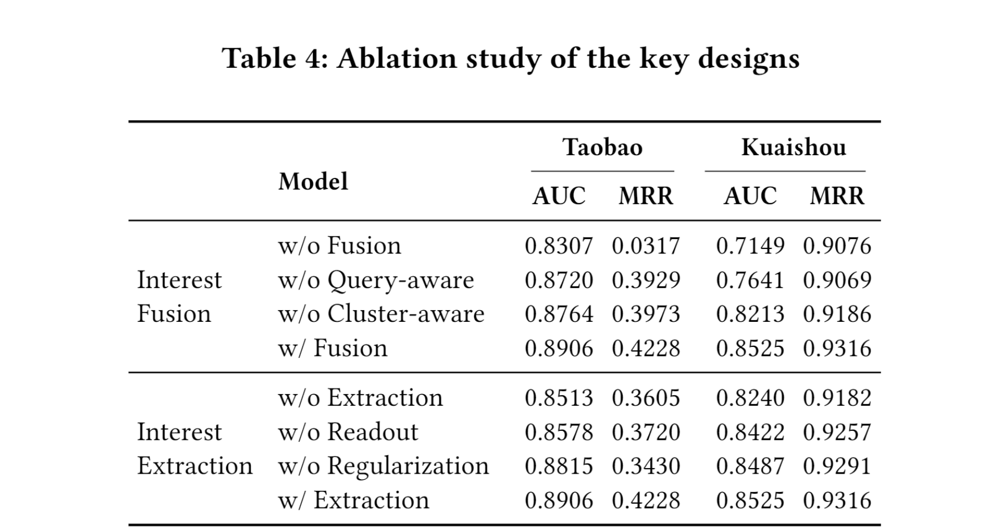
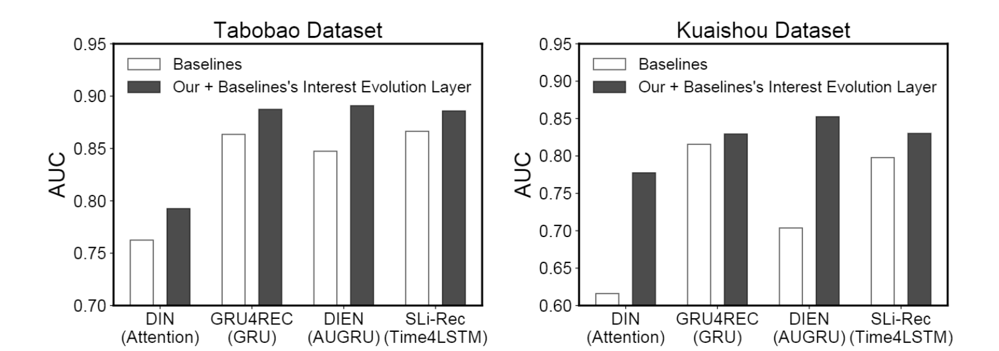

# Sequential Recommendation with Graph Neural Networks

> SIGIR 2021|Jianxin Chang1, Chen Gao...|[源码](https://github.com/tsinghua-fib-lab/SIGIR21-SURGE)

## 1. ABSTART

现有工作尚未解决顺序推荐中的两个主要挑战。 首先，用户在其丰富的历史序列中的行为往往是隐含的、嘈杂的偏好信号，它们不能充分反映用户的实际偏好。 此外，用户的动态偏好往往会随着时间的推移而迅速变化，因此很难在他们的历史序列中捕捉用户模式。

我们提出了一个名为 SURGE，通过基于度量学习将松散的项目序列重构为紧密的项目-项目兴趣图，将长期用户行为中不同类型的偏好整合到图中的集群中。 然后，我们在构建的图上执行集群感知和查询感知图卷积传播和图池化。 它从嘈杂的用户行为序列中动态融合并提取用户当前激活的核心兴趣。

## 2. PROBLEM FORMULATION

在这里，我们提供了顺序推荐的正式定义。输入：每个用户的交互历史$\left\{x_{1}, x_{2}, \ldots, x_{n}\right\}$。 输出：一个推荐模型，用于估计具有交互历史的用户将在第 (𝑛 + 1) 步与目标项目 𝑥𝑡 交互。

## 3. METHODOLOGY

1. 兴趣图构建。 通过基于度量学习将松散的项目序列重建为紧密的项目兴趣图，我们明确地整合和区分长期用户行为中的不同类型的偏好。
2. 兴趣融合图卷积层。 在构建的兴趣图上进行图卷积传播，动态融合用户兴趣，强化重要行为，弱化噪声行为。
3. 兴趣提取图池化层。 考虑用户在不同时刻的不同偏好，进行动态图池化操作，自适应地保留动态激活的核心偏好。
4. 预测层。 在将池化图展平为简化序列后，我们对增强兴趣信号的演变进行建模，并预测用户很有可能与之交互的下一个项目。

### 3.1 Interest Graph Construction

#### 3.1.1 Raw graph construction

构造一个单向图 G = {V, E, 𝐴} 来表示每个交互序列，我们的目标是学习邻接矩阵𝐴，其中每条边 (𝑖, 𝑗, 𝐴𝑖,𝑗 ) ∈ E 表示项目 𝑖 是否与项目 𝑗 相关。

#### 3.1.2 Node similarity metric learning

由于我们需要一个相邻节点相似的先验图，因此可以将图学习问题转化为节点相似度度量学习，与下游推荐任务联合训练。为了平衡表现力和复杂性，我们采用加权余弦相似度作为我们的度量函数：

为了增加学习过程的稳定性和表达能力，相似性度量函数可以扩展到多头度量：

其中 𝜙 是头数，𝑀𝛿𝑖j计算嵌入的两个项目之间的相似性度量。每个头部都捕捉到了不同的语义视角。

#### 3.1.3 Graph sparsification via 𝜀-sparseness

通常，邻接矩阵元素应该是非负的，但余弦值 𝑀𝑖 𝑗 是根据 [−1, 1] 之间的度量范围计算得出的。我们只考虑具有最重要连接的节点对，从𝑀中提取对称稀疏非负邻接矩阵𝐴。我们屏蔽掉（即设置为零）𝑀 中小于非负阈值的元素，非负阈值是通过对 𝑀 中的度量值进行排名而获得的：

其中 Rank𝜀𝑛2 (𝑀) 返回度量矩阵 𝑀 中第 𝜀𝑛2 最大值的值。 𝑛 是节点数，𝜀 控制生成图的整体稀疏性。

### 3.2 Interest-fusion Graph Convolutional Layer

#### 3.2.1 Interest fusion via graph attentive convolution

我们提出了一个集群和查询感知的图注意力卷积层，可以在信息聚合过程中感知用户的核心兴趣（即位于集群中心的项目）和与查询兴趣相关的兴趣（即当前目标项目）。

注意：聚合函数可以是Mean、Sum、Max、GRU等函数，这里我们使用简单的sum函数。为了稳定注意力机制的学习过程，我们采用多头注意力：

#### 3.2.2 Cluster- and query-aware attention

为了减轻聚合过程中产生的噪声，作者提出两种注意力：

- 簇意识注意力：对于任意一个节点 𝑖 以及其embedding h𝑖，以该节点为中心的k跳感受野内的所有邻居节点可以计算出一个平均值h𝑖c，然后计算h𝑖与hc的靠近程度：

  

  Attention𝑐 是一个以 LeakyReLU 作为激活函数的两层前馈神经网络。

- 搜索意识注意力：主要是确定源结点 j （目标节点的邻居）对目标查询节点 t 的重要程度：

  

  Attention𝑞 是一个应用 LeakyReLU 非线性的两层前馈神经网络。

则最终目标节点 i 对其邻居 j 的关注程度计算为上述两个注意力系数之和，再通过softmax进行归一化：

### 3.3 Interest-extraction Graph Pooling Layer

#### 3.3.1 Interest extraction via graph pooling

这一步的目的是学习一个集群指定矩阵S，其中S𝑖：表示第 𝑖 个节点被指定在 m 个不同兴趣簇上的概率：

再通过矩阵相乘得到 m 个不同兴趣集群的表示（相当于CNN中的池化操作）：

其中，通过对𝛽𝑖应用softmax获得的𝛾𝑖表示第 𝑖 节点的重要性得分。

#### 3.3.2 Assignment regularization

- Same mapping regularization

  

  为了使连接强度较大的两个节点更容易映射到同一个簇。其中 ∥ · ∥𝐹 表示 Frobenius 范数。邻接矩阵𝐴中的每个元素代表两个节点之间的连接强度，𝑆𝑆𝑇中的每个元素代表两个节点被划分到同一个簇的概率。

- Single affiliation regularization

  

  为了清楚地定义每个集群的从属关系。其中𝐻 (·) 是可以降低映射分布不确定性的熵函数。 最优情况是第 𝑖 节点只映射到一个簇，此时熵 𝐻 (𝑆𝑖:) 为 0。

- Relative position regularization

  

  其中𝑃𝑛是位置编码向量 {1, 2, . . . , 𝑛} 和 𝑃𝑚 是位置编码向量 {1, 2, . . . ，𝑚}。这是一个位置正则化来确保池化期间集群之间的时间顺序。

#### 3.3.3 Graph readout

对原始图 G 执行加权读出以约束每个节点的重要性，在传播层的前向计算之后聚合所有节点嵌入以生成图级表示：

其中权重是池化前每个节点的得分𝛾𝑖，Readout函数可以是Mean、Sum、Max等函数。

### 3.4 Prediction Layer

#### 3.4.1 Interest evolution modeling

对上一阶段得到的用户兴趣图（簇表示）进行位置平整得到精简版的兴趣序列，利用AUGRU（GRU with attentional update gate）输出用户层的表示：

#### 3.4.2 Prediction

我们使用两层前馈神经网络作为预测函数来估计用户在下一时刻与物品交互的概率：

## 4 EXPERIMENT

### 4.1 Experimental Settings

### 4.2 Overall Performance (RQ1)

### 4.3 Study on Sequence Length and Efficiency Comparison (RQ2)

### 4.4 Ablation and Hyper-parameter Study (RQ3)

## 6 CONCLUSIONS AND FUTURE WORK

我们研究了顺序推荐系统的任务。 我们提出了一种基于图的解决方案，将松散的项目序列重新构建为紧密的项目-项目兴趣图。 该模型利用图神经网络的强大能力，从嘈杂的用户行为序列中动态融合和提取用户激活的核心兴趣。 我们还计划考虑使用多种类型的行为，例如点击和收藏，从嘈杂的历史序列中探索细粒度的多重交互。

