# Time Interval Aware Self-Attention for Sequential Recommendation

> WSDM ’20, February 3–7, 2020,Jiacheng Li,Yujie Wang,Julian McAuley

## ABSTRACT

传统上，马尔可夫链 (MC) 以及最近的递归神经网络 (RNN) 和自注意力 (SA) 由于它们能够捕捉序列模式的动态而得到了广泛应用。 然而，大多数这些模型所做的简化假设是将交互历史视为有序序列，而不考虑每次交互之间的时间间隔。 在本文中，我们寻求在顺序建模框架内显式建模交互的时间戳，以探索不同时间间隔对下一个项目预测的影响。

## 1 INTRODUCTION

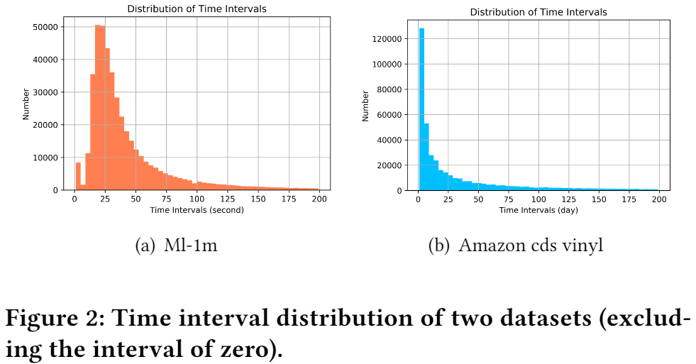

在本文中，我们认为应该将用户交互序列建模为具有不同时间间隔的序列。 图 2 表明交互序列具有不同的时间间隔，其中一些可能很大。 以前的工作忽略了这些间隔及其对预测项目的影响。 为了解决上述限制，受具有相对位置表示的自我注意的启发，我们提出了一种时间感知自我注意机制。 该模型不仅考虑了像 SASRec这样的项目的绝对位置，还考虑了任何两个项目之间的相对时间间隔。 最后，我们的贡献总结如下：

- 我们将用户的交互历史看作一个不同时间间隔的序列，并将不同的时间间隔建模为任意两个交互之间的关系。

- 我们结合绝对位置编码和相对时间间隔编码用于自我注意的优点，设计了一种新的时间间隔感知自我注意机制，以学习不同项目的权重、绝对位置和时间间隔来预测未来项目。
- 我们通过深入的实验研究了绝对位置和相对时间间隔以及不同组件对TiSASRec性能的影响，结果表明，该方法在时间搜索度量方面优于最先进的基线。

## 2 RELATED WORK

### 2.1 Sequential Recommendation

### 2.2 Attention Mechanisms

## 3 PROPOSED METHOD

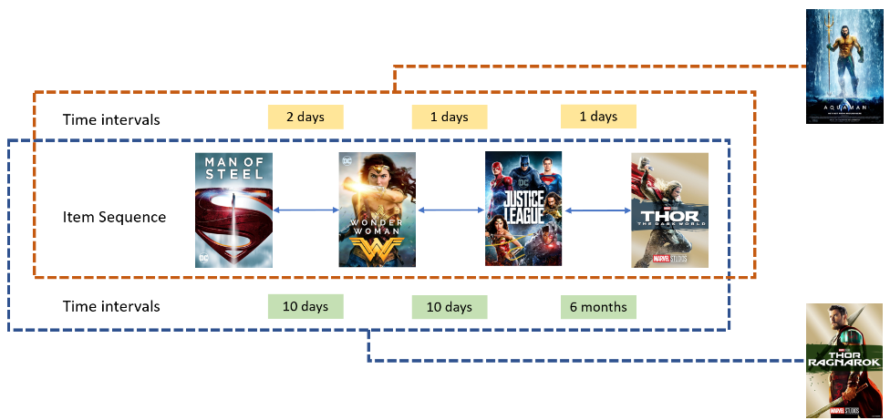

图1：给定具有不同时间间隔的相同项序列，我们的模型将对下一项产生不同的预测。

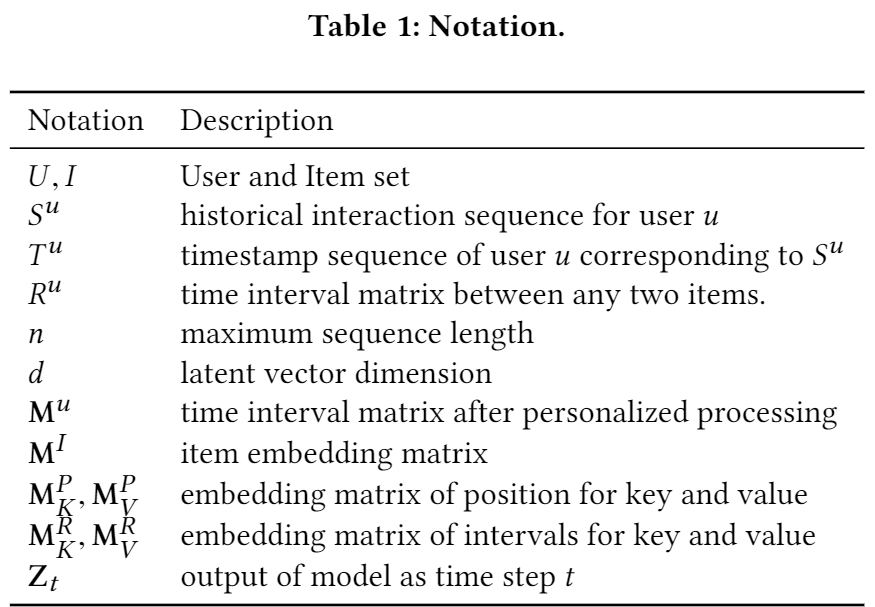

### 3.1 Problem Formulation

模型的输入是$S^{u}=\left(S_{1}^{u}, S_{2}^{u}, \ldots, S_{\left|S^{u}\right|-1}^{u}\right)$和序列中任意两个项目之间的时间间隔$R^{u}$，其中$R^{u} \in \mathbb{N}\left(\left|S^{u}\right|-1\right) \times\left(\left|S^{u}\right|-1\right)$。

输出是$S^{u}=\left(S_{2}^{u}, S_{3}^{u}, \ldots, S_{\left|S^{u}\right|}^{u}\right)$。

### 3.2 Personalized Time Intervals

1. 将用户序列和时间序列转化为等长，我们考虑最大长度n。若大于n，我们考虑最近n项；若小于n项，则向左添加填充项。

2. 对于固定长度时间序列，设用户的最小时间间隔$r_{\min }^{u}=\min \left(\mathbf{R}^{u}\right)$，放缩后的时间间隔为：$r_{i j}^{u}=\left\lfloor\frac{\left|t_{i}-t_{j}\right|}{r_{\min }^{u}}\right\rfloor$。因此，用户 u 的关系矩阵$M^{u} ∈ N^{n×n}$ 为：

   

3. 考虑的两个项目之间的最大相对时间间隔被裁剪为 k，则剪裁过的矩阵为$\mathrm{M}_{\text {clipped }}^{u}=\operatorname{clip}\left(\mathrm{M}^{u}\right)$,其中的每一个项$r^{u}_{i j} = min(k,r^{u}_{i j} )$。对最大间隔的剪裁也避免了稀疏的关系编码，并使模型能够泛化到训练期间未见的时间间隔。

### 3.3 Embedding Layer

我们为项目创建一个嵌入矩阵$M^{I} \in R^{|I|×d}$ ，其中 d 是潜在维度。 常量零向量 0 用作填充项的嵌入。 检索前 n 个项目的嵌入，并将它们堆叠在一起，得到一个矩阵$E^{I} \in R^{n\times d}$ ：

接着，我们使用两个不同的可学习位置嵌入矩阵$M^{P}_{K} \in R^{n \times d}$ ，$M^{P}_{V} \in R^{n \times d}$分别用于自注意机制中的键和值。 这种方法更适合用在self-attention机制中，不需要额外的线性变换。 检索后，我们得到嵌入$E^{P}_{K} \in R^{n \times d}$ 和$E^{P}_{V} \in R^{n \times d}$ ：

与位置嵌入类似，相对时间间隔嵌入矩阵$M^{R}_{K} \in R^{n \times d}$，$M^{R}_{V} \in R^{n \times d}$用于自我注意中的键和值。 在检索关系矩阵$M^{u}_{clipped}$之后，我们得到嵌入矩阵$E^{R}_{K} \in R^{n \times d \times d}$ 和$E^{R}_{V} \in R^{n \times d \times d}$：

两个相对时间间隔嵌入是对称矩阵，主对角线上的元素全为零。

### 3.4 Time Interval-Aware Self-Attention

**Time Interval-Aware Self-attention Layer**：

由于序列的性质，模型在预测第 (t + 1) 个项目时应该只考虑前 t 个项目。因此，我们通过禁止 Qi 和 Kj (j > i) 之间的所有连接来修改注意力。

**Point-Wise Feed-Forward Network**：

在每个时间感知注意力层之后，我们应用两个线性变换，中间有一个 ReLU 激活，这可以赋予模型非线性。在堆叠自注意力层和前馈层之后，会出现更多问题，包括过度拟合、训练过程不稳定（例如梯度消失）以及需要更多的训练时间。我们采用层归一化、残差连接和 dropout 正则化技术来解决这些问题：

### 3.5 Prediction layer

### 3.6 Model Inference

我们将 o = (o1, o2, ..., on ) 定义为给定时间和项目序列的预期输出。 o 的元素 oi 是：

因为用户交互是隐式数据，我们不能直接优化偏好分数Ri,t。 我们模型的目标是提供一个排名项目列表。 因此，我们采用负抽样来优化项目的排名：

## 4 EXPERIMENTS

### 4.1 Datasets

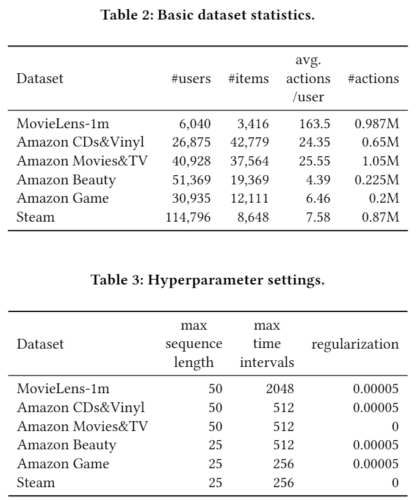

### 4.5 Recommendation Performance

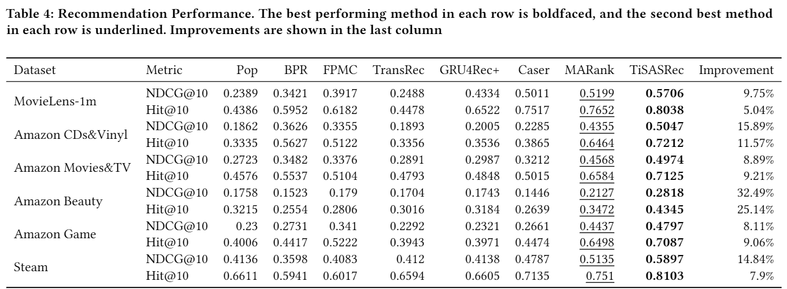

### 4.6 Relative Time Intervals

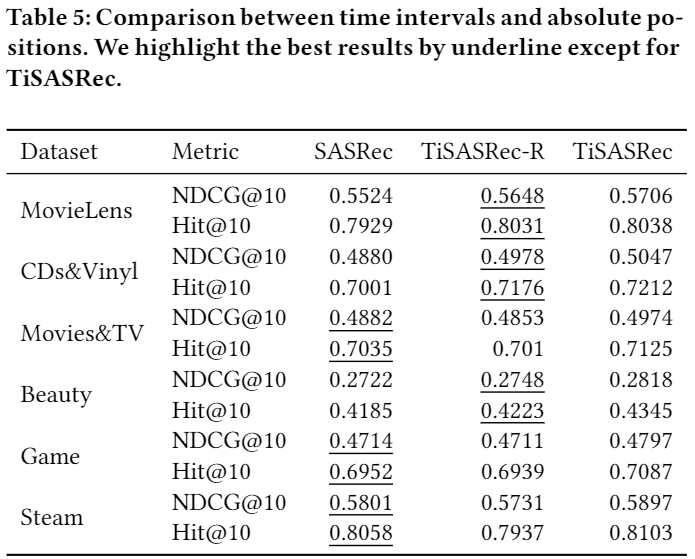

### 4.7 Influence of Hyper-parameters

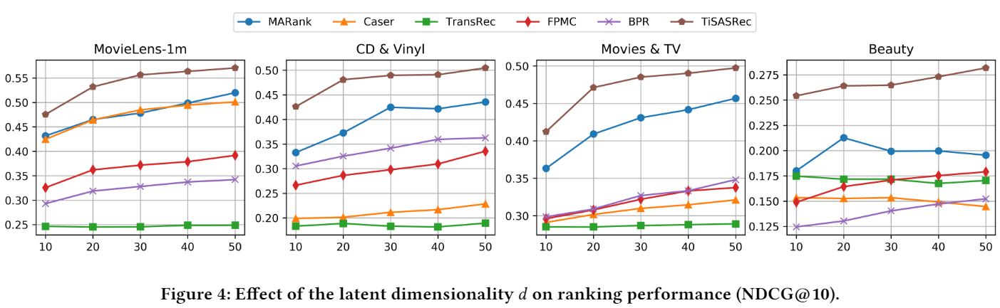

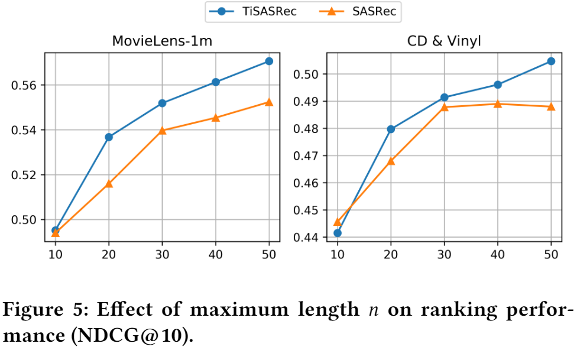

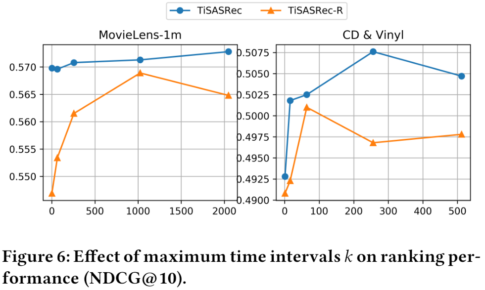

### 4.8 Personalized time intervals

在本节中，我们将探讨时间戳的不同处理方法。

- 直接使用时间戳作为特征。 我们将减去数据集中的最小时间戳，让所有时间戳从 0 开始。 
- 使用未缩放的时间间隔。 对于每个用户，我们减去序列中最小的时间戳，让用户的时间戳从0开始。
- 使用个性化的时间间隔。 对于用户的每个时间间隔，这些间隔除以第 3.4 节中所述的最小间隔。

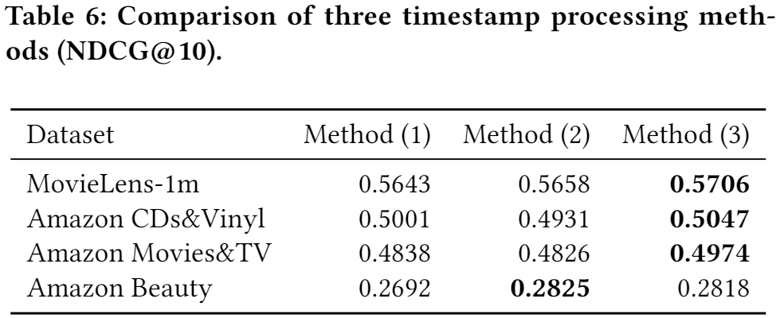

### 4.9 Visualization

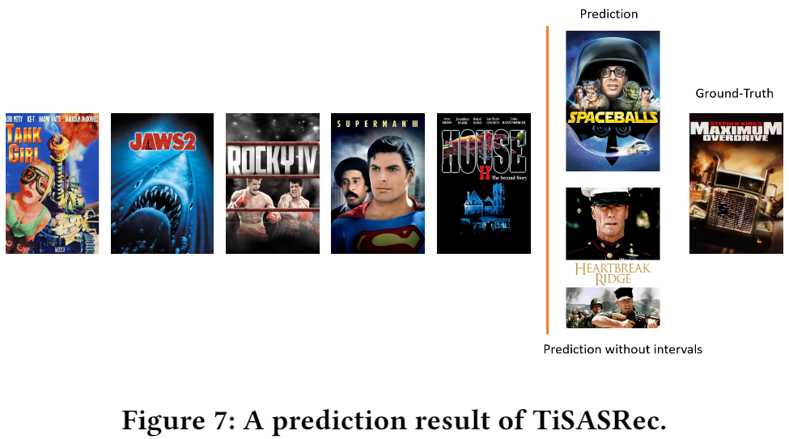

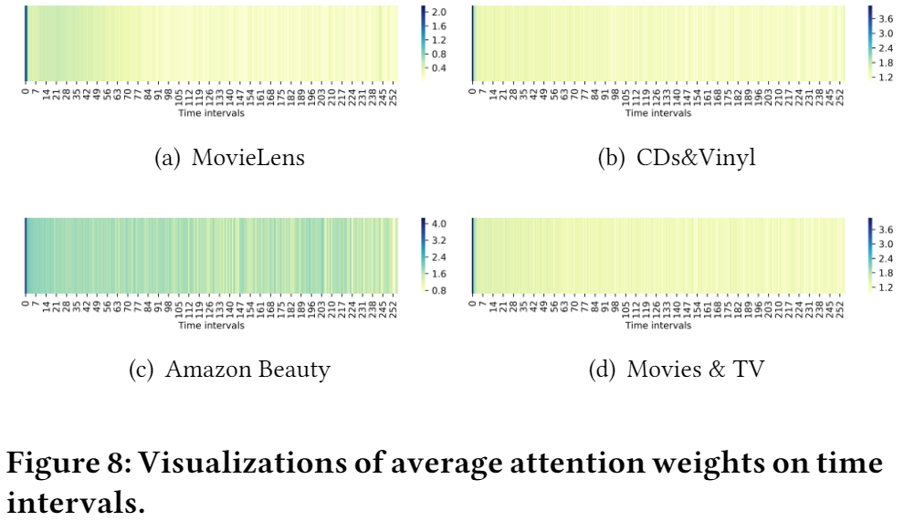

## 5 CONCLUSION

在这项工作中，我们提出了一个时间间隔感知的自注意序列推荐模型(TiSASRec)。TiSASRec对项目之间的相对时间间隔和绝对位置进行建模，以预测未来的交互。

