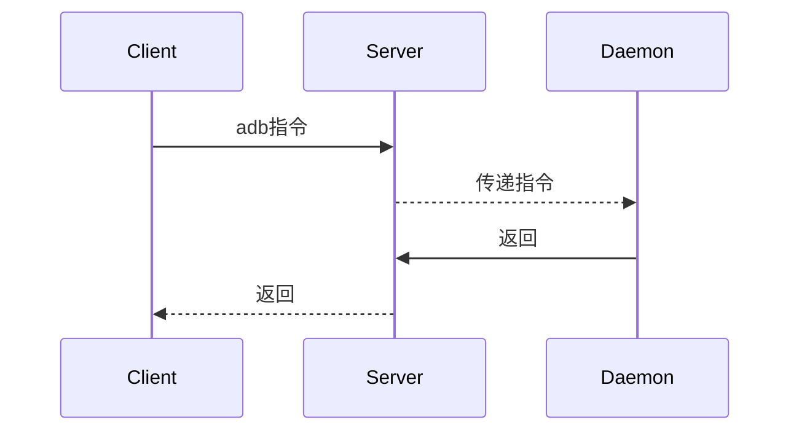

# ADB基本指令相关
## ADB的工作原理
ADB包含三个部分：
1. Client端：运行在开发机器中，用来发送adb命令，比如电脑
2. Daemon守护进程：运行在调试设备，比如手机、模拟器中，用来接收并执行adb命令
3. Server端：运行在开发机器中，用来管理Client端和手机端Daemon之间的通信



## ADB指令分类整理

### 连接相关
```shell
adb version 查看adb版本
adb devices 查看连接设备
adb connect <android_ip>    连接android设备（需要在同一网段下）
adb kill-server 杀死adb 服务
adb start-server 启动adb服务
adb reboot 重启手机

adb kill-server && adb -a -P 5037 nodaemon server   //远程连接Client
adb -H {device_hub_ip} -P {port} {其他 adb 命令}    //远程连接Server
```

### 多个设备
```shell
adb devices 查看连接设备
adb -s <device_name> shell 进入指定的设备shell
```

### 应用相关
```shell
adb shell pm list packages    显示所有应用信息
adb shell pm list packages -s    显示系统应用信息
adb shell pm list packages -3   显示第三方应用信息
adb shell pm list permissions -d -g    显示权限信息
adb shell pm clear <package_name>    清除数据
adb shell pm install <package_name>    安装应用
adb shell pm install -r -r <package_name>    保留数据和缓存文件，重新安装apk
adb shell pm uninstall <package_name>    卸载应用(与adb uninstall相同)

adb install <package_name>    安装应用
adb install -r <package_name>    保留数据和缓存文件，重新安装apk
adb uninstall <package_name>    卸载应用
```

### 获取手机系统信息
```shell
adb shell cat /proc/cpuinfo     显示cpu信息
adb get-serialno    获取序列号
adb shell  cat /sys/class/net/wlan0/address    获取mac地址
adb shell getprop ro.product.model    获取设备型号
adb shell wm size    查看屏幕分辨率
adb shell wm density    查看屏幕密度
```

### 日志相关
```shell
adb logcat -v time    带时间戳的log
adb logcat -b <buffer>    查看不同类型的log，如main,system,radio,events,crash,all.默认为main log
adb logcat -c    清除log
adb logcat | grep -i "str"    忽略大小写筛选指定字符串log
adb logcat | grep -iE "str1|str2|str3"    筛选多个字符串
adb logcat > log.txt    打印log输入到文件
```

### fastboot模式
```shell
adb reboot-bootloader
fastboot flash boot boot.img
fastboot flash recovery recovery.img
fastboot flash android system.img
```

### 文件相关
```shell
adb remount    
adb push <file_path> <dest_path>    从PC向手机端push文件
adb pull <target_path> <dest_path>    从手机端向PC端拉取文件
eg.
adb remount
adb push Hello.apk /system/app/Hello/
```

### 截屏与录屏
```shell
截屏：
adb shell screencap -p <output_file>    截取屏幕，并设置图片存储路径
adb pull <output_file> .    拉取该截图到PC
adb shell rm <output_file>    删除截图文件
eg.
adb shell screencap -p /sdcard/screen.png

录屏：
adb shell screenrecord <output_file> 录屏
```

### dumpsys 查看信息相关
```shell
adb shell dumpsys    显示当前android系统信息(四大组件，内容太多，一般使用重定向)
adb shell dumpsys > info.txt 显示当前android系统信息(文件重定向)

activity：
adb shell dumpsys activity    显示当前所有activity信息
adb shell dumpsys activity top    查看当前应用的 activity 信息

package：
adb shell dumpsys package [package_name] 查看应用信息

内存：
adb shell dumpsys meminfo [package_name/pid] 查看指定进程名或者是进程 id 的内存信息

数据库：
adb shell dumpsys dbinfo [package_name] 查看指定包名应用的数据库存储信息(包括存储的sql语句)
```

### am相关
```shell
启动Activity:
adb shell am start -n <package_name>/<package_name>.<activity_name>
eg.
adb shell am start -n com.example.hello/com.example.hello.MainActivity

启动Service:
adb shell am startservice -n <package_name>/<package_name>.<service_name>    启动service
eg.
adb shell am startservice -n com.example.test/com.example.test.TestService

发送广播:
adb shell am broadcast -a <action>    发送广播
```

### 其他
```shell
//查看网络信息
adb shell netcfg    查看设备的 ip 地址
adb shell netstat    查看设备的端口号信息

//属性信息
adb shell getprop [prop_name]    查看属性信息
adb shell setprop <prop_name> <value>    设置属性值

//Monkey测试-对指定应用，做evnet_number个随机伪事件
adb shell monkey [options] <event-count>
adb shell monkey -p <package_name> -v <event_number>

adb shell ps    查看进程信息
```
