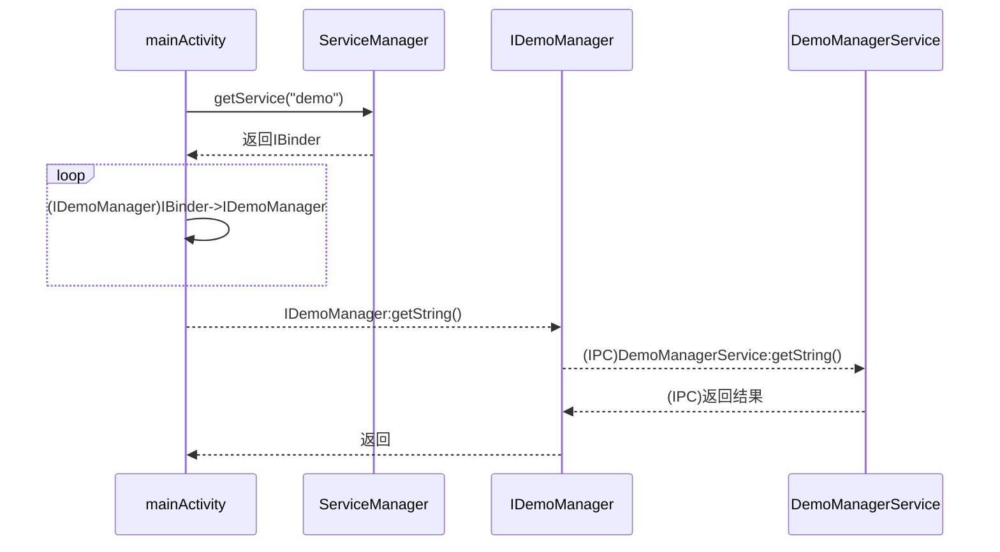

# Android 11添加系统服务

## 1. 自定义系统Service

### 1.1 定义接口

定义了一个名为 `IDemoManager` 的 AIDL 接口，其中包含一个 `getString` 方法用于返回字符串。

```Java
//project/frameworks/base/core/java/android/os/demo/IDemoManager.aidl
package android.os.demo;

 /**
* @hide
*/
interface IDemoManager {
    String getString(String text);
}
```

### 1.2 编写代理类

Android系统中的ManagerService都是不可以直接访问的，需要通过它们的客户端代理类执行操作，我们也为我们的Service写一个代理类。

```Java
//project/frameworks/base/core/java/com/demo/DemoManager.java
package com.demo;

import android.os.demo.IDemoManager;
import android.util.Log;
import android.content.Context;
import android.os.Handler;
import java.util.ArrayList;
import android.os.RemoteException;
public class DemoManager {
    private final Context mContext;
    private final IDemoManager mService;
    public DemoManager(Context context, IDemoManager service) {
        this.mContext = context;
        this.mService = service;
    }

   public String getString(String text) {
        try {
            return mService.getString(text);
        } catch (RemoteException e) {
            e.printStackTrace();
        }
        return "getString error!";
    }

}
```

### 1.3 编写系统服务

```Java
//project/frameworks/base/services/core/java/com/android/server/demo/DemoManagerService.java
package com.android.server.demo;
import android.os.demo.IDemoManager;
import android.os.RemoteException;
import android.content.Context;
import android.util.Log;

public class DemoManagerService extends IDemoManager.Stub {
    // private static final String TAG = "DemoManagerService";
    private Context mContext;

    public DemoManagerService(Context context) {
        this.mContext = context;
        Log.d("WFJ","public DemoManagerServicexcxc");
    }

    @Override
    public String getString(String text) throws RemoteException {
        return text;
    }
    // String getString(String text);
}
```

### 1.4 注册服务

```Java
//project/frameworks/base/core/java/android/app/SystemServiceRegistry.java
//...
import android.os.demo.IDemoManager;
import com.demo.DemoManager;
//...
static{
    //...
    registerService(Context.DEMO_SERVICE, DemoManager.class,
                    new CachedServiceFetcher<DemoManager>() {
                        @Override
                        public DemoManager createService(ContextImpl ctx) {
                            IBinder b = ServiceManager.getService(Context.DEMO_SERVICE);
                            IDemoManager service = IDemoManager.Stub.asInterface(b);
                            return new DemoManager(ctx, service);
                        }});
            //sInitializing = true;
}
//...
```

### 1.5 定义服务常量

```Java
//project/frameworks/base/core/java/android/content/Context.java
//...
public abstract class Context {
  	/** @hide */
    @StringDef(suffix = { "_SERVICE" }, value = {
            POWER_SERVICE,
            //省略此处代码......
            PERMISSION_SERVICE,
            DEMO_SERVICE,  //这里添加自己的服务常量
    })
    //...
    @SuppressLint("ServiceName")
    public static final String DEMO_SERVICE = "demo";
    //...
}
//...
```

### 1.6 添加服务

```Java
//project/frameworks/base/services/java/com/android/server/SystemServer.java
//...
import com.android.server.demo.DemoManagerService;
mActivityManagerService.systemReady(() -> {
    //...
    t.traceBegin("DemoManagerService");
            ServiceManager.addService(Context.DEMO_SERVICE,new DemoManagerService(context));
            t.traceEnd();
    //...
}, t);
```


## 2. 编译源码

1. 初始化项目编译

   ```
   1.source  build/envsetup.sh
   2.lunch [project]
   ```

2. 执行 make update-api, 更新接口,若aidl文件没有问题则会在frameworks/base/api/current.txt中看到自己的服务。

3. make 编译整个系统源码


## 3. 调用服务

```Java
//mainActivity.java
import android.os.demo.IDemoManager;
//...

try {
    IBinder binder = ServiceManager.getService("demo");
    IDemoManager myService = IDemoManager.Stub.asInterface(binder);
    String str =  String.valueOf(myService.getString("wufangjian success!"));
}catch (RemoteException e) {
    e.printStackTrace(); 
}
```

## 4. 注意事项

### 4.1 关闭SElinux

为了快速调试，这里选择关闭SElinux，避免没有权限造成的无法调用。若不关闭，则配置安全权限。参考[Selinux权限解决](https://blog.csdn.net/qq_45649553/article/details/138523625#Selinux_341)

```Java
//project/system/core/init/selinux.cpp
//...
bool IsEnforcing() {
    // 直接返回false，关闭SElinux
    return false;
    
//...
```


## 5. 调用流程解析
在这个调用过程中，`mainActivity` 通过 `ServiceManager` 获取名为 "demo" 的服务，获得一个代表远程服务接口的 `IBinder` 对象。随后，`mainActivity` 将该 `IBinder` 对象转换为 `IDemoManager` 接口对象，通过该代理对象调用 `getString()` 方法。代理对象通过 IPC 机制将请求发送到远程服务端的 `DemoManagerService`，执行相应逻辑后返回结果，最终由代理对象将结果传递给 `mainActivity`。




