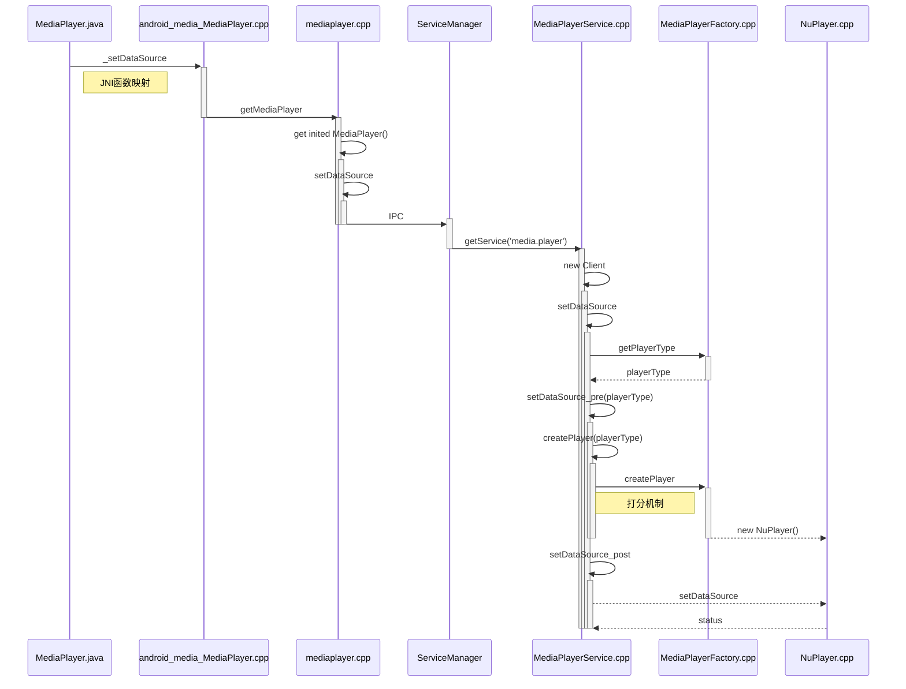
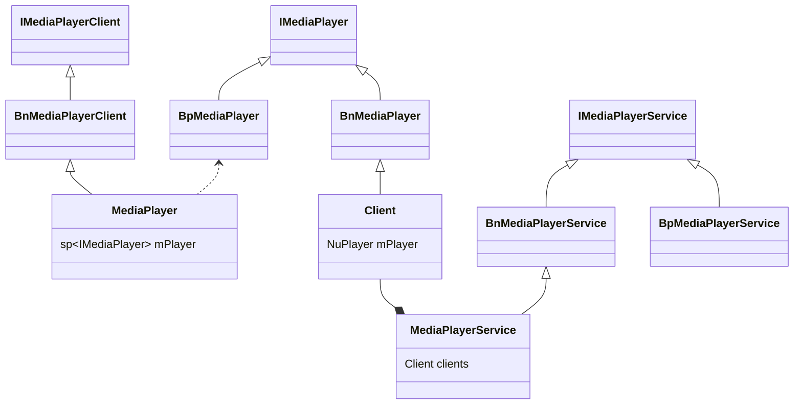

# Media Player 源码分析

## MediaPlayer 调用流程

MediaPlayer中涉及到的主要函数都是通过 JNI 来完成的，MediaPlayer.java 对应的是android_media_MediaPlayer.cpp。其中的对应关系如下，省略了一部分不是特别重要的。

```cpp
static JNINativeMethod gMethods[] = {
    {
        "nativeSetDataSource",
        "(Landroid/os/IBinder;Ljava/lang/String;[Ljava/lang/String;"
        "[Ljava/lang/String;)V",
        (void *)android_media_MediaPlayer_setDataSourceAndHeaders
    },
    {"_setDataSource",       "(Ljava/io/FileDescriptor;JJ)V",    (void *)android_media_MediaPlayer_setDataSourceFD},
    {"_prepare",            "()V",                              (void *)android_media_MediaPlayer_prepare},
    {"prepareAsync",        "()V",                              (void *)android_media_MediaPlayer_prepareAsync},
    {"_start",              "()V",                              (void *)android_media_MediaPlayer_start},
    {"_stop",               "()V",                              (void *)android_media_MediaPlayer_stop},
    {"getVideoWidth",       "()I",                              (void *)android_media_MediaPlayer_getVideoWidth},
    {"getVideoHeight",      "()I",                              (void *)android_media_MediaPlayer_getVideoHeight},
    {"seekTo",              "(I)V",                             (void *)android_media_MediaPlayer_seekTo},
    {"_pause",              "()V",                              (void *)android_media_MediaPlayer_pause},
    {"isPlaying",           "()Z",                              (void *)android_media_MediaPlayer_isPlaying},
    {"getCurrentPosition",  "()I",                              (void *)android_media_MediaPlayer_getCurrentPosition},
    {"getDuration",         "()I",                              (void *)android_media_MediaPlayer_getDuration},
    {"_release",            "()V",                              (void *)android_media_MediaPlayer_release},
    {"_reset",              "()V",                              (void *)android_media_MediaPlayer_reset},
    {"native_init",         "()V",                              (void *)android_media_MediaPlayer_native_init},
    {"native_setup",        "(Ljava/lang/Object;)V",            (void *)android_media_MediaPlayer_native_setup},
};
```

Java 这边的调用顺序通常是：

```java
MediaPlayer mp = new MediaPlayer();
mp.setDataSource("/sdcard/test.mp3");
mp.prepare();
mp.start();
mp.pause();
mp.stop();
mp.release();
```

下面将按照这个顺序一步一步来分析。

### 构造函数

在 MediaPlayer 的构造函数中调用了 native 的 android_media_MediaPlayer_native_setup 方法:

```java
public MediaPlayer() {
    ...
    native_setup(new WeakReference<MediaPlayer>(this));
}

```

setup 方法中创建了 MediaPlayer，同时也设置了回调函数。其中最后一行的 setMediaPlayer 将 MediaPlayer 的指针保存成一个 Java 对象，之后可以看到 getMediaPlayer 通过同样的方法获取到该对象的指针。

```cpp
static void android_media_MediaPlayer_native_setup(JNIEnv *env, jobject thiz, jobject weak_this,
                                       jobject jAttributionSource,
                                       jint jAudioSessionId)
{
    ALOGV("native_setup");
    Parcel* parcel = parcelForJavaObject(env, jAttributionSource);
    android::content::AttributionSourceState attributionSource;
    attributionSource.readFromParcel(parcel);
    sp<MediaPlayer> mp = sp<MediaPlayer>::make(
        attributionSource, static_cast<audio_session_t>(jAudioSessionId));
    if (mp == NULL) {
        jniThrowException(env, "java/lang/RuntimeException", "Out of memory");
        return;
    }

    // create new listener and give it to MediaPlayer
    sp<JNIMediaPlayerListener> listener = new JNIMediaPlayerListener(env, thiz, weak_this);
    mp->setListener(listener);

    // Stow our new C++ MediaPlayer in an opaque field in the Java object.
    setMediaPlayer(env, thiz, mp);
}

static sp<MediaPlayer> setMediaPlayer(JNIEnv* env, jobject thiz, const sp<MediaPlayer>& player)
{
    Mutex::Autolock l(sLock);
    /* 由于指针的大小和 long 的大小是一样的，所以这里的 get 和 set 可以将MediaPlayer 的指针取出或存入*/
    sp<MediaPlayer> old = (MediaPlayer*)env->GetLongField(thiz, fields.context);
    // 判断 mediaplayer 是否为空指针，如果不是，这 sp 引用计数加1
    if (player.get()) {
        player->incStrong((void*)setMediaPlayer);
    }
    // 如果之前存过 mediaplayer，检查之前存的是否为空，如果不为空，则引用计数减1
    if (old != 0) {
        old->decStrong((void*)setMediaPlayer);
    }
    // 将新的 mediaplayer 指针存入 Java 对象中
    env->SetLongField(thiz, fields.context, (jlong)player.get());
    return old;
}
```

现在一个 mediaplayer 对象就创建好了，其他的 jni 中对应的方法几乎都是调用 mediaplayer 来完成的。

### 设置数据源

setDataSource对应的是 jni 中的这个函数：

```cpp
static void android_media_MediaPlayer_setDataSourceFD(JNIEnv *env, jobject thiz, jobject fileDescriptor, jlong offset, jlong length)
{
    sp<MediaPlayer> mp = getMediaPlayer(env, thiz);
    if (mp == NULL ) {
        jniThrowException(env, "java/lang/IllegalStateException", NULL);
        return;
    }

    if (fileDescriptor == NULL) {
        jniThrowException(env, "java/lang/IllegalArgumentException", NULL);
        return;
    }
    int fd = jniGetFDFromFileDescriptor(env, fileDescriptor);
    ALOGV("setDataSourceFD: fd %d", fd);
    process_media_player_call( env, thiz, mp->setDataSource(fd, offset, length), "java/io/IOException", "setDataSourceFD failed." );
}

```

可以看到函数开始先做了空指针的判断，之后调用了 mp->setDataSource(fd, offset, length) 方法来给 mediaplayer 设置数据源，同时 process_media_player_call 函数对 setDataSource 返回值做判断是否设置成功以及失败后抛出异常。mediaplayer 中的 setDataSource 函数分为三种，分别对应播放本地文件、网络和流三种情况，现在只看播放本地文件的情况：

```cpp
status_t MediaPlayer::setDataSource(int fd, int64_t offset, int64_t length)
{
    ALOGV("setDataSource(%d, %" PRId64 ", %" PRId64 ")", fd, offset, length);
    status_t err = UNKNOWN_ERROR;
    // 获取 MediaPlayerService 接口
    const sp<IMediaPlayerService>& service(getMediaPlayerService());
    if (service != 0) {
        // 获取 MediaPlayer 接口
        sp<IMediaPlayer> player(service->create(this, mAudioSessionId));
        // 设置数据源
        if ((NO_ERROR != doSetRetransmitEndpoint(player)) ||
            (NO_ERROR != player->setDataSource(fd, offset, length))) {
           player.clear();
        }
        err = attachNewPlayer(player);
    }
    return err;
}
```

这个函数分为三个部分，逐个分析。

#### 获取 MediaPlayerService 接口

这里先是调用了 getMediaPlayerService 方法获取到一个 IMediaPlayerService

```cpp

/*static*/const sp<IMediaPlayerService> &IMediaDeathNotifier::getMediaPlayerService()
{
    ALOGV("getMediaPlayerService");
    Mutex::Autolock _l(sServiceLock);
    if (sMediaPlayerService == 0) {
        // 获取 servicemanager
        sp<IServiceManager> sm = defaultServiceManager();
        sp<IBinder> binder;
        do {
            // 获取对应的 binder
            binder = sm->getService(String16("media.player"));
            if (binder != 0) {
                break;
            }
            ALOGW("Media player service not published, waiting...");
            usleep(500000); // 0.5 s
        } while (true);
        if (sDeathNotifier == NULL) {
            sDeathNotifier = new DeathNotifier();
        }
        binder->linkToDeath(sDeathNotifier);
        // asInterface 获取 binder 中的 remote 对象
        sMediaPlayerService = interface_cast<IMediaPlayerService>(binder);
    }
    ALOGE_IF(sMediaPlayerService == 0, "no media player service!?");
    return sMediaPlayerService;
}
```

IServiceManager 是 IInterface 类型，和用 AIDL 生成的接口相同，IInterface 中包含了 binder 和 remote 两个东西。在 ndk 中对应的是 BnInterface 和 BpInterface。在 Java 中，本地 Client 通过 ServiceConnection 中的 onServiceConnected (ComponentName name, IBinder service) 方法获得 Service 中在 onBind 时候返回的 binder，同理，这里通过 ServiceManager 的 getService 获得和 media.player 这个 Service 通信用的 binder。

到这里为止我们只拿到了 media.player Service 的 binder，要想调用接口中的方法还需要通过 asInterface 方法来获得与之对应的 IInterface 接口。这里的 interface_cast<IMediaPlayerService>(binder) 方法就可以获得对应的接口，那么 interface_cast 是怎么做到的呢，其实很简单，利用了模板封装了 asInterface 的操作：

```cpp
template<typename INTERFACE> inline sp<INTERFACE> interface_cast(const sp<IBinder>& obj)
{
    return INTERFACE::asInterface(obj);
}
```

现在我们就拿到了 media.player 的Service 的接口。看到这里会有一个疑问，这个 media.player 的 Service 是什么时候启动的呢。我们根据 media.player 这个线索找到了下面的代码：

```cpp

void MediaPlayerService::instantiate() {
    defaultServiceManager()->addService(String16("media.player"), new MediaPlayerService());
}

int main(int argc __unused, char** argv)
{
    ...
    sp<ProcessState> proc(ProcessState::self());
    sp<IServiceManager> sm = defaultServiceManager();
    ALOGI("ServiceManager: %p", sm.get());
    AudioFlinger::instantiate();
    // 就是这里啦
    MediaPlayerService::instantiate();
    // 照相机
    CameraService::instantiate();
    // 音频
    AudioPolicyService::instantiate();
    // 语音识别
    SoundTriggerHwService::instantiate();
    registerExtensions();
    ProcessState::self()->startThreadPool();
    IPCThreadState::self()->joinThreadPool();
}

```

其中 MediaPlayerService 位于 MediaPlayerService.cpp 中，而 main 函数位于main_mediaserver.cpp。它是在开机的时候启动的，被写在了启动脚本中。这样在系统启动的时候这个进程就开启了，同时里面的 Service 也就启动了。

#### 获取 MediaPlayer 接口

service->create(this, mAudioSessionId) 方法通过 IPC 的方式调用MediaPlayerService中的 create 方法获得 IMediaPlayer，IMediaPlayer 从名字就可以看出是一个 IInterface，所以 MediaPlayer 也是通过 IPC 来调用的。先看这个方法做了什么：

```cpp
sp<IMediaPlayer> MediaPlayerService::create(const sp<IMediaPlayerClient>& client, int audioSessionId)
{
    pid_t pid = IPCThreadState::self()->getCallingPid();
    int32_t connId = android_atomic_inc(&mNextConnId);
    // MediaPlayerClient
    sp<Client> c = new Client(
            this, pid, connId, client, audioSessionId,
            IPCThreadState::self()->getCallingUid());
    ALOGV("Create new client(%d) from pid %d, uid %d, ", connId, pid,
         IPCThreadState::self()->getCallingUid());
    wp<Client> w = c;
    {
        Mutex::Autolock lock(mLock);
        // 管理 Client
        mClients.add(w);
    }
    return c;
}
```

首先调用的时候传的参数是 MediaPlayer 本身，MediaPlayer 除了继承 IMediaDeathNotifier 同时还继承了 BnMediaPlayerClient，而 BnMediaPlayerClient 又继承了 BnInterface<IMediaPlayerClient>，所以这里的参数列表是一个 client 引用。其中 Client 的实现也在 MediaPlayerService.cpp 这个文件中，他的构造函数用来保存这些对象：

```cpp
MediaPlayerService::Client::Client(
        const sp<MediaPlayerService>& service, pid_t pid,
        int32_t connId, const sp<IMediaPlayerClient>& client,
        int audioSessionId, uid_t uid)
{
    ALOGV("Client(%d) constructor", connId);
    mPid = pid;
    mConnId = connId;
    mService = service;
    mClient = client;
    mLoop = false;
    mStatus = NO_INIT;
    mAudioSessionId = audioSessionId;
    mUID = uid;
    mRetransmitEndpointValid = false;
    mAudioAttributes = NULL;
#if CALLBACK_ANTAGONIZER
    ALOGD("create Antagonizer");
    mAntagonizer = new Antagonizer(notify, this);
#endif
}
```

最后 create 方法返回一个 MediaPlayer 的接口，这个接口通过 IPC 用来调用 Client 中的函数。

#### 设置数据源

经过了之前的折腾，我们先拿到了 MediaPlayerService 的接口，通过 MediaPlayerService 的接口又拿到了 MediaPlayer 的接口，接下来就要进行这个函数的最终目的**设置数据源**。同样是通过 IPC 调用了 MediaPlayer 的 setDataSource，定义如下：

```cpp
status_t MediaPlayerService::Client::setDataSource(int fd, int64_t offset, int64_t length)
{
    // 前面是一些输出要设置的数据源的信息的 log
    ...
    // 获取播放器类型
    player_type playerType = MediaPlayerFactory::getPlayerType(this, fd, offset, length);
    // 创建播放器
    sp<MediaPlayerBase> p = setDataSource_pre(playerType);
    if (p == NULL) {
        return NO_INIT;
    }
    // now set data source
    setDataSource_post(p, p->setDataSource(fd, offset, length));
    return mStatus;
}
```

这些 player 都是由对应的 factory 创建的，对应的实现在MediaPlayerFactory.cpp 中，其中的代码比较简单，这里就不分析了，主要是匹配不同类型对应不同的分数，然后选取分高的 player 创建。最新源码中默认的创建的player是`NU_PLAYER`，最后的设置数据源也是调用它的方法进行设置，具体的可见下一篇[NuPlayer源码分析之播放器创建](NuPlayer源码分析之播放器创建.md)中的详细解析。

### 准备&开始&暂停&停止&释放

MediaPlayer中的这几个函数基本都是调用NuPlayer中的函数实现的，不多说，直接上代码。

```c++
static jint android_media_MediaPlayer_prepare(JNIEnv *env, jobject thiz, jobject piidParcel)
{
    sp<MediaPlayer> mp = getMediaPlayer(env, thiz);
    if (mp == nullptr) {
        jniThrowException(env, "java/lang/IllegalStateException", NULL);
        return UNKNOWN_ERROR;
    }

    // Handle the case where the display surface was set before the mp was
    // initialized. We try again to make it stick.
    sp<IGraphicBufferProducer> st = getVideoSurfaceTexture(env, thiz);
    mp->setVideoSurfaceTexture(st);

    process_media_player_call( env, thiz, mp->prepare(), "java/io/IOException", "Prepare failed." );

    if (env->ExceptionCheck()) {
        return UNKNOWN_ERROR;
    }

    // update the piid
    Parcel *request = parcelForJavaObject(env, piidParcel);
    auto reply = std::make_unique<Parcel>();
    return static_cast<jint>(mp->invoke(*request, reply.get()));
}
static void android_media_MediaPlayer_start(JNIEnv *env, jobject thiz)
{
    ALOGV("start");
    sp<MediaPlayer> mp = getMediaPlayer(env, thiz);
    if (mp == NULL ) {
        jniThrowException(env, "java/lang/IllegalStateException", NULL);
        return;
    }
    process_media_player_call( env, thiz, mp->start(), NULL, NULL );
}
static void android_media_MediaPlayer_pause(JNIEnv *env, jobject thiz)
{
    ALOGV("pause");
    sp<MediaPlayer> mp = getMediaPlayer(env, thiz);
    if (mp == NULL ) {
        jniThrowException(env, "java/lang/IllegalStateException", NULL);
        return;
    }
    process_media_player_call( env, thiz, mp->pause(), NULL, NULL );
}
static void android_media_MediaPlayer_stop(JNIEnv *env, jobject thiz)
{
    ALOGV("stop");
    sp<MediaPlayer> mp = getMediaPlayer(env, thiz);
    if (mp == NULL ) {
        jniThrowException(env, "java/lang/IllegalStateException", NULL);
        return;
    }
    process_media_player_call( env, thiz, mp->stop(), NULL, NULL );
}
static void android_media_MediaPlayer_release(JNIEnv *env, jobject thiz)
{
    ALOGV("release");
    decVideoSurfaceRef(env, thiz);
    sp<MediaPlayer> mp = setMediaPlayer(env, thiz, 0);
    if (mp != NULL) {
        // this prevents native callbacks after the object is released
        mp->setListener(0);
        mp->disconnect();
    }
}
```

## 总结

到此为止mediaplayer的流程就算是走完了。重点总结一下**设置数据源**简单的时序图以及C/S的架构类图：



## 参考文献

[MediaPlayer](http://developer.android.com/reference/android/media/MediaPlayer.html)

[Android MediaPlayer源码分析](https://blog.csdn.net/k663514387/article/details/110622681)NuPlayer源码分析之播放器创建
