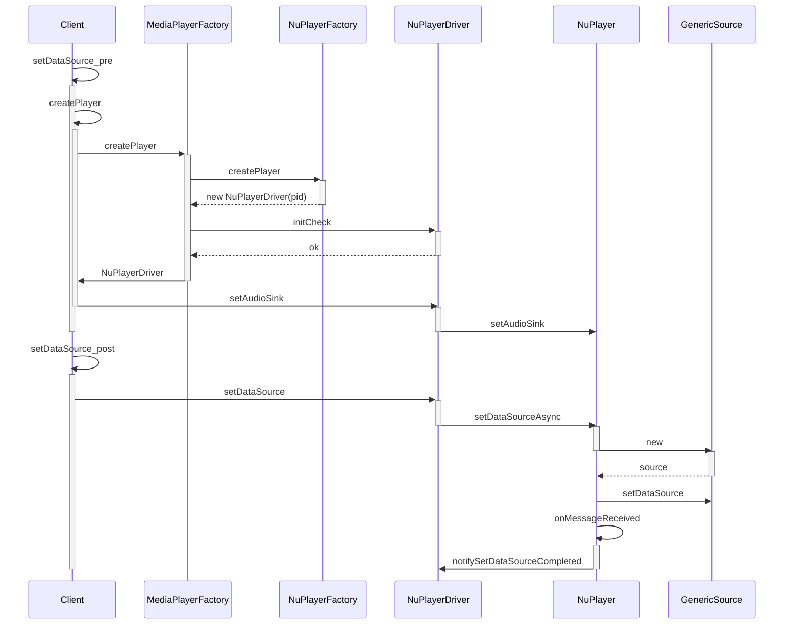

# NuPlayer源码分析之播放器创建

> 本文内容的源码全摘录自[android14-qpr3-release](https://cs.android.com/android/platform/superproject/+/android14-qpr3-release:)，悉知！

播放器的创建追溯到MediaPlayer源码分析中的`MediaPlayerService::Client::setDataSource`：

```c++
//frameworks/av/media/libmediaplayerservice/MediaPlayerService.cpp
status_t MediaPlayerService::Client::setDataSource(int fd, int64_t offset, int64_t length)
{
    // 省略资源判断代码
    // 通过评分机制获取播放器类型
    player_type playerType = MediaPlayerFactory::getPlayerType(this,fd,offset,length);
    // 根据前面获得的播放器类型创建播放器对象。
    sp<MediaPlayerBase> p = setDataSource_pre(playerType);
    if (p == NULL) {
        return NO_INIT;
    }
    // 将媒体资源设置给播放器，这才是真正的setDataSource操作。
    return mStatus = setDataSource_post(p, p->setDataSource(fd, offset, length));
}
```

其中`getPlayerType`函数涉及Android底层媒体播放器的评分机制。通过评分，获得一个最优的播放器类型，具体怎么得到播放器类型，请阅：[Android Framework层播放器评分机制](https://blog.csdn.net/qq_25333681/article/details/89715957)。这里，函数调用返回的是`NuPlayer`对应的播放器类型`NU_PLAYER`。接下来是`setDataSource_pre`和`setDataSource_post`，依次深入分析。

## MediaPlayerService/Client/setDataSource_pre

```c++
//frameworks/av/media/libmediaplayerservice/MediaPlayerService.cpp
sp<MediaPlayerBase> MediaPlayerService::Client::setDataSource_pre(player_type playerType)
{
    ALOGV("player type = %d", playerType);

    // 根据播放器类型创建播放器
    sp<MediaPlayerBase> p = createPlayer(playerType);
    if (p == NULL) {
        return p;
    }
    // 删掉了大量注册服务监听的代码，包括extractor、IOMX
    if (!p->hardwareOutput()) {// 播放器音频是否通过硬件直接输出，NuPlayer是不需要的，因此需要执行。
        mAudioOutput = new AudioOutput(mAudioSessionId, mAttributionSource, mAudioAttributes, mAudioDeviceUpdatedListener);
        static_cast<MediaPlayerInterface*>(p.get())->setAudioSink(mAudioOutput);
    }
    return p;
}
```

### MediaPlayerService/Client/createPlayer

```c++
//frameworks/av/media/libmediaplayerservice/MediaPlayerService.cpp
sp<MediaPlayerBase> MediaPlayerService::Client::createPlayer(player_type playerType)
{
    // 检查当前进程，是否已经有一个播放器不同类型的播放器了，如果有，干掉它。
    sp<MediaPlayerBase> p = getPlayer();
    if ((p != NULL) && (p->playerType() != playerType)) {
        ALOGV("delete player");
        p.clear();
    }
  // 创建对应类型的播放器。
    if (p == NULL) {
        p = MediaPlayerFactory::createPlayer(playerType, mListener,
            VALUE_OR_FATAL(aidl2legacy_int32_t_pid_t(mAttributionSource.pid)));
    }
    if (p != NULL) {
        p->setUID(VALUE_OR_FATAL(aidl2legacy_int32_t_uid_t(mAttributionSource.uid)));
    }
    return p;
}
```

#### MediaPlayerFactory/createPlayer

```cpp
//frameworks/av/media/libmediaplayerservice/MediaPlayerFactory.cpp
sp<MediaPlayerBase> MediaPlayerFactory::createPlayer(
        player_type playerType,
        const sp<MediaPlayerBase::Listener> &listener,
        pid_t pid) {
    sp<MediaPlayerBase> p;
    IFactory* factory;
    status_t init_result;
    Mutex::Autolock lock_(&sLock);

    if (sFactoryMap.indexOfKey(playerType) < 0) {
        ALOGE("Failed to create player object of type %d, no registered"
              " factory", playerType);
        return p;
    }
  	
    factory = sFactoryMap.valueFor(playerType);// 通过sFactoryMap和playerType获取播放器工厂对象。
    CHECK(NULL != factory);
    
    p = factory->createPlayer(pid);// 调用播放器工厂对象创建播放器对象。

    if (p == NULL) {
        ALOGE("Failed to create player object of type %d, create failed",
               playerType);
        return p;
    }
		
    init_result = p->initCheck();// 对播放器做初始化检查。
  
    if (init_result == NO_ERROR) {
        p->setNotifyCallback(listener);
    } else {
        ALOGE("Failed to create player object of type %d, initCheck failed"
              " (res = %d)", playerType, init_result);
        p.clear();
    }
    return p;
}
```

先来看看`sFactoryMap`是个什么东西：

```c++
//frameworks/av/media/libmediaplayerservice/MediaPlayerFactory.h
class MediaPlayerFactory {
  private:
      typedef KeyedVector<player_type, IFactory*> tFactoryMap;
      static tFactoryMap sFactoryMap;
}
```

这里省略了其他的代码，只看`sFactoryMap`的申明。它是一个`KeyedVector`的结构，以播放器类型为键，对应的播放器工厂为值。在`MediaPlayerService`服务启动时，会通过`MediaPlayerFactory::registerBuiltinFactories()`函数调用，将所有的播放器工厂添加到这个Map结构中。这部分逻辑，在[Android Framework层播放器评分机制](https://blog.csdn.net/qq_25333681/article/details/89715957)一文中的注册播放器工厂小节中有详细分析。我们已经知道此时的播放器类型为`NU_PLAYER`，`sFactoryMap.valueFor(playerType);`可以等价于：`sFactoryMap.valueFor(NU_PLAYER)`，所以，`factory`是`NuPlayer`播放器对应的工厂对象`NuPlayerFactory`。

##### NuPlayerFactory/createPlayer

```c++
//frameworks/av/media/libmediaplayerservice/MediaPlayerFactory.cpp
class NuPlayerFactory : public MediaPlayerFactory::IFactory {
  public:
  // 删掉了评分机制的代码
    virtual sp<MediaPlayerBase> createPlayer(pid_t pid) {
        ALOGV(" create NuPlayer");
        return new NuPlayerDriver(pid);
    }
};
```
说好的创建`NuPlayer`播放器呢，怎么冒出来一个`NuPlayerDriver`？

实际上虽然播放器叫`NuPlayer`，但并意味着“播放器”只有`NuPlayer`对象。实际上，`NuPlayer`播放器由`NuPlayerDriver`和`NuPlayer`两部分组成，`NuPlayer`对象负责播放、暂停等功能函数的实现，`NuPlayerDriver`则负责功能的调度，和`MediaPlayerSerivce`等外界沟通。

###### NuPlayerDriver/NuPlayerDriver

```c++
//frameworks/av/media/libmediaplayerservice/nuplayer/NuPlayerDriver.cpp
NuPlayerDriver::NuPlayerDriver(pid_t pid)
    : mState(STATE_IDLE),// 将播放器状态设置为空闲
      mIsAsyncPrepare(false),
      mAsyncResult(UNKNOWN_ERROR),
      mSetSurfaceInProgress(false),
      mDurationUs(-1),
      mPositionUs(-1),
      mSeekInProgress(false),
      mPlayingTimeUs(0),
      mRebufferingTimeUs(0),
      mRebufferingEvents(0),
      mRebufferingAtExit(false),
      mLooper(new ALooper),
      mMediaClock(new MediaClock),
      mPlayer(new NuPlayer(pid, mMediaClock)),// 创建NuPlayer，让NuPlayerDriver持有NuPlayer的引用
      mPlayerFlags(0),
      mCachedPlayerIId(PLAYER_PIID_INVALID),
      mMetricsItem(NULL),
      mClientUid(-1),
      mAtEOS(false),
      mLooping(false),
      mAutoLoop(false) {
    ALOGD("NuPlayerDriver(%p) created, clientPid(%d)", this, pid);
    mLooper->setName("NuPlayerDriver Looper");
    mMediaClock->init();
    // set up an analytics record
    mMetricsItem = mediametrics::Item::create(kKeyPlayer);
    mLooper->start(false, /* runOnCallingThread */ true,  /* canCallJava */ PRIORITY_AUDIO);
    mLooper->registerHandler(mPlayer);
    mPlayer->init(this);// 将NuPlayerDriver设置给NuPlayer，让NuPlayer持有NuPlayerDriver的引用。
}
```

这部分代码的详解在这篇文章中[Android媒体底层通信框架Native Handler(三):NuPlayer](https://blog.csdn.net/qq_25333681/article/details/89436181)。有所不同的是，这篇文章侧重点放在媒体通信部分，也就是`NativeHandler`逻辑部分。

##### NuPlayerDriver/initCheck

再回到`MediaPlayerFactory::createPlayer`中，接下来是`initCheck()`部分：

```c++
//frameworks/av/media/libmediaplayerservice/nuplayer/NuPlayerDriver.cpp
status_t NuPlayerDriver::initCheck() {
    return OK;
}
// 工作量++，朴实无华。。。。
```

到这里`MediaPlayerFactory::createPlayer`已经执行完毕了，回到`MediaPlayerService::Client::setDataSource_pre`中。下一步创建`AudioOutput`然后执行`NuPlayerDriver::setAudioSink`，回顾一下：

```c++
if (!p->hardwareOutput()) {// 播放器音频是否通过硬件直接输出，NuPlayer是不需要的，因此需要执行。
    mAudioOutput = new AudioOutput(mAudioSessionId, mAttributionSource, mAudioAttributes, mAudioDeviceUpdatedListener);
    static_cast<MediaPlayerInterface*>(p.get())->setAudioSink(mAudioOutput);
}
```

### NuPlayerDriver/setAudioSink

```c++
//frameworks/av/media/libmediaplayerservice/nuplayer/NuPlayerDriver.cpp
void NuPlayerDriver::setAudioSink(const sp<AudioSink> &audioSink) {
    Mutex::Autolock autoLock(mAudioSinkLock);
    mPlayer->setAudioSink(audioSink);// mPlayer为刚才创建的NuPlayer对象
    mAudioSink = audioSink;
    if (mCachedPlayerIId != PLAYER_PIID_INVALID) {
        mAudioSink->setPlayerIId(mCachedPlayerIId);
    }
}
```

#### NuPlayer/setAudioSink

```c++
//frameworks/av/media/libmediaplayerservice/nuplayer/NuPlayer.cpp
void NuPlayer::setAudioSink(const sp<MediaPlayerBase::AudioSink> &sink) {
    sp<AMessage> msg = new AMessage(kWhatSetAudioSink, this);
    msg->setObject("sink", sink);
    msg->post();
}
...
case kWhatSetAudioSink:
  {
      ALOGV("kWhatSetAudioSink");
      sp<RefBase> obj;
      CHECK(msg->findObject("sink", &obj));
      mAudioSink = static_cast<MediaPlayerBase::AudioSink *>(obj.get());
      break;
  }
...
```

> 关于`AMessage`、`msg->findObject`等代码和为什么这么调用，可以去快速看一下[Android媒体底层通信框架Native Handler(三):NuPlayer](https://blog.csdn.net/qq_25333681/article/details/89436181)的总结部分。

可以看出，不管是`NuPlayerDriver`还是`NuPlayer`的`setAudioSink`代码，都是将新建的`AudioOutput`对象存在对应的`mAudioSink`字段中了，方便以后播放音频做准备。

到这里`MediaPlayerService::Client::setDataSource_pre`的执行也完毕了，来看上一层`MediaPlayerService::Client::setDataSource`中的下一步：
`setDataSource_post(p, p->setDataSource(fd, offset, length));`。

## MediaPlayerService/Client/setDataSource_post

```c++
//frameworks/av/media/libmediaplayerservice/MediaPlayerService.cpp
status_t MediaPlayerService::Client::setDataSource_post(
        const sp<MediaPlayerBase>& p,
        status_t status)
{
    ALOGV(" setDataSource");
    if (status != OK) {
        ALOGE("  error: %d", status);
        return status;
    }
    // 通过设置重传端点，系统能够更好地处理丢包情况
    if (mRetransmitEndpointValid) {
        status = p->setRetransmitEndpoint(&mRetransmitEndpoint);
        if (status != NO_ERROR) {
            ALOGE("setRetransmitEndpoint error: %d", status);
        }
    }
    if (status == OK) {
        Mutex::Autolock lock(mLock);
        mPlayer = p;
    }
    return status;
}
```

主要是返回`NuPlayerDriver::setDataSource`的执行结果并设置新的`mPlayer`。

### NuPlayerDriver/setDataSource

```c++
//frameworks/av/media/libmediaplayerservice/nuplayer/NuPlayerDriver.cpp
status_t NuPlayerDriver::setDataSource(int fd, int64_t offset, int64_t length) {
    ALOGV("setDataSource(%p) file(%d)", this, fd);
    Mutex::Autolock autoLock(mLock);
    if (mState != STATE_IDLE) {// NuPlayerDriver构造中mState被设置成了STATE_IDLE。
        return INVALID_OPERATION;
    }
    mState = STATE_SET_DATASOURCE_PENDING;// 将播放器状态设置为STATE_SET_DATASOURCE_PENDING
    mPlayer->setDataSourceAsync(fd, offset, length);// 调用NuPlayer，设置媒体源
    //因为上一步的setDataSourceAsync流程中会用到NativeHandler机制，是异步的，
    //所以在while循环体中加了一个锁，让当前线程阻塞。直到setDataSourceAsync流程执行完毕后，唤醒。
    while (mState == STATE_SET_DATASOURCE_PENDING) {
        mCondition.wait(mLock);// 加锁，直到被通知唤醒
    }
    return mAsyncResult;
}
```

#### NuPlayer/setDataSourceAsync

继续跟踪`setDataSourceAsync`函数：

```c++
//frameworks/av/media/libmediaplayerservice/nuplayer/NuPlayer.cpp
void NuPlayer::setDataSourceAsync(int fd, int64_t offset, int64_t length) {
    sp<AMessage> msg = new AMessage(kWhatSetDataSource, this);// 新建消息，这属于常规操作了
    sp<AMessage> notify = new AMessage(kWhatSourceNotify, this);// 新建消息，用于和解封装模块通信，类似于一种listener的功能
    sp<GenericSource> source = 
      new GenericSource(notify, mUIDValid, mUID, mMediaClock);// 创建解封装器
    ALOGV("setDataSourceAsync fd %d/%lld/%lld source: %p", fd, (long long)offset, (long long)length, source.get());
    status_t err = source->setDataSource(fd, offset, length);// 为GenericSource设置媒体源
    if (err != OK) {
        ALOGE("Failed to set data source!");
        source = NULL;
    }
    msg->setObject("source", source);
    msg->post();// 将创建并设置好的setDataSource，post给下一个流程处理
    mDataSourceType = DATA_SOURCE_TYPE_GENERIC_FD;
}
```

- **new AMessage**：构建了两个消息对象，msg用于向下一个流程发送消息和当前函数执行的成果（source）。notify用于在构建GenericSource的结果回调。
- **new GenericSource**：只是一个解封装格式的类，同样的类还有`RTSPSource、HTTPLiveSource`等，是媒体流信息的直接处理者。媒体源信息也将被设置到该对象中。这会在一下篇文章进行展开，这里就先留个疑问。
- **source->setDataSource**：将媒体流（源）设置给解封装格式的解析器，这个也在下一篇文章中展开。
- **msg->post()**：通过`NativeHandler`机制，将函数执行结果，也就是新创建的source对象发送给下一个函数执`onMessageReceived`，这个过程是异步的，当前函数执行到这里就会退栈。

##### NuPlayer/onMessageReceived

创建了一个解封装格式的解析器后，将结果`post`到`NuPlayer::onMessageReceived`函数处理：

```c++
//frameworks/av/media/libmediaplayerservice/nuplayer/NuPlayer.cpp
void NuPlayer::onMessageReceived(const sp<AMessage> &msg) {
    switch (msg->what()) {
        case kWhatSetDataSource:
        {
            ALOGV("kWhatSetDataSource");
            CHECK(mSource == NULL);
            status_t err = OK;
            sp<RefBase> obj;
            CHECK(msg->findObject("source", &obj));
            if (obj != NULL) {
                Mutex::Autolock autoLock(mSourceLock);
                mSource = static_cast<Source *>(obj.get());// 将新创建的GenericSource对象，赋值给mSource
            } else {
                err = UNKNOWN_ERROR;
            }
            CHECK(mDriver != NULL);
            sp<NuPlayerDriver> driver = mDriver.promote();
            if (driver != NULL) {
                driver->notifySetDataSourceCompleted(err);// 通知NuPlayerDriver，任务完成
            }
            break;
        }
        ...
    }
}
```

###### NuPlayerDriver/notifySetDataSourceCompleted

```c++
//frameworks/av/media/libmediaplayerservice/nuplayer/NuPlayerDriver.cpp
void NuPlayerDriver::notifySetDataSourceCompleted(status_t err) {
    Mutex::Autolock autoLock(mLock);
    CHECK_EQ(mState, STATE_SET_DATASOURCE_PENDING);// 当前mState为STATE_SET_DATASOURCE_PENDING
    mAsyncResult = err;
    mState = (err == OK) ? STATE_UNPREPARED : STATE_IDLE;// 将状态设置为STATE_UNPREPARED
    mCondition.broadcast();// 唤醒mCondition.wait(mLock);锁，完成setDataSource函数调用
}
```

释放锁后，`NuPlayerDriver::setDataSource`会将执行的结果`mAsyncResult`返回给调用者。`setDataSource`流程执行完毕。

# 总结

最后总结一下简单的调用时序图，本篇结束撒花🎉。请看下一篇**NuPlayer源码分析之解封装模块**。



# 参考文献

- [NuPlayer源码分析一：播放器创建](https://blog.csdn.net/qq_25333681/article/details/90354268)

