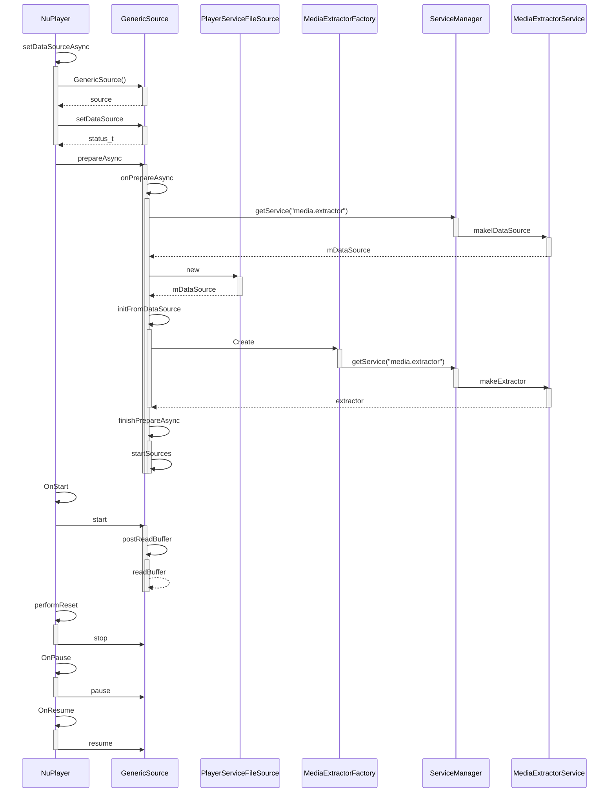

# NuPlayer源码分析之解封装模块

> 本文内容的源码全摘录自[android14-qpr3-release](https://cs.android.com/android/platform/superproject/+/android14-qpr3-release:)，悉知！

## NuPlayer/setDataSourceAsync

上一篇文章中，我们提到，在`NuPlayer`的`setDataSourceAsync`函数中创建了`GenericSource`对象。并调用了`setDataSource`函数。回顾一下：

```c++
//frameworks/av/media/libmediaplayerservice/nuplayer/NuPlayer.cpp
void NuPlayer::setDataSourceAsync(int fd, int64_t offset, int64_t length) {
    sp<AMessage> msg = new AMessage(kWhatSetDataSource, this);// 新建消息，这属于常规操作了
    sp<AMessage> notify = new AMessage(kWhatSourceNotify, this);// 新建消息，用于和解封装模块通信，类似于一种listener的功能
    sp<GenericSource> source = 
      new GenericSource(notify, mUIDValid, mUID, mMediaClock);// 创建解封装器
    ALOGV("setDataSourceAsync fd %d/%lld/%lld source: %p",
            fd, (long long)offset, (long long)length, source.get());
    status_t err = source->setDataSource(fd, offset, length);// 为GenericSource设置媒体源
    if (err != OK) {
        ALOGE("Failed to set data source!");
        source = NULL;
    }
    msg->setObject("source", source);
    msg->post();// 将创建并设置好的setDataSource，post给下一个流程处理
    mDataSourceType = DATA_SOURCE_TYPE_GENERIC_FD;
}
```

这段代码中，首次创建了一个GenericSource实例并设置数据源，依次来看这两个函数。

### NuPlayer/GenericSource/GenericSource

```c++
//frameworks/av/media/libmediaplayerservice/nuplayer/GenericSource.cpp
NuPlayer::GenericSource::GenericSource(
        const sp<AMessage> &notify,
        bool uidValid,
        uid_t uid,
        const sp<MediaClock> &mediaClock)
    : Source(notify),// 将一个AMessage对象存放在父类Source的mNotify字段中，这是个通用操作，用来通知调用者，当前资源状态的。
      mAudioTimeUs(0),
      mAudioLastDequeueTimeUs(0),
      mVideoTimeUs(0),
      mVideoLastDequeueTimeUs(0),
      mPrevBufferPercentage(-1),
      mPollBufferingGeneration(0),
      mSentPauseOnBuffering(false),
      mAudioDataGeneration(0),
      mVideoDataGeneration(0),
      mFetchSubtitleDataGeneration(0),
      mFetchTimedTextDataGeneration(0),
      mDurationUs(-1LL),
      mAudioIsVorbis(false),// 音频是否为Vorbis压缩格式，默认为false
      mIsSecure(false),
      mIsStreaming(false),
      mUIDValid(uidValid),
      mUID(uid),
      mMediaClock(mediaClock),
      mBitrate(-1LL),// 比特率
      mPendingReadBufferTypes(0) {
    ALOGV("GenericSource");
    CHECK(mediaClock != NULL);//断言检查

    mBufferingSettings.mInitialMarkMs = kInitialMarkMs;//初始缓冲标记
    mBufferingSettings.mResumePlaybackMarkMs = kResumePlaybackMarkMs;//恢复播放标记
    resetDataSource();
}
```

者段代码初始化了该类的各个成员变量，包括音频和视频的时间戳、缓冲百分比等。构造函数还设置了一些标志变量，如是否为 Vorbis 音频、是否为安全流等，并对传入的参数进行赋值。在初始化过程中，还进行了日志输出和断言检查，最后设置了缓冲设置并重置了数据源。整体来说，这段代码确保了 `NuPlayer::GenericSource` 实例在创建时被正确初始化和准备好处理后续操作。

### NuPlayer/GenericSource/setDataSource

```c++
//frameworks/av/media/libmediaplayerservice/nuplayer/GenericSource.cpp
status_t NuPlayer::GenericSource::setDataSource(
        int fd, int64_t offset, int64_t length) {
    Mutex::Autolock _l(mLock);
    ALOGV("setDataSource %d/%lld/%lld (%s)", fd, (long long)offset, (long long)length, nameForFd(fd).c_str());
    resetDataSource();// 重置一些DataSource数据到初始状态
    mFd.reset(dup(fd));// 将文件的句柄复制一份给mFd字段
    mOffset = offset;// 数据的偏移量
    mLength = length;// 文件长度
    //数据源的实际创建被延迟到 `prepareAsync()` 方法中，以避免在 `setDataSource` 中阻塞调用线程太长时间。
    return OK;
}
```

可以看到，setDataSource除了将媒体文件相关参数保存下来外，并没有做其他的工作。看看`resetDataSource`干了啥：

```
//frameworks/av/media/libmediaplayerservice/nuplayer/GenericSource.cpp
void NuPlayer::GenericSource::resetDataSource() {
    ALOGV("resetDataSource");
    mHTTPService.clear();
    {
        Mutex::Autolock _l_d(mDisconnectLock);
        mHttpSource.clear();
        mDisconnected = false;
    }
    mUri.clear();
    mUriHeaders.clear();
    mSources.clear();
    mFd.reset();
    mOffset = 0;
    mLength = 0;
    mStarted = false;
    mPreparing = false;

    mIsDrmProtected = false;
    mIsDrmReleased = false;
    mIsSecure = false;
    mMimes.clear();
}
```

这个函数用于将数据源对象的各个属性和状态重置为初始状态，包括清空HTTP服务、重置HTTP源、清空URI和相关头部信息、重置文件描述符和偏移量、标志位复位等操作，以确保数据源处于初始可用状态。


## NuPlayer/GenericSource/prepareAsync

```c++
//frameworks/av/media/libmediaplayerservice/nuplayer/GenericSource.cpp
void NuPlayer::GenericSource::prepareAsync() {
    Mutex::Autolock _l(mLock);
    ALOGV("prepareAsync: (looper: %d)", (mLooper != NULL));
    if (mLooper == NULL) {// 创建looper并启动AHandler循环
        mLooper = new ALooper;
        mLooper->setName("generic");
        mLooper->start();
        mLooper->registerHandler(this);
    }
    sp<AMessage> msg = new AMessage(kWhatPrepareAsync, this);
    msg->post();
}

void NuPlayer::GenericSource::onMessageReceived(const sp<AMessage> &msg) {
    Mutex::Autolock _l(mLock);
    switch (msg->what()) {
      case kWhatPrepareAsync:
      {
          onPrepareAsync();
          break;
      }
```

GenericSource类通过继承`NuPlayer::Source`间接继承了AHandler，用于处理消息。这些都说明GenericSource的函数会有部分是异步的，函数名中`prepareAsync`中的Async也表明了这一点。关于AHandler、ALooper和AMessage不了解的话，直接看大佬总结：[Android媒体底层通信框架Native Handler](https://blog.csdn.net/qq_25333681/article/details/89289411)。

### NuPlayer/GenericSource/onPrepareAsync

```c++
//frameworks/av/media/libmediaplayerservice/nuplayer/GenericSource.cpp
void NuPlayer::GenericSource::onPrepareAsync() {// 该函数运行在looper所在的子线程中
    mDisconnectLock.lock();
    ALOGV("onPrepareAsync: mDataSource: %d", (mDataSource != NULL));
    // delayed data source creation
    if (mDataSource == NULL) {// 第一次进来，mDataSource肯定为空
        mIsSecure = false;// 先设置为false，如果extractor返回为安全，再设置为true.
        if (!mUri.empty()) {// 因为是本地文件，所以mUri不用初始化，自然为空。
              // 略掉网络媒体源创建DataSource相关代码。
        } else {// 处理本地媒体文件源
            //省略MediaExtractor服务获取DataSource
            if (mDataSource == nullptr) {// 如果没有从extractor服务中成功获取DataSource就自己创建
                ALOGD("FileSource local");
                mDataSource = new PlayerServiceFileSource(dup(mFd.get()), mOffset, mLength);
            }
        }

        if (mDataSource == NULL) {
            ALOGE("Failed to create data source!");
            mDisconnectLock.unlock();
            notifyPreparedAndCleanup(UNKNOWN_ERROR);
            return;
        }
    }

    if (mDataSource->flags() & DataSource::kIsCachingDataSource) {// 检查数据源是否是缓存数据源，如果是，则将其转换为 NuCachedSource2 类型的数据源。
        mCachedSource = static_cast<NuCachedSource2 *>(mDataSource.get());
    }

    mDisconnectLock.unlock();

    // For cached streaming cases, we need to wait for enough
    // buffering before reporting prepared.
    mIsStreaming = (mCachedSource != NULL);

    // init extractor from data source
    status_t err = initFromDataSource();

    if (err != OK) {
        ALOGE("Failed to init from data source!");
        notifyPreparedAndCleanup(err);
        return;
    }

    if (mVideoTrack.mSource != NULL) {
        sp<MetaData> meta = getFormatMeta_l(false /* audio */);
        sp<AMessage> msg = new AMessage;
        err = convertMetaDataToMessage(meta, &msg);
        if(err != OK) {
            notifyPreparedAndCleanup(err);
            return;
        }
        notifyVideoSizeChanged(msg);
    }

    notifyFlagsChanged(
            // FLAG_SECURE will be known if/when prepareDrm is called by the app
            // FLAG_PROTECTED will be known if/when prepareDrm is called by the app
            FLAG_CAN_PAUSE |
            FLAG_CAN_SEEK_BACKWARD |
            FLAG_CAN_SEEK_FORWARD |
            FLAG_CAN_SEEK);

    finishPrepareAsync();

    ALOGV("onPrepareAsync: Done");
}
```

从函数代码中可以看出，该函数唯一的目的就是为了初始化mDataSource，主要的初始化方式有两个：1.从MediaExtractorService服务中获取。2.如果第一步未能初始化成功，直接自己创建一个`new FileSource`。上面省略了方法1的代码，接下来我们拿出来单独分析。

#### MediaExtractorService

```c++
if ( property_get_bool( "media.stagefright.extractremote", true ) &&!PlayerServiceFileSource::requiresDrm(
	     mFd.get(), mOffset, mLength, nullptr /* mime */ ) )
{
  // 通过Binder机制，获取"media.extractor"服务的远程代理
	sp<IBinder> binder = defaultServiceManager()->getService( String16( "media.extractor" ) );
	if ( binder != nullptr )
	{
		ALOGD( "FileSource remote" );
    // 强转为IMediaExtractorService对象指针
		sp<IMediaExtractorService> mediaExService(interface_cast<IMediaExtractorService>( binder ) );
		sp<IDataSource> source;
    // 调用服务的代理对象接口，获取IDataSource对象指针
		mediaExService->makeIDataSource( base::unique_fd( dup( mFd.get() ) ), mOffset, mLength, &source );
		ALOGV( "IDataSource(FileSource): %p %d %lld %lld", source.get(), 
          mFd.get(), (long long) mOffset, (long long) mLength );
		if ( source.get() != nullptr )
		{
      // 通过获取IDataSource对象指针初始化mDataSource
			mDataSource = CreateDataSourceFromIDataSource( source );
		} else {
			ALOGW( "extractor service cannot make data source" );
		}
	} else {
		ALOGW( "extractor service not running" );
	}
}
```

这里是基本的系统服务调用，不懂的可以去看[Android 11添加系统服务](Android 11添加系统服务.md)。可以来深入一下这个服务干了啥，先看makeIDataSource：

```c++
//frameworks/av/services/mediaextractor/MediaExtractorService.cpp
::android::binder::Status MediaExtractorService::makeIDataSource(
        base::unique_fd fd,
        int64_t offset,
        int64_t length,
        ::android::sp<::android::IDataSource>* _aidl_return) {
    sp<DataSource> source = DataSourceFactory::getInstance()->CreateFromFd(fd.release(), offset, length);
    *_aidl_return = CreateIDataSourceFromDataSource(source);// 将sp<DataSource>转换成sp<IDataSource>
    return binder::Status::ok();
}
```

```c++
//frameworks/av/media/libdatasource/DataSourceFactory.cpp
sp<DataSource> DataSourceFactory::CreateFromFd(int fd, int64_t offset, int64_t length) {
    sp<FileSource> source = new FileSource(fd, offset, length);// 创建文件源
    return source->initCheck() != OK ? nullptr : source;// 检查 mFd >= 0
}
```

接下来看CreateDataSourceFromIDataSource：

```c++
//frameworks/av/media/libstagefright/InterfaceUtils.cpp
sp<DataSource> CreateDataSourceFromIDataSource(const sp<IDataSource> &source) {
    if (source == nullptr) {
        return nullptr;
    }
    return new TinyCacheSource(new CallbackDataSource(source));
}
```

- `CallbackDataSource`：实现了`DataSource`接口（实现关系），但它的私有字段`mIDataSource`中，保留了`IDataSource`（服务端`DataSource`）的引用（组合关系），让Client端程序可以回调到server端的`DataSource`对象，从而具备了”回调“功能。
- `TinyCacheSource`：该类实现了`DataSource`接口（实现关系），在私有字段`mSource`中可以持有`DataSource`的引用，这个引用通常是用来存放`CallbackDataSource`对象的，所以和`CallbackDataSource`形成了组合关系。另外，该类中还有一个用于缓存的数组`mCache[kCacheSize]`，对于小于`kCacheSize`的读取，它将提前读取并缓存在`mCache`中，这不仅极大减少了Client端到Server端的数据读取操作，对提高数据类型嗅探和元数据`metadata`的提取也有较高效率。

综合来说，这段代码的作用是创建一个具有缓存和回调功能的 `DataSource` 对象，通过将 `CallbackDataSource` 嵌套在 `TinyCacheSource` 中实现这一目的。

#### NuPlayer/GenericSource/initFromDataSource

回到`onPrepareAsync`中，继续往下走。接下来分析一下这段调用中最重要的函数之一`initFromDataSource`：

```c++
//frameworks/av/media/libmediaplayerservice/nuplayer/GenericSource.cpp
status_t NuPlayer::GenericSource::initFromDataSource() {
    sp<IMediaExtractor> extractor;
    sp<DataSource> dataSource;
    {
        Mutex::Autolock _l_d(mDisconnectLock);
        dataSource = mDataSource; // 获取数据源
    }
    CHECK(dataSource != NULL); // 确保数据源不为空

    mLock.unlock(); // 解锁

    // 创建媒体提取器
    extractor = MediaExtractorFactory::Create(dataSource, NULL);

    if (extractor == NULL) {
        ALOGE("initFromDataSource, cannot create extractor!");
        mLock.lock();
        return UNKNOWN_ERROR; // 提取器创建失败
    }

    sp<MetaData> fileMeta = extractor->getMetaData(); // 获取文件元数据

    size_t numtracks = extractor->countTracks(); // 获取轨道数
    if (numtracks == 0) {
        ALOGE("initFromDataSource, source has no track!");
        mLock.lock();
        return UNKNOWN_ERROR; // 没有轨道信息
    }

    mLock.lock();

    mFileMeta = fileMeta; // 存储文件元数据
    if (mFileMeta != NULL) {
        int64_t duration;
        if (mFileMeta->findInt64(kKeyDuration, &duration)) {
            mDurationUs = duration; // 存储时长信息
        }
    }

    int32_t totalBitrate = 0;

    mMimes.clear(); // 清空 MIME 类型容器

    for (size_t i = 0; i < numtracks; ++i) {
        sp<IMediaSource> track = extractor->getTrack(i); // 获取轨道
        if (track == NULL) {
            continue;
        }

        sp<MetaData> meta = extractor->getTrackMetaData(i); // 获取轨道元数据
        if (meta == NULL) {
            ALOGE("no metadata for track %zu", i);
            return UNKNOWN_ERROR;
        }

        const char *mime;
        CHECK(meta->findCString(kKeyMIMEType, &mime)); // 获取 MIME 类型

        // 处理音频轨道
        if (!strncasecmp(mime, "audio/", 6)) {
            if (mAudioTrack.mSource == NULL) {
                // 创建音频轨道相关信息
                mAudioTrack.mIndex = i;
                mAudioTrack.mSource = track;
                mAudioTrack.mPackets = new AnotherPacketSource(mAudioTrack.mSource->getFormat());

                if (!strcasecmp(mime, MEDIA_MIMETYPE_AUDIO_VORBIS)) {
                    mAudioIsVorbis = true;
                } else {
                    mAudioIsVorbis = false;
                }

                mMimes.add(String8(mime)); // 添加 MIME 类型
            }
        } 
        // 处理视频轨道
        else if (!strncasecmp(mime, "video/", 6)) {
            if (mVideoTrack.mSource == NULL) {
                // 创建视频轨道相关信息
                mVideoTrack.mIndex = i;
                mVideoTrack.mSource = track;
                mVideoTrack.mPackets = new AnotherPacketSource(mVideoTrack.mSource->getFormat());

                mMimes.insertAt(String8(mime), 0); // 插入 MIME 类型
            }
        }

        mSources.push(track); // 将轨道添加到容器中
        int64_t durationUs;
        if (meta->findInt64(kKeyDuration, &durationUs)) {
            if (durationUs > mDurationUs) {
                mDurationUs = durationUs; // 更新最大时长
            }
        }

        int32_t bitrate;
        if (totalBitrate >= 0 && meta->findInt32(kKeyBitRate, &bitrate)) {
            totalBitrate += bitrate; // 计算总比特率
        } else {
            totalBitrate = -1;
        }
    }

    ALOGV("initFromDataSource mSources.size(): %zu  mIsSecure: %d  mime[0]: %s", mSources.size(),
            mIsSecure, (mMimes.isEmpty() ? "NONE" : mMimes[0].c_str()));

    if (mSources.size() == 0) {
        ALOGE("b/23705695");
        return UNKNOWN_ERROR; // 没有轨道信息
    }

    // Modular DRM: The return value doesn't affect source initialization.
    (void)checkDrmInfo(); // 检查 DRM 信息

    mBitrate = totalBitrate; // 存储总比特率

    return OK; // 初始化成功
}

```

这个函数咋一看很多，其实最主要的就是创建媒体提取器，这里来简单分析一下他的执行流程：

```c++
//frameworks/av/media/libstagefright/MediaExtractorFactory.cpp
sp<IMediaExtractor> MediaExtractorFactory::Create(
        const sp<DataSource> &source, const char *mime) {
    ALOGV("MediaExtractorFactory::Create %s", mime);

    if (!property_get_bool("media.stagefright.extractremote", true)) {
        // local extractor
        ALOGW("creating media extractor in calling process");
        return CreateFromService(source, mime);
    } else {
        // remote extractor
        ALOGV("get service manager");
        sp<IBinder> binder = defaultServiceManager()->getService(String16("media.extractor"));

        if (binder != 0) {
            sp<IMediaExtractorService> mediaExService(
                    interface_cast<IMediaExtractorService>(binder));
            sp<IMediaExtractor> ex;
            mediaExService->makeExtractor(
                    CreateIDataSourceFromDataSource(source),
                    mime ? std::optional<std::string>(mime) : std::nullopt,
                    &ex);
            return ex;
        } else {
            ALOGE("extractor service not running");
            return NULL;
        }
    }
    return NULL;
}
```

这里主要是通过远程服务`media.extractor`创建一个MediaExtractor返回。然后调用他的`makeExtractor`方法。接着看：

```
//frameworks/av/services/mediaextractor/MediaExtractorService.cpp
::android::binder::Status MediaExtractorService::makeExtractor(
        const ::android::sp<::android::IDataSource>& remoteSource,
        const ::std::optional< ::std::string> &mime,
        ::android::sp<::android::IMediaExtractor>* _aidl_return) {
    ALOGV("@@@ MediaExtractorService::makeExtractor for %s", mime ? mime->c_str() : nullptr);
		// 通过获取IDataSource对象指针初始化mDataSource
    sp<DataSource> localSource = CreateDataSourceFromIDataSource(remoteSource);

    MediaBuffer::useSharedMemory();
    sp<IMediaExtractor> extractor = MediaExtractorFactory::CreateFromService(
            localSource,
            mime ? mime->c_str() : nullptr);
    ALOGV("extractor service created %p (%s)",
            extractor.get(),
            extractor == nullptr ? "" : extractor->name());
    if (extractor != nullptr) {
        registerMediaExtractor(extractor, localSource, mime ? mime->c_str() : nullptr);
    }
    *_aidl_return = extractor;
    return binder::Status::ok();
}
```

`CreateDataSourceFromIDataSource`之前已经熟悉了，主要说说`CreateFromService`这个函数做了什么，就不往下展开了。它根据给定的数据源和`MIME`类型自动检测媒体内容，创建对应的媒体提取器实例，并返回一个 `IMediaExtractor` 接口的智能指针。让我们回到`initFromDataSource`中，经过`MediaExtractorFactory`创建了`extractor`后，后面就是从中取出并填入各种信息。

#### NuPlayer/GenericSource/finishPrepareAsync

扯了这么多，才把`initFromDataSource`搞完，赶紧看一下最后一个函数：

```c++
//frameworks/av/media/libmediaplayerservice/nuplayer/GenericSource.cpp
void NuPlayer::GenericSource::finishPrepareAsync() {
    // 打印调试信息
    ALOGV("finishPrepareAsync");
    // 启动数据源
    status_t err = startSources();
    if (err != OK) {
        // 启动数据源失败，记录错误并通知准备完成并清理操作
        ALOGE("Failed to init start data source!");
        notifyPreparedAndCleanup(err);
        return;
    }
    if (mIsStreaming) {
        // 如果是流媒体播放
        mCachedSource->resumeFetchingIfNecessary(); // 恢复数据获取（如果需要）
        mPreparing = true; // 设置准备状态
        schedulePollBuffering(); // 调度缓冲区轮询
    } else {
        // 如果不是流媒体播放，通知准备完成
        notifyPrepared();
    }
    if (mAudioTrack.mSource != NULL) {
        // 如果存在音频轨道，向音频轨道发送读取缓冲区请求
        postReadBuffer(MEDIA_TRACK_TYPE_AUDIO);
    }
    if (mVideoTrack.mSource != NULL) {
        // 如果存在视频轨道，向视频轨道发送读取缓冲区请求
        postReadBuffer(MEDIA_TRACK_TYPE_VIDEO);
    }
}

```

这里可能会觉得很奇怪，为什么在`finishPrepareAsync`结束的时候开始读取数据了。其实，在准备阶段完成后立即开始读取数据是一种常见的做法，特别是对于实时流媒体或需要快速响应用户操作的应用程序。这样可以确保数据源能够及时提供数据，减少播放器的启动延迟，提升用户体验。所以这里的`postReadBuffer`放到下面的`start`里面去详解。

## NuPlayer/GenericSource/start

```c++
//frameworks/av/media/libmediaplayerservice/nuplayer/GenericSource.cpp
void NuPlayer::GenericSource::start() {
    Mutex::Autolock _l(mLock);
    ALOGI("start");
    if (mAudioTrack.mSource != NULL) {
        postReadBuffer(MEDIA_TRACK_TYPE_AUDIO);
    }
    if (mVideoTrack.mSource != NULL) {
        postReadBuffer(MEDIA_TRACK_TYPE_VIDEO);
    }
    mStarted = true;
}
```

`postReadBuffer`函数其实做的事情不多，就是把`trackType`一路向下异步传递，最后让`NuPlayer::GenericSource::readBuffer`摘桃子，调用链如下：`postReadBuffer` => `onMessageReceived` => `onReadBuffer` => `readBuffer`。

```c++
//frameworks/av/media/libmediaplayerservice/nuplayer/GenericSource.cpp
void NuPlayer::GenericSource::readBuffer(
        media_track_type trackType, int64_t seekTimeUs, MediaPlayerSeekMode mode,
        int64_t *actualTimeUs, bool formatChange) {
    Track *track; // 轨道指针
    size_t maxBuffers = 1; // 最大缓冲区数，默认为1
    switch (trackType) {// 根据track类型分配最大buffer，并初始化track
        case MEDIA_TRACK_TYPE_VIDEO:
            track = &mVideoTrack; // 视频轨道
            maxBuffers = 8;  // 视频缓冲区最大数，过大的数值可能影响定位
            break;
        case MEDIA_TRACK_TYPE_AUDIO:
            track = &mAudioTrack; // 音频轨道
            maxBuffers = 64; // 音频缓冲区最大数
            break;
        case MEDIA_TRACK_TYPE_SUBTITLE:
            track = &mSubtitleTrack; // 字幕轨道
            break;
        case MEDIA_TRACK_TYPE_TIMEDTEXT:
            track = &mTimedTextTrack; // 定时文本轨道
            break;
        default:
            TRESPASS(); // 默认情况下终止程序
    }
    //...忽略不重要的代码
    for (size_t numBuffers = 0; numBuffers < maxBuffers; ) {
        Vector<MediaBufferBase *> mediaBuffers; // 媒体缓冲区向量
        status_t err = NO_ERROR; // 错误状态
        sp<IMediaSource> source = track->mSource; // 轨道源
        mLock.unlock(); // 解锁互斥锁
        if (couldReadMultiple) {// 多次读取媒体数据
            err = source->readMultiple(
                    &mediaBuffers, maxBuffers - numBuffers, &options); 
        } else {// 单次去读取媒体数据
            MediaBufferBase *mbuf = NULL;
            err = source->read(&mbuf, &options); // 读取媒体数据
            if (err == OK && mbuf != NULL) {
                mediaBuffers.push_back(mbuf); // 将读取的数据加入缓冲区向量
            }
        }
        mLock.lock(); // 再次加锁
        //...忽略不重要的代码

        for (; id < count; ++id) {// 将所有刚才读到的MediaBuffer中的数据摘出来封装到mPackets中
            int64_t timeUs;
            MediaBufferBase *mbuf = mediaBuffers[id];
            if (!mbuf->meta_data().findInt64(kKeyTime, &timeUs)) {
                mbuf->meta_data().dumpToLog(); // 记录元数据
                track->mPackets->signalEOS(ERROR_MALFORMED); // 发送格式错误信号
                break;
            }
            if (trackType == MEDIA_TRACK_TYPE_AUDIO) {
                mAudioTimeUs = timeUs; // 设置音频时间戳
            } else if (trackType == MEDIA_TRACK_TYPE_VIDEO) {
                mVideoTimeUs = timeUs; // 设置视频时间戳
            }
            queueDiscontinuityIfNeeded(seeking, formatChange, trackType, track); // 根据需要排队不连续性
            sp<ABuffer> buffer = mediaBufferToABuffer(mbuf, trackType); // 将媒体缓冲区转换为ABuffer
            if (numBuffers == 0 && actualTimeUs != nullptr) {
                *actualTimeUs = timeUs; // 设置实际时间为当前时间
            }
          	//...忽略不重要的代码
            track->mPackets->queueAccessUnit(buffer); // 将数据包入队
            formatChange = false;
            seeking = false;
            ++numBuffers;
        }
      	//...忽略不重要的代码
    }
    //...忽略不重要的代码
}
```

这里总结一下`readBuffer`这个函数的工作流程：首先确定要处理的轨道类型，并设置相应的最大缓冲区数。它检查轨道的源是否存在，若为空则直接返回。根据传入的定位时间参数，设置定位时间。然后，根据轨道类型设置读取数据的选项，并处理定位、多次读取、数据转换等操作。在读取数据的过程中，会处理时间戳、不连续性、数据转换等。最后，根据播放状态，通知准备完成或恢复播放。在处理可能的错误情况时，会处理阻塞状态、格式变化和其他错误，并发送相应的信号。整体流程涵盖了从媒体源读取数据到处理和根据播放状态进行操作的完整过程。

==需要注意的是：解封装模块的start函数和NuPlayer的start功能并不相同，NuPlayer的start函数是播放，而解封装模块的start函数则是加载数据，后者是前者的子集。==

## stop&pause&resume

==注意：播放器的暂停：表示的是暂停播放；解封装模块的暂停：表示暂停将读取并缓存好的数据提供给播放器，这一点同样适用于停止，回复和start则相反。==

```c++
//frameworks/av/media/libmediaplayerservice/nuplayer/GenericSource.cpp
void NuPlayer::GenericSource::stop() {
    Mutex::Autolock _l(mLock);
    mStarted = false;
}
void NuPlayer::GenericSource::pause() {
    Mutex::Autolock _l(mLock);
    mStarted = false;
}
void NuPlayer::GenericSource::resume() {
    Mutex::Autolock _l(mLock);
    mStarted = true;
}
```

停止、暂停、恢复几个动作，相关函数中仅是改变mStarted，其它几乎什么事情都没做。所以，不管是停止、暂停还是回复的函数，关键都不在函数本身，而在于mStarted变量对于向外提供数据的函数的影响，也就是`dequeueAccessUnit`。该函数在播放过程中扮演着关键的角色，负责从媒体源中提取、准备和传递媒体数据单元，为音频和视频的解码和播放提供必要的支持。

```c++
//frameworks/av/media/libmediaplayerservice/nuplayer/GenericSource.cpp
status_t NuPlayer::GenericSource::dequeueAccessUnit(
        bool audio, sp<ABuffer> *accessUnit) {
    Mutex::Autolock _l(mLock);
    if (!mStarted && mIsDrmReleased) {
        return -EWOULDBLOCK;
    }
  //...
}
```

# 总结

最后总结一下简单的调用时序图，本篇结束撒花🎉。请看下一篇[NuPlayer源码分析之解码模块](NuPlayer源码分析之解码模块.md)




# 参考文献

https://www.cnblogs.com/rongmiao/p/15986408.html

https://blog.csdn.net/liuning1985622/article/details/138505877

https://blog.csdn.net/qq_25333681/article/details/90614193