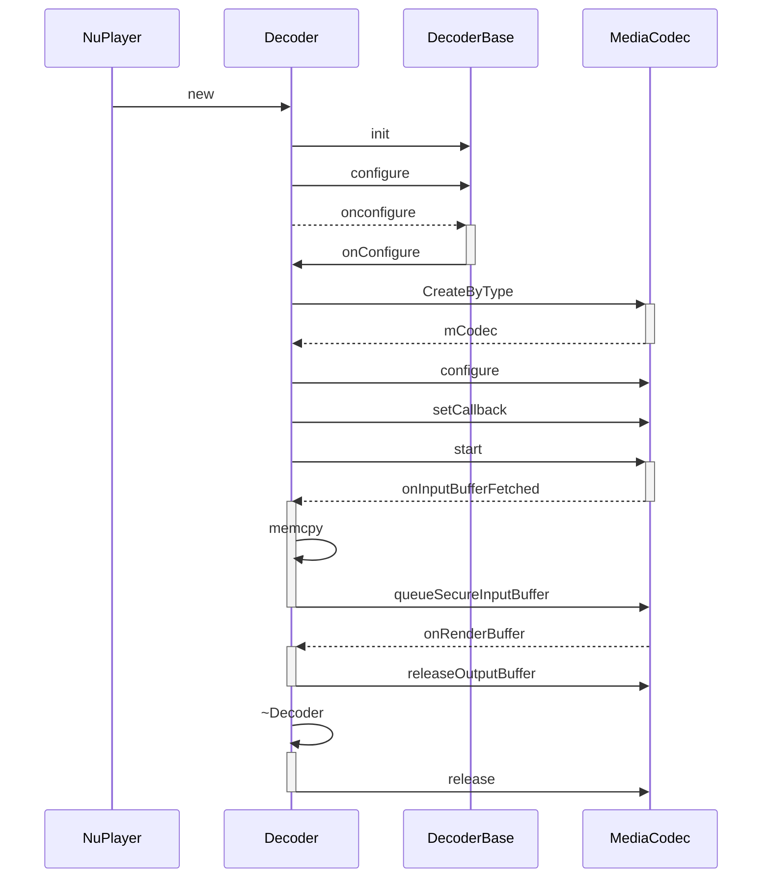

# NuPlayer源码分析之解码模块

## NuPlayer/instantiateDecoder

解码器创建的入口在NuPlayer的`NuPlayer::instantiateDecoder`，调用关系为`NuPlayer::OnStart` => `postScanSources` => `instantiateDecoder`。本文从`instantiateDecoder`这个函数开始分析：

```c++
//frameworks/av/media/libmediaplayerservice/nuplayer/NuPlayer.cpp
status_t NuPlayer::instantiateDecoder(bool audio, sp<DecoderBase> *decoder, bool checkAudioModeChange)
{
    /* 检查是否已经存在解码器或者音频正在被停止，如果是则直接返回OK */
    //...
    // 忽略获取媒体格式信息、检查代码...
    if (!audio)
    { // 如果是视频
        //...
        /* 创建字幕解码器 */
        sp<AMessage> ccNotify = new AMessage(kWhatClosedCaptionNotify, this);
        if (mCCDecoder == NULL)
        {
            mCCDecoder = new CCDecoder(ccNotify);
        }
        //...
    }
    //...
    if (audio)
    {// 如果是音频
        sp<AMessage> notify = new AMessage(kWhatAudioNotify, this);
        //...
        *decoder = new DecoderPassThrough(notify, mSource, mRenderer);
        //...
    }
    else
    {
        sp<AMessage> notify = new AMessage(kWhatVideoNotify, this);
        //...
        *decoder = new Decoder(notify, mSource, mPID, mUID, mRenderer, mSurface, mCCDecoder);
        //...
    }
    /* 初始化解码器 */
    (*decoder)->init();
    //...
    /* 配置解码器 */
    (*decoder)->configure(format);
    /* 设置视频参数 */
    if (!audio)
    {
        sp<AMessage> params = new AMessage();
        //...
            (*decoder)->setParameters(params);
        //...
    }
    return (OK);
}
```

可以看到创建音频和视频的解码器，参数略有不同，创建视频解码器是会多出一个`mSurface`，提供给`MediaCodec`以显示视频，`mCCDecoder`则是字幕相关解码器。

### NuPlayer/Decoder/Decoder

接下来看解码器的构造函数：

```c++
//frameworks/av/media/libmediaplayerservice/nuplayer/NuPlayerDecoder.cpp
NuPlayer::Decoder::Decoder(
        const sp<AMessage> &notify,
        const sp<Source> &source,
        pid_t pid,
        uid_t uid,
        const sp<Renderer> &renderer,
        const sp<Surface> &surface,
        const sp<CCDecoder> &ccDecoder)
    : DecoderBase(notify),
      mSurface(surface),
      mSource(source),
      mRenderer(renderer),// 渲染器
      mCCDecoder(ccDecoder),
      //...
      mComponentName("decoder") {
    mCodecLooper = new ALooper;
    mCodecLooper->setName("NPDecoder-CL");
    mCodecLooper->start(false, false, ANDROID_PRIORITY_AUDIO);
    mVideoTemporalLayerAggregateFps[0] = mFrameRateTotal;
}
```

构造函数基本上就是将传递进来的参数，直接保存到自己的各类变量中，功能后续使用。

### NuPlayer/DecoderBase/init

再来看看关于解码器的第二个操作：`(*decoder)->init();`，这里发现`Decoder`中并没有`init`函数，所以要向上去找。由于`Decoder`继承于`DecoderBase`，很快可以从中找到`init`：

```
//frameworks/av/media/libmediaplayerservice/nuplayer/NuPlayerDecoderBase.cpp
void NuPlayer::DecoderBase::init() {
    mDecoderLooper->registerHandler(this);
}
```

这里的`mDecoderLooper`的创建是在`DecoderBase`的构造函数中：

```c++
//frameworks/av/media/libmediaplayerservice/nuplayer/NuPlayerDecoderBase.cpp
NuPlayer::DecoderBase::DecoderBase(const sp<AMessage> &notify)
    :  mNotify(notify),
       mBufferGeneration(0),
       mPaused(false),
       mStats(new AMessage),
       mRequestInputBuffersPending(false) {
    mDecoderLooper = new ALooper;
    mDecoderLooper->setName("NPDecoder");
    mDecoderLooper->start(false, false, ANDROID_PRIORITY_AUDIO);
}
```

在`DecoderBase`的构造函数中，已经创建了一套`NativeHandler`体系，并将`Looper`启动，只是没有将`AHandler`的子类对象和`ALooper`绑定，直到`init()`函数执行后，这种绑定关系才算结束。也只有这样，`DecoderBase`中的`NativeHandler`体系才能够正常工作。有关`NativeHandler`的详细信息，请参考：[NativeHandler系列](https://blog.csdn.net/qq_25333681/article/details/89289411)。

==这段代码中的注释解释了为什么每个解码器都有自己的 looper。在这里，因为 MediaCodec 操作是阻塞的，为了确保解码器操作不会阻塞 NuPlayer 的其他操作，每个解码器都有自己的 looper 来处理解码器操作，以保持 NuPlayer 的异步操作。==

### NuPlayer/Decoder/onConfigure

再回到`instantiateDecoder`中，来看看和解码相关的最重要的一步操作：`(*decoder)->configure(format);`。同理`configure`方法也是在`DecoderBase`中的，但是会通过`DecoderBase::configure`=>`DecoderBase::onconfigure`=>`Decoder::onConfigure`调用链回到`Decoder`中去。

```c++
//frameworks/av/media/libmediaplayerservice/nuplayer/NuPlayerDecoder.cpp
void NuPlayer::Decoder::onConfigure(const sp<AMessage> &format)
{
    //...
    // 根据类型创建解码器
    mCodec = MediaCodec::CreateByType(
        mCodecLooper, mime.c_str(), false /* encoder */, NULL /* err */, mPid, mUid, format);
    //...
    err = mCodec->configure( format, mSurface, crypto, 0 /* flags */);// 配置解码器
    //...
    sp<AMessage> reply = new AMessage(kWhatCodecNotify, this);
    mCodec->setCallback(reply);// 设置解码器回调
    err = mCodec->start();// 启动解码器
    //...
}
```

从简化后的代码可以看到， 在`onConfigure`函数中，有关`MediaCodec`的调用都是比较经典的调用方式。分别有，`MediaCodec`的创建、配置、设置回调通知、启动解码器。自此`MediaCodec`就被创建并启动了，后面详细学`MediaCodec`会专门出一期关于它的工作流程。接下来看下`MediaCodec`被启动后经过回调`Decoder`不断地填充数据到解码队列。回调的调用链是**MediaCodec**=>**onMessageReceived**=>**handleAnInputBuffer**=>**onInputBufferFetched**。

```c++
//frameworks/av/media/libmediaplayerservice/nuplayer/NuPlayerDecoder.cpp
bool NuPlayer::Decoder::onInputBufferFetched(const sp<AMessage> &msg) {
    //...
    bool hasBuffer = msg->findBuffer("buffer", &buffer);// 填充通解封装模块获取的数据
    bool needsCopy = true;// 是否需要将数据拷贝给MediaCodec

    if (buffer == NULL) {
		// 没有buffer了...
    } else {
        //...
        // 复制到解码器缓冲区
        if (needsCopy) {
              //...
              if (buffer->data() != NULL) {
                  codecBuffer->setRange(0, buffer->size());
                  memcpy(codecBuffer->data(), buffer->data(), buffer->size());
              } 
          		//...
            } // buffer->data()
        } // needsCopy

        status_t err;
        AString errorDetailMsg;
        if (cryptInfo != NULL) {
            err = mCodec->queueSecureInputBuffer(// 将buffer加入到MediaCodec的待解码队列中
                    bufferIx,
                    codecBuffer->offset(),
                    cryptInfo->subSamples,
                    cryptInfo->numSubSamples,
                    cryptInfo->key,
                    cryptInfo->iv,
                    cryptInfo->mode,
                    cryptInfo->pattern,
                    timeUs,
                    flags,
                    &errorDetailMsg);
            // 同步调用，因此在此处处理cryptInfo
            free(cryptInfo);
        }
  		  //...
    }   // buffer != NULL
    return true;
}
```

这个函数的核心，就是调用`MediaCodec`的`queueInputBuffer`函数，将填充好的`MediaCodecBuffer`添加到`MediaCodec`的输入队列中，等待解码。

## NuPlayer/Decoder/onRenderBuffer

`MediaCodec`将输入队列中的数据解码后放入输出队列，`Decoder`通过执行对应的回调函数`onRenderBuffer`来渲染数据。在`NuPlayer::Decoder`中回调函数执行链条为：**onMessageReceived** => **handleAnOutputBuffer** => **onRenderBuffer**。

==注意：**onRenderBuffer**和**onInputBufferFetched**的执行几乎是同时的。==

```c++
//frameworks/av/media/libmediaplayerservice/nuplayer/NuPlayerDecoder.cpp
void NuPlayer::Decoder::onRenderBuffer(const sp<AMessage> &msg) {
    //...
    if (msg->findInt32("render", &render) && render) {
        int64_t timestampNs;
        CHECK(msg->findInt64("timestampNs", &timestampNs));
        err = mCodec->renderOutputBufferAndRelease(bufferIx, timestampNs);// 触发播放音频数据
    } else {
        if (!msg->findInt32("eos", &eos) || !eos ||
                !msg->findSize("size", &size) || size) {
            mNumOutputFramesDropped += !mIsAudio;
        }
        err = mCodec->releaseOutputBuffer(bufferIx);// 播放视频数据
    }
    //...
}
```
## NuPlayer/Decoder/~Decoder

关于渲染逻辑和音视频同步不是本篇的重点内容，将在下篇中展开。最后看下解码器的释放。

```c++
//frameworks/av/media/libmediaplayerservice/nuplayer/NuPlayerDecoder.cpp
NuPlayer::Decoder::~Decoder() {
    stopLooper();// 停止looper
    if (mCodec != NULL) {
        mCodec->release();// release掉MediaCodec
    }
    releaseAndResetMediaBuffers();// 清理buffer
}
```

# 总结

最后总结一下简单的调用时序图，本篇结束撒花🎉。请看下一篇[NuPlayer源码分析之渲染和同步模块](NuPlayer源码分析之渲染和同步模块.md)。



# 参考文献

[NuPlayer源码分析三：解码模块](https://blog.csdn.net/qq_25333681/article/details/90614231)

Android 音视频开发_何俊林.pdf中的5.4 NuPlayer的解码模块
