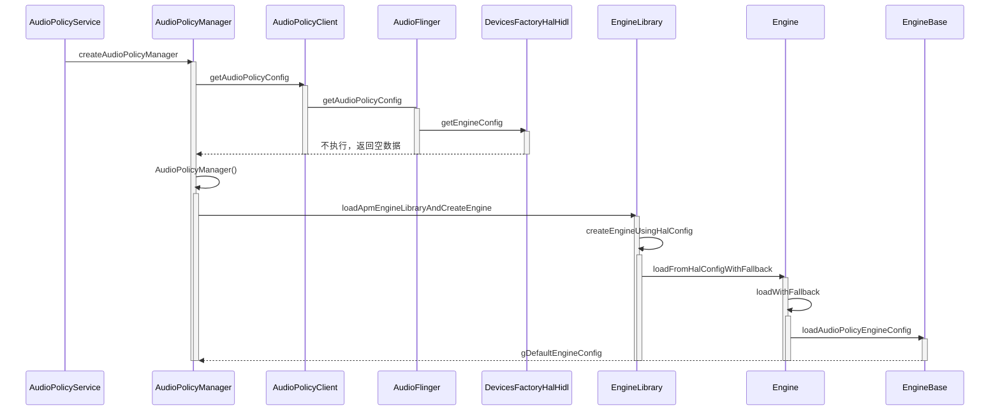
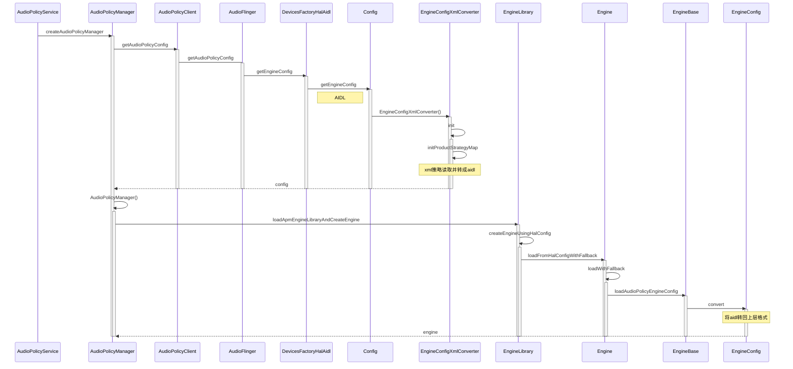

# 唱吧K歌闹钟双响问题


## 问题描述：

插入有线耳机的时候，唱吧k歌时，闹钟不双响。（系统组件W+vendor组件W）

## 问题分析：

首先双响的问题与音频的播放策略相关，使用`adb shell dumpsys media.audio_policy` dump测试机当前的音频播放策略：

```
Policy Engine dump:
  Product Strategies dump:
    -STRATEGY_MEDIA (id: 0)
      Selected Device: {AUDIO_DEVICE_OUT_SPEAKER, @:}
       Group: 12 stream: AUDIO_STREAM_ASSISTANT
        Attributes: { Content type: AUDIO_CONTENT_TYPE_SPEECH Usage: AUDIO_USAGE_ASSISTANT Source: AUDIO_SOURCE_INVALID Flags: 0x0 Tags:  }
       Group: 4 stream: AUDIO_STREAM_MUSIC
        Attributes: { Content type: AUDIO_CONTENT_TYPE_UNKNOWN Usage: AUDIO_USAGE_MEDIA Source: AUDIO_SOURCE_INVALID Flags: 0x0 Tags:  }
       Group: 4 stream: AUDIO_STREAM_MUSIC
        Attributes: { Content type: AUDIO_CONTENT_TYPE_UNKNOWN Usage: AUDIO_USAGE_GAME Source: AUDIO_SOURCE_INVALID Flags: 0x0 Tags:  }
       Group: 4 stream: AUDIO_STREAM_MUSIC
        Attributes: { Content type: AUDIO_CONTENT_TYPE_UNKNOWN Usage: AUDIO_USAGE_ASSISTANT Source: AUDIO_SOURCE_INVALID Flags: 0x0 Tags:  }
       Group: 4 stream: AUDIO_STREAM_MUSIC
        Attributes: { Content type: AUDIO_CONTENT_TYPE_UNKNOWN Usage: AUDIO_USAGE_ASSISTANCE_NAVIGATION_GUIDANCE Source: AUDIO_SOURCE_INVALID Flags: 0x0 Tags:  }
       Group: 4 stream: AUDIO_STREAM_MUSIC
        Attributes: { Any }
       Group: 2 stream: AUDIO_STREAM_SYSTEM
        Attributes: { Content type: AUDIO_CONTENT_TYPE_UNKNOWN Usage: AUDIO_USAGE_ASSISTANCE_SONIFICATION Source: AUDIO_SOURCE_INVALID Flags: 0x0 Tags:  }

    -STRATEGY_PHONE (id: 1)
      Selected Device: {AUDIO_DEVICE_OUT_EARPIECE, @:}
       Group: 1 stream: AUDIO_STREAM_VOICE_CALL
        Attributes: { Content type: AUDIO_CONTENT_TYPE_UNKNOWN Usage: AUDIO_USAGE_VOICE_COMMUNICATION Source: AUDIO_SOURCE_INVALID Flags: 0x0 Tags:  }
       Group: 7 stream: AUDIO_STREAM_BLUETOOTH_SCO
        Attributes: { Content type: AUDIO_CONTENT_TYPE_UNKNOWN Usage: AUDIO_USAGE_BLUETOOTH_SCO Source: AUDIO_SOURCE_INVALID Flags: 0x0 Tags:  }
       Group: 7 stream: AUDIO_STREAM_BLUETOOTH_SCO
        Attributes: { Content type: AUDIO_CONTENT_TYPE_UNKNOWN Usage: AUDIO_USAGE_UNKNOWN Source: AUDIO_SOURCE_INVALID Flags: 0x4 Tags:  }

    -STRATEGY_SONIFICATION (id: 2)
      Selected Device: {AUDIO_DEVICE_OUT_SPEAKER, @:}
       Group: 3 stream: AUDIO_STREAM_RING
        Attributes: { Content type: AUDIO_CONTENT_TYPE_UNKNOWN Usage: AUDIO_USAGE_NOTIFICATION_TELEPHONY_RINGTONE Source: AUDIO_SOURCE_INVALID Flags: 0x0 Tags:  }
       Group: 5 stream: AUDIO_STREAM_ALARM
        Attributes: { Content type: AUDIO_CONTENT_TYPE_UNKNOWN Usage: AUDIO_USAGE_ALARM Source: AUDIO_SOURCE_INVALID Flags: 0x0 Tags:  }

    -STRATEGY_SONIFICATION_RESPECTFUL (id: 3)
      Selected Device: {AUDIO_DEVICE_OUT_SPEAKER, @:}
       Group: 6 stream: AUDIO_STREAM_NOTIFICATION
        Attributes: { Content type: AUDIO_CONTENT_TYPE_UNKNOWN Usage: AUDIO_USAGE_NOTIFICATION Source: AUDIO_SOURCE_INVALID Flags: 0x0 Tags:  }
       Group: 6 stream: AUDIO_STREAM_NOTIFICATION
        Attributes: { Content type: AUDIO_CONTENT_TYPE_UNKNOWN Usage: AUDIO_USAGE_NOTIFICATION_EVENT Source: AUDIO_SOURCE_INVALID Flags: 0x0 Tags:  }

    -STRATEGY_DTMF (id: 4)
      Selected Device: {AUDIO_DEVICE_OUT_SPEAKER, @:}
       Group: 9 stream: AUDIO_STREAM_DTMF
        Attributes: { Content type: AUDIO_CONTENT_TYPE_UNKNOWN Usage: AUDIO_USAGE_VOICE_COMMUNICATION_SIGNALLING Source: AUDIO_SOURCE_INVALID Flags: 0x0 Tags:  }

    -STRATEGY_ENFORCED_AUDIBLE (id: 5)
      Selected Device: {AUDIO_DEVICE_OUT_SPEAKER, @:}
       Group: 8 stream: AUDIO_STREAM_ENFORCED_AUDIBLE
        Attributes: { Content type: AUDIO_CONTENT_TYPE_UNKNOWN Usage: AUDIO_USAGE_ENFORCED_AUDIBLE Source: AUDIO_SOURCE_INVALID Flags: 0x0 Tags:  }
       Group: 8 stream: AUDIO_STREAM_ENFORCED_AUDIBLE
        Attributes: { Content type: AUDIO_CONTENT_TYPE_UNKNOWN Usage: AUDIO_USAGE_UNKNOWN Source: AUDIO_SOURCE_INVALID Flags: 0x1 Tags:  }
```


对比机系统组件W+Vendor组件V（双响）：

```
Policy Engine dump:
  Product Strategies dump:
    -STRATEGY_PHONE (id: 0)
      Selected Device: {AUDIO_DEVICE_OUT_BLUETOOTH_A2DP, @:5F:46:69:A3:0D:D9}
       Group: 1 stream: AUDIO_STREAM_VOICE_CALL
        Attributes: { Content type: AUDIO_CONTENT_TYPE_UNKNOWN Usage: AUDIO_USAGE_VOICE_COMMUNICATION Source: AUDIO_SOURCE_INVALID Flags: 0x0 Tags:  }
       Group: 7 stream: AUDIO_STREAM_BLUETOOTH_SCO
        Attributes: { Content type: AUDIO_CONTENT_TYPE_UNKNOWN Usage: AUDIO_USAGE_BLUETOOTH_SCO Source: AUDIO_SOURCE_INVALID Flags: 0x0 Tags:  }
       Group: 7 stream: AUDIO_STREAM_BLUETOOTH_SCO
        Attributes: { Content type: AUDIO_CONTENT_TYPE_UNKNOWN Usage: AUDIO_USAGE_UNKNOWN Source: AUDIO_SOURCE_INVALID Flags: 0x4 Tags:  }

    -STRATEGY_SONIFICATION (id: 1)
      Selected Device: {AUDIO_DEVICE_OUT_SPEAKER, AUDIO_DEVICE_OUT_BLUETOOTH_A2DP, @:5F:46:69:A3:0D:D9}
       Group: 3 stream: AUDIO_STREAM_RING
        Attributes: { Content type: AUDIO_CONTENT_TYPE_UNKNOWN Usage: AUDIO_USAGE_NOTIFICATION_TELEPHONY_RINGTONE Source: AUDIO_SOURCE_INVALID Flags: 0x0 Tags:  }
       Group: 5 stream: AUDIO_STREAM_ALARM
        Attributes: { Content type: AUDIO_CONTENT_TYPE_UNKNOWN Usage: AUDIO_USAGE_ALARM Source: AUDIO_SOURCE_INVALID Flags: 0x0 Tags:  }

    -STRATEGY_ENFORCED_AUDIBLE (id: 2)
      Selected Device: {AUDIO_DEVICE_OUT_SPEAKER, AUDIO_DEVICE_OUT_BLUETOOTH_A2DP, @:5F:46:69:A3:0D:D9}
       Group: 8 stream: AUDIO_STREAM_ENFORCED_AUDIBLE
        Attributes: { Content type: AUDIO_CONTENT_TYPE_UNKNOWN Usage: AUDIO_USAGE_ENFORCED_AUDIBLE Source: AUDIO_SOURCE_INVALID Flags: 0x0 Tags:  }
       Group: 8 stream: AUDIO_STREAM_ENFORCED_AUDIBLE
        Attributes: { Content type: AUDIO_CONTENT_TYPE_UNKNOWN Usage: AUDIO_USAGE_UNKNOWN Source: AUDIO_SOURCE_INVALID Flags: 0x1 Tags:  }

    -STRATEGY_ACCESSIBILITY (id: 3)
      Selected Device: {AUDIO_DEVICE_OUT_BLUETOOTH_A2DP, @:5F:46:69:A3:0D:D9}
       Group: 11 stream: AUDIO_STREAM_ACCESSIBILITY
        Attributes: { Content type: AUDIO_CONTENT_TYPE_UNKNOWN Usage: AUDIO_USAGE_ASSISTANCE_ACCESSIBILITY Source: AUDIO_SOURCE_INVALID Flags: 0x0 Tags:  }

    -STRATEGY_SONIFICATION_RESPECTFUL (id: 4)
      Selected Device: {AUDIO_DEVICE_OUT_BLUETOOTH_A2DP, @:5F:46:69:A3:0D:D9}
       Group: 6 stream: AUDIO_STREAM_NOTIFICATION
        Attributes: { Content type: AUDIO_CONTENT_TYPE_UNKNOWN Usage: AUDIO_USAGE_NOTIFICATION Source: AUDIO_SOURCE_INVALID Flags: 0x0 Tags:  }
       Group: 6 stream: AUDIO_STREAM_NOTIFICATION
        Attributes: { Content type: AUDIO_CONTENT_TYPE_UNKNOWN Usage: AUDIO_USAGE_NOTIFICATION_EVENT Source: AUDIO_SOURCE_INVALID Flags: 0x0 Tags:  }

    -STRATEGY_MEDIA (id: 5)
      Selected Device: {AUDIO_DEVICE_OUT_BLUETOOTH_A2DP, @:5F:46:69:A3:0D:D9}
       Group: 12 stream: AUDIO_STREAM_ASSISTANT
        Attributes: { Content type: AUDIO_CONTENT_TYPE_SPEECH Usage: AUDIO_USAGE_ASSISTANT Source: AUDIO_SOURCE_INVALID Flags: 0x0 Tags:  }
       Group: 4 stream: AUDIO_STREAM_MUSIC
        Attributes: { Content type: AUDIO_CONTENT_TYPE_UNKNOWN Usage: AUDIO_USAGE_MEDIA Source: AUDIO_SOURCE_INVALID Flags: 0x0 Tags:  }
       Group: 4 stream: AUDIO_STREAM_MUSIC
        Attributes: { Content type: AUDIO_CONTENT_TYPE_UNKNOWN Usage: AUDIO_USAGE_GAME Source: AUDIO_SOURCE_INVALID Flags: 0x0 Tags:  }
       Group: 4 stream: AUDIO_STREAM_MUSIC
        Attributes: { Content type: AUDIO_CONTENT_TYPE_UNKNOWN Usage: AUDIO_USAGE_ASSISTANT Source: AUDIO_SOURCE_INVALID Flags: 0x0 Tags:  }
       Group: 4 stream: AUDIO_STREAM_MUSIC
        Attributes: { Content type: AUDIO_CONTENT_TYPE_UNKNOWN Usage: AUDIO_USAGE_ASSISTANCE_NAVIGATION_GUIDANCE Source: AUDIO_SOURCE_INVALID Flags: 0x0 Tags:  }
       Group: 4 stream: AUDIO_STREAM_MUSIC
        Attributes: { Any }
       Group: 2 stream: AUDIO_STREAM_SYSTEM
        Attributes: { Content type: AUDIO_CONTENT_TYPE_UNKNOWN Usage: AUDIO_USAGE_ASSISTANCE_SONIFICATION Source: AUDIO_SOURCE_INVALID Flags: 0x0 Tags:  }
```

从这里可以发现，测试机的策略上已经不一致了，由于两者是共系统分支，所以问题是出现在vendor上。首先看一下对比机的策略生成：



由于对比机使用的是HIDL接口，则不从vendor获取数据，直接返回系统层初始化好的默认策略。gDefaultEngineConfig的内容如下：

```
const engineConfig::Config gDefaultEngineConfig = {
      1.0,
      gOrderedStrategies,
      {},
      {},
      {},
  };
const engineConfig::ProductStrategies gOrderedStrategies = {
    {"STRATEGY_PHONE", static_cast<int>(AudioProductStrategyType::PHONE),
     {
         {AUDIO_STREAM_VOICE_CALL, "AUDIO_STREAM_VOICE_CALL",
          {{AUDIO_CONTENT_TYPE_UNKNOWN, AUDIO_USAGE_VOICE_COMMUNICATION, AUDIO_SOURCE_DEFAULT,
            AUDIO_FLAG_NONE, ""}},
         },
         {AUDIO_STREAM_BLUETOOTH_SCO, "AUDIO_STREAM_BLUETOOTH_SCO",
          {{AUDIO_CONTENT_TYPE_UNKNOWN, AUDIO_USAGE_UNKNOWN, AUDIO_SOURCE_DEFAULT, AUDIO_FLAG_SCO,
            ""}},
         }
     },
    },
    {"STRATEGY_SONIFICATION", static_cast<int>(AudioProductStrategyType::SONIFICATION),
     {
         {AUDIO_STREAM_RING, "AUDIO_STREAM_RING",
          {{AUDIO_CONTENT_TYPE_UNKNOWN, AUDIO_USAGE_NOTIFICATION_TELEPHONY_RINGTONE,
            AUDIO_SOURCE_DEFAULT, AUDIO_FLAG_NONE, ""}}
         },
         {AUDIO_STREAM_ALARM, "AUDIO_STREAM_ALARM",
          {{AUDIO_CONTENT_TYPE_UNKNOWN, AUDIO_USAGE_ALARM, AUDIO_SOURCE_DEFAULT,
            AUDIO_FLAG_NONE, ""}},
         }
     },
    },
    {"STRATEGY_ENFORCED_AUDIBLE", static_cast<int>(AudioProductStrategyType::ENFORCED_AUDIBLE),
     {
         {AUDIO_STREAM_ENFORCED_AUDIBLE, "AUDIO_STREAM_ENFORCED_AUDIBLE",
          {{AUDIO_CONTENT_TYPE_UNKNOWN, AUDIO_USAGE_UNKNOWN, AUDIO_SOURCE_DEFAULT,
            AUDIO_FLAG_AUDIBILITY_ENFORCED, ""}}
         }
     },
    },
    {"STRATEGY_ACCESSIBILITY", static_cast<int>(AudioProductStrategyType::ACCESSIBILITY),
     {
         {AUDIO_STREAM_ACCESSIBILITY, "AUDIO_STREAM_ACCESSIBILITY",
          {{AUDIO_CONTENT_TYPE_UNKNOWN, AUDIO_USAGE_ASSISTANCE_ACCESSIBILITY,
            AUDIO_SOURCE_DEFAULT, AUDIO_FLAG_NONE, ""}}
         }
     },
    },
    {"STRATEGY_SONIFICATION_RESPECTFUL",
            static_cast<int>(AudioProductStrategyType::SONIFICATION_RESPECTFUL),
     {
         {AUDIO_STREAM_NOTIFICATION, "AUDIO_STREAM_NOTIFICATION",
          {
              {AUDIO_CONTENT_TYPE_UNKNOWN, AUDIO_USAGE_NOTIFICATION, AUDIO_SOURCE_DEFAULT,
               AUDIO_FLAG_NONE, ""},
              {AUDIO_CONTENT_TYPE_UNKNOWN, AUDIO_USAGE_NOTIFICATION_EVENT,
               AUDIO_SOURCE_DEFAULT, AUDIO_FLAG_NONE, ""}
          }
         }
     },
    },
    {"STRATEGY_MEDIA", static_cast<int>(AudioProductStrategyType::MEDIA),
     {
         {AUDIO_STREAM_ASSISTANT, "AUDIO_STREAM_ASSISTANT",
          {{AUDIO_CONTENT_TYPE_SPEECH, AUDIO_USAGE_ASSISTANT,
            AUDIO_SOURCE_DEFAULT, AUDIO_FLAG_NONE, ""}}
         },
         {AUDIO_STREAM_MUSIC, "AUDIO_STREAM_MUSIC",
          {
              {AUDIO_CONTENT_TYPE_UNKNOWN, AUDIO_USAGE_MEDIA, AUDIO_SOURCE_DEFAULT,
               AUDIO_FLAG_NONE, ""},
              {AUDIO_CONTENT_TYPE_UNKNOWN, AUDIO_USAGE_GAME, AUDIO_SOURCE_DEFAULT,
               AUDIO_FLAG_NONE, ""},
              {AUDIO_CONTENT_TYPE_UNKNOWN, AUDIO_USAGE_ASSISTANT, AUDIO_SOURCE_DEFAULT,
               AUDIO_FLAG_NONE, ""},
              {AUDIO_CONTENT_TYPE_UNKNOWN, AUDIO_USAGE_ASSISTANCE_NAVIGATION_GUIDANCE,
               AUDIO_SOURCE_DEFAULT, AUDIO_FLAG_NONE, ""},
              {AUDIO_CONTENT_TYPE_UNKNOWN, AUDIO_USAGE_UNKNOWN, AUDIO_SOURCE_DEFAULT,
               AUDIO_FLAG_NONE, ""}
          },
         },
         {AUDIO_STREAM_SYSTEM, "AUDIO_STREAM_SYSTEM",
          {{AUDIO_CONTENT_TYPE_UNKNOWN, AUDIO_USAGE_ASSISTANCE_SONIFICATION,
            AUDIO_SOURCE_DEFAULT, AUDIO_FLAG_NONE, ""}}
         }
     },
    },
 .....
```

可以看到这个和dump出来的是一致的。那么看下测试机的策略生成流程：



由于测试机用的是AIDL接口，会在HAL层读取xml策略文件转成AIDL返回框架，框架再转成上层格式后去使用。这时候就怀疑是xml的文件的问题了。查看打印的路径下的配置文件发现没有问题。

```
<ProductStrategies>
    <ProductStrategy name="STRATEGY_PHONE">
        <AttributesGroup streamType="AUDIO_STREAM_VOICE_CALL" volumeGroup="voice_call">
            <Attributes> <Usage value="AUDIO_USAGE_VOICE_COMMUNICATION"/> </Attributes>
        </AttributesGroup>
        <AttributesGroup streamType="AUDIO_STREAM_BLUETOOTH_SCO" volumeGroup="bluetooth_sco">
            <Attributes> <Usage value="AUDIO_USAGE_BLUETOOTH_SCO"/> </Attributes>
            <Attributes> <Flags value="AUDIO_FLAG_SCO"/> </Attributes>
        </AttributesGroup>
    </ProductStrategy>

    <ProductStrategy name="STRATEGY_SONIFICATION">
        <AttributesGroup streamType="AUDIO_STREAM_RING" volumeGroup="ring">
            <Attributes> <Usage value="AUDIO_USAGE_NOTIFICATION_TELEPHONY_RINGTONE"/> </Attributes>
        </AttributesGroup>
        <AttributesGroup streamType="AUDIO_STREAM_ALARM" volumeGroup="alarm">
            <Attributes> <Usage value="AUDIO_USAGE_ALARM"/> </Attributes>
        </AttributesGroup>
    </ProductStrategy>

    <ProductStrategy name="STRATEGY_ENFORCED_AUDIBLE">
        <AttributesGroup streamType="AUDIO_STREAM_ENFORCED_AUDIBLE" volumeGroup="enforced_audible">
            <Attributes> <Usage value="AUDIO_USAGE_ENFORCED_AUDIBLE"/> </Attributes>
            <Attributes> <Flags value="AUDIO_FLAG_AUDIBILITY_ENFORCED"/> </Attributes>
        </AttributesGroup>
    </ProductStrategy>

    <ProductStrategy name="STRATEGY_ACCESSIBILITY">
        <AttributesGroup streamType="AUDIO_STREAM_ACCESSIBILITY" volumeGroup="accessibility">
            <Attributes> <Usage value="AUDIO_USAGE_ASSISTANCE_ACCESSIBILITY"/> </Attributes>
        </AttributesGroup>
    </ProductStrategy>

    <ProductStrategy name="STRATEGY_SONIFICATION_RESPECTFUL">
        <AttributesGroup streamType="AUDIO_STREAM_NOTIFICATION" volumeGroup="notification">
            <Attributes> <Usage value="AUDIO_USAGE_NOTIFICATION"/> </Attributes>
            <Attributes> <Usage value="AUDIO_USAGE_NOTIFICATION_EVENT"/> </Attributes>
        </AttributesGroup>
    </ProductStrategy>

    <ProductStrategy name="STRATEGY_MEDIA">
        <AttributesGroup streamType="AUDIO_STREAM_ASSISTANT" volumeGroup="assistant">
            <Attributes>
                <ContentType value="AUDIO_CONTENT_TYPE_SPEECH"/>
                <Usage value="AUDIO_USAGE_ASSISTANT"/>
            </Attributes>
        </AttributesGroup>
         <AttributesGroup streamType="AUDIO_STREAM_MUSIC" volumeGroup="music">
            <Attributes> <Usage value="AUDIO_USAGE_MEDIA"/> </Attributes>
            <Attributes> <Usage value="AUDIO_USAGE_GAME"/> </Attributes>
            <Attributes> <Usage value="AUDIO_USAGE_ASSISTANT"/> </Attributes>
            <Attributes> <Usage value="AUDIO_USAGE_ASSISTANCE_NAVIGATION_GUIDANCE"/> </Attributes>
            <Attributes></Attributes>
        </AttributesGroup>
        <AttributesGroup streamType="AUDIO_STREAM_SYSTEM" volumeGroup="system">
            <Attributes> <Usage value="AUDIO_USAGE_ASSISTANCE_SONIFICATION"/> </Attributes>
        </AttributesGroup>
    </ProductStrategy>
```

后续调试才发现HAL层在转换的时候赋值了一次ID，ID的值由枚举中的值来决定：

```
# hardware/interfaces/audio/aidl/default/EngineConfigXmlConverter.cpp
void EngineConfigXmlConverter::initProductStrategyMap() {
#define STRATEGY_ENTRY(name) {"STRATEGY_" #name, static_cast<int>(AudioProductStrategyType::name)}

    mProductStrategyMap = {STRATEGY_ENTRY(MEDIA),
                           STRATEGY_ENTRY(PHONE),
                           STRATEGY_ENTRY(SONIFICATION),
                           STRATEGY_ENTRY(SONIFICATION_RESPECTFUL),
                           STRATEGY_ENTRY(DTMF),
                           STRATEGY_ENTRY(ENFORCED_AUDIBLE),
                           STRATEGY_ENTRY(TRANSMITTED_THROUGH_SPEAKER),
                           STRATEGY_ENTRY(ACCESSIBILITY)};
#undef STRATEGY_ENTRY
}

int EngineConfigXmlConverter::convertProductStrategyNameToAidl(
        const std::string& xsdcProductStrategyName) {
    const auto [it, success] = mProductStrategyMap.insert(
            std::make_pair(xsdcProductStrategyName, mNextVendorStrategy));
    if (success) {
        mNextVendorStrategy++;
    }
    return it->second;
}
ConversionResult<AudioHalProductStrategy> EngineConfigXmlConverter::convertProductStrategyToAidl(
        const eng_xsd::ProductStrategies::ProductStrategy& xsdcProductStrategy) {
    AudioHalProductStrategy aidlProductStrategy;

    if (xsdcProductStrategy.hasId()) {
        aidlProductStrategy.id =
                VALUE_OR_FATAL(convertProductStrategyIdToAidl(xsdcProductStrategy.getId()));
    } else {
        aidlProductStrategy.id =
                VALUE_OR_FATAL(convertProductStrategyNameToAidl(xsdcProductStrategy.getName()));
    }
    aidlProductStrategy.name = xsdcProductStrategy.getName();

    if (xsdcProductStrategy.hasAttributesGroup()) {
        aidlProductStrategy.attributesGroups = VALUE_OR_FATAL(
                (convertCollectionToAidl<eng_xsd::AttributesGroup, AudioHalAttributesGroup>(
                        xsdcProductStrategy.getAttributesGroup(),
                        std::bind(&EngineConfigXmlConverter::convertAttributesGroupToAidl, this,
                                  std::placeholders::_1))));
    }
    if ((mDefaultProductStrategyId != std::nullopt) && (mDefaultProductStrategyId.value() == -1)) {
        mDefaultProductStrategyId = aidlProductStrategy.id;
    }
    return aidlProductStrategy;
}
```

查了一下AudioProductStrategyType类中相关的枚举值，本文称为新的map：

```
enum AudioProductStrategyType {
    SYS_RESERVED_NONE = (-1) /* -1 */,
    MEDIA = 0,
    PHONE = 1,
    SONIFICATION = 2,
    SONIFICATION_RESPECTFUL = 3,
    DTMF = 4,
    ENFORCED_AUDIBLE = 5,
    TRANSMITTED_THROUGH_SPEAKER = 6,
    ACCESSIBILITY = 7,
    SYS_RESERVED_REROUTING = 8,
    SYS_RESERVED_CALL_ASSISTANT = 9,
  }
```

这里可以看到重新赋值后的顺序已经和xml文件中的不一致了，但是和dump的结果是已经对应上了。

后续我们发现Google的W对比机没有这个问题，于是查阅到了google的代码提交发现有这样一笔：

https://android-review.googlesource.com/c/platform/hardware/interfaces/+/3455328

大概的意思是将mProductStrategyMap更换成之前的内容，本文称为旧的map：

```
std::unordered_map<std::string, int> getLegacyProductStrategyMap() {
#define STRATEGY_ENTRY(name, id) {"STRATEGY_" #name, static_cast<int>(id)}
        return {STRATEGY_ENTRY(MEDIA, 5),
                STRATEGY_ENTRY(PHONE, 0),
                STRATEGY_ENTRY(SONIFICATION, 1),
                STRATEGY_ENTRY(SONIFICATION_RESPECTFUL, 4),
                STRATEGY_ENTRY(DTMF, 6),
                STRATEGY_ENTRY(ENFORCED_AUDIBLE, 2),
                STRATEGY_ENTRY(CALL_ASSISTANT, 7),
                STRATEGY_ENTRY(TRANSMITTED_THROUGH_SPEAKER,8),
                STRATEGY_ENTRY(ACCESSIBILITY, 3)};
#undef STRATEGY_ENTRY
}
```

于是我们将HAL层的更换了，发现dump的结果是这样的，而且双响的问题也没有解决：

```
Policy Engine dump:
  Product Strategies dump:
    -STRATEGY_MEDIA (id: 0)
      Selected Device: {AUDIO_DEVICE_OUT_BLUETOOTH_A2DP, @:5F:46:69:A3:0D:D9}
       Group: 1 stream: AUDIO_STREAM_VOICE_CALL
        Attributes: { Content type: AUDIO_CONTENT_TYPE_UNKNOWN Usage: AUDIO_USAGE_VOICE_COMMUNICATION Source: AUDIO_SOURCE_INVALID Flags: 0x0 Tags:  }
       Group: 7 stream: AUDIO_STREAM_BLUETOOTH_SCO
        Attributes: { Content type: AUDIO_CONTENT_TYPE_UNKNOWN Usage: AUDIO_USAGE_BLUETOOTH_SCO Source: AUDIO_SOURCE_INVALID Flags: 0x0 Tags:  }
       Group: 7 stream: AUDIO_STREAM_BLUETOOTH_SCO
        Attributes: { Content type: AUDIO_CONTENT_TYPE_UNKNOWN Usage: AUDIO_USAGE_UNKNOWN Source: AUDIO_SOURCE_INVALID Flags: 0x4 Tags:  }
....
```

一开始我们只是关注了ID和策略名，到这里没仔细看误以为是下层的修改没有生效而且插耳机普通视频播放都变成双响了。仔细看就能发现，修改后的dump的内容相对V版本的除了策略名不一样，其他的内容都一致了。也就是说，下层传递过来时是没有问题的了，但是上层有修改这个策略名。经排查最终发现了!!!

```
ParsingResult convert(const ::android::media::audio::common::AudioHalEngineConfig& aidlConfig) {
    auto config = std::make_unique<engineConfig::Config>();
    config->version = 1.0f;
    if (auto conv = convertContainer<engineConfig::ProductStrategies>(
                    aidlConfig.productStrategies,
                    aidl2legacy_AudioHalProductStrategy_ProductStrategy); conv.ok()) {
        config->productStrategies = std::move(conv.value());
    } else {
        return ParsingResult{};
    }
    if (auto conv = convertContainer<engineConfig::VolumeGroups>(
                    aidlConfig.volumeGroups,
                    aidl2legacy_AudioHalVolumeGroup_VolumeGroup); conv.ok()) {
        config->volumeGroups = std::move(conv.value());
    } else {
        return ParsingResult{};
    }
    return {.parsedConfig=std::move(config), .nbSkippedElement=0};
}
ConversionResult<ProductStrategy> aidl2legacy_AudioHalProductStrategy_ProductStrategy(
        const media::audio::common::AudioHalProductStrategy& aidl) {
    ProductStrategy ps;
    ps.name = aidl.name.value_or(VALUE_OR_RETURN(
                    aidlAudioHalProductStrategyIdToName(aidl.id)));
    ps.id = aidl.id;
    ps.attributesGroups = VALUE_OR_RETURN(convertContainer<AttributesGroups>(
                    aidl.attributesGroups,
                    aidl2legacy_AudioHalAttributeGroup_AttributesGroup));
    return ps;
}
ConversionResult<std::string> aidlAudioHalProductStrategyIdToName(int id) {
    if (id >= media::audio::common::AudioHalProductStrategy::VENDOR_STRATEGY_ID_START) {
        return gVendorStrategyPrefix + std::to_string(id);
    }
    auto it = gProductStrategyMap.find(id);
    if (it == gProductStrategyMap.end()) {
        ALOGE("%s Invalid legacy strategy id %d", __func__, id);
        return base::unexpected(BAD_VALUE);
    }
    return it->second;
}

```

可以看到，框架层在拿到HAL传递的config后，在转换时根据框架层定义的map去重新赋值了策略名，这就导致为什么HAL层改了后最后dump的结果只有策略名变了。最后手动对策略名重新赋值或者使用同样的方式去修改框架层的map后就没有问题了，dump出的策略名和V版本的可以保持一致了。

至于为什么ID和策略名都要一致才能发挥作用，因为当前涉及到的是两个策略，一个是STRATEGY_MEDIA（K歌），一个是STRATEGY_SONIFICATION（闹钟），需要保证STRATEGY_SONIFICATION的优先级在STRATEGY_MEDIA之前。而后面会根据ID从小到大进行查找，需要先执行STRATEGY_SONIFICATION才能保证双响。这就可以解释上面出现的奇怪现象了，因为只有策略名被修改后导致了策略名和策略内容的混乱，PHONE的策略被当作MEDIA执行了。

详细的音频APM生成以及设备选择会作为单独的源码解读。

## 问题总结：

Vendor升级前使用的HIDL接口不会去获取HAL数据来生成播放策略，而是会在框架层使用默认值。Vendor升级W后会使用AIDL接口进行音频播放策略生成，但新的W代码上的Vendor层和系统层会在转换时分别根据新的枚举中定义的策略和和对应的ID来对读取后的策略进行更改，Vendor层会根据策略名修改ID，系统层会根据ID修改策略名。也就出现了本文的三种情况：

1. 如果我们不做其他任何修改，则vendor层会对策略进行了重新排序，由于系统层修改策略名使用的是同一个map，则最后的顺序是和新的map中一致。
2. 如果只修改了vendor层的map，则由于两者map的不一致性，系统层会去修改策略名造成策略名和对应策略的不匹配，也就是ID和策略名的顺序是新的map，而对应真实的策略却是和旧map保持一致。
3. 如果同时修改vendor和系统层，则最后的会和V版本一致。

发现新升级的旗舰机也是有这个差异，由于旗舰机走了澄清不做修改，所以此问题也没有修改。