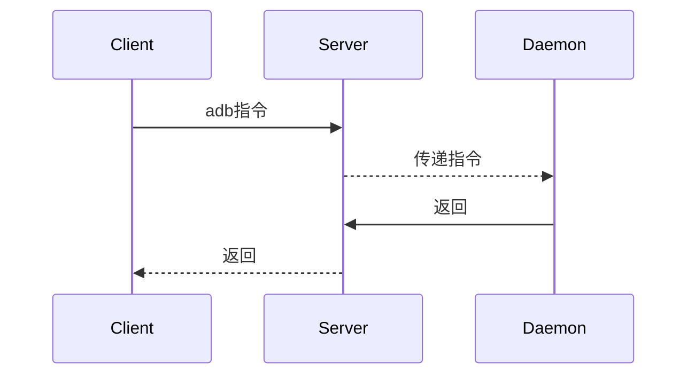
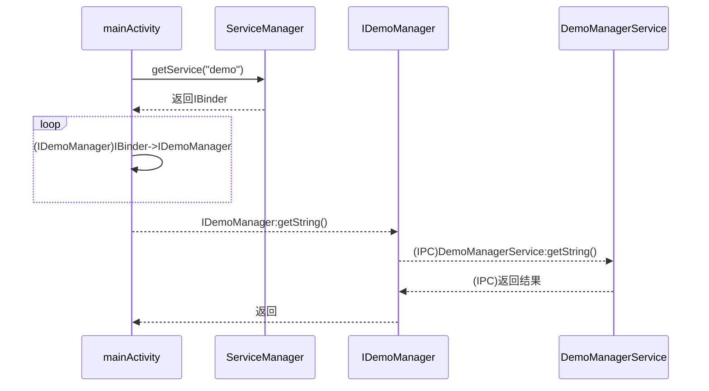

# 学习记录总结

## Git学习总结

### 1. Git 基础

#### 1.1 什么是 Git？

Git 是一个开源的分布式版本控制系统，由 Linus Torvalds 创建，用于有效、高速地处理从小到大的项目版本管理。

#### 1.2 Git 与 SVN 的区别

- **分布式**：Git 是分布式的，每个开发者都拥有完整的代码库（包括完整的历史记录）；而 SVN 是集中式的，开发者只拥有代码的最新版本。
- **速度**：Git 在本地操作，速度快；SVN 需要网络连接，速度慢。
- **非线性开发**：Git 支持更灵活的分支管理；SVN 分支管理较为笨重。

### 2. Git 安装与配置

#### 2.1 安装 Git
- 在 Windows 上，可以通过 Git for Windows 安装。
- 在 macOS 上，可以通过 Homebrew 安装：`brew install git`。
- 在 Linux 上，可以通过包管理器安装，如在 Ubuntu 上：`sudo apt-get install git`。

#### 2.2 配置 Git
- 设置用户名：`git config --global user.name "Your Name"`
- 设置邮箱：`git config --global user.email "youremail@example.com"`
- 查看配置：`git config --list`

### 3. Git 常用命令

#### 3.1 初始化仓库
- `git init`：在当前目录创建一个新的 Git 仓库。

#### 3.2 克隆仓库
- `git clone [url]`：克隆远程仓库到本地。

#### 3.3 查看状态
- `git status`：查看文件状态，哪些文件被修改了但未提交。

#### 3.4 添加文件
- `git add [file]`：将文件添加到暂存区。
- `git add .`：将所有修改过的文件添加到暂存区。

#### 3.5 提交更改
- `git commit -m "commit message"`：提交暂存区的文件到仓库。

#### 3.6 查看提交历史
- `git log`：查看提交历史。
- `git log --oneline`：简洁地显示提交历史。

#### 3.7 分支管理
- `git branch [branch-name]`：创建新分支。
- `git checkout [branch-name]`：切换到指定分支。
- `git merge [branch-name]`：将指定分支合并到当前分支。
- `git branch -d [branch-name]`：删除分支。

#### 3.8 远程仓库
- `git remote add [name] [url]`：添加远程仓库。
- `git push [name] [branch]`：推送本地分支到远程仓库。
- `git pull [name] [branch]`：从远程仓库拉取内容并合并到当前分支。

#### 3.9 解决冲突
- `git mergetool`：打开合并工具解决冲突。
- `git add [resolved-file]`：添加解决冲突后的文件。
- `git commit`：提交解决冲突后的文件。

### 4. Git 高级技巧

#### 4.1 标签管理
- `git tag [tag-name]`：创建标签。
- `git push --tags`：推送所有标签到远程仓库。

#### 4.2 撤销操作
- `git reset --soft HEAD^`：撤销最后一次提交，但保留暂存区。
- `git reset --mixed HEAD^`：撤销最后一次提交，保留工作目录（默认）。
- `git reset --hard HEAD^`：撤销最后一次提交，并且清除工作目录和暂存区。

#### 4.3 stash 功能
- `git stash`：临时保存当前工作进度。
- `git stash pop`：恢复最近的 stash。

#### 4.4 子模块
- `git submodule add [url] [path]`：添加子模块。
- `git submodule update --init --recursive`：初始化并更新所有子模块。

#### 4.5 忽略文件
- 在 `.gitignore` 文件中添加不需要版本控制的文件和目录模式。

### 5. Git 工作流程

#### 5.1 Feature Branch Workflow
- 开发新功能时创建一个新的分支。
- 开发完成后，合并回主分支。

#### 5.2 Git Flow
- 基于 Feature Branch Workflow，增加了发布分支和维护分支。

#### 5.3 Forking Workflow
- 适用于开源项目，通过 Fork 项目，创建 Pull Request 来贡献代码。

### 6. 常见问题与解决方案

#### 6.1 拉取远程仓库的最新代码
- `git pull` 或 `git fetch` 后 `git merge`。

#### 6.2 推送到远程仓库
- `git push`。

#### 6.3 处理大文件

- 使用 Git LFS（Large File Storage）。

#### 6.4 忽略文件大小限制
- 设置 `git config --global http.postBuffer 524288000`。


## Repo学习总结

### 1. Repo 的基本概念

Repo 是一个用于管理多个 Git 仓库的客户端工具，它允许开发者通过一个统一的接口来管理多个依赖的 Git 仓库。Repo 通过一个配置文件 `manifest` 来定义项目中需要包含的 Git 仓库及其版本。

### 2. Repo 的安装与配置

- **安装**：Repo 可以通过 Python 的包管理工具 pip 来安装，使用命令 `pip install repo`。
- **配置**：Repo 需要配置环境变量，以便在命令行中直接调用。配置完成后，可以使用 `repo selfupdate` 命令来更新 Repo 到最新版本。

### 3. Repo 的常用命令

- `repo init`：初始化一个新的 Repo 项目，需要指定 manifest 的远程仓库地址。
- `repo sync`：同步所有仓库到本地，类似于 Git 的 `git clone` 和 `git pull`。
- `repo status`：查看所有仓库的状态，类似于 Git 的 `git status`。
- `repo upload`：上传提交到远程 Git 仓库。
- `repo forall`：对所有仓库执行指定的 Git 命令。

### 4. Repo 的工作流程

Repo 的工作流程通常包括初始化、同步、开发和上传。开发者首先使用 `repo init` 初始化项目，然后通过 `repo sync` 同步所有依赖的仓库。在开发过程中，可以使用 Git 命令进行代码提交，最后通过 `repo upload` 上传代码。

### 5. Repo 与 Git 的关系

Repo 本质上是一个基于 Git 的工具，它扩展了 Git 的功能，使得管理多个 Git 仓库变得更加方便。Repo 使用 Git 作为底层版本控制系统，通过封装 Git 命令来实现更高级的功能，如批量同步和上传。


## Gerrit 学习总结

### 1. Gerrit 简介
Gerrit 是一个基于 Web 的代码审查工具，它与 Git 集成并建立在 Git 版本控制系统之上，帮助开发人员协同工作并维护他们的工作历史。Gerrit 允许将更改合并到 Git 存储库。

### 2. Gerrit 的重要性和应用场景
Gerrit 的代码审查功能能够帮助开发人员发现潜在的问题和错误，提高代码的质量。它提供了一个集中式的代码审查平台，方便团队成员之间进行沟通和协作。Gerrit 通过自动化的工作流程和提醒机制，加速代码审查的过程，提高开发效率。

### 3. Gerrit 的安装与配置
Gerrit 的安装通常涉及以下步骤：
- 安装 Java 环境和 Git。
- 下载 Gerrit 的 `war` 文件，并使用 `java -jar gerrit.war init -d ~/review_site` 命令初始化 Gerrit 环境。
- 配置 Gerrit，包括用户认证方式（如 HTTP）、插件安装等。
- 设置反向代理服务（如 Apache 或 Nginx）以访问 Gerrit 服务。

### 4. Gerrit 常用命令
- **克隆仓库**：`git clone <repository_url>`。
- **配置 Git 用户信息**：`git config --global user.name "Your Name"` 和 `git config --global user.email "your.email@example.com"`。
- **创建更改**：在本地创建一个新分支，并进行更改：`git checkout -b feature-branch`。
- **添加和提交更改**：`git add .` 和 `git commit -m "Describe your changes"`。
- **推送更改到 Gerrit**：`git push origin HEAD:refs/for/master`。
- **查看更改**：使用 `ssh user@review.example.com gerrit query --format=JSON status:open project:project-name` 查看特定项目的变更。
- **查看单个更改**：`ssh user@review.example.com gerrit review <change-id>`。
- **更新变更**：`git commit --amend` 和 `git push origin HEAD:refs/for/master`。
- **删除更改**：`git push origin :refs/for/master`。
- **强制推送**：`git push --force origin HEAD:refs/for/master`。
- **合并更改**：在 Gerrit 上审查通过后，可以合并更改到主分支：`ssh user@review.example.com gerrit review <change-id> +1`。

### 5. Gerrit 与 Git 的关系
Gerrit 是建立在 Git 之上的代码审查系统，它可以与 GitHub 这类代码仓库协同，也可以直接使用，因为它里面也会存有代码（提供代码托管功能）。Gerrit 支持作为代码源，并且因为它是基于 Git 的，所以它可以与 Git 无缝集成。

### 6. Gerrit 工作流程

Gerrit 的工作流程是代码审查的核心，它确保代码的质量和项目的健康发展。以下是 Gerrit 的典型工作流程：

1. **创建本地更改**：开发者在本地 Git 仓库中创建一个新的分支，并进行代码更改。
2. **提交更改到 Gerrit**：开发者将本地更改推送到 Gerrit 服务器上，但不是直接推送到主分支，而是推送到一个特殊的 "refs/for/branch" 引用。这个操作通常通过 `git push origin HEAD:refs/for/<branch-name>` 命令完成。
3. **代码审查**：Gerrit 服务器接收到推送的更改后，会自动创建一个审查（review）页面，供其他开发者审查。审查者可以查看代码更改，并提供反馈。他们可以对更改进行评论，批准（+1），或者提出修改建议。如果审查者发现问题，可以要求开发者修正。开发者可以根据反馈修改代码，并重新推送更新。
4. **代码合并**：一旦更改获得足够的批准（通常是 +2），并且所有自动化测试都通过，它就可以被合并到主分支。合并操作通常由有权限的开发者执行，他们可以点击 Gerrit 界面上的 "Submit" 按钮来合并代码。
5. **代码合并后**：合并后的代码会被推送到主分支，其他开发者可以拉取最新的代码。如果合并后的代码出现问题，可以进行回滚操作。
6. **标签和版本管理**：在某些情况下，开发者可能需要为合并的更改创建标签，以便于版本管理。
7. **监控和维护**：Gerrit 提供了监控工具，如 Jenkins 集成，以监控代码审查和合并过程中的自动化测试。项目维护者可以定期检查 Gerrit 的审查队列，确保代码审查的及时性和质量。


## Samba 服务器安装和配置指南

### 1. Samba 介绍
Samba 是一个在 Linux 和 UNIX 系统上实现 SMB 协议的免费软件，由服务器及客户端程序构成。SMB 是一种在局域网上共享文件和打印机的通信协议，允许不同计算机之间共享文件及打印机等资源。

### 2. 安装 Samba

#### 2.1 安装说明
Samba 服务器搭建流程主要分为以下几个步骤：
1. 安装 Samba 包。
2. 编辑主配置文件 `/etc/samba/smb.conf`，自定义需要共享的目录，并为共享目录设置共享权限。
3. 在 `/etc/samba/smb.conf` 中指定日志文件名称和存放路径。
4. 设置共享目录的本地系统权限及 Samba 共享权限。
5. 重新加载配置文件或重新启动 smb 服务，使配置生效。

#### 2.2 安装 Samba

##### 2.2.1 Ubuntu 安装 Samba
```bash
apt-get install samba samba-common -y
```

##### 2.2.2 CentOS 安装 Samba
```bash
yum install samba -y
```

##### 2.2.3 查看 Samba 版本
```bash
smbclient -V
```

### 3. User 级别的 Samba 配置

User 级别的 Samba 需要以 Samba 用户和密码才能访问。

#### 3.1 创建用于分享的 Samba 目录
```bash
mkdir -p /smb
```

#### 3.2 创建 Samba 访问用户
```bash
useradd smb
passwd smb
```

#### 3.3 设置目录权限
```bash
chmod -R o+rwx /smb
# 或者
chown -R smb:smb /smb
# 或者
chown -R smb /smb
```

#### 3.4 设置 Samba 用户的访问密码
```bash
smbpasswd -a smb
```

#### 3.5 配置 Samba 的配置文件
在 `/etc/samba/smb.conf` 文件中添加以下内容：
```ini
[global]
security = user

[smb]
comment = smb folder
browseable = yes
path = /smb
create mask = 0700
directory mask = 0700
valid users = smb
force user = smb
force group = smb
public = yes
available = yes
writable = yes
```

#### 3.6 重启 Samba 服务器

```bash
service smbd restart
```

### 4. 匿名级别的 Samba 配置

匿名级别的 Samba 不需要用户和密码验证登录。

#### 4.1 创建用于分享的 Samba 目录
```bash
mkdir -p /share
```

#### 4.2 配置目录权限
```bash
chown nobody:nobody /share
chmod o+rwx -R /share/
```

#### 4.3 配置 Samba 的配置文件
在 `/etc/samba/smb.conf` 文件中添加以下内容：
```ini
[global]
security = user
map to guest = Bad User

[share]
comment = share folder
browseable = yes
path = /share
public = ok
guest ok = yes
writable = yes
```

#### 4.4 重启 Samba 服务

```bash
service smb restart
```

### 5. 验证

#### 5.1 Windows 打开 Samba 服务器 IP

在 Windows 系统中，使用 `win + r` 键打开运行，输入 `\\samba服务器IP` 访问 Samba 共享。

#### 5.2 使用 Samba 用户名和密码登录
对于 Samba 4 版本，匿名登录的用户名和密码均为 `nobody`。

#### 5.3 创建文件测试
在 Windows 资源管理器中，尝试在共享目录中创建文件以测试 Samba 配置是否成功。

### 6. 配置文件基本格式

`smb.conf` 文件由以下几个部分组成：

- **全局配置**：在文件的顶部，以 `[global]` 作为区块名称，包含影响整个 Samba 服务器的设置。
- **共享定义**：定义共享资源的部分，每个共享都有一个自己的区块，以方括号 `[]` 包围共享名称。
- **参数**：在每个区块内部，使用 `参数 = 值` 的形式设置参数。

#### 示例配置文件

```ini
# 全局配置
[global]
    workgroup = WORKGROUP
    server string = Samba Server Version %v
    netbios name = SERVERNAME
    security = user
    map to guest = bad user
    dns proxy = no

# 共享定义
[homes]
    comment = Home Directories
    browseable = no
    writable = yes

# 特定共享
[printers]
    comment = All Printers
    path = /var/spool/samba
    browseable = no
    guest ok = yes
    writable = no
    printable = yes

# 另一个共享
[共享名]
    comment = 共享描述
    path = /path/to/share
    available = yes
    valid users = 用户1 用户2
    read only = no
    browsable = yes
    guest ok = no
```

#### 常见配置项

- **workgroup**：定义工作组名称，与 Windows 工作组名称相同。
- **server string**：定义服务器的描述字符串。
- **netbios name**：定义 NetBIOS 名称，通常设置为服务器的主机名。
- **security**：定义安全模式，可以是 `user`、`share` 或 `domain`。
- **map to guest**：定义哪些用户映射为 guest，通常设置为 `bad user` 以增强安全性。
- **dns proxy**：是否为本地网络上的非域成员提供 DNS 解析。

在共享区块中：

- **comment**：共享的描述。
- **path**：共享文件或目录的路径。
- **browseable**：是否在网络浏览器中可见。
- **writable**：是否可写。
- **guest ok**：是否允许 guest 用户访问。
- **read only**：是否只读。
- **browsable**：是否在网络邻居中可见。


## Java入门

### 1. 对象（Object）

对象是现实世界中的实体在计算机中的映射，它是面向对象编程的核心概念。在Java中，一切皆对象，每个对象都是某个类的实例。对象拥有状态（属性）和行为（方法），可以通过方法来操作对象的内部状态。

### 2. 面向对象编程（Object-Oriented Programming, OOP）

面向对象编程是一种编程范式，它将现实世界中的实体抽象为对象，并使用对象来设计软件和程序。OOP的主要特点是将数据（属性）和操作数据的方法（行为）封装在一起，提高代码的重用性和可维护性。OOP的三个基本特征是封装、继承和多态。

### 3. 类（Class）

类是对象的蓝图或模板，定义了对象的属性（字段）和方法（行为）。类是创建对象的模板，通过类可以创建多个对象实例。类定义了对象的结构和行为，但不占用内存空间，只有当通过类创建对象时，才会分配内存。

### 4. 对象的属性和方法

- **属性**：对象的属性是对象状态的描述，通常称为字段或成员变量。属性可以是原始数据类型（如int、double等）或引用类型（如字符串、其他对象等）。
- **方法**：对象的方法是对象的行为，它们定义了对象可以执行的操作。方法可以包含参数，这些参数用于传递信息给方法，并可以返回结果。

### 5. 类与对象的关系和区别

- **关系**：类是对象的蓝图，对象是类的实例。类定义了对象的结构和行为，而对象是类的具体化，是类在内存中的一个实例。
- **区别**：
  - **类**：是一个模板，定义了一组属性和方法，但不占用内存空间。
  - **对象**：是根据类创建的实例，占用内存空间，每个对象都有自己的属性值和方法。


## IO流
### 1. File类
`File` 类是 Java IO 的基础，用于表示文件和目录。

- **用法**：
  - 创建实例：`File file = new File("path/to/file");`
  - 检查文件是否存在：`file.exists()`
  - 检查是否为文件：`file.isFile()`
  - 检查是否为目录：`file.isDirectory()`
  - 创建新文件：`file.createNewFile()`
  - 删除文件：`file.delete()`

### 2. 基本的字节流：OutputStream 和 InputStream
- **OutputStream**：用于写出字节数据到目的地。
  - **FileOutputStream**：将数据写入文件。
    - **用法**：`FileOutputStream fos = new FileOutputStream("file.txt");`
    - 写数据：`fos.write(data);`
- **InputStream**：用于从数据源读取字节数据。
  - **FileInputStream**：从文件读取数据。
    - **用法**：`FileInputStream fis = new FileInputStream("file.txt");`
    - 读数据：`int data = fis.read();`

### 3. 基本的字符流：Writer 和 Reader
- **Writer**：用于写出字符数据到目的地。
  - **FileWriter**：将数据写入文件。
    - **用法**：`FileWriter fw = new FileWriter("file.txt");`
    - 写数据：`fw.write(data);`
- **Reader**：用于从数据源读取字符数据。
  - **FileReader**：从文件读取数据。
    - **用法**：`FileReader fr = new FileReader("file.txt");`
    - 读数据：`int data = fr.read();`

### 4. 缓冲流
缓冲流提高了IO操作的效率，通过使用内部缓冲区减少实际的IO操作次数。

- **字节缓冲流**：
  - **BufferedInputStream**：包装`InputStream`，提供缓冲。
    - **用法**：`BufferedInputStream bis = new BufferedInputStream(new FileInputStream("file.txt"));`
  - **BufferedOutputStream**：包装`OutputStream`，提供缓冲。
    - **用法**：`BufferedOutputStream bos = new BufferedOutputStream(new FileOutputStream("file.txt"));`
- **字符缓冲流**：
  - **BufferedReader**：包装`Reader`，提供缓冲。
    - **用法**：`BufferedReader br = new BufferedReader(new FileReader("file.txt"));`
  - **BufferedWriter**：包装`Writer`，提供缓冲。
    - **用法**：`BufferedWriter bw = new BufferedWriter(new FileWriter("file.txt"));`

### 5. 转换流
转换流用于在不同字符集之间转换数据。

- **InputStreamReader**：将字节流转换为字符流。
  - **用法**：`InputStreamReader isr = new InputStreamReader(new FileInputStream("file.txt"), "UTF-8");`
- **OutputStreamWriter**：将字符流转换为字节流。
  - **用法**：`OutputStreamWriter osw = new OutputStreamWriter(new FileOutputStream("file.txt"), "UTF-8");`

### 6. 序列化流
序列化流用于对象的持久化和反序列化。

- **ObjectOutputStream**：将对象序列化到文件。
  - **用法**：`ObjectOutputStream oos = new ObjectOutputStream(new FileOutputStream("file.txt"));`
  - 序列化对象：`oos.writeObject(object);`
- **ObjectInputStream**：从文件反序列化对象。
  - **用法**：`ObjectInputStream ois = new ObjectInputStream(new FileInputStream("file.txt"));`
  - 反序列化对象：`Object object = ois.readObject();`

### 7. 打印流
打印流提供了方便的API来打印数据。

- **PrintStream**：用于打印字节数据。
  - **用法**：`PrintStream ps = new PrintStream("file.txt");`
  - 打印数据：`ps.println("Hello World");`
- **PrintWriter**：用于打印字符数据。
  - **用法**：`PrintWriter pw = new PrintWriter("file.txt");`
  - 打印数据：`pw.println("Hello World");`


### 8. 流之间的关系
#### 8.1 流的继承体系关系

Java中的流类都是从`java.io`包中的抽象基类派生出来的。这些基类提供了所有子类流的通用行为和特性。

1. **InputStream 和 OutputStream**
   - 所有字节输入流的超类是`InputStream`，它提供了从不同数据源读取字节的方法。
   - 所有字节输出流的超类是`OutputStream`，它提供了向不同目的地写入字节的方法。

2. **Reader 和 Writer**
   - 所有字符输入流的超类是`Reader`，它提供了从不同数据源读取字符的方法。
   - 所有字符输出流的超类是`Writer`，它提供了向不同目的地写入字符的方法。

3. **具体的流类**
   - `FileInputStream`和`FileOutputStream`是处理文件IO的字节流。
   - `FileReader`和`FileWriter`是处理文件IO的字符流。
   - `BufferedReader`和`BufferedWriter`是对应的缓冲流，它们提供了更高的读写效率。
   - `InputStreamReader`和`OutputStreamWriter`是转换流，用于在字节流和字符流之间转换。

4. **打印流**
   - `PrintStream`和`PrintWriter`是方便打印输出的流，它们提供了格式化输出的能力。

5. **对象序列化流**
   - `ObjectOutputStream`用于对象的序列化，将对象写入到流中。
   - `ObjectInputStream`用于对象的反序列化，从流中恢复对象。

#### 8.2 流的用途关系

1. **字节流与字符流**
   - 字节流（`InputStream`和`OutputStream`）用于读写二进制数据，可以处理任何类型的数据，如图片、视频等。
   - 字符流（`Reader`和`Writer`）用于读写字符数据，通常用于文本文件的读写。

2. **缓冲流**
   - 缓冲流（`BufferedReader`、`BufferedWriter`、`BufferedInputStream`、`BufferedOutputStream`）提供了一个缓冲区，可以减少实际的IO操作次数，提高效率。

3. **转换流**
   - 转换流（`InputStreamReader`、`OutputStreamWriter`）用于在字节流和字符流之间转换，它们可以指定特定的编码，解决不同编码之间的转换问题。

4. **打印流**
   - 打印流（`PrintStream`、`PrintWriter`）提供了方便的API来打印数据，它们可以自动刷新输出，并且可以很容易地重定向到文件或其他目的地。

5. **序列化流**
   - 序列化流（`ObjectOutputStream`、`ObjectInputStream`）用于对象的持久化存储和网络传输，它们可以将对象的状态保存到文件中或通过网络发送到其他JVM实例。


## 内部类

Java内部类是指定义在另一个类里或方法里的类，主要有四种类型：成员内部类、局部内部类、匿名内部类和静态内部类。

### 1. 成员内部类

成员内部类定义在另一个类的内部，可以访问外部类的所有成员属性和成员方法，包括私有成员和静态成员。

**特点**：
- 成员内部类可以像外部类的成员一样拥有private、protected、public和包访问权限。
- 外部类要访问成员内部类的成员，需要先创建成员内部类的对象。
- 成员内部类的对象创建依赖于外部类的对象。

**例子**：
```java
class Circle {
    double radius = 0;

    public Circle(double radius) {
        this.radius = radius;
    }

    class Draw {
        public void drawShape() {
            System.out.println("drawShape");
        }
    }
}
```

### 2. 局部内部类

局部内部类定义在一个方法或作用域内，其访问仅限于该方法或作用域内。

**特点**：
- 局部内部类不能有public、protected、private和static修饰符。
- 局部内部类类似于局部变量，其生命周期仅限于声明它的方法或作用域。

**例子**：
```java
class Man {
    public Man() {}

    public People getWoman() {
        class Woman extends People {
            int age = 0;
        }
        return new Woman();
    }
}

class People {
    public People() {}
}
```

### 3. 匿名内部类

匿名内部类通常用于事件监听等场景，不需要单独定义一个类，直接实现接口或继承父类。

**特点**：
- 匿名内部类没有构造器，不能有访问修饰符和static修饰符。
- 匿名内部类用于接口回调，继承其他类或实现接口。

**例子**：
```java
scan_bt.setOnClickListener(new OnClickListener() {
    @Override
    public void onClick(View v) {
        // TODO Auto-generated method stub
    }
});
```

### 4. 静态内部类

静态内部类定义在另一个类内部，但加了static关键字，不依赖于外部类的实例。

**特点**：
- 静态内部类可以不通过外部类的实例来创建。
- 静态内部类不能访问外部类的非static成员。

**例子**：
```java
class Outter {
    static class Inner {
        public Inner() {}
    }
}
```


## 反射
Java反射是一种强大的机制，它允许程序在运行时访问、检查和修改它自己的结构，包括类、接口、字段和方法。

### 1. 反射的基本概念

反射是Java语言提供的一种特殊机制，通过Java反射API，可以在运行时获得类的完整结构，包括类的结构、字段、方法等信息，甚至可以调用对象的方法和访问或修改对象的字段。

### 2. 反射的主要类

- `Class`：反射的核心类，每个类都有一个`Class`对象，可以通过`Class`对象来访问类的属性和方法。
- `Field`：表示类的成员变量。
- `Method`：表示类的方法。
- `Constructor`：表示类的构造器。

### 3. 获取`Class`对象的方式

- 通过`.class`语法直接获取，如`String.class`。
- 通过`Object`类的`getClass()`方法获取，如`"Hello".getClass()`。
- 通过`Class.forName()`方法获取，如`Class.forName("java.lang.String")`。

### 4. 使用反射访问类的结构

- **获取类的字段（Field）**：通过`Class`对象的`getFields()`方法可以获取所有public字段，`getDeclaredFields()`方法可以获取所有字段（包括private）。
- **获取类的方法（Method）**：通过`Class`对象的`getMethods()`方法可以获取所有public方法，`getDeclaredMethods()`方法可以获取所有方法（包括private）。
- **获取类的构造器（Constructor）**：通过`Class`对象的`getConstructors()`方法可以获取所有public构造器，`getDeclaredConstructors()`方法可以获取所有构造器（包括private）。

### 5. 使用反射创建对象实例

- 通过`Class`对象的`newInstance()`方法可以创建实例，但仅限于public构造器。
- 通过`Constructor`对象的`newInstance()`方法可以创建实例，可以访问private构造器。

### 6. 使用反射调用方法和访问字段

- 通过`Method`对象的`invoke()`方法可以调用对象的方法。
- 通过`Field`对象的`get()`和`set()`方法可以访问和修改字段的值。

### 7. 反射的用途

- **动态代理**：创建动态代理类，实现AOP编程。
- **框架开发**：许多框架（如Spring）使用反射来实现依赖注入和运行时动态处理。
- **插件加载**：动态加载和执行插件代码。
- **测试和调试**：在测试和调试时，反射可以用来检查和修改私有成员的值。

### 8. 反射的注意事项

- **性能开销**：反射操作通常比直接代码调用要慢，因为它需要在运行时分析类型信息。
- **安全问题**：反射可以绕过编译时类型检查，可能会破坏封装性，导致安全问题。
- **异常处理**：使用反射时需要处理多种异常，如`ClassNotFoundException`、`NoSuchMethodException`等。


## Android简单控件

### 1. 文本显示

```xml
<TextView
    android:id="@+id/textView"
    android:layout_width="wrap_content"  <!-- 设置宽度为自适应内容 -->
    android:layout_height="wrap_content" <!-- 设置高度为自适应内容 -->
    android:text="Hello, World!" <!-- 设置文本内容 -->
    android:textSize="16sp" <!-- 设置文本字号为16sp -->
    android:padding="8dp" <!-- 设置内边距为8dp -->
    android:layout_gravity="center" <!-- 设置在父容器中的居中对齐 -->
    android:gravity="center" /> <!-- 设置文本内容在控件内部的居中对齐 -->
```

### 2. 视图基础

```xml
<View
    android:layout_width="100dp" <!-- 设置宽度为100dp -->
    android:layout_height="100dp" <!-- 设置高度为100dp -->
    android:background="#FF0000" <!-- 设置背景颜色为红色 -->
    android:layout_margin="16dp" <!-- 设置外边距为16dp -->
    android:layout_gravity="center" <!-- 设置在父容器中的居中对齐 -->
    android:gravity="center" /> <!-- 设置内容在控件内部的居中对齐 -->
```

### 3. 常用布局：

#### 线性布局LinearLayout

```xml
<LinearLayout
    android:layout_width="match_parent" <!-- 设置宽度填充父容器 -->
    android:layout_height="wrap_content" <!-- 设置高度为自适应内容 -->
    android:orientation="horizontal"> <!-- 设置为水平排列 -->
    
    <Button
        android:layout_width="0dp" <!-- 设置宽度为0dp，由权重决定 -->
        android:layout_height="wrap_content" <!-- 设置高度为自适应内容 -->
        android:layout_weight="1" <!-- 设置权重为1，平分父容器 -->
        android:text="Button 1" />
        
    <Button
        android:layout_width="0dp"
        android:layout_height="wrap_content"
        android:layout_weight="1"
        android:text="Button 2" />
</LinearLayout>
```

#### 相对布局RelativeLayout

```xml
<RelativeLayout
    android:layout_width="match_parent" <!-- 设置宽度填充父容器 -->
    android:layout_height="match_parent"> <!-- 设置高度填充父容器 -->
    
    <TextView
        android:id="@+id/textView1"
        android:layout_width="wrap_content" <!-- 设置宽度为自适应内容 -->
        android:layout_height="wrap_content" <!-- 设置高度为自适应内容 -->
        android:text="Top Left"
        android:layout_alignParentTop="true" <!-- 设置在父容器顶部对齐 -->
        android:layout_alignParentLeft="true" /> <!-- 设置在父容器左侧对齐 -->
        
    <TextView
        android:id="@+id/textView2"
        android:layout_width="wrap_content"
        android:layout_height="wrap_content"
        android:text="Bottom Right"
        android:layout_alignParentBottom="true" <!-- 设置在父容器底部对齐 -->
        android:layout_alignParentRight="true" /> <!-- 设置在父容器右侧对齐 -->
</RelativeLayout>
```

#### 网格布局GridLayout

```xml
<GridLayout
    android:layout_width="match_parent" <!-- 设置宽度填充父容器 -->
    android:layout_height="wrap_content" <!-- 设置高度为自适应内容 -->
    android:columnCount="2"> <!-- 设置列数为2 -->
    
    <TextView
        android:layout_width="wrap_content"
        android:layout_height="wrap_content"
        android:text="Row 1, Column 1" />
        
    <TextView
        android:layout_width="wrap_content"
        android:layout_height="wrap_content"
        android:text="Row 1, Column 2" />
</GridLayout>
```

#### 滚动视图ScrollView

```xml
<ScrollView
    android:layout_width="match_parent" <!-- 设置宽度填充父容器 -->
    android:layout_height="match_parent"> <!-- 设置高度填充父容器 -->
    
    <TextView
        android:layout_width="wrap_content"
        android:layout_height="wrap_content"
        android:text="@string/long_text" />
</ScrollView>
```

### 4. 按钮触控

```xml
<Button
    android:layout_width="wrap_content" <!-- 设置宽度为自适应内容 -->
    android:layout_height="wrap_content" <!-- 设置高度为自适应内容 -->
    android:text="Click Me" <!-- 设置按钮文本 -->
    android:background="#FF0000" <!-- 设置背景颜色为红色 -->
    android:onClick="onButtonClick" /> <!-- 设置点击事件处理方法 -->
```

### 5. 图像显示

```xml
<ImageView
    android:layout_width="wrap_content" <!-- 设置宽度为自适应内容 -->
    android:layout_height="wrap_content" <!-- 设置高度为自适应内容 -->
    android:src="@drawable/image" <!-- 设置图片资源 -->
    android:scaleType="centerCrop" /> <!-- 设置图片缩放类型为居中裁剪 -->
```


## Android资源图片

在Android开发中，资源是应用程序中的重要组成部分，包括图片、布局定义、界面字符串、动画等，这些资源文件通常存放在`res`目录下。

### 1. 资源介绍

资源文件包括各种类型，主要存放在`res`目录中，方便应用程序的管理和调用。

### 2. Drawable系列

- **存放图片文件**：`res/drawable`目录用于存放图片资源文件。
- **支持不同dpi的文件夹**：Android提供了不同密度的资源目录，如`drawable-mdpi`、`drawable-hdpi`、`drawable-xhdpi`等，用于存放不同密度的图片资源。

### 3. Mipmap系列

- **存放启动器图标**：`res/mipmap`目录用于存放应用程序的启动器图标。
- **支持不同dpi的文件夹**：类似于Drawable系列，Mipmap系列也支持不同密度的资源目录。

### 4. Values系列

- **存放颜色、字符串、风格等资源**：`res/values`目录用于存放颜色、字符串、风格等资源文件，方便在应用程序中引用和使用。

### 5. 资源引用

- **在XML布局中引用**：通过`@drawable/`、`@string/`等格式，在XML布局文件中引用资源。
- **在代码中引用**：通过`R.drawable.my_image`、`R.string.app_name`等方式，在Java代码中引用资源。

### 6. 资源优化

- **减少资源文件**：项目中应尽量减少不必要的资源文件，避免占用过多空间。
- **图片压缩**：对图片资源进行压缩和优化，以减小应用包大小和避免内存溢出。

### 7. 其他资源

- **XML资源**：`res/xml`目录用于存放XML格式的资源文件，如配置文件等。
- **Raw资源**：`res/raw`目录用于存放原始文件，如音频、视频等。
- **Assets资源**：`assets`目录用于存放特殊格式的文件，可以通过`AssetManager`来访问这些文件。


## Android四大组件之Activity

### 活动是什么

在Android开发中，`Activity` 是一个非常重要的组件，它代表了应用中的一个用户界面屏幕。每个`Activity`提供了一个可以包含用户界面的窗口，用户可以与这些界面进行交互。`Activity`是`Context`的一个子类，因此它拥有`Context`的所有功能，并且可以创建视图和接收事件。

### 活动的基本用法

1. **手动创建Activity**：通过继承`Activity`类并重写其生命周期方法（如`onCreate`、`onStart`、`onResume`等）来创建自定义的`Activity`。

2. **创建和加载布局**：使用XML文件定义界面布局，然后在`Activity`的`onCreate`方法中通过`setContentView(R.layout.your_layout)`加载这个布局。

3. **在AndroidManifest文件中注册**：为了让系统知道这个`Activity`的存在，需要在`AndroidManifest.xml`文件中进行声明。

4. **隐藏标题栏**：可以通过`requestWindowFeature(Window.FEATURE_NO_TITLE)`或者在主题中设置`android:windowNoTitle=true`来隐藏`Activity`的标题栏。

5. **在活动中使用Toast和Menu**：`Toast`用于显示简短的消息，而`Menu`则用于创建应用的导航菜单。

6. **销毁一个Activity**：可以通过调用`finish()`方法来销毁当前的`Activity`，将其从返回栈中移除。

### 使用Intent在活动之间穿梭

1. **显式Intent和隐式Intent**：
   - **显式Intent**：直接指定目标`Activity`的组件名称，用于明确知道要启动哪个`Activity`。
   - **隐式Intent**：不指定具体的`Activity`，而是通过Intent的Action、Category等信息让系统决定启动哪个`Activity`。

2. **更多隐式Intent的用法**：隐式Intent常用于执行一些标准操作，如打开网页、发送邮件等，这些操作不需要知道具体的`Activity`是谁。

3. **向下一个Activity传递数据**：通过在Intent中使用`putExtra`方法添加额外的数据，然后在目标`Activity`的`onCreate`方法中通过`getIntent().getExtras()`获取。

4. **返回数据给上一个Activity**：通过设置结果码和使用`setResult`方法返回数据给启动它的`Activity`。

### 活动的生命周期

1. **返回栈**：Android使用返回栈来管理`Activity`的历史记录，用户可以通过按下返回键来在`Activity`之间导航。

2. **活动状态**：`Activity`有多种状态，包括运行态、暂停态、停止态等。

3. **活动的生存期**：`Activity`的生命周期方法如`onCreate`、`onStart`、`onResume`、`onPause`、`onStop`、`onDestroy`等，描述了`Activity`从创建到销毁的整个过程。

4. **体验活动的生命周期**：通过重写这些生命周期方法，可以在不同的状态下执行不同的操作。

5. **活动被回收了怎么办**：如果`Activity`被系统回收，可以通过保存状态和恢复状态的方法来保持用户界面和数据的一致性。

### 活动的启动模式

1. **standard**：默认模式，每次启动都会创建新的`Activity`实例。

2. **singleTop**：如果`Activity`已经位于任务的顶部，那么不会创建新的实例，而是调用`onNewIntent`方法。

3. **singleTask**：如果`Activity`已经存在于任务中，那么不会创建新的实例，并且会将位于它上面的所有`Activity`出栈。

4. **singleInstance**：`Activity`始终是单独任务中唯一的实例，并且任何启动它的`Activity`都会被移到新任务中。

## Fragment
### 碎片是什么
碎片（Fragment）是一种可以嵌入在活动中的UI片段，它能让程序更加合理和充分地利用大屏幕的空间。碎片和活动非常相似，同样能包含布局，同样有自己的生命周期。你可以将碎片理解为一个迷你型的活动。

### Fragment的使用方式
#### 简单用法
- **创建Fragment布局文件**：为每个Fragment创建一个对应的XML布局文件。
- **编写Fragment类**：Fragment类需要继承自`android.app.Fragment`或`androidx.fragment.app.Fragment`，并重写`onCreateView()`方法来加载布局。
  ```java
  public View onCreateView(LayoutInflater inflater, ViewGroup container, Bundle savedInstanceState) {
      View view = inflater.inflate(R.layout.left_fragment, container, false);
      return view;
  }
  ```
- **在Activity的布局中添加Fragment**：使用`<fragment>`标签在Activity的XML布局文件中添加Fragment，并指定Fragment的类名。
  ```xml
  <fragment
      android:id="@+id/first_fragment"
      android:name="com.example.fragmenttest.LeftFragment"
      android:layout_width="match_parent"
      android:layout_height="match_parent" />
  ```
#### 动态添加碎片
- **创建Fragment实例**。
- **获取FragmentManager**：在活动中通过`getSupportFragmentManager()`方法获取。
- **开启一个事务**：通过`beginTransaction()`方法开启。
- **向容器内添加或替换碎片**：使用`replace()`方法，传入容器的ID和待添加的Fragment实例。
- **提交事务**：调用`commit()`方法完成。

#### 在碎片中模拟返回栈
- **使用`addToBackStack()`方法**：在`FragmentTransaction`中使用此方法将事务添加到返回栈中，实现按下Back键时的回退效果。

#### 碎片和活动之间进行通信
- **从布局中获取Fragment实例**：使用`findFragmentById()`方法。
- **在Fragment中调用活动里的方法**：通过`getActivity()`方法获取与当前Fragment相关联的活动实例。

### 碎片的生命周期
Fragment的生命周期与活动类似，但也有一些特有的回调方法，如`onAttach()`、`onCreateView()`、`onActivityCreated()`、`onDestroyView()`和`onDetach()`。这些方法覆盖了Fragment生命周期的各个环节。

## Android四大组件之广播
### 广播机制简介
Android中的广播机制允许应用对感兴趣的广播进行注册，这些广播可能来自系统或其他应用程序。广播分为两种类型：标准广播和有序广播。

### 接收系统广播
#### 动态注册监听网络变化
```java
public class NetworkChangeReceiver extends BroadcastReceiver {
    @Override
    public void onReceive(Context context, Intent intent) {
        if (intent.getAction().equals(ConnectivityManager.CONNECTIVITY_ACTION)) {
            NetworkInfo networkInfo = intent.getParcelableExtra(ConnectivityManager.EXTRA_NETWORK_INFO);
            if (networkInfo != null && networkInfo.isConnected()) {
                Log.i(TAG, "Network is available");
            } else {
                Log.i(TAG, "Network is unavailable");
            }
        }
    }
}
```
在`Activity`中注册和注销广播：
```java
public class MainActivity extends AppCompatActivity {
    private NetworkChangeReceiver networkChangeReceiver;
    private IntentFilter intentFilter;

    @Override
    protected void onCreate(Bundle savedInstanceState) {
        super.onCreate(savedInstanceState);
        setContentView(R.layout.activity_main);
        networkChangeReceiver = new NetworkChangeReceiver();
        intentFilter = new IntentFilter();
        intentFilter.addAction(ConnectivityManager.CONNECTIVITY_ACTION);
        registerReceiver(networkChangeReceiver, intentFilter);
    }

    @Override
    protected void onDestroy() {
        super.onDestroy();
        unregisterReceiver(networkChangeReceiver);
    }
}
```
#### 静态注册实现开机启动
在`AndroidManifest.xml`中静态注册广播接收器，并监听系统启动的广播`BOOT_COMPLETED`：
```xml
<receiver android:name=".BootCompleteReceiver">
    <intent-filter>
        <action android:name="android.intent.action.BOOT_COMPLETED" />
    </intent-filter>
</receiver>
```
### 发送自定义广播
#### 发送标准广播
```java
public class MainActivity extends AppCompatActivity {
    @Override
    protected void onCreate(Bundle savedInstanceState) {
        super.onCreate(savedInstanceState);
        setContentView(R.layout.activity_main);
        sendBroadcast(new Intent("com.example.broadcastdemo.MY_BROADCAST"));
    }
}
```
#### 发送有序广播
```java
public class MainActivity extends AppCompatActivity {
    @Override
    protected void onCreate(Bundle savedInstanceState) {
        super.onCreate(savedInstanceState);
        setContentView(R.layout.activity_main);
        Intent intent = new Intent("com.example.broadcastdemo.MY_ORDERED_BROADCAST");
        sendOrderedBroadcast(intent, null);
    }
}
```
### 本地广播
使用`LocalBroadcastManager`发送和接收广播，适用于应用内部组件之间的通信：
```java
LocalBroadcastManager localBroadcastManager = LocalBroadcastManager.getInstance(this);
Intent intent = new Intent("com.example.broadcastdemo.LOCAL_BROADCAST");
localBroadcastManager.sendBroadcast(intent);

private final BroadcastReceiver localReceiver = new BroadcastReceiver() {
    @Override
    public void onReceive(Context context, Intent intent) {
        // 处理接收到的广播
    }
};

localBroadcastManager.registerReceiver(localReceiver, new IntentFilter("com.example.broadcastdemo.LOCAL_BROADCAST"));
```
### 广播的最佳实践
#### 实现强制下线功能
在基类`Activity`中注册广播接收器，用于接收强制下线的广播，并在接收到广播时关闭所有`Activity`并提示用户：
```java
public class BaseActivity extends AppCompatActivity {
    private BroadcastReceiver receiver;

    @Override
    protected void onResume() {
        super.onResume();
        IntentFilter filter = new IntentFilter("offlineReceiver");
        receiver = new BroadcastReceiver() {
            @Override
            public void onReceive(Context context, Intent intent) {
                AlertDialog.Builder builder = new AlertDialog.Builder(context);
                builder.setTitle("系统提示")
                       .setMessage("你已经被强制下线")
                       .setCancelable(false)
                       .setPositiveButton("确定", (dialog, which) -> {
                           dialog.dismiss();
                           finishAffinity(); // 关闭所有Activity
                       })
                       .create().show();
            }
        };
        registerReceiver(receiver, filter);
    }

    @Override
    protected void onPause() {
        super.onPause();
        unregisterReceiver(receiver);
    }
}
```
在主`Activity`中发送强制下线的广播：
```java
public class MainActivity extends BaseActivity {
    @Override
    protected void onCreate(Bundle savedInstanceState) {
        super.onCreate(savedInstanceState);
        setContentView(R.layout.activity_main);
        // 点击按钮发送强制离线通知
        findViewById(R.id.btn_offline).setOnClickListener(v -> {
            sendBroadcast(new Intent("offlineReceiver"));
        });
    }
}
```

## Android四大组件之ContentProvider
### 内容提供器简介
内容提供器（Content Provider）是Android中用于跨应用程序共享数据的一套机制。它允许不同应用之间访问和操作数据，同时确保数据的安全性。内容提供器可以选择性地共享数据，保护应用中的隐私数据不被泄露。

### 运行时权限
从Android 6.0（Marshmallow）开始，Android引入了运行时权限，以更好地保护用户安全和隐私。应用需要在运行时请求用户授权某些权限，而不是在安装时一次性请求所有权限。

### 访问内容提供器中的数据
#### 查询数据
查询数据时，使用`ContentResolver`的`query`方法，传入URI、投影、选择条件等参数。以下是查询数据的代码示例：
```java
Uri uri = Uri.parse("content://com.example.app.provider/table1");
Cursor cursor = getContentResolver().query(uri, projection, selection, selectionArgs, sortOrder);
if (cursor != null) {
    while (cursor.moveToNext()) {
        String column1 = cursor.getString(cursor.getColumnIndex("column1"));
        int column2 = cursor.getInt(cursor.getColumnIndex("column2"));
    }
    cursor.close();
}
```
#### 增加数据
增加数据时，使用`ContentResolver`的`insert`方法，传入URI和`ContentValues`对象。以下是增加数据的代码示例：
```java
Uri uri = Uri.parse("content://com.example.app.provider/table1");
ContentValues contentValues = new ContentValues();
contentValues.put("column1", "text");
contentValues.put("column2", 1);
Uri newUri = getContentResolver().insert(uri, contentValues);
```
#### 更新数据
更新数据时，使用`ContentResolver`的`update`方法，传入URI、`ContentValues`对象、选择条件等参数。以下是更新数据的代码示例：
```java
Uri uri = Uri.parse("content://com.example.app.provider/table1");
ContentValues contentValues = new ContentValues();
contentValues.put("column1", "new text");
getContentResolver().update(uri, contentValues, "column1 = ? and column2 = ?", new String[]{"text", "1"});
```
#### 删除数据
删除数据时，使用`ContentResolver`的`delete`方法，传入URI和选择条件等参数。以下是删除数据的代码示例：
```java
Uri uri = Uri.parse("content://com.example.app.provider/table1");
getContentResolver().delete(uri, "column2 = ?", new String[]{"1"});
```

### 读取系统联系人
读取系统联系人需要请求`READ_CONTACTS`权限，并使用系统提供的内容提供器`ContactsContract`。以下是读取系统联系人的代码示例：
```java
if (ContextCompat.checkSelfPermission(this, Manifest.permission.READ_CONTACTS) == PackageManager.PERMISSION_GRANTED) {
    Cursor cursor = getContentResolver().query(ContactsContract.CommonDataKinds.Phone.CONTENT_URI, null, null, null, null);
    if (cursor != null) {
        while (cursor.moveToNext()) {
            String displayName = cursor.getString(cursor.getColumnIndex(ContactsContract.CommonDataKinds.Phone.DISPLAY_NAME));
            String number = cursor.getString(cursor.getColumnIndex(ContactsContract.CommonDataKinds.Phone.NUMBER));
        }
        cursor.close();
    }
}
```
记得在`AndroidManifest.xml`中添加权限：
```xml
<uses-permission android:name="android.permission.READ_CONTACTS"/>
```

### 创建自己的内容提供器
创建内容提供器需要继承`ContentProvider`类，并重写`onCreate`、`query`、`insert`、`delete`、`update`和`getType`方法。以下是创建内容提供器的代码示例：
```java
public class DatabaseProvider extends ContentProvider {
    public static final int BOOK_DIR = 0;
    public static final int BOOK_ITEM = 1;
    public static final String AUTHORITY = "com.example.databasetest.provider";
    private static UriMatcher uriMatcher;
    private MyDatabaseHelper dbHelper;

    static {
        uriMatcher = new UriMatcher(UriMatcher.NO_MATCH);
        uriMatcher.addURI(AUTHORITY, "book", BOOK_DIR);
        uriMatcher.addURI(AUTHORITY, "book/#", BOOK_ITEM);
    }

    @Override
    public boolean onCreate() {
        dbHelper = new MyDatabaseHelper(getContext(), "BookStore.db", null, 1);
        return true;
    }

    @Override
    public Cursor query(Uri uri, String[] projection, String selection, String[] selectionArgs, String sortOrder) {
        SQLiteDatabase db = dbHelper.getReadableDatabase();
        Cursor cursor = null;
        switch (uriMatcher.match(uri)) {
            case BOOK_DIR:
                cursor = db.query("Book", projection, selection, selectionArgs, null, null, sortOrder);
                break;
            case BOOK_ITEM:
                String bookId = uri.getPathSegments().get(1);
                cursor = db.query("Book", projection, "id=?", new String[]{bookId}, null, null, sortOrder);
                break;
        }
        return cursor;
    }

    // 其他方法的实现...
}
```
在`AndroidManifest.xml`中声明内容提供器：
```xml
<provider
    android:name=".DatabaseProvider"
    android:authorities="com.example.databasetest.provider"
    android:exported="true" />
```


## Android四大组件之Service


### 1. 什么是 Service？

- **Service** 是 Android 应用程序组件，用于在后台执行长时间运行的操作或远程处理。
- Service 在后台运行，即使用户切换到其他应用程序，Service 也可以继续运行。
- Service 没有用户界面，通常用于执行后台任务，如播放音乐、下载文件、处理网络请求等。

### 2. Service 的类型

- **Started Service**：通过调用 `startService()` 启动的 Service，一旦启动就可以在后台无限期运行，直到调用 `stopSelf()` 或 `stopService()` 停止。
- **Bound Service**：通过调用 `bindService()` 绑定的 Service，与调用者（通常是 Activity）绑定，当所有绑定都解除时自动销毁。

### 3. Service 的生命周期

- **onCreate()**：Service 创建时调用，只会调用一次。
- **onStartCommand()****：每次通过 `startService()` 启动 Service 时调用。
- **onBind()**：当 Service 通过 `bindService()` 绑定时调用。
- **onUnbind()**：当所有绑定都解除时调用。
- **onDestroy()**：Service 销毁时调用。

### 4. Service 的使用

- **启动 Service**：通过 `startService()` 启动 Service，适合执行一次性任务或长时间运行的任务。
- **绑定 Service**：通过 `bindService()` 绑定 Service，适合需要与 Service 交互的情况。
- **IntentService**：继承自 Service，用于处理异步请求，每次只处理一个请求，适合执行顺序任务。
- **Foreground Service**：通过 `startForeground()` 将 Service 提升为前台 Service，通常用于需要在通知栏显示通知的情况。

### 5. Service 的注意事项

- **主线程操作**：Service 默认在主线程中运行，长时间操作应在子线程中执行，以避免 ANR（Application Not Responding）错误。
- **内存管理**：及时停止不再需要的 Service，避免内存泄漏。
- **后台限制**：Android 8.0 及以上版本对后台 Service 有限制，应使用 JobScheduler 或 WorkManager 来替代。

### 6. 示例代码

```java
public class MyService extends Service {
    @Override
    public void onCreate() {
        super.onCreate();
        // 初始化操作
    }

    @Override
    public int onStartCommand(Intent intent, int flags, int startId) {
        // 处理启动命令
        return START_STICKY;
    }

    @Override
    public void onDestroy() {
        super.onDestroy();
        // 释放资源
    }

    @Nullable
    @Override
    public IBinder onBind(Intent intent) {
        // 返回 IBinder 对象用于与调用者通信
        return null;
    }
}
```

## Android UI进阶实操总结

### 帧动画（Frame Animation）
帧动画通过连续的图片帧来创建动画效果。定义帧动画的XML示例：
```xml
<animation-list xmlns:android="http://schemas.android.com/apk/res/android"
    android:oneshot="false">
    <item
        android:drawable="@drawable/frame1"
        android:duration="100" />
    <item
        android:drawable="@drawable/frame2"
        android:duration="100" />
    <!-- 更多帧 -->
</animation-list>
```
在代码中设置动画：
```java
ImageView imageView = findViewById(R.id.my_imageview);
AnimationDrawable animation = (AnimationDrawable) imageView.getBackground();
animation.start();
```

### 时间日期（Time and Date）
处理时间日期可以使用`java.text.SimpleDateFormat`类或者`java.time`包（Java 8+）。例如，获取当前时间：
```java
SimpleDateFormat sdf = new SimpleDateFormat("yyyy-MM-dd HH:mm:ss", Locale.getDefault());
String currentTime = sdf.format(new Date());
```

### 下拉框（Spinner）
下拉框允许用户从下拉列表中选择一个选项。在XML中定义Spinner：
```xml
<Spinner
    android:id="@+id/my_spinner"
    android:layout_width="match_parent"
    android:layout_height="wrap_content"/>
```
在Activity中设置适配器：
```java
Spinner spinner = findViewById(R.id.my_spinner);
ArrayAdapter<CharSequence> adapter = ArrayAdapter.createFromResource(this,
    R.array.my_items, android.R.layout.simple_spinner_item);
adapter.setDropDownViewResource(android.R.layout.simple_spinner_dropdown_item);
spinner.setAdapter(adapter);
```

### 列表框（ListView）
ListView用于显示垂直列表的数据。定义ListView和适配器：
```xml
<ListView
    android:id="@+id/my_listview"
    android:layout_width="match_parent"
    android:layout_height="wrap_content"/>
```
使用ArrayAdapter作为适配器：
```java
ListView listView = findViewById(R.id.my_listview);
ArrayAdapter<String> adapter = new ArrayAdapter<>(this,
    android.R.layout.simple_list_item_1, myDataset);
listView.setAdapter(adapter);
```
使用SimpleAdapter：
```java
SimpleAdapter adapter = new SimpleAdapter(this, myDataset,
    android.R.layout.simple_list_item_1, new String[]{"text1"}, new int[]{android.R.id.text1});
listView.setAdapter(adapter);
```
使用BaseAdapter自定义适配器：
```java
listView.setAdapter(new BaseAdapter() {
    @Override
    public int getCount() { return myDataset.length; }

    @Override
    public Object getItem(int position) { return myDataset[position]; }

    @Override
    public long getItemId(int position) { return 0; }

    @Override
    public View getView(int position, View convertView, ViewGroup parent) {
        TextView view = (TextView) convertView;
        if (view == null) {
            view = new TextView(getContext());
        }
        view.setText(myDataset[position]);
        return view;
    }
});
```


## 进程与线程
### 一、进程的基本知识
#### 1. 进程的定义
- 进程是程序的一次执行过程，是系统进行资源分配和调度的一个独立单位。
- 进程实体由程序段、数据段和进程控制块（PCB）组成，其中PCB是进程存在的唯一标志。

#### 2. 进程的组成
- **程序段**：存放程序代码。
- **数据段**：存放程序运行时使用、产生的运算数据，如全局变量、局部变量等。
- **PCB**：包含操作系统管理进程所需的信息，如进程状态、优先级、程序计数器等。

#### 3. 进程的组织方式
- **链接方式**：利用指针指向不同状态的队列，如执行态、就绪态和阻塞态。
- **索引方式**：指针指向就绪索引表和阻塞索引表，以有效管理PCB。

#### 4. 进程的特征
- **动态性**：进程是动态地产生、变化和消亡的。
- **并发性**：多个进程实体可以并发执行。
- **独立性**：进程是独立运行、独立获得资源的基本单位。
- **异步性**：各进程按各自独立的、不可预知的速度向前推进。
- **结构性**：每个进程都会配置一个PCB。

### 二、进程的状态与转换
#### 1. 进程的状态
- **运行态**：进程占有CPU并在CPU上运行。
- **就绪态**：进程已具备运行条件，等待CPU资源。
- **阻塞态**：进程因等待某一事件而暂时不能运行。
- **创建态**：进程正在被创建，操作系统为进程分配资源和初始化PCB。
- **终止态**：进程正在从系统中撤销，操作系统会回收进程拥有的资源，撤销PCB。

#### 2. 进程状态的转换
- 进程状态之间可以相互转换，但阻塞态不能直接转换为运行态，就绪态也不能直接转换为阻塞态。

### 三、进程控制
#### 1. 进程控制
- 进程控制涉及创建新进程、撤销已有进程、实现进程状态转换等功能。

#### 2. 原语
- 原语是不可中断的操作，用于更新PCB信息、插入队列、分配和回收资源。
- 原语的执行需要关中断和开中断指令，以保证操作的原子性。

### 四、进程通信
进程通信是进程间信息交换的方式，包括共享存储、管道通信和消息传递。

#### 1. 共享存储
- **基于数据结构的共享**：共享空间里只能存放固定的数据结构。
- **基于存储区的共享**：在内存中划出一块共享存储区，由进程控制数据的形式和存放位置。

#### 2. 管道通信
- 管道是连接读写进程的共享文件，数据以字符流形式传输。
- 管道通信是半双工的，需要互斥访问。

#### 3. 消息传递
- 进程间的数据交换以格式化的消息为单位。
- 消息传递包括直接通信方式和间接通信方式（信箱通信方式）。

### 五、线程概念和多线程模型
#### 1. 线程的概念及作用
- 线程是程序执行流的最小单位，用于增加系统的并发度。
- 线程使得进程内也可以并发处理各种任务。

#### 2. 线程的属性
- 线程具有线程ID、线程控制块（TCB）和三种基本状态等属性。

#### 3. 线程的实现方式
- **用户级线程**：由应用程序通过线程库实现，线程的管理工作都由应用程序负责。
- **内核级线程**：由操作系统内核完成线程的管理工作。

#### 4. 多线程模型
- **多对一模型**：多个用户级线程映射到一个内核级线程。
- **一对一模型**：一个用户级线程映射到一个内核级线程。
- **多对多模型**：n个用户级线程映射到m个内核级线程，其中n >= m。


## Android通知

### 1. 通知的重要性和演变
通知是Android系统中用于向用户提供提醒和信息的关键API。从Android 4.1开始，通知API经历了多次重大变更，尤其是在Android 8.0（Oreo）中，通知功能趋于稳定。通知不仅在状态栏显示图标，还可以在通知抽屉中展示更详细的信息，甚至可以直接从通知执行操作。

### 2. 通知的使用
#### 创建简单通知
创建通知分为两个主要步骤：创建渠道和创建通知本身。

##### 创建渠道
从Android 8.0开始，必须创建通知渠道才能展示通知。渠道的创建可以在应用的任何时候进行，不一定要在展示通知时才创建。渠道的优先级（IMPORTANCE）会影响通知的展示方式，包括声音、震动等。

```java
if (Build.VERSION.SDK_INT >= Build.VERSION_CODES.O) {
    val channel = NotificationChannel(channelId, channelName, NotificationManager.IMPORTANCE_DEFAULT)
    notificationManager.createNotificationChannel(channel)
}
```

##### 渠道重要性设置
渠道的优先级有四种设置，不同的设置会影响通知的展示和用户接收通知的方式。

- IMPORTANCE_HIGH：发出提示音并浮动提示用户。
- IMPORTANCE_DEFAULT：发出提示音，不会浮动提示。
- IMPORTANCE_LOW：不会发出声音，状态栏有小图标展示。
- IMPORTANCE_MIN：看不到通知。

##### 禁用通知
可以通过将渠道的优先级设置为IMPORTANCE_MIN来禁用通知。

#### 创建通知
使用`NotificationCompat.Builder`来创建通知，可以设置通知的图标、标题、内容等。

```java
val notification = NotificationCompat.Builder(context, channelName)
    .setSmallIcon(R.drawable.apple)
    .setLargeIcon(BitmapFactory.decodeResource(context.resources, R.drawable.apple))
    .setContentTitle("公众号")
    .setContentText("安安安安卓")
    .setChannelId(channelId)
    .setPriority(NotificationCompat.PRIORITY_DEFAULT)
    .build()
NotificationManagerCompat.from(context).notify(13, notification)
```

### 3. 通知的进阶使用
#### 展开式通知
可以通过`NotificationCompat.BigTextStyle()`创建展开式通知，展示更多的文本内容。

#### 通知的点击事件
可以为通知设置点击事件，使其在点击时打开特定的Activity或执行其他操作。

```java
val intent = Intent(context, OnlyShowActivity::class.java).apply {
    flags = Intent.FLAG_ACTIVITY_NEW_TASK or Intent.FLAG_ACTIVITY_CLEAR_TASK
}
val pendingIntent = PendingIntent.getActivity(context, 0, intent, 0)
val notification = NotificationCompat.Builder(context, channelId)
    .setContentIntent(pendingIntent)
    .build()
```

#### 给通知栏设置按钮
可以通过`addAction`给通知添加操作按钮，并指定对应的`PendingIntent`。

#### 设置进度条
可以使用`setProgress`方法在通知中设置进度条，适用于展示下载进度等。

### 4. 自定义通知
可以通过`RemoteViews`创建完全自定义的通知布局。

### 5. 其他知识点
- 从Android 8.1开始，应用一秒钟最多只能发出一次通知提示音。
- 可以通过`NotificationManager.getNotificationChannel()`获取通知渠道的设置，并提示用户打开相应的设置。
- 可以调用`NotificationChannel.setShowBadge(false)`关闭桌面图标圆点。
- 通过`setNumber`方法可以设置桌面图标的红点数量。
- 自定义布局的通知也可以给内部的view添加点击跳转事件。

### 6. 版本适配
Android通知API在不同版本中有不同的特性和要求，需要根据目标SDK版本进行适配。例如，Android 5.0引入了重要通知和锁屏通知，Android 7.0引入了直接回复操作的功能，而Android 8.0则引入了通知渠道和优先级的概念。Android 10.0及以上版本中，添加了通知上的操作按钮，而Android 12.0及以上版本对PendingIntent的flag有明确的要求。


## Android传感器

### 1. 传感器的分类
Android传感器可以分为三大类：
- **运动传感器**：测量沿三个轴的加速力和旋转力，包括加速度计、重力传感器、陀螺仪和旋转矢量传感器。
- **环境传感器**：测量环境参数，如温度、压力、照度和湿度，包括气压计、光度计和温度计。
- **位置传感器**：测量设备的物理位置，包括方向传感器和磁力计。

### 2. 常用的传感器列表
常用传感器及其在Java中的名称和本地接口名称：

| 传感器         | Java中的名称           | 本地接口名称                   | 数值 |
| ------------ | ------------------ | ------------------------ | -- |
| 加速度传感器   | TYPE_ACCELEROMETER | SENSOR_TYPE_ACCELEROMETER | 1   |
| 磁场传感器     | TYPE_MAGNETIC_FIELD | SENSOR_TYPE_MAGNETIC_FIELD | 2   |
| 方向传感器     | TYPE_ORIENTATION  | SENSOR_TYPE_ORIENTATION  | 3   |
| 陀螺仪传感器   | TYPE_GYROSCOPE     | SENSOR_TYPE_GYROSCOPE     | 4   |
| 光线传感器     | TYPE_LIGHT         | SENSOR_TYPE_LIGHT         | 5   |
| 压力传感器     | TYPE_PRESSURE       | SENSOR_TYPE_PRESSURE       | 6   |
| 温度传感器     | TYPE_AMBIENT_TEMPERATURE | SENSOR_TYPE_TEMPERATURE | 7   |
| 距离传感器    | TYPE_PROXIMITY     | SENSOR_TYPE_PROXIMITY     | 8   |

### 3. 传感器框架
Android传感器框架中的关键类和接口：

- **SensorManager**：用于创建传感器服务的实例，提供访问和列出传感器、注册和注销传感器事件侦听器以及获取方向信息的方法。
- **Sensor**：用于创建特定传感器的实例，提供确定传感器功能的方法。
- **SensorEvent**：系统使用此类创建传感器事件对象，提供有关传感器事件的信息，包括原始传感器数据、传感器类型、数据的准确性和时间戳。
- **SensorEventListener**：用于创建两个回调方法，以在传感器值更改或传感器精度更改时接收通知。


### 4. 获取传感器列表

```java
public class SensorActivity extends AppCompatActivity {
    private SensorManager sensorManager;
    private List<Sensor> sensorList;

    @Override
    protected void onCreate(Bundle savedInstanceState) {
        super.onCreate(savedInstanceState);
        setContentView(R.layout.activity_sensor);

        sensorManager = (SensorManager) getSystemService(Context.SENSOR_SERVICE);
        sensorList = sensorManager.getSensorList(Sensor.TYPE_ALL);
        // 打印所有传感器信息
        for (Sensor sensor : sensorList) {
            Log.d("Sensor", "Type: " + sensor.getType() + ", Name: " + sensor.getName());
        }
    }
}
```

### 5. 注册传感器监听器

```java
private SensorEventListener sensorEventListener = new SensorEventListener() {
    @Override
    public void onSensorChanged(SensorEvent event) {
        // 处理传感器数据变化
        switch (event.sensor.getType()) {
            case Sensor.TYPE_ACCELEROMETER:
                // 处理加速度传感器数据
                float x = event.values[0];
                float y = event.values[1];
                float z = event.values[2];
                Log.d("Accelerometer", "X: " + x + ", Y: " + y + ", Z: " + z);
                break;
            // 可以根据需要处理其他传感器类型
        }
    }

    @Override
    public void onAccuracyChanged(Sensor sensor, int accuracy) {
        // 处理传感器精度变化
        if (accuracy == SensorManager.SENSOR_STATUS_UNRELIABLE) {
            Log.d("SensorAccuracy", "Sensor is unreliable");
        } else if (accuracy == SensorManager.SENSOR_STATUS_ACCURACY_HIGH) {
            Log.d("SensorAccuracy", "Sensor is accurate");
        }
    }
};
```

### 6. 注册和解除注册传感器

```java
@Override
protected void onResume() {
    super.onResume();
    // 注册传感器
    Sensor accelerometer = sensorManager.getDefaultSensor(Sensor.TYPE_ACCELEROMETER);
    sensorManager.registerListener(sensorEventListener, accelerometer, SensorManager.SENSOR_DELAY_NORMAL);
}

@Override
protected void onPause() {
    super.onPause();
    // 解除注册传感器
    sensorManager.unregisterListener(sensorEventListener);
}
```


## Android Widget

### 一、Android Widget 原理常见问题

#### 1. 小部件是什么？
App widgets是可以在其他应用中嵌入的微型应用视图，例如主屏幕，并能定期接收更新。它们允许用户在不打开应用的情况下快速访问信息和功能。

#### 2. 小部件的运行机制是什么？
小部件的运行机制涉及以下几个关键组件：
- **AppWidgetProvider**：这是一个继承自`BroadcastReceiver`的类，用于处理小部件的生命周期事件，如更新和配置。
- **RemoteViews**：这是一个类，用于定义小部件的UI，可以在不同的进程中渲染小部件的视图。
- **AppWidgetManager**：这是一个管理小部件的类，提供了添加、更新和删除小部件的方法。
- **Manifest注册**：在应用的`AndroidManifest.xml`中注册`AppWidgetProvider`，以便系统知道如何处理小部件。

**示例代码**：
```xml
<receiver android:name=".MyAppWidgetProvider">
    <intent-filter>
        <action android:name="android.appwidget.action.APPWIDGET_UPDATE" />
    </intent-filter>
    <meta-data android:name="android.appwidget.provider"
               android:resource="@xml/appwidget_info" />
</receiver>
```
```java
public class MyAppWidgetProvider extends AppWidgetProvider {
    @Override
    public void onUpdate(Context context, AppWidgetManager appWidgetManager, int[] appWidgetIds) {
        // 更新小部件的UI
        for (int appWidgetId : appWidgetIds) {
            RemoteViews views = new RemoteViews(context.getPackageName(), R.layout.widget_layout);
            appWidgetManager.updateAppWidget(appWidgetId, views);
        }
    }
}
```

#### 3. RemoteView如何工作？
RemoteViews将UI定义中的行为转换成Action，然后在Host侧将这些Action翻译成对应的行为。

**示例代码**：
```java
RemoteViews views = new RemoteViews(context.getPackageName(), R.layout.widget_layout);
views.setTextViewText(R.id.widget_text_view, "Hello, World!");
appWidgetManager.updateAppWidget(appWidgetId, views);
```

#### 4. 小部件运行在什么进程？
- **AppWidgetProvider逻辑**：运行在小部件所在应用进程。
- **查找和权限校验逻辑**：运行在`system_process`中。
- **渲染逻辑**：运行在Host进程中。

### 二、开发中常见问题

#### 1. 开发一个小部件的必要流程
- **继承AppWidgetProvider**：新建一个类继承`AppWidgetProvider`用于定义主要的逻辑和行为。
- **配置文件**：新建一个配置文件描述`AppWidgetProviderInfo`信息。
- **Manifest注册**：在`AndroidManifest.xml`中注册`AppWidgetProvider`。

**示例代码**（配置文件`appwidget_info.xml`）：
```xml
<appwidget-provider xmlns:android="http://schemas.android.com/apk/res/android"
    android:minWidth="40dp"
    android:minHeight="40dp"
    android:updatePeriodMillis="86400000"
    android:previewImage="@drawable/preview"
    android:initialLayout="@layout/example_appwidget"
    android:resizeMode="horizontal|vertical"
    android:widgetCategory="home_screen">
</appwidget-provider>
```

#### 2. 如何设置minWidth和minHeight
这些属性用于计算小部件在主屏幕上所占的格子数。

**示例代码**（更新`appwidget_info.xml`）：
```xml
<appwidget-provider xmlns:android="http://schemas.android.com/apk/res/android"
    android:minWidth="146dp"
    android:minHeight="73dp"
    ...>
</appwidget-provider>
```

#### 3. AppWidgetProvider如何更新小部件？
使用`RemoteViews`和`AppWidgetManager`来更新小部件。

**示例代码**：
```java
RemoteViews views = new RemoteViews(context.getPackageName(), R.layout.widget_layout);
views.setTextViewText(R.id.widget_text_view, "Updated Text");
appWidgetManager.updateAppWidget(appWidgetId, views);
```

#### 4. 应用里如何更新小部件？
在应用内部，你也可以更新小部件，通过`AppWidgetManager`和`ComponentName`。

**示例代码**：
```java
RemoteViews views = new RemoteViews(context.getPackageName(), R.layout.widget_layout);
AppWidgetManager appWidgetManager = AppWidgetManager.getInstance(context);
ComponentName componentName = new ComponentName(context, MyAppWidgetProvider.class);
appWidgetManager.updateAppWidget(componentName, views);
```

#### 5. 如何设置点击事件？
为小部件中的视图设置点击事件，使用`PendingIntent`。

**示例代码**：
```java
Intent intent = new Intent(context, ExampleActivity.class);
PendingIntent pendingIntent = PendingIntent.getActivity(context, 0, intent, PendingIntent.FLAG_UPDATE_CURRENT);
RemoteViews views = new RemoteViews(context.getPackageName(), R.layout.widget_layout);
views.setOnClickPendingIntent(R.id.widget_button, pendingIntent);
appWidgetManager.updateAppWidget(appWidgetId, views);
```

#### 6. Widget中List设置setRemoteAdapter后，第二次添加该小部件时，为什么没有调用onGetViewFactory？
这是因为系统可能复用了`RemoteViewsAdapter`，如果没有数据变化，就不会触发回调。

**解决方案**：
确保每次设置`setRemoteAdapter`时，Intent都是唯一的，可以通过将extras嵌入到数据中来实现。

**示例代码**：
```java
Intent intent = new Intent(context, StackWidgetService.class);
intent.putExtra(AppWidgetManager.EXTRA_APPWIDGET_ID, appWidgetIds[i]);
intent.setData(Uri.parse(intent.toUri(Intent.URI_INTENT_SCHEME)));
RemoteViews rv = new RemoteViews(context.getPackageName(), R.layout.widget_layout);
rv.setRemoteAdapter(appWidgetIds[i], R.id.stack_view, intent);
appWidgetManager.updateAppWidget(appWidgetId, rv);
```


## Android播放音乐


### 1. MediaPlayer播放音频

MediaPlayer是Android中最常用的音频播放类，支持AAC、AMR、FLAC、MP3等多种音频格式，并提供丰富的音频播放控制功能。它支持从文件路径、文件描述符、Context和Uri等多种来源设置播放源。在播放前，需要调用`prepare()`或`prepareAsync()`方法，其中`prepareAsync()`是异步执行的，不会阻塞UI线程。播放完成后，应调用`stop()`和`release()`方法来释放资源。
```java
MediaPlayer mMediaPlayer = MediaPlayer.create(context, R.raw.audio);
mMediaPlayer.start();
```

### 2. SoundPool播放音频

SoundPool适合短促、密集的音频播放场景，如游戏音效，支持同时播放多个音频文件，但有数量限制。它通过`load`方法加载音频资源，并获取soundID，使用`play`方法播放音频，返回streamID，用于控制音频播放。
```java
SoundPool soundPool = new SoundPool.Builder().setMaxStreams(10).build();
int soundID = soundPool.load(context, R.raw.audio, 1);
soundPool.play(soundID, 1, 1, 0, 0, 1);
```

### 3. AudioTrack播放音频

AudioTrack是更底层的音频播放API，适合实时产生播放数据的情况，用于播放PCM格式的音频流，适合播放大文件音乐。需要自己解码音频数据，然后通过`write`方法推送到AudioTrack，支持流式播放，可以减少播放延迟。
```java
AudioTrack audioTrack = new AudioTrack(44100, AudioFormat.CHANNEL_OUT_STEREO, AudioFormat.ENCODING_PCM_16BIT, bufferSize, AudioTrack.MODE_STREAM);
audioTrack.play();
byte[] buffer = new byte[bufferSize];
// 读取音频数据并写入AudioTrack
audioTrack.write(buffer, 0, buffer.length);
```

### 4. AsyncPlayer播放音频

AsyncPlayer是异步播放器，所有操作都在子线程中执行，不会阻塞UI线程，适合简单的异步播放，但不能控制播放进度。内部使用MediaPlayer进行播放，但封装了异步操作。

### 5. JetPlayer播放音频

JetPlayer用于播放.jet格式的音频文件，常用于游戏声音特效，可以控制音频的播放序列和事件。通过`queueJetSegment`方法指定播放序列，使用`play`和`pause`方法控制播放。
```java
JetPlayer jetPlayer = JetPlayer.getJetPlayer();
jetPlayer.clearQueue();
jetPlayer.loadJetFile(context.getResources().openRawResourceFd(R.raw.audio));
jetPlayer.queueJetSegment(0, 0, 0, 0, 0, 0);
jetPlayer.play();
```

### 6. Ringtone播放音频

Ringtone用于播放铃声、通知等系统声音，通过RingtoneManager管理铃声资源。可以通过RingtoneManager获取系统铃声的Uri，然后创建Ringtone对象进行播放。
```java
Ringtone ringtone = RingtoneManager.getRingtone(context, RingtoneManager.getDefaultUri(RingtoneManager.TYPE_RINGTONE));
ringtone.play();
```


## Android录音

### MediaRecorder实现录音

#### 1. 权限配置

首先，在`AndroidManifest.xml`中添加必要的权限：

```xml
<uses-permission android:name="android.permission.RECORD_AUDIO" />
<uses-permission android:name="android.permission.WRITE_EXTERNAL_STORAGE" />
```

#### 2. 代码实现

```java
MediaRecorder mediaRecorder = new MediaRecorder();

try {
    // 设置音频源
    mediaRecorder.setAudioSource(MediaRecorder.AudioSource.MIC);
    // 设置输出格式
    mediaRecorder.setOutputFormat(MediaRecorder.OutputFormat.MPEG_4);
    // 设置音频编码格式
    mediaRecorder.setAudioEncoder(MediaRecorder.AudioEncoder.AAC);
    // 设置文件输出路径
    mediaRecorder.setOutputFile(getFilesDir() + "/audio.aac");

    // 准备录音
    mediaRecorder.prepare();
    // 开始录音
    mediaRecorder.start();
    
    // 录音结束后的操作
    mediaRecorder.stop();
    mediaRecorder.release();
    mediaRecorder = null;
} catch (IOException e) {
    e.printStackTrace();
}
```

### AudioRecord实现录音

#### 1. 权限配置

与`MediaRecorder`相同，需要在`AndroidManifest.xml`中添加录音和存储权限。

#### 2. 代码实现

```java
int sampleRateInHz = 44100;
int channelConfig = AudioFormat.CHANNEL_IN_MONO;
int audioFormat = AudioFormat.ENCODING_PCM_16BIT;
int bufferSizeInBytes = AudioRecord.getMinBufferSize(sampleRateInHz, channelConfig, audioFormat);

AudioRecord audioRecord = new AudioRecord(MediaRecorder.AudioSource.MIC, sampleRateInHz, channelConfig, audioFormat, bufferSizeInBytes);

short[] buffer = new short[bufferSizeInBytes / 2];

try {
    audioRecord.startRecording();

    while (isRecording) {
        // 读取音频数据
        int read = audioRecord.read(buffer, 0, buffer.length);
        if (read > 0) {
            // 处理音频数据，例如保存到文件
            writeAudioDataToFile(buffer, read);
        }
    }
} catch (IOException e) {
    e.printStackTrace();
} finally {
    if (audioRecord != null) {
        audioRecord.stop();
        audioRecord.release();
    }
}

private void writeAudioDataToFile(short[] audioBuffer, int length) {
    // 实现将音频数据写入文件的逻辑
}
```

### 两者对比

- **易用性**：`MediaRecorder`使用起来更简单，因为它自动处理了音频的编码和压缩。而`AudioRecord`需要手动处理音频数据的编码和压缩。
- **实时性**：`AudioRecord`提供了更好的实时性，适合需要实时处理音频数据的场景，如实时语音识别。
- **音质和压缩**：`MediaRecorder`支持音频压缩，适合存储和传输。`AudioRecord`输出的是未压缩的PCM数据，占用空间较大，但音质更好。
- **格式支持**：`MediaRecorder`支持的音频格式有限，而`AudioRecord`可以输出原始的PCM数据，方便进行自定义处理。

选择`MediaRecorder`还是`AudioRecord`取决于应用的具体需求。如果需要简单的录音功能，且对音质要求不高，可以选择`MediaRecorder`。如果需要实时处理音频数据，或者对音质有较高要求，可以选择`AudioRecord`。在实际开发中，可以根据需求灵活选择。


## Android通过AIDL调用第三方App

在Android开发中，AIDL（Android Interface Definition Language）是一种用于定义进程间通信接口的语言，它允许一个应用（客户端）调用另一个应用（服务端）提供的服务。以下是通过AIDL实现第三方App服务调用的详细总结：

### 1. 服务端（提供服务的应用）

**步骤1：定义AIDL接口**

在服务端应用中，首先需要定义一个AIDL接口文件，该文件描述了可以被远程调用的方法。例如：

```aidl
// IRemoteService.aidl
package com.example.service;
interface IRemoteService {
    String getServiceData();
}
```

**步骤2：实现AIDL接口**

创建一个服务类，实现上述AIDL接口，并在`onBind`方法中返回一个Binder实例，该实例继承自AIDL接口的`Stub`类。

```java
// MyService.java
public class MyService extends Service {
    @Override
    public IBinder onBind(Intent intent) {
        return new MyBinder();
    }
    
    class MyBinder extends IRemoteService.Stub {
        @Override
        public String getServiceData() throws RemoteException {
            return "Data from service";
        }
    }
}
```

**步骤3：在AndroidManifest.xml中注册服务**

```xml
<service android:name=".MyService"
    android:exported="true">
    <intent-filter>
        <action android:name="com.example.service.IRemoteService" />
    </intent-filter>
</service>
```

### 2. 客户端（调用服务的应用）

**步骤1：复制AIDL接口**

将服务端的AIDL接口复制到客户端应用中，并确保包名相同。

**步骤2：绑定服务**

在客户端应用中，通过Intent绑定服务端的服务，并实现`ServiceConnection`接口。

```java
private ServiceConnection connection = new ServiceConnection() {
    @Override
    public void onServiceConnected(ComponentName name, IBinder service) {
        IRemoteService remoteService = IRemoteService.Stub.asInterface(service);
        try {
            String data = remoteService.getServiceData();
            // 使用获取到的数据
        } catch (RemoteException e) {
            e.printStackTrace();
        }
    }

    @Override
    public void onServiceDisconnected(ComponentName name) {
    }
};

private void bindService() {
    Intent intent = new Intent("com.example.service.IRemoteService");
    intent.setPackage("com.example.service"); // 服务端应用的包名
    bindService(intent, connection, Context.BIND_AUTO_CREATE);
}
```

**步骤3：调用服务方法**

一旦服务绑定成功，就可以通过`IRemoteService`接口调用服务端的方法了。

**注意事项：**

- AIDL接口定义的方法需要在服务端和客户端保持一致。
- 服务端的`android:exported`属性需要设置为`true`，以便其他应用可以绑定服务。
- 客户端需要知道服务端应用的包名，以便在Intent中设置。
- 如果服务端应用没有运行，客户端将无法调用服务。

## Android播放视频的四种方法

### 1. 调用本地播放器播放视频

**方法描述：**
这种方法是通过Intent调用系统默认的视频播放器来播放视频。适用于播放本地视频文件。

**代码实现：**
```java
String path = "your_video_path";
Uri uri = Uri.parse(Environment.getExternalStorageDirectory().getPath() + path);
Intent intent = new Intent(Intent.ACTION_VIEW);
intent.setDataAndType(uri, "video/mp4");
startActivity(intent);
```

### 2. MediaPlayer + SurfaceView

**方法描述：**
这种方法使用`MediaPlayer`类来控制视频的播放，`SurfaceView`作为视频的显示容器。

**代码实现：**
```java
public class MediaPlayerActivity extends Activity implements OnClickListener, SurfaceHolder.Callback {
    private SurfaceView surface;
    private SurfaceHolder surfaceHolder;
    private MediaPlayer mediaPlayer;
    private int position = 0;

    @Override
    protected void onCreate(Bundle savedInstanceState) {
        super.onCreate(savedInstanceState);
        setContentView(R.layout.activity_media_player);
        init();
        lis();
        path = "http://192.168.1.100/wuxin.mp4";
        surfaceHolder = surface.getHolder();
        surfaceHolder.addCallback(this);
        surfaceHolder.setType(SurfaceHolder.SURFACE_TYPE_PUSH_BUFFERS);
        mediaPlayer = new MediaPlayer();
    }

    private void play() {
        mediaPlayer.reset();
        try {
            mediaPlayer.setDataSource(path);
            mediaPlayer.setDisplay(surfaceHolder);
            mediaPlayer.prepare();
            mediaPlayer.start();
        } catch (Exception e) {
            e.printStackTrace();
        }
    }

    @Override
    public void surfaceCreated(SurfaceHolder holder) {
        if (position > 0) {
            play();
            mediaPlayer.seekTo(position);
            position = 0;
        }
    }

    @Override
    public void surfaceDestroyed(SurfaceHolder holder) {
        if (mediaPlayer.isPlaying()) {
            position = mediaPlayer.getCurrentPosition();
            mediaPlayer.stop();
        }
    }
}
```

### 3. 利用VideoView控件

**方法描述：**
`VideoView`是一个封装了`MediaPlayer`和`SurfaceView`的控件，简化了视频播放的实现。

**代码实现：**
```java
String path = "http://192.168.1.100/wuxin.mp4";
VideoView videoView = (VideoView) findViewById(R.id.videoview);
videoView.setVideoPath(path);
videoView.setMediaController(new MediaController(this));
videoView.requestFocus();
videoView.start();
```

### 4. WebView网络播放视频

**方法描述：**
通过WebView加载包含视频的网页，实现视频的播放。

**代码实现：**
```java
WebView webView = (WebView) findViewById(R.id.webView1);
WebSettings settings = webView.getSettings();
settings.setUseWideViewPort(true);
settings.setLoadWithOverviewMode(true);
webView.loadUrl("http://www.example.com/video.html");
```

## 总结
调用本地播放器播放视频的优点在于简单易用和良好的兼容性，但缺点是无法自定义播放界面和控制播放行为，且可能不支持所有视频格式。使用MediaPlayer结合SurfaceView的优点是可以自定义播放界面和支持更多视频格式，但缺点是代码复杂，需要处理播放逻辑和错误处理。利用VideoView控件的优点是代码简洁且易于实现，支持基本的播放控制，但缺点是自定义能力有限，且可能不支持所有视频格式。而WebView网络播放视频的优点是可以播放网页中嵌入的视频，利用网页技术具有高灵活性，缺点是依赖网络连接，播放性能和兼容性取决于网页视频的实现。在选择播放视频的方法时，需要根据需求权衡这些优缺点，以确定最适合的实现方式。对于简单的本地视频播放，使用系统播放器或`VideoView`可能更方便快捷；而对于需要自定义播放界面或播放网络视频的场景，`MediaPlayer + SurfaceView`或`WebView`可能是更好的选择。


## Android操作系统架构总结

### 1. Android架构概览

Android系统架构从下到上可以分为五个主要层次：

1. **Linux内核层**：作为Android的基础，提供硬件抽象和驱动支持。
2. **硬件抽象层(HAL)**：为应用程序层提供一组标准接口，访问硬件功能。
3. **Android运行时和系统库**：包括Android Runtime(ART)和Native系统库。
4. **框架层**：包含Android的核心库和Android系统服务。
5. **应用层**：运行在Android设备上的各种应用程序。

### 2. 系统启动过程

Android系统的启动是由Boot Loader引导，经过Linux内核，最终启动用户空间的init进程。init进程孵化出Zygote进程，Zygote进程是所有Java进程的父进程，负责启动System Server和App进程。

### 3. 通信方式

Android系统中的组件和模块通常运行在不同的进程和线程中，因此需要进程间通信(IPC)机制。Android主要使用Binder、Socket和Handler三种通信方式：

- **Binder**：Android特有的IPC机制，用于跨进程通信。
- **Socket**：用于framework层与native层之间的通信。
- **Handler**：用于同进程的线程间通信。


## 深入理解Android编译系统和命令

### 一、编译环境准备

在编译Android源码之前，需要准备编译环境。这通常涉及到以下几个步骤：

1. **设置环境变量**：

   ```shell
   source build/envsetup.sh
   ```
   这个命令会为当前终端会话设置环境变量和函数，使得后续的编译命令可用。这个脚本定义了一系列的函数，包括`lunch`和`make`，它们是编译过程中的关键命令。

2. **选择目标设备和编译类型**：

   ```shell
   lunch [target]-[version]
   ```
   使用`lunch`命令来选择目标设备的配置和编译类型。这个命令会根据选择的设备和编译类型设置一系列的环境变量，这些变量会在后续的编译过程中使用。例如，`lunch aosp_arm-eng`会选择ARM架构的Android工程编译环境。

3. **开始编译**：

   ```shell
   make -j12
   ```
   使用`make -j12`命令开始编译过程。这里的`-j12`参数指定了同时运行的编译作业数，可以根据自己的机器性能调整这个数字以加快编译速度。

### 二、编译命令详解

Android编译系统提供了一系列的编译命令，用于编译整个系统或特定的模块。

- **编译整个系统**：

  ```shell
  make
  ```
  使用`make`命令可以编译整个Android系统。如果系统很大，这可能需要一些时间。

- **编译特定模块**：

  ```shell
  # 编译当前目录下所有模块，不包含依赖
  mm
  
  # 编译指定路径下所有模块，不包含依赖
  mmm [module_path]
  
  # 编译当前目录下所有模块，包含依赖
  mma
  
  # 编译指定路径下所有模块，包含依赖
  mmma [module_path]
  ```
  这些命令都可以通过在命令后添加`-B`参数来强制重新编译所有目标文件。

  ```shell
  make -B [module_name]
  ```

### 三、代码搜索命令

在庞大的Android源码中搜索特定的代码片段是一项常见的任务。Android编译系统提供了一系列的搜索命令，如`cgrep`、`jgrep`、`ggrep`等，它们分别用于在C/C++、Java和Gradle文件中搜索关键词。

```shell
# 在所有C/C++文件中搜索关键词
cgrep [keyword]

# 在所有Java文件中搜索关键词
jgrep [keyword]
```

### 四、导航命令

在源码树中快速导航也是一项重要的任务。Android编译系统提供了`croot`、`cproj`和`godir`等命令，它们可以帮助开发者快速定位到特定的目录。

```shell
# 切换至Android根目录
croot

# 切换至工程的根目录
cproj

# 跳转到包含某个文件的目录
godir [filename]
```

### 五、信息查询命令

编译过程中，可能需要查询各种信息，如可用的编译选项、编译变量的值等。`hmm`、`findmakefile`、`print_lunch_menu`和`printconfig`等命令提供了这些信息。

```shell
# 查询所有的指令帮助信息
hmm

# 查询当前目录所在工程的Android.mk文件路径
findmakefile

# 查询lunch可选的产品
print_lunch_menu

# 查询各项编译变量值
printconfig
```

### 六、编译产物

编译完成后，产物会被放置在`/out`目录下。这个目录包含了针对不同目标的编译产物，如`/out/host`包含开发工具，`/out/target/common`包含通用编译产物，而`/out/target/product/[product_name]`包含特定设备的编译产物。

```shell
# 例如，查看特定设备的编译产物
cd out/target/product/[product_name]
```

### 七、Android.mk文件

每个模块都有自己的`Android.mk`文件，这个文件定义了模块的编译规则和依赖关系。`Android.mk`文件中定义了模块的名称、源文件、依赖库等信息，是编译系统识别和编译模块的关键。

```makefile
# 设置当编译路径为当前文件夹所在路径
LOCAL_PATH := $(call my-dir)

# 清空编译环境的变量（由其他模块设置过的变量）
include $(CLEAR_VARS)

# 指定源文件
LOCAL_SRC_FILES := file1.c file2.c

# 指定模块名称
LOCAL_MODULE := my_module

# 指定模块依赖的库
LOCAL_SHARED_LIBRARIES := lib1 lib2

# 构建静态库
include $(BUILD_STATIC_LIBRARY)
```

## 刷机流程

### 整编

1. source build/envsetup.sh
2. lunch //选择58，该工程暂无GMS包
3. make -j8

### pac打包

1. cp_sign
2. makepac
3. pac包路径：out\target\product\s9863a1h10_go_32b\cp_sign\SHARKL3_R11\*.pac
4. scp 复制pac包到本机
    wufangjian@172.16.48.67:~/Workbase/out/target/product/s9863a1h10_go_32b/cp_sign/SHARKL3_R11/s9863a1h10_go_32b_2g-userdebug-native_SHARKL3_R11.pac ./

### 刷机

1. 打开ResearchDownload软件(Bin下的exe)
2. 点击左边第一个按钮选择刚才的pac
3. 显示ready后点击第三个按钮,软件刷机就绪!
4. 打开本地命令行并使用usb连接手机
5. 执行启动adb reboot bootloader；手机屏幕界面出现即可。
6. 查看研发标记:fastboot getvar auth_debugmode;输出为1则可以下一步,否则:
    如果未写研发模式，按如下命令写研发模式：
   fastboot oemowninfo set DEBUGMODE,1
   写完之后马上查询是不生效的，如果要查询生效，需要重启下fastboot，再查看
   fastboot reboot bootloader
   fastboot getvar auth_debugmode
7. 刷机:fastboot oem dloader;结束后手机会自动重启。


## ADB基本指令相关

### 1. ADB的工作原理

ADB包含三个部分：
1. Client端：运行在开发机器中，用来发送adb命令，比如电脑
2. Daemon守护进程：运行在调试设备，比如手机、模拟器中，用来接收并执行adb命令
3. Server端：运行在开发机器中，用来管理Client端和手机端Daemon之间的通信



### 2. ADB指令分类整理

#### 2.1 连接相关
```shell
adb version 查看adb版本
adb devices 查看连接设备
adb connect <android_ip>    连接android设备（需要在同一网段下）
adb kill-server 杀死adb 服务
adb start-server 启动adb服务
adb reboot 重启手机

adb kill-server && adb -a -P 5037 nodaemon server   //远程连接Client
adb -H {device_hub_ip} -P {port} {其他 adb 命令}    //远程连接Server
```

#### 2.2 多个设备
```shell
adb devices 查看连接设备
adb -s <device_name> shell 进入指定的设备shell
```

#### 2.3 应用相关
```shell
adb shell pm list packages    显示所有应用信息
adb shell pm list packages -s    显示系统应用信息
adb shell pm list packages -3   显示第三方应用信息
adb shell pm list permissions -d -g    显示权限信息
adb shell pm clear <package_name>    清除数据
adb shell pm install <package_name>    安装应用
adb shell pm install -r -r <package_name>    保留数据和缓存文件，重新安装apk
adb shell pm uninstall <package_name>    卸载应用(与adb uninstall相同)

adb install <package_name>    安装应用
adb install -r <package_name>    保留数据和缓存文件，重新安装apk
adb uninstall <package_name>    卸载应用
```

#### 2.4 获取手机系统信息
```shell
adb shell cat /proc/cpuinfo     显示cpu信息
adb get-serialno    获取序列号
adb shell  cat /sys/class/net/wlan0/address    获取mac地址
adb shell getprop ro.product.model    获取设备型号
adb shell wm size    查看屏幕分辨率
adb shell wm density    查看屏幕密度
```

#### 2.5 日志相关
```shell
adb logcat -v time    带时间戳的log
adb logcat -b <buffer>    查看不同类型的log，如main,system,radio,events,crash,all.默认为main log
adb logcat -c    清除log
adb logcat | grep -i "str"    忽略大小写筛选指定字符串log
adb logcat | grep -iE "str1|str2|str3"    筛选多个字符串
adb logcat > log.txt    打印log输入到文件
```

#### 2.6 fastboot模式
```shell
adb reboot-bootloader
fastboot flash boot boot.img
fastboot flash recovery recovery.img
fastboot flash android system.img
```

#### 2.7 文件相关
```shell
adb remount    
adb push <file_path> <dest_path>    从PC向手机端push文件
adb pull <target_path> <dest_path>    从手机端向PC端拉取文件
eg.
adb remount
adb push Hello.apk /system/app/Hello/
```

#### 2.8 截屏与录屏
```shell
截屏：
adb shell screencap -p <output_file>    截取屏幕，并设置图片存储路径
adb pull <output_file> .    拉取该截图到PC
adb shell rm <output_file>    删除截图文件
eg.
adb shell screencap -p /sdcard/screen.png

录屏：
adb shell screenrecord <output_file> 录屏
```

#### 2.8 dumpsys 查看信息相关
```shell
adb shell dumpsys    显示当前android系统信息(四大组件，内容太多，一般使用重定向)
adb shell dumpsys > info.txt 显示当前android系统信息(文件重定向)

activity：
adb shell dumpsys activity    显示当前所有activity信息
adb shell dumpsys activity top    查看当前应用的 activity 信息

package：
adb shell dumpsys package [package_name] 查看应用信息

内存：
adb shell dumpsys meminfo [package_name/pid] 查看指定进程名或者是进程 id 的内存信息

数据库：
adb shell dumpsys dbinfo [package_name] 查看指定包名应用的数据库存储信息(包括存储的sql语句)
```

#### 2.9 am相关
```shell
启动Activity:
adb shell am start -n <package_name>/<package_name>.<activity_name>
eg.
adb shell am start -n com.example.hello/com.example.hello.MainActivity

启动Service:
adb shell am startservice -n <package_name>/<package_name>.<service_name>    启动service
eg.
adb shell am startservice -n com.example.test/com.example.test.TestService

发送广播:
adb shell am broadcast -a <action>    发送广播
```

#### 2.10 其他
```shell
//查看网络信息
adb shell netcfg    查看设备的 ip 地址
adb shell netstat    查看设备的端口号信息

//属性信息
adb shell getprop [prop_name]    查看属性信息
adb shell setprop <prop_name> <value>    设置属性值

//Monkey测试-对指定应用，做evnet_number个随机伪事件
adb shell monkey [options] <event-count>
adb shell monkey -p <package_name> -v <event_number>

adb shell ps    查看进程信息
```


## Android 11添加系统服务

### 1. 自定义系统Service

#### 1.1 定义接口

定义了一个名为 `IDemoManager` 的 AIDL 接口，其中包含一个 `getString` 方法用于返回字符串。

```Java
//project/frameworks/base/core/java/android/os/demo/IDemoManager.aidl
package android.os.demo;

 /**
* @hide
*/
interface IDemoManager {
    String getString(String text);
}
```

#### 1.2 编写代理类

Android系统中的ManagerService都是不可以直接访问的，需要通过它们的客户端代理类执行操作，我们也为我们的Service写一个代理类。

```Java
//project/frameworks/base/core/java/com/demo/DemoManager.java
package com.demo;

import android.os.demo.IDemoManager;
import android.util.Log;
import android.content.Context;
import android.os.Handler;
import java.util.ArrayList;
import android.os.RemoteException;
public class DemoManager {
    private final Context mContext;
    private final IDemoManager mService;
    public DemoManager(Context context, IDemoManager service) {
        this.mContext = context;
        this.mService = service;
    }

   public String getString(String text) {
        try {
            return mService.getString(text);
        } catch (RemoteException e) {
            e.printStackTrace();
        }
        return "getString error!";
    }

}
```

#### 1.3 编写系统服务

```Java
//project/frameworks/base/services/core/java/com/android/server/demo/DemoManagerService.java
package com.android.server.demo;
import android.os.demo.IDemoManager;
import android.os.RemoteException;
import android.content.Context;
import android.util.Log;

public class DemoManagerService extends IDemoManager.Stub {
    // private static final String TAG = "DemoManagerService";
    private Context mContext;

    public DemoManagerService(Context context) {
        this.mContext = context;
        Log.d("WFJ","public DemoManagerServicexcxc");
    }

    @Override
    public String getString(String text) throws RemoteException {
        return text;
    }
    // String getString(String text);
}
```

#### 1.4 注册服务

```Java
//project/frameworks/base/core/java/android/app/SystemServiceRegistry.java
//...
import android.os.demo.IDemoManager;
import com.demo.DemoManager;
//...
static{
    //...
    registerService(Context.DEMO_SERVICE, DemoManager.class,
                    new CachedServiceFetcher<DemoManager>() {
                        @Override
                        public DemoManager createService(ContextImpl ctx) {
                            IBinder b = ServiceManager.getService(Context.DEMO_SERVICE);
                            IDemoManager service = IDemoManager.Stub.asInterface(b);
                            return new DemoManager(ctx, service);
                        }});
            //sInitializing = true;
}
//...
```

#### 1.5 定义服务常量

```Java
//project/frameworks/base/core/java/android/content/Context.java
//...
public abstract class Context {
  	/** @hide */
    @StringDef(suffix = { "_SERVICE" }, value = {
            POWER_SERVICE,
            //省略此处代码......
            PERMISSION_SERVICE,
            DEMO_SERVICE,  //这里添加自己的服务常量
    })
    //...
    @SuppressLint("ServiceName")
    public static final String DEMO_SERVICE = "demo";
    //...
}
//...
```

#### 1.6 添加服务

```Java
//project/frameworks/base/services/java/com/android/server/SystemServer.java
//...
import com.android.server.demo.DemoManagerService;
mActivityManagerService.systemReady(() -> {
    //...
    t.traceBegin("DemoManagerService");
            ServiceManager.addService(Context.DEMO_SERVICE,new DemoManagerService(context));
            t.traceEnd();
    //...
}, t);
```


### 2. 编译源码

1. 初始化项目编译

   ```
   1.source  build/envsetup.sh
   2.lunch [project]
   ```

2. 执行 make update-api, 更新接口,若aidl文件没有问题则会在frameworks/base/api/current.txt中看到自己的服务。

3. make 编译整个系统源码


### 3. 调用服务

```Java
//mainActivity.java
import android.os.demo.IDemoManager;
//...

try {
    IBinder binder = ServiceManager.getService("demo");
    IDemoManager myService = IDemoManager.Stub.asInterface(binder);
    String str =  String.valueOf(myService.getString("wufangjian success!"));
}catch (RemoteException e) {
    e.printStackTrace(); 
}
```

### 4. 注意事项

#### 4.1 关闭SElinux

为了快速调试，这里选择关闭SElinux，避免没有权限造成的无法调用。若不关闭，则配置安全权限。参考[Selinux权限解决](https://blog.csdn.net/qq_45649553/article/details/138523625#Selinux_341)

```Java
//project/system/core/init/selinux.cpp
//...
bool IsEnforcing() {
    // 直接返回false，关闭SElinux
    return false;
    
//...
```


### 5. 调用流程解析
在这个调用过程中，`mainActivity` 通过 `ServiceManager` 获取名为 "demo" 的服务，获得一个代表远程服务接口的 `IBinder` 对象。随后，`mainActivity` 将该 `IBinder` 对象转换为 `IDemoManager` 接口对象，通过该代理对象调用 `getString()` 方法。代理对象通过 IPC 机制将请求发送到远程服务端的 `DemoManagerService`，执行相应逻辑后返回结果，最终由代理对象将结果传递给 `mainActivity`。




## Android JNI

### 一、开发工具

#### 1.1 NDK(Native Development Kit)
NDK是一套工具集，允许开发者使用C/C++编写Android应用的本地代码。通过NDK，我们可以将C/C++代码编译成动态库，供Java层调用。

**Android.mk文件示例：**
```makefile
LOCAL_PATH := $(call my-dir)
include $(CLEAR_VARS)

LOCAL_MODULE_TAGS := optional
LOCAL_PRELINK_MODULE := false

LOCAL_SRC_FILES := hello.c
LOCAL_MODULE := hello
include $(BUILD_EXECUTABLE)
```
这个文件定义了如何编译一个名为`hello`的可执行文件，源文件为`hello.c`。

**Application.mk文件示例：**
```makefile
APP_ABI := x86
```
这个文件指定了编译的二进制库的格式，例如`x86`。

### 二、JNI的初步认识

#### 2.1 JNI的作用
JNI提供了Java和其他语言（主要是C/C++）之间的通信接口，允许Java代码和其他语言写的代码进行交互。

#### 2.2 JNI使用流程
使用JNI通常从`System.loadLibrary(“xxx”);`开始，其中`xxx`是需要加载的库名。这告诉Java虚拟机加载C/C++代码，之后就可以调用本地代码了。

#### 2.3 查阅一个使用JNI的C文件
```cpp
#include <jni.h>

extern "C" {
    JNIEXPORT void JNICALL Java_com_android_gl2jni_GL2JNILib_init(JNIEnv * env, jobject obj, jint width, jint height);
    JNIEXPORT void JNICALL Java_com_android_gl2jni_GL2JNILib_step(JNIEnv * env, jobject obj);
};

JNIEXPORT void JNICALL Java_com_android_gl2jni_GL2JNILib_init(JNIEnv * env, jobject obj, jint width, jint height) {
    setupGraphics(width, height);
}

JNIEXPORT void JNICALL Java_com_android_gl2jni_GL2JNILib_step(JNIEnv * env, jobject obj) {
    // ...
}
```
这段代码展示了如何使用JNI函数，其中`JNIEXPORT`和`JNICALL`是JNI中的特殊宏。

#### 2.4 JNIEXPORT 和 JNICALL
这两个宏定义在`jni.h`中，用于确保函数可以被JNI调用。

### 三、JVM查找native代码的简要过程

JVM查找native方法有两种方式：静态方式和动态方式。

#### 3.1 静态方式
静态方式使用的是按照JNI的命名规范来查找native函数，命名规则为：`Java_类全路径_方法名`。

#### 3.2 动态方式
动态方式涉及到`System.loadLibrary`函数的工作流程，这个函数打开一个动态库后，会找到`JNI_OnLoad`这个函数的地址，然后调用这个函数，完成向JVM注册native方法的工作。

### 四、实战

#### 4.1 静态方式
**hello.c**
```c
#include <jni.h>
JNIEXPORT jstring JNICALL Java_com_jinwei_jnitesthello_MainActivity_sayHello(JNIEnv * env, jobject obj) {
    return (*env)->NewStringUTF(env, "jni say hello to you");
}
```
**Android.mk**

```makefile
LOCAL_PATH := $(call my-dir)
include $(CLEAR_VARS)

LOCAL_MODULE_TAGS := optional
LOCAL_PRELINK_MODULE := false
LOCAL_SRC_FILES := hello.c
LOCAL_MODULE := hello
include $(BUILD_SHARED_LIBRARY)
```
**Application.mk**

```makefile
APP_ABI := armeabi
```
这些文件用于编译和加载一个简单的JNI库。

#### 4.2 动态方式

**hello.c**
```c
#include <jni.h>

jstring native_sayHello(JNIEnv * env, jobject obj) {
    return (*env)->NewStringUTF(env, "jni say hello to you");
}

static JNINativeMethod gMethods[] = {
{"sayHello", "()Ljava/lang/String;", (void *)native_sayHello},
};

JNIEXPORT jint JNICALL JNI_OnLoad(JavaVM *vm, void *reserved) {
    JNIEnv* env = NULL;
    jint result = -1;

    if ((*vm)->GetEnv(vm, (void**)&env, JNI_VERSION_1_4) != JNI_OK) {
        return -1;
    }

    jclass clazz = (*env)->FindClass(env, "com/jinwei/jnitesthello/MainActivity");
    if (clazz == NULL) {
        return -1;
    }

    if ((*env)->RegisterNatives(env, clazz, gMethods, sizeof(gMethods)/sizeof(gMethods[0])) != JNI_OK) {
        return -1;
    }

    return JNI_VERSION_1_4;
}
```

## Android编译入门

Android系统的编译是一个复杂的过程，涉及到众多的构建工具和步骤。本篇文章将基于CSDN博客中的三篇文章，为您提供一个Android编译的入门指南。

### 一、Android编译系统概述

在Android 7.0之前，Android编译系统主要使用GNU Make和shell脚本来构建编译规则，模块定义通常使用Android.mk文件。随着Android项目的不断增长，Makefile组织的项目编译时间越来越长，因此Google引入了新的构建系统。

#### 1.1 NDK和Soong构建系统

从Android 7.0开始，Google采用了ninja来取代make，同时引入了kati工具，用于将Android.mk转换成ninja的构建规则文件。Android.bp文件被引入以替换Android.mk，它是一个纯粹的配置文件，不包括分支、循环语句等控制流程，本质上是一个json配置文件。Android.bp通过Blueprint+soong转换成ninja的构建规则文件，再使用ninja进行构建。

#### 1.2 编译环境初始化

在开始编译之前，需要初始化编译环境。这通常是通过执行`source build/envsetup.sh`命令完成的。这个脚本会设置一系列的环境变量和函数，为后续的编译步骤做好准备。

#### 1.3 Lunch命令

在环境变量初始化完成后，需要选择一个编译目标。`lunch`命令的作用是根据用户输入或选择的产品名来设置与具体产品相关的环境变量。

### 二、make编译过程

执行`make`命令后，实际上是调用了`build/soong/soong_ui.bash`脚本，这个脚本是Soong构建系统的一部分。Soong构建系统家族成员包括kati、blueprint和ninja，它们共同工作以完成编译过程。

#### 2.1 make流程

mk文件被编译成`out/build-aosp_arm.ninja`，bp文件被编译成`out/soong/build.ninja`，这两个文件最终被合并成`out/combined-aosp_arm.ninja`，由ninja工具完成最终的编译。

#### 2.2 main.mk文件

`main.mk`是Android Build系统的主控文件。它通过include命令加载所有需要的.mk文件，形成一个巨大的Makefile文件。这个文件主要由变量定义、函数定义和目标依赖规则构成。

### 三、编译工具链说明

1. **Soong（Soong构建系统）**：
   - Soong是Android的构建系统，它用于解析`Android.bp`文件（blueprint文件），这些文件定义了Android项目中的模块和构建规则。
   - Soong将`Android.bp`文件中的信息转化为`.ninja`文件，这些文件包含了构建项目所需的具体指令和依赖关系。
   - Soong是Android构建系统的核心，负责整个构建过程的管理和调度。

2. **kati**：
   - kati是Android的一个构建工具，它主要用于处理传统的`Android.mk`文件，这些文件定义了Makefile风格的构建规则。
   - kati将`Android.mk`文件转换为`.ninja`文件，以便ninja构建系统可以执行构建任务。
   - 随着Android构建系统向Soong的迁移，kati的使用逐渐减少，因为Soong支持`Android.bp`文件，这是Android构建系统的未来方向。

3. **blueprint**：
   - blueprint是Soong构建系统的一部分，它提供了生成和解析`Android.bp`文件的工具。
   - `Android.bp`文件是Android项目中定义模块和构建规则的文件，blueprint工具帮助开发者创建和维护这些文件。
   - blueprint与Soong紧密集成，使得开发者可以更容易地定义和修改构建规则。

4. **ninja**：
   - ninja是一个小型构建系统，类似于Make，但它专注于速度和效率。
   - ninja读取`.ninja`文件，这些文件包含了构建项目所需的具体指令和依赖关系。
   - ninja负责实际的构建工作，它会根据`.ninja`文件中的指令执行编译、链接等任务，并确保构建的并行性和缓存机制，以提高构建速度。

**它们之间的关系**：

- **Soong**和**kati**都负责将构建规则文件（`Android.bp`和`Android.mk`）转换为`.ninja`文件，但Soong是处理`Android.bp`文件的主要工具，而kati处理`Android.mk`文件。
- **blueprint**是Soong的一部分，专门用于处理`Android.bp`文件的生成和解析。
- **ninja**是执行实际构建工作的系统，它读取Soong和kati生成的`.ninja`文件，并执行构建任务。

## 其他
- 学习Linux基础文件系统权限
- 学习进阶课程 Android Selinux权限
- 学习进阶课程 Android fastboot/adb/dump使用技巧
- 学习进阶课程 Android上层稳定性问题分析指导
- 学习进阶课程 Android XTS介绍以及分析指导


## 音视频基础知识

**1. 视频编码**

视频编码是将原始视频数据（帧序列）转换成压缩数据的过程。编码的目的是减少数据量，同时尽可能保持视频质量。常见的视频编码格式包括H.264/AVC、H.265/HEVC、VP9和AV1。每种编码格式都有其特定的压缩技术和效率。

**2. 音频编码**

音频编码是将模拟声音信号转换成数字信号，并进行压缩的过程。音频编码的目标是在保持音质的同时减少数据量。常见的音频编码格式包括MP3、AAC、Opus和Vorbis。

**3. 帧率（Frame Rate）**

帧率是指每秒钟显示的静止画面（帧）的数量。帧率越高，视频看起来越流畅。常见的帧率有24fps（电影）、30fps（电视）、60fps（高清视频）等。

**4. 分辨率（Resolution）**

分辨率是指视频图像的清晰度，通常以像素数表示，如720p、1080p、4K等。分辨率越高，图像越清晰，但文件大小也越大。

**5. 刷新率（Refresh Rate）**

刷新率是指显示设备（如显示器、电视）每秒钟刷新图像的次数。刷新率通常以赫兹（Hz）表示，如60Hz、120Hz等。高刷新率可以减少运动模糊，使视频看起来更流畅。

**6. 编码格式与封装格式**

编码格式是指视频和音频数据的压缩方式，而封装格式是指将编码后的视频和音频数据以及元数据封装在一起的容器。常见的封装格式有MP4、MKV、AVI等。

**7. 码率（Bitrate）**

码率是指数据传输或存储的速率，通常以比特每秒（bps）表示。码率越高，视频和音频的质量越好，但文件大小也越大。

**8. 画质与码率**

画质与码率之间存在权衡关系。高码率可以提供更好的画质，但也会导致文件大小增加。在网络传输中，过高的码率可能会导致缓冲和延迟。

**9. DTS与PTS**

DTS（Decode Time Stamp）和PTS（Presentation Time Stamp）是用于音视频同步的时间戳。DTS用于解码，PTS用于显示或播放。正确的DTS和PTS值可以确保音视频同步播放。

**10. YUV与RGB**

YUV和RGB是两种不同的色彩空间。YUV主要用于视频处理，而RGB主要用于图像和显示器。YUV由亮度分量Y和两个色度分量U、V组成，而RGB由红、绿、蓝三个分量组成。

**11. 视频帧与音频帧**

视频帧是视频序列中的单个图像，而音频帧是音频序列中的一段声音。视频帧通常以I帧（关键帧）、P帧（预测帧）和B帧（双向预测帧）的形式存在。

**12. 量化精度**

量化精度是指在编码过程中，音频或视频信号的采样值被转换成有限数量的离散值的精度。量化精度越高，编码后的数据越接近原始信号，但文件大小也越大。

**13. 采样率**

采样率是指每秒钟采集声音样本的次数。采样率越高，能够捕捉到的声音频率范围越广，音质也越好。常见的采样率有44.1kHz（CD音质）、48kHz（专业音频）等。

**14. 声道**

声道是指音频信号的通道数，如单声道、立体声（双声道）、5.1环绕声等。声道数越多，能够提供的音频体验越丰富。


## MediaPlayer源码分析

- [MediaPlayer源码分析](MediaPlayer源码分析.md)

## Nuplayer源码分析

- [NuPlayer源码分析之播放器创建](NuPlayer源码分析之播放器创建.md)
- [NuPlayer源码分析之解封装模块](NuPlayer源码分析之解封装模块.md)
- [ NuPlayer源码分析之解码模块]( NuPlayer源码分析之解码模块.md)
- [NuPlayer源码分析之渲染和同步模块](NuPlayer源码分析之渲染和同步模块.md)

## FFmpeg基础

1. **基础概念和理论**：
   - 了解音视频基础，包括模数转换原理、音频采样率、PCM、采样位数等基本概念。
   - FFmpeg的基本组成，包括命令行工具（ffmpeg、ffprobe、ffplay）和模块库（AVFormat、AVCodec、AVFilter等）。

2. **命令行工具**：
   - FFmpeg命令行的基本语法和常用参数，例如如何使用`-i`指定输入文件，`-codec`指定编解码器等。
   - 如何使用FFmpeg进行视频和音频的抓取、转换、编码、解码等操作。

3. **编解码器（Codecs）**：
   - 了解FFmpeg支持的编码器和解码器，可以通过命令`ffmpeg -codecs`查看。
   - 学习不同编码器的特点和适用场景，例如H.264、H.265、VP9等。

4. **容器格式（Formats）**：
   - 学习FFmpeg支持的容器格式，可以通过命令`ffmpeg -formats`查看。
   - 了解不同容器格式的特点和它们在多媒体文件中的应用。

5. **滤镜处理（Filters）**：
   - 学习如何使用FFmpeg的滤镜功能进行视频和音频的处理，例如调整分辨率、裁剪、填充等。
   - 滤镜图（filtergraph）的概念和构建方法，以及如何通过滤镜链（filter chain）实现复杂的处理效果。


## Android Codec2框架分析
1. 概述
2. MediaCodec流程
- 2.1 选择最优的编解码组件
- 2.2 Codec2编解码组件的初始化
- 2.3 CCodec的初始化: allocate
- 2.4 Codec2的数据传输流程
- 2.5 Codec2的Buffer申请
- 2.6 实例:C2SoftAvcDec分析
3. media.swcodec服务
4. 编解码器组件配置

## 其他
- android视频类log分析
- 视频dump和trace抓取、分析
- ANR问题分析

## 下一步学习计划
- 荣耀自带播放器详解
- 录屏场景数据流详解
- 音视频同步问题分析


