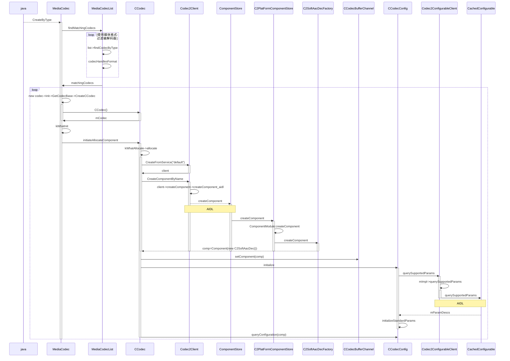
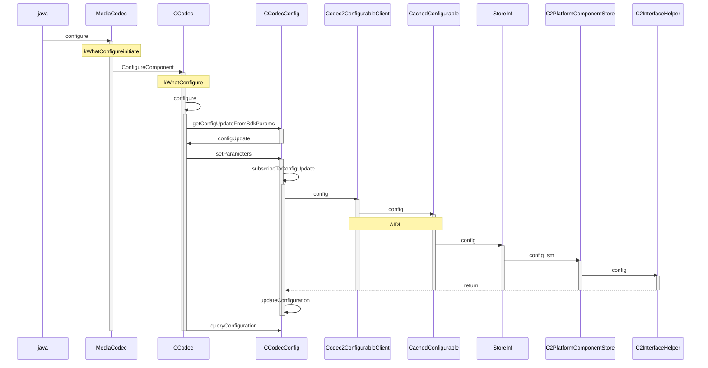
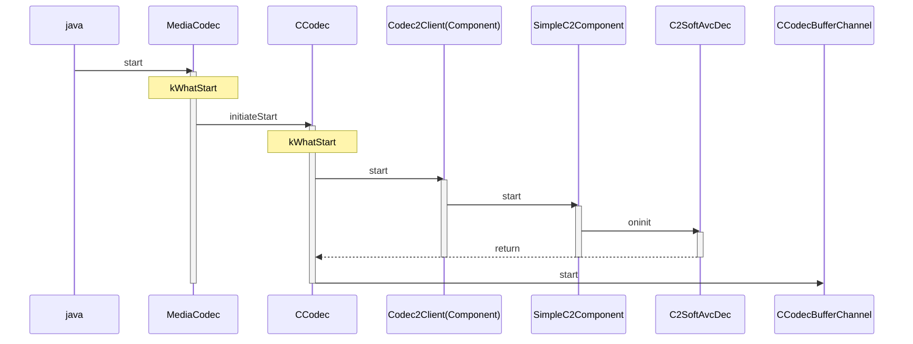
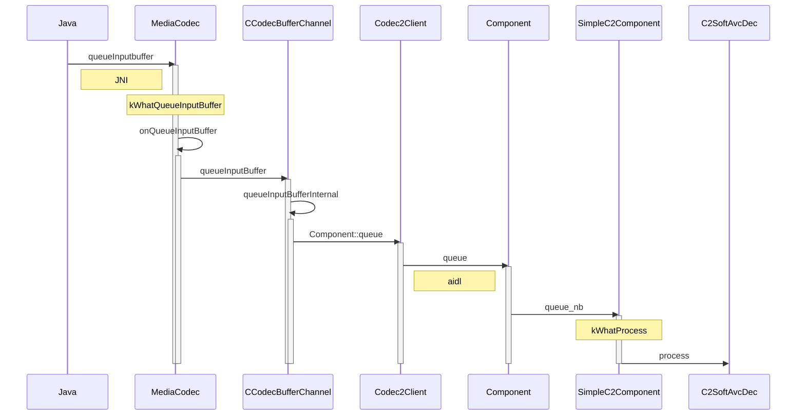

# MediaCodec源码分析

前面有说过java层的MediaCodec的异步模式《MediaCodec简介与使用详解》，本文将继续进行分析MediaCodec的几个关键函数的native执行流程。


## 初始化流程



整个流程始于应用层通过 `MediaCodec.createDecoderByType` 发起请求，系统首先在编解码器列表中根据媒体格式进行匹配和筛选。找到合适的编解码器后，便开始其初始化过程：在底层会创建一个 `CCodec` 对象，它通过 AIDL 跨进程通信连接到 Codec2 服务，并由平台级的组件工厂实例化出具体的编解码组件实体。**此时，系统会向该组件查询其所有支持的可配置参数，为后续的 `configure` 调用做好准备，但尚未进行具体的格式配置。** 至此，编解码器实例本身已完成创建并获取了能力清单，处于可被配置的初始状态。


## 配置流程



配置的主要流程是把 SDK 的键转换为 C2Param，根据组件 query 得到 usage/maxInputSize/prepend 等建议并写入 format，校正并验证 client 指定的 max input size，最后把参数通过 config->setParameters 下发给组件或缓冲通道，最后更新内部 config（queryConfiguration）并通知配置结果。

日志中的重要表现在CCodec和CCodecConfig都会输出一些配置信息，CCodec输出的是Android MediaCodec框架层的完整配置信息，包含显示、渲染相关的各种参数，而CCodecConfig则输出底层Codec2组件实际使用的核心编解码参数差异，它采用diff模式只显示发生变化的配置，前者面向应用层接口，后者反映底层编解码器的真实状态。

```
11-05 22:12:06.186  4622  4656 D CCodecConfig: c2 config diff is   c2::u32 coded.pl.level = 20495
11-05 22:12:06.186  4622  4656 D CCodecConfig:   c2::u32 coded.pl.profile = 20484
11-05 22:12:06.186  4622  4656 D CCodecConfig:   c2::u32 default.color.matrix = 5
11-05 22:12:06.186  4622  4656 D CCodecConfig:   c2::u32 default.color.primaries = 6
11-05 22:12:06.186  4622  4656 D CCodecConfig:   c2::u32 default.color.range = 2
11-05 22:12:06.186  4622  4656 D CCodecConfig:   c2::u32 default.color.transfer = 3
11-05 22:12:06.186  4622  4656 D CCodecConfig:   c2::u32 input.buffers.max-size.value = 6220800
11-05 22:12:06.186  4622  4656 D CCodecConfig:   c2::i32 raw.rotation.value = -90
11-05 22:12:06.186  4622  4656 D CCodecConfig:   c2::u32 raw.size.height = 2160
11-05 22:12:06.186  4622  4656 D CCodecConfig:   c2::u32 raw.size.width = 3840
11-05 22:12:06.187  4622  4656 D CCodec  : setup formats input: AMessage(what = 0x00000000) = {
11-05 22:12:06.187  4622  4656 D CCodec  :   int32_t height = 2160
11-05 22:12:06.187  4622  4656 D CCodec  :   int32_t level = 32768
11-05 22:12:06.187  4622  4656 D CCodec  :   int32_t max-input-size = 6220800
11-05 22:12:06.187  4622  4656 D CCodec  :   string mime = "video/avc"
11-05 22:12:06.187  4622  4656 D CCodec  :   int32_t profile = 8
11-05 22:12:06.187  4622  4656 D CCodec  :   int32_t width = 3840
11-05 22:12:06.187  4622  4656 D CCodec  :   Rect crop(0, 0, 3839, 2159)
11-05 22:12:06.187  4622  4656 D CCodec  : }
11-05 22:12:06.187  4622  4656 D CCodec  : setup formats output: AMessage(what = 0x00000000) = {
11-05 22:12:06.187  4622  4656 D CCodec  :   int32_t android._color-format = 2135033992
11-05 22:12:06.187  4622  4656 D CCodec  :   int32_t android._video-scaling = 1
11-05 22:12:06.187  4622  4656 D CCodec  :   int32_t rotation-degrees = 90
11-05 22:12:06.187  4622  4656 D CCodec  :   int32_t color-standard = 6
11-05 22:12:06.187  4622  4656 D CCodec  :   int32_t color-range = 2
11-05 22:12:06.187  4622  4656 D CCodec  :   int32_t color-transfer = 3
11-05 22:12:06.187  4622  4656 D CCodec  :   int32_t sar-height = 1
11-05 22:12:06.187  4622  4656 D CCodec  :   int32_t sar-width = 1
11-05 22:12:06.187  4622  4656 D CCodec  :   Rect crop(0, 0, 3839, 2159)
11-05 22:12:06.187  4622  4656 D CCodec  :   int32_t width = 3840
11-05 22:12:06.187  4622  4656 D CCodec  :   int32_t height = 2160
11-05 22:12:06.187  4622  4656 D CCodec  :   int32_t max-height = 240
11-05 22:12:06.187  4622  4656 D CCodec  :   int32_t max-width = 320
11-05 22:12:06.187  4622  4656 D CCodec  :   string mime = "video/raw"
11-05 22:12:06.187  4622  4656 D CCodec  :   int32_t android._dataspace = 281411584
11-05 22:12:06.187  4622  4656 D CCodec  : }
```


## 启动流程



 `CCodecBufferChannel::start` 函数负责初始化编解码器的输入输出缓冲区通道，包括查询组件参数、计算延迟与槽位数量、选择合适的缓冲区类型与内存池、配置加密与安全模式、绑定输出 Surface、设置重排序与音频延迟处理，并最终建立管道控制器以确保数据流畅传输，是编解码流程启动阶段的核心配置逻辑。


## 数据送入流程



持续更新中。。。
