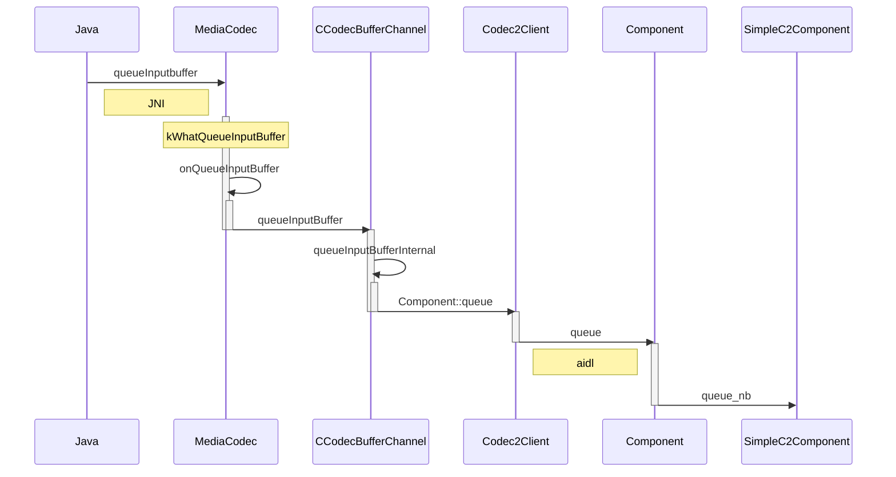

# MediaCodec源码分析

前面有说过java层的MediaCodec的异步模式[MediaCodec简介与使用详解](/_posts/源码分析/MediaCodec简介与使用详解.md)，本文将基于AOSP15源码继续进行分析MediaCodec的几个关键函数的native执行流程。

```mermaid
sequenceDiagram

Java->>MediaCodec: queueInputbuffer
Note right of Java: JNI
activate MediaCodec
Note over MediaCodec:kWhatQueueInputBuffer
MediaCodec->>MediaCodec: onQueueInputBuffer
activate MediaCodec
MediaCodec->>CCodecBufferChannel:queueInputBuffer
deactivate MediaCodec
deactivate MediaCodec
activate CCodecBufferChannel
CCodecBufferChannel->>CCodecBufferChannel:queueInputBufferInternal
activate CCodecBufferChannel
CCodecBufferChannel->>Codec2Client:Component::queue
deactivate CCodecBufferChannel
deactivate CCodecBufferChannel
activate Codec2Client
Codec2Client->>Component:queue
deactivate Codec2Client
activate Component
Note left of Component:aidl
Component->>SimpleC2Component:queue_nb
deactivate Component
```

