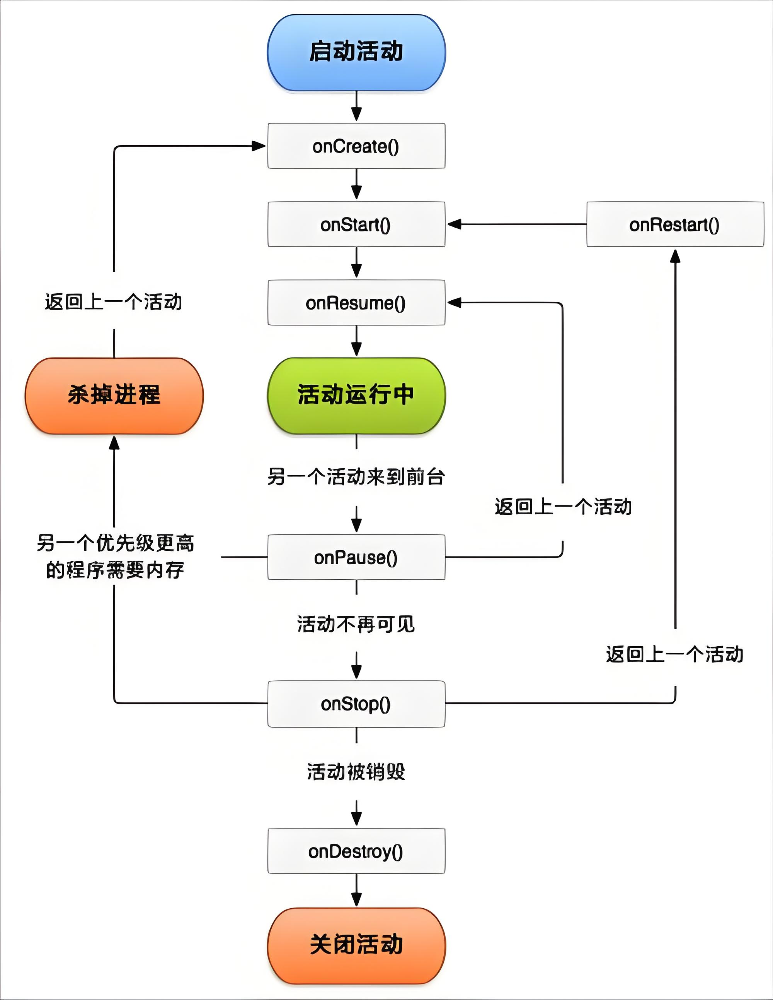

# **Android Activity**

## **Activity 是什么？**

**Activity** 是 Android 四大组件之一，代表一个用户界面（UI）屏幕，负责与用户交互。

##  **Activity的基本使用**

### **定义 Activity**

1. **创建 Java/Kotlin 类**，继承 `AppCompatActivity`（兼容旧版本）或 `Activity`：
   
   ```java
   public class MainActivity extends AppCompatActivity {
       @Override
       protected void onCreate(Bundle savedInstanceState) {
           super.onCreate(savedInstanceState);
           setContentView(R.layout.activity_main); // 绑定布局文件
       }
   }
   ```
   
2. **在 `AndroidManifest.xml` 中注册**：
   ```xml
   <application>
       <activity android:name=".MainActivity">
           <intent-filter>
               <action android:name="android.intent.action.MAIN" />
               <category android:name="android.intent.category.LAUNCHER" />
           </intent-filter>
       </activity>
   </application>
   ```
   - `<intent-filter>` 指定该 Activity 为应用入口（主界面）。

---

### **启动 Activity**

通过 **Intent** 启动另一个 Activity：
```java
// 显式启动（明确指定目标 Activity）
Intent intent = new Intent(MainActivity.this, SecondActivity.class);
startActivity(intent);

// 传递数据
intent.putExtra("key", "value");
startActivity(intent);
```

---

## **显式 Intent vs 隐式 Intent**

### **显式 Intent**

- **明确指定目标 Activity 的类名**，用于应用内部跳转。
- 示例：
  ```java
  Intent intent = new Intent(MainActivity.this, SecondActivity.class);
  startActivity(intent);
  ```

### **隐式 Intent**

- **不指定具体类名，而是声明 Action 和 Category**，由系统匹配符合条件的 Activity（可以是其他应用的 Activity）。
- 示例：
  ```java
  Intent intent = new Intent();
  intent.setAction(Intent.ACTION_VIEW); // 定义动作
  intent.setData(Uri.parse("https://www.example.com")); // 设置数据（URL）
  startActivity(intent);
  ```
- 需在 `AndroidManifest.xml` 中声明 `<intent-filter>`：
  ```xml
  <activity android:name=".BrowserActivity">
      <intent-filter>
          <action android:name="android.intent.action.VIEW" />
          <category android:name="android.intent.category.DEFAULT" />
          <data android:scheme="https" />
      </intent-filter>
  </activity>
  ```

---

##  **Activity 生命周期**


---

## **Activity 的启动模式（Launch Mode）**

通过 `AndroidManifest.xml` 或 `Intent` 标志控制 Activity 的实例化行为，避免重复创建。

### **四种启动模式**
| 模式 | 说明 | 示例场景 |
|------|------|---------|
| `standard`（默认） | 每次启动创建新实例 | 普通页面（如新闻详情页） |
| `singleTop` | 如果目标 Activity 已在栈顶，则复用 | 通知跳转（避免重复） |
| `singleTask` | 整个任务栈只保留一个实例 | 应用主页（MainActivity） |
| `singleInstance` | 独立任务栈，全局唯一 | 系统拨号界面 |

### **配置方式**
- **在 `AndroidManifest.xml` 中声明**：
  ```xml
  <activity android:name=".MainActivity" android:launchMode="singleTask" />
  ```
- **通过 Intent 标志动态设置**：
  ```java
  Intent intent = new Intent(this, MainActivity.class);
  intent.addFlags(Intent.FLAG_ACTIVITY_CLEAR_TOP); // 清除栈顶之上的所有 Activity
  startActivity(intent);
  ```

## **Activity 数据传递**

Activity 之间的数据传递是 Android 开发中的核心技能，主要包括**单向传递**、**双向传递（回调）** 和**复杂对象传递**。下面从 5 种实现方式详细说明。

---

### **使用 Intent.putExtra() 传递简单数据**

**适用场景**：传递基本类型（String、int 等）或简单对象（Serializable/Parcelable）。

- **发送数据**

```java
// 从 MainActivity 跳转到 SecondActivity 并传递数据
Intent intent = new Intent(MainActivity.this, SecondActivity.class);
intent.putExtra("username", "Alice");  // String
intent.putExtra("age", 25);           // int
intent.putExtra("isStudent", true);    // boolean
startActivity(intent);
```

- **接收数据**

```java
// 在 SecondActivity 中获取数据
String username = getIntent().getStringExtra("username");
int age = getIntent().getIntExtra("age", 0); // 第二个参数是默认值
boolean isStudent = getIntent().getBooleanExtra("isStudent", false);
```

---

### **传递复杂对象（Serializable/Parcelable）**

#### **Serializable 方式（Java 原生序列化）**

**步骤 1：实现 Serializable 接口**
```java
public class User implements Serializable {
    private String name;
    private int age;
    // 构造方法 + getter/setter
}
```

**步骤 2：传递对象**
```java
User user = new User("Alice", 25);
Intent intent = new Intent(this, SecondActivity.class);
intent.putExtra("user", user); // 直接传递对象
startActivity(intent);
```

**步骤 3：接收对象**
```java
User user = (User) getIntent().getSerializableExtra("user");
```

#### **Parcelable 方式（Android 专用，性能更高）**

**步骤 1：实现 Parcelable 接口**
```java
public class User implements Parcelable {
    private String name;
    private int age;

    // 构造方法 + getter/setter

    @Override
    public int describeContents() {
        return 0;
    }

    @Override
    public void writeToParcel(Parcel dest, int flags) {
        dest.writeString(name);
        dest.writeInt(age);
    }

    public static final Creator<User> CREATOR = new Creator<User>() {
        @Override
        public User createFromParcel(Parcel in) {
            return new User(in.readString(), in.readInt());
        }

        @Override
        public User[] newArray(int size) {
            return new User[size];
        }
    };
}
```

**步骤 2：传递与接收（同 Serializable）**
```java
// 发送
intent.putExtra("user", user);

// 接收
User user = getIntent().getParcelableExtra("user");
```

---

### **使用 Bundle 传递数据包**

Bundle 是键值对集合，适合传递多组数据。

**发送数据**

```java
Intent intent = new Intent(this, SecondActivity.class);
Bundle bundle = new Bundle();
bundle.putString("key1", "value1");
bundle.putInt("key2", 100);
intent.putExtras(bundle); // 将 Bundle 附加到 Intent
startActivity(intent);
```

**接收数据**

```java
Bundle bundle = getIntent().getExtras();
String value1 = bundle.getString("key1");
int value2 = bundle.getInt("key2");
```

---

### **使用 startActivityForResult() 获取返回数据（旧方式）**

**适用场景**：从 SecondActivity 返回数据给 MainActivity。

**MainActivity 发送请求**

```java
Intent intent = new Intent(this, SecondActivity.class);
startActivityForResult(intent, REQUEST_CODE); // REQUEST_CODE 是自定义请求码（如 1）
```

**SecondActivity 返回数据**

```java
Intent resultIntent = new Intent();
resultIntent.putExtra("result", "Data from SecondActivity");
setResult(RESULT_OK, resultIntent); // RESULT_OK 表示成功
finish(); // 关闭 SecondActivity
```

**MainActivity 接收返回数据**

```java
@Override
protected void onActivityResult(int requestCode, int resultCode, Intent data) {
    super.onActivityResult(requestCode, resultCode, data);
    if (requestCode == REQUEST_CODE && resultCode == RESULT_OK) {
        String result = data.getStringExtra("result");
        Log.d("MainActivity", "Received: " + result);
    }
}
```

---

### **使用 Activity Result API（推荐方式，替代 startActivityForResult）**

AndroidX 提供了更现代的 `ActivityResultLauncher`。

#### **注册 ActivityResultLauncher**

```java
// 在 MainActivity 中定义
private ActivityResultLauncher<Intent> launcher = registerForActivityResult(
    new ActivityResultContracts.StartActivityForResult(),
    result -> {
        if (result.getResultCode() == RESULT_OK) {
            Intent data = result.getData();
            String resultData = data.getStringExtra("result");
            Log.d("MainActivity", "Received: " + resultData);
        }
    }
);
```

#### **启动 Activity 并等待结果**

```java
Intent intent = new Intent(this, SecondActivity.class);
launcher.launch(intent);
```

#### **SecondActivity 返回数据（同旧方式）**

```java
Intent resultIntent = new Intent();
resultIntent.putExtra("result", "New Data");
setResult(RESULT_OK, resultIntent);
finish();
```

---

### **全局数据传递（谨慎使用）**

#### **使用 Application 类**

```java
public class MyApp extends Application {
    private String globalData;

    public String getGlobalData() {
        return globalData;
    }

    public void setGlobalData(String data) {
        this.globalData = data;
    }
}

// 在 Activity 中设置/获取
((MyApp) getApplication()).setGlobalData("Hello");
String data = ((MyApp) getApplication()).getGlobalData();
```

#### **使用静态变量（易内存泄漏，不推荐）**

```java
public class DataHolder {
    public static String data;
}

// 设置数据
DataHolder.data = "Some data";

// 获取数据
String value = DataHolder.data;
```

---

### **总结对比**

| 方法 | 适用场景 | 优点 | 缺点 |
|------|---------|------|------|
| `Intent.putExtra()` | 简单数据传递 | 直接、简单 | 不支持复杂对象（需序列化） |
| `Serializable` | 复杂对象（Java 兼容） | 实现简单 | 性能较低 |
| `Parcelable` | 复杂对象（Android 专用） | 高性能 | 代码较繁琐 |
| `Bundle` | 多组数据打包传递 | 灵活 | 本质仍是 Intent 扩展 |
| `startActivityForResult` | 获取返回数据（旧方式） | 广泛兼容 | 已废弃 |
| `Activity Result API` | 获取返回数据（新方式） | 解耦、现代化 | 需要 AndroidX |
| `Application/静态变量` | 全局数据共享 | 跨 Activity 共享 | 易内存泄漏 |

**推荐选择**：

- 简单数据 → `Intent.putExtra()`
- 复杂对象 → `Parcelable`
- 需要返回结果 → `Activity Result API`
- 全局数据 → `Application` 类（谨慎使用）